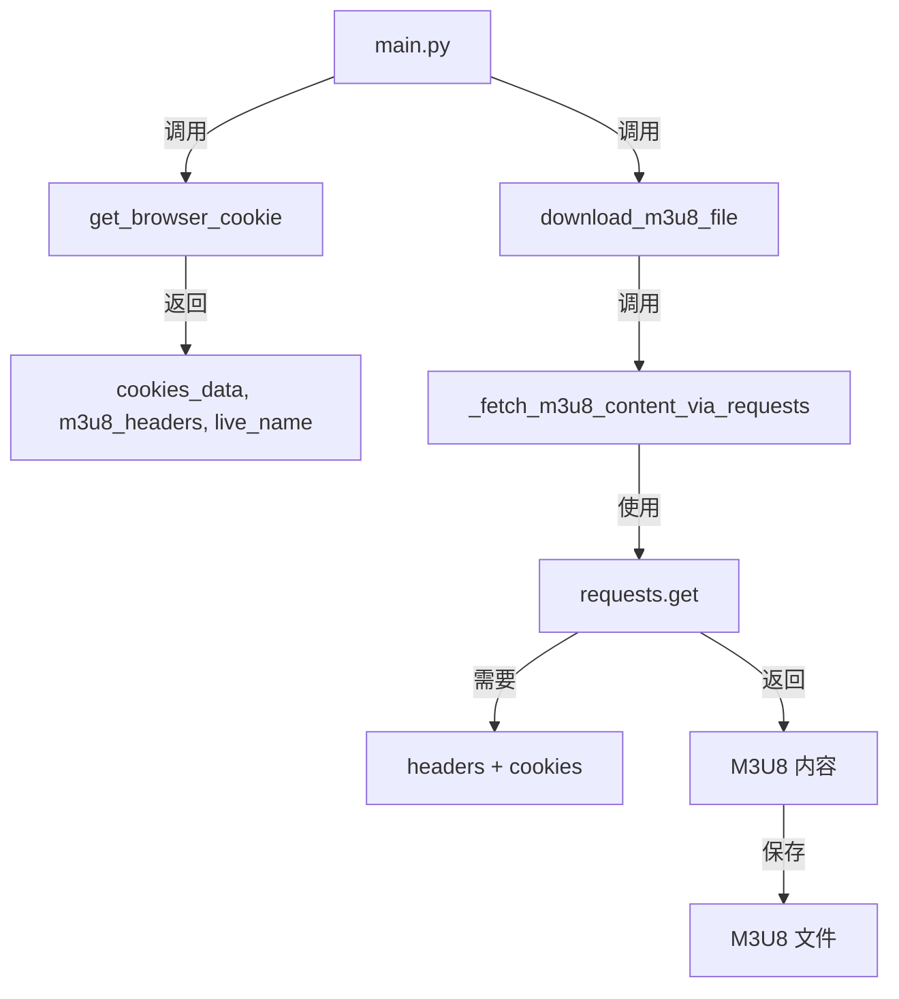
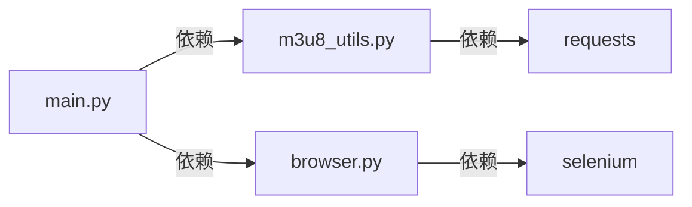
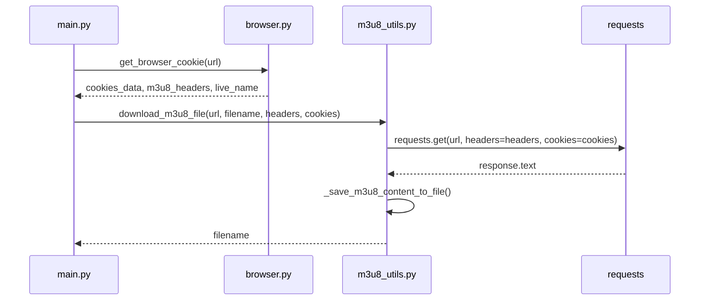
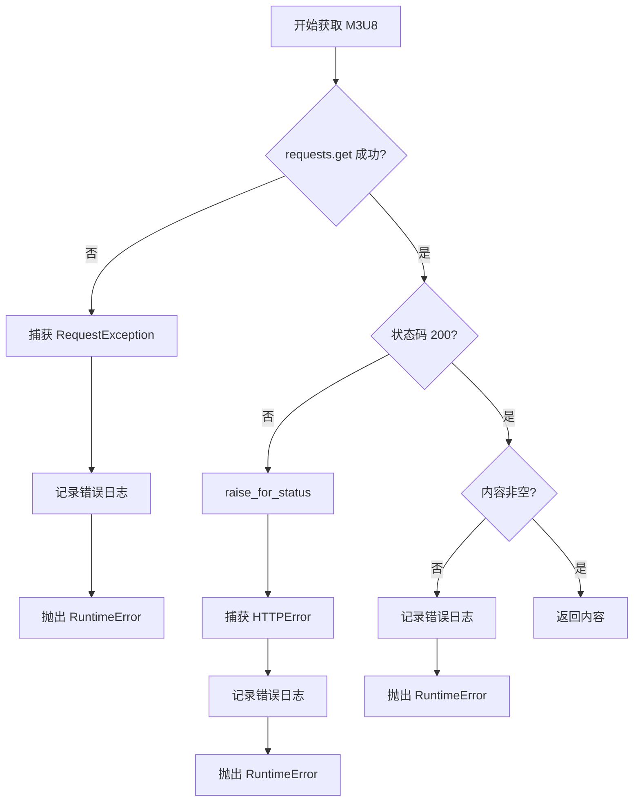

# M3U8 内容获取 403 错误修复 - 设计文档

## 1. 整体架构



## 2. 分层设计

### 2.1 核心组件

| 组件 | 职责 | 修改内容 |
|------|------|----------|
| `main.py` | 主流程控制 | 传递 `cookies_data` 到 `download_m3u8_file` |
| `m3u8_utils.py` | M3U8 文件处理 | 添加 Cookie 参数支持 |
| `browser.py` | 浏览器操作 | 无需修改 |

### 2.2 模块依赖关系



## 3. 接口契约定义

### 3.1 修改的函数

#### 3.1.1 `_fetch_m3u8_content_via_requests`

**修改前**:
```python
def _fetch_m3u8_content_via_requests(
    url: str,
    headers: Dict[str, str]
) -> str:
    response = requests.get(url, headers=headers, timeout=30)
    response.raise_for_status()
    return response.text
```

**修改后**:
```python
def _fetch_m3u8_content_via_requests(
    url: str,
    headers: Dict[str, str],
    cookies: Optional[Dict[str, str]] = None
) -> str:
    response = requests.get(
        url,
        headers=headers,
        cookies=cookies,
        timeout=30
    )
    response.raise_for_status()
    return response.text
```

**参数说明**:
- `url`: M3U8 文件 URL
- `headers`: HTTP 请求头
- `cookies`: Cookie 字典（新增，可选参数）

**返回值**: M3U8 文件内容字符串

**异常**:
- `RuntimeError`: 获取失败或内容为空

#### 3.1.2 `download_m3u8_file`

**修改前**:
```python
def download_m3u8_file(
    url: str,
    filename: str,
    headers: Dict[str, str]
) -> str:
    m3u8_content = _fetch_m3u8_content_via_requests(url, headers)
    _save_m3u8_content_to_file(filename, m3u8_content)
    return filename
```

**修改后**:
```python
def download_m3u8_file(
    url: str,
    filename: str,
    headers: Dict[str, str],
    cookies: Optional[Dict[str, str]] = None
) -> str:
    m3u8_content = _fetch_m3u8_content_via_requests(url, headers, cookies)
    _save_m3u8_content_to_file(filename, m3u8_content)
    return filename
```

**参数说明**:
- `url`: M3U8 文件 URL
- `filename`: 保存的文件路径
- `headers`: HTTP 请求头
- `cookies`: Cookie 字典（新增，可选参数）

**返回值**: 保存的文件路径

**异常**:
- `ValueError`: 参数无效
- `PermissionError`: 文件目录不可写
- `RuntimeError`: 下载或保存失败

### 3.2 修改的调用点

#### 3.2.1 `main.py` 中的调用

**修改前**:
```python
m3u8_file = download_m3u8_file(link, DEFAULT_M3U8_FILENAME, m3u8_headers)
```

**修改后**:
```python
m3u8_file = download_m3u8_file(link, DEFAULT_M3U8_FILENAME, m3u8_headers, cookies_data)
```

**调用位置**:
1. `main.py#L97` - 批量下载模式
2. `main.py#L206` - 单个视频下载模式
3. `main.py#L327` - 批量下载模式（第二个位置）

## 4. 数据流向图



## 5. 异常处理策略

### 5.1 错误类型

| 错误类型 | 处理方式 | 日志级别 |
|----------|----------|----------|
| `requests.exceptions.HTTPError` (403) | 抛出 RuntimeError | ERROR |
| `requests.exceptions.Timeout` | 抛出 RuntimeError | ERROR |
| `requests.exceptions.ConnectionError` | 抛出 RuntimeError | ERROR |
| `ValueError` (参数无效) | 抛出 ValueError | ERROR |
| `PermissionError` (文件权限) | 抛出 PermissionError | ERROR |

### 5.2 错误处理流程



## 6. 实现约束

### 6.1 技术栈约束

- Python 3.13
- requests >= 2.28.0
- selenium >= 4.6.0

### 6.2 代码规范约束

- 遵循 PEP 8 代码风格
- 使用类型注解
- 添加完整的文档字符串
- 保持与现有代码风格一致

### 6.3 质量要求

- 单元测试覆盖率 >= 80%
- 所有测试用例通过
- 无 linting 错误
- 无类型检查错误

## 7. 向后兼容性

### 7.1 兼容性策略

使用可选参数保持向后兼容性：

```python
def download_m3u8_file(
    url: str,
    filename: str,
    headers: Dict[str, str],
    cookies: Optional[Dict[str, str]] = None  # 可选参数
) -> str:
    # ...
```

### 7.2 兼容性验证

- 旧代码调用 `download_m3u8_file(url, filename, headers)` 仍然有效
- 新代码调用 `download_m3u8_file(url, filename, headers, cookies)` 功能完整

## 8. 测试策略

### 8.1 单元测试

- 测试 `_fetch_m3u8_content_via_requests` 函数
- 测试 `download_m3u8_file` 函数
- 测试 Cookie 参数传递

### 8.2 集成测试

- 测试完整的 M3U8 下载流程
- 测试与浏览器 Cookie 的集成
- 测试错误处理机制

### 8.3 回归测试

- 确保现有功能不受影响
- 确保所有测试用例通过

## 9. 部署计划

### 9.1 部署步骤

1. 修改 `m3u8_utils.py` 中的函数
2. 修改 `main.py` 中的调用点
3. 运行单元测试
4. 运行集成测试
5. 更新文档

### 9.2 回滚计划

如果出现问题，可以通过 Git 回滚到修复前的版本。

## 10. 风险评估

### 10.1 技术风险

| 风险 | 概率 | 影响 | 缓解措施 |
|------|------|------|----------|
| 调用点遗漏 | 中 | 高 | 使用 IDE 重构功能，全面搜索 |
| Cookie 格式错误 | 低 | 中 | 遵循 requests 库规范 |
| 向后兼容性破坏 | 低 | 高 | 使用可选参数，充分测试 |

### 10.2 业务风险

| 风险 | 概率 | 影响 | 缓解措施 |
|------|------|------|----------|
| 下载功能异常 | 低 | 高 | 充分测试，灰度发布 |
| 性能下降 | 低 | 中 | 性能测试，优化代码 |

## 11. 验收标准

### 11.1 功能验收

- [ ] 能够成功获取 M3U8 文件内容（不再出现 403 错误）
- [ ] Cookie 正确传递到 HTTP 请求中
- [ ] 能够正确解析 M3U8 文件内容
- [ ] 能够成功下载视频文件

### 11.2 质量验收

- [ ] 代码符合项目规范
- [ ] 错误处理完善
- [ ] 日志记录详细
- [ ] 单元测试覆盖率 >= 80%
- [ ] 所有测试用例通过

### 11.3 集成验收

- [ ] 与现有系统无冲突
- [ ] 不引入新的技术债务
- [ ] 性能无明显下降
- [ ] 向后兼容性良好
