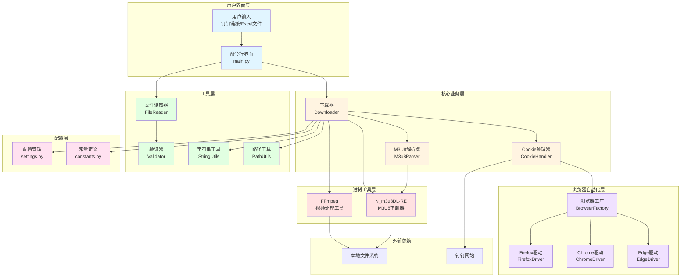
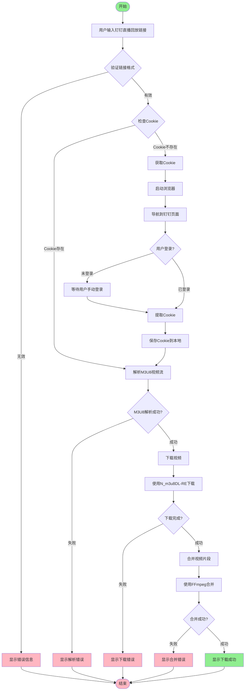
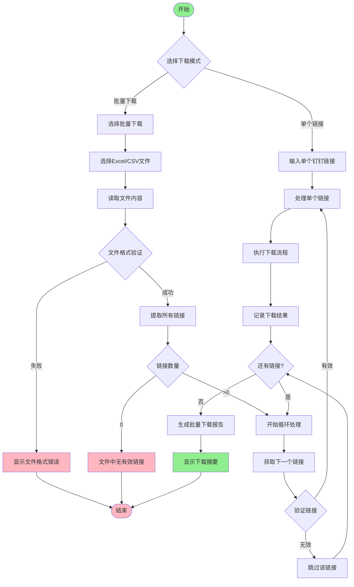
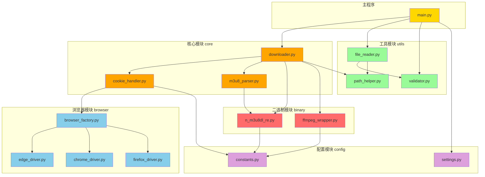
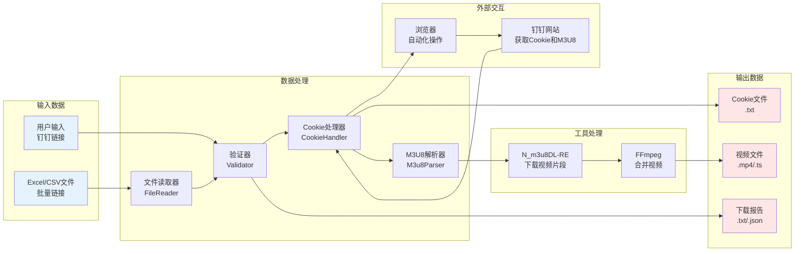
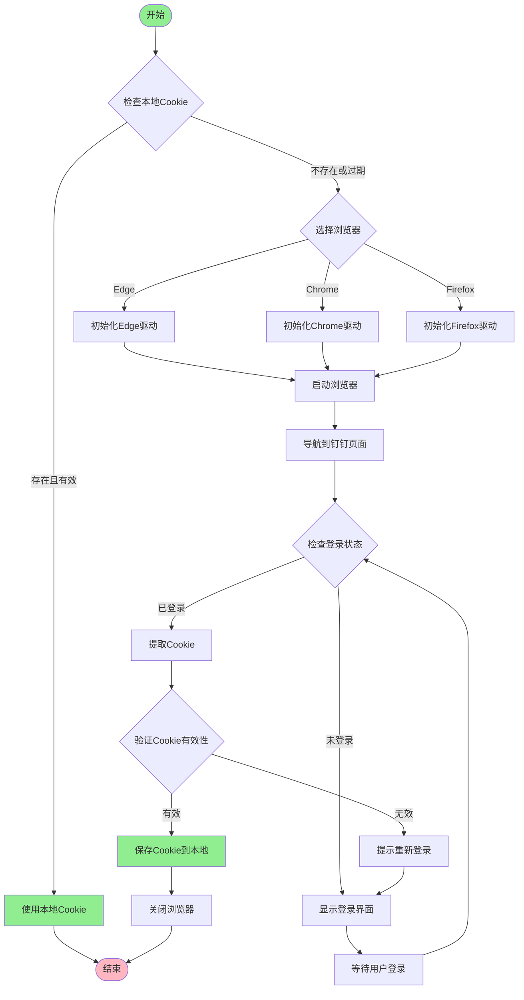
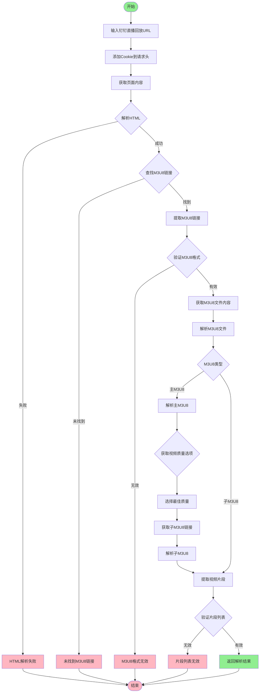
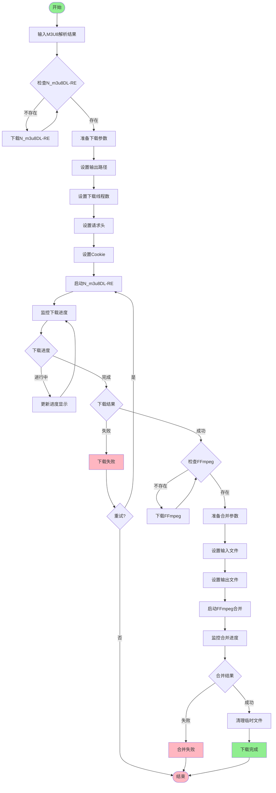

# 项目架构图和流程图

本文档包含 DingTalk-Live-Playback-Download-Tool 项目的各种架构图和流程图，帮助开发者和用户更好地理解系统结构和工作流程。

## 目录

- [1. 项目整体架构图](#1-项目整体架构图)
- [2. 核心业务流程图](#2-核心业务流程图)
- [3. 批量处理流程图](#3-批量处理流程图)
- [4. 模块依赖关系图](#4-模块依赖关系图)
- [5. 数据流向图](#5-数据流向图)
- [6. Cookie 获取流程图](#6-cookie获取流程图)
- [7. M3U8 解析流程图](#7-m3u8解析流程图)
- [8. 视频下载流程图](#8-视频下载流程图)

---

## 1. 项目整体架构图

### 架构说明

项目采用分层架构设计，共分为 6 个主要层次：

1. **用户界面层**：负责接收用户输入和提供命令行交互
2. **核心业务层**：实现下载、Cookie 处理、M3U8 解析等核心功能
3. **浏览器自动化层**：提供浏览器驱动管理和自动化操作
4. **工具层**：提供文件操作、路径处理、字符串处理等通用功能
5. **二进制工具层**：集成 N_m3u8DL-RE 和 FFmpeg 等专业工具
6. **配置层**：管理项目配置和常量定义

---

## 2. 核心业务流程图

### 流程说明

核心业务流程包含以下关键步骤：

1. **输入验证**：验证用户输入的钉钉链接格式是否正确
2. **Cookie 管理**：检查本地 Cookie，如不存在则启动浏览器获取
3. **M3U8 解析**：解析钉钉直播回放的 M3U8 视频流地址
4. **视频下载**：使用 N_m3u8DL-RE 工具下载视频片段
5. **视频合并**：使用 FFmpeg 工具将下载的视频片段合并为完整视频
6. **结果反馈**：向用户显示下载结果或错误信息

---

## 3. 批量处理流程图

### 流程说明

批量处理流程支持两种模式：

1. **单个链接模式**：直接处理单个钉钉直播回放链接
2. **批量下载模式**：从 Excel/CSV 文件中读取多个链接并批量处理

批量处理特点：

- 支持 Excel 和 CSV 文件格式
- 自动验证文件格式和链接有效性
- 循环处理每个链接
- 记录每个链接的处理结果
- 生成批量下载报告和摘要

---

## 4. 模块依赖关系图

### 依赖说明

模块依赖关系遵循以下原则：

1. **单向依赖**：上层模块依赖下层模块，避免循环依赖
2. **核心优先**：核心模块（core）是业务逻辑的核心，被其他模块依赖
3. **工具独立**：工具模块（utils）保持独立性，可被多个模块复用
4. **配置底层**：配置模块（config）作为最底层，被所有模块依赖
5. **浏览器封装**：浏览器模块（browser）通过工厂模式统一管理

---

## 5. 数据流向图

### 数据流说明

数据流向展示了数据从输入到输出的完整过程：

1. **输入阶段**：接收用户输入的单个链接或批量文件
2. **验证阶段**：使用验证器检查数据格式和有效性
3. **Cookie 获取**：通过浏览器自动化从钉钉网站获取 Cookie
4. **M3U8 解析**：解析钉钉直播回放的 M3U8 视频流地址
5. **视频下载**：使用 N_m3u8DL-RE 下载视频片段
6. **视频合并**：使用 FFmpeg 将片段合并为完整视频
7. **输出阶段**：生成视频文件、下载报告和 Cookie 文件

---

## 6. Cookie 获取流程图

### 流程说明

Cookie 获取流程确保用户能够访问钉钉的直播回放内容：

1. **本地检查**：优先检查本地是否存在有效的 Cookie
2. **浏览器选择**：支持 Edge、Chrome、Firefox 三种主流浏览器
3. **自动化操作**：通过 Selenium 驱动浏览器自动导航
4. **登录处理**：检测登录状态，引导用户完成登录
5. **Cookie 提取**：从浏览器中提取有效的 Cookie
6. **本地存储**：将 Cookie 保存到本地文件，避免重复登录

---

## 7. M3U8 解析流程图

### 流程说明

M3U8 解析流程负责从钉钉直播回放页面提取视频流信息：

1. **页面获取**：使用 Cookie 获取钉钉直播回放页面内容
2. **HTML 解析**：解析 HTML 页面，查找 M3U8 视频流链接
3. **M3U8 验证**：验证 M3U8 链接的格式和有效性
4. **类型识别**：识别 M3U8 文件类型（主 M3U8 或子 M3U8）
5. **质量选择**：对于主 M3U8，选择最佳视频质量
6. **片段提取**：提取所有视频片段的 URL 列表
7. **结果返回**：返回完整的 M3U8 解析结果

---

## 8. 视频下载流程图

### 流程说明

视频下载流程使用专业工具完成视频片段的下载和合并：

1. **工具检查**：检查 N_m3u8DL-RE 和 FFmpeg 是否可用
2. **参数准备**：设置下载参数（输出路径、线程数、请求头、Cookie）
3. **下载执行**：使用 N_m3u8DL-RE 下载视频片段
4. **进度监控**：实时监控下载进度并显示给用户
5. **错误处理**：下载失败时提供重试机制
6. **视频合并**：使用 FFmpeg 将下载的片段合并为完整视频
7. **清理工作**：删除临时文件，保持目录整洁

---

## 总结

本文档通过多个架构图和流程图，全面展示了 DingTalk-Live-Playback-Download-Tool 项目的系统结构和工作流程。这些图表帮助开发者和用户：

- 理解项目的整体架构和模块关系
- 掌握核心业务流程的实现逻辑
- 了解批量处理的工作方式
- 理解数据在系统中的流动过程
- 掌握关键功能（Cookie 获取、M3U8 解析、视频下载）的详细流程

所有图表均使用 Mermaid 语法编写，可以在支持 Mermaid 的 Markdown 编辑器中直接渲染，也可以导出为图片格式用于文档和演示。
