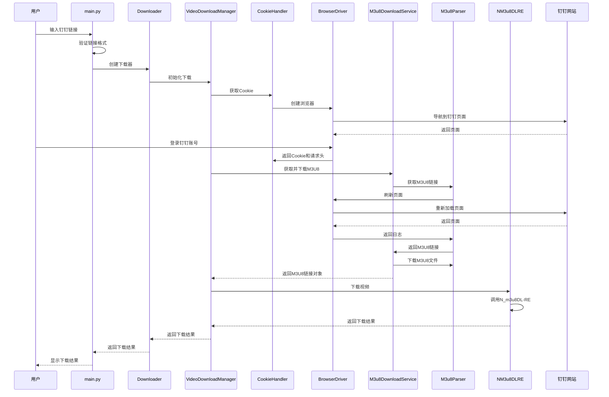
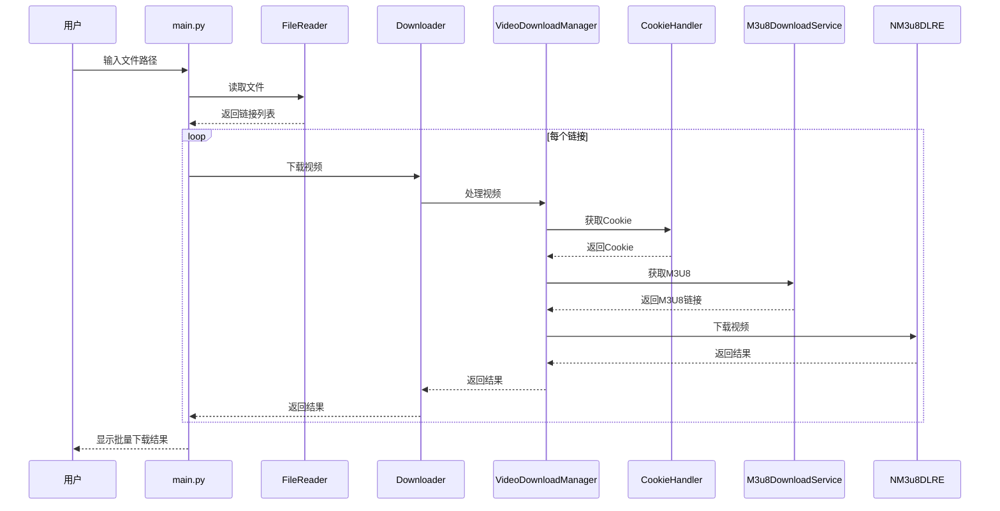
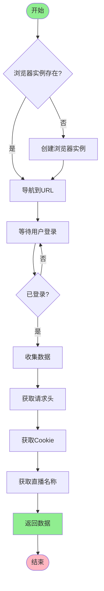
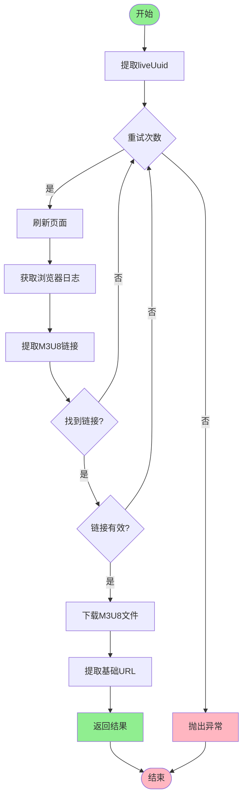
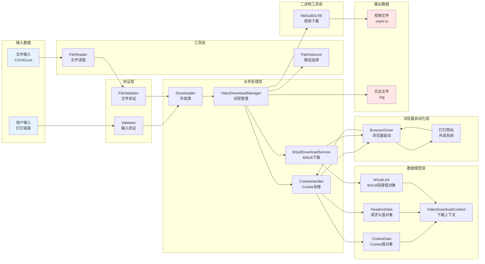

# 项目架构文档

本文档详细描述钉钉直播回放下载工具的系统架构、模块划分、核心组件交互流程及技术栈选型依据。

## 目录

- [一、系统架构概述](#一系统架构概述)
- [二、技术栈选型](#二技术栈选型)
- [三、模块划分与职责](#三模块划分与职责)
- [四、核心组件交互流程](#四核心组件交互流程)
- [五、数据流程设计](#五数据流程设计)
- [六、设计模式应用](#六设计模式应用)
- [七、关键技术实现](#七关键技术实现)
- [八、架构演进方向](#八架构演进方向)

---

## 一、系统架构概述

### 1.1 架构设计原则

项目遵循以下架构设计原则:

1. **分层架构**: 将系统划分为清晰的层次,每层职责明确
2. **单一职责**: 每个模块只负责一个功能领域
3. **依赖倒置**: 高层模块不依赖低层模块,都依赖抽象
4. **开闭原则**: 对扩展开放,对修改关闭
5. **接口隔离**: 通过接口定义模块间交互
6. **依赖注入**: 使用工厂模式实现依赖注入,降低耦合度

### 1.2 整体架构图

```mermaid
graph TB
    subgraph "用户交互层"
        MAIN[main.py<br/>程序入口]
        USER_CTRL[UserInteractionController<br/>用户交互控制器]
    end

    subgraph "业务逻辑层"
        DOWNLOADER[Downloader<br/>外观类]
        VIDEO_MGR[VideoDownloadManager<br/>视频下载管理器]
        COOKIE_HDL[CookieHandler<br/>Cookie处理器]
        M3U8_SVC[M3u8DownloadService<br/>M3U8下载服务]
        M3U8_PARSER[M3u8Parser<br/>M3U8解析器]
        DEP_FACTORY[DependencyFactory<br/>依赖工厂]
    end

    subgraph "浏览器自动化层"
        BROWSER_FACTORY[BrowserFactory<br/>浏览器工厂]
        BROWSER_DRIVER[BrowserDriver<br/>浏览器驱动基类]
        EDGE[EdgeDriver]
        CHROME[ChromeDriver]
        FIREFOX[FirefoxDriver]
    end

    subgraph "工具层"
        VALIDATOR[Validator<br/>输入验证]
        FILE_READER[FileReader<br/>文件读取]
        PATH_SELECTOR[PathSelector<br/>路径选择]
        PATH_HELPER[PathHelper<br/>路径工具]
        FILE_VALIDATOR[FileValidator<br/>文件验证]
    end

    subgraph "二进制工具层"
        NM3U8DL[NM3u8DLRE<br/>N_m3u8DL-RE封装]
    end

    subgraph "配置层"
        YAML_CONFIG[YamlConfig<br/>配置管理(单例)]
        LOGGER_CONFIG[LoggerConfig<br/>日志配置]
        HEADER_MGR[HeaderManager<br/>请求头管理]
        CONSTANTS[Constants<br/>常量定义]
    end

    subgraph "数据模型层"
        MODELS[Models<br/>数据模型]
        COOKIE_DATA[CookieData<br/>Cookie值对象]
        HEADERS_DATA[HeadersData<br/>请求头值对象]
        M3U8_LINK[M3u8Link<br/>M3U8链接值对象]
        VIDEO_CTX[VideoDownloadContext<br/>视频下载上下文]
    end

    subgraph "外部系统"
        DINGTALK[钉钉网站]
        FILE_SYS[本地文件系统]
    end

    MAIN --> USER_CTRL
    MAIN --> DOWNLOADER
    MAIN --> VALIDATOR
    MAIN --> FILE_READER

    DOWNLOADER --> VIDEO_MGR
    DOWNLOADER --> DEP_FACTORY

    VIDEO_MGR --> COOKIE_HDL
    VIDEO_MGR --> M3U8_SVC
    VIDEO_MGR --> PATH_SELECTOR
    VIDEO_MGR --> NM3U8DL
    VIDEO_MGR --> MODELS

    DEP_FACTORY --> COOKIE_HDL
    DEP_FACTORY --> M3U8_PARSER
    DEP_FACTORY --> M3U8_SVC
    DEP_FACTORY --> PATH_SELECTOR
    DEP_FACTORY --> NM3U8DL

    COOKIE_HDL --> BROWSER_FACTORY
    BROWSER_FACTORY --> BROWSER_DRIVER
    BROWSER_DRIVER --> EDGE
    BROWSER_DRIVER --> CHROME
    BROWSER_DRIVER --> FIREFOX

    M3U8_SVC --> M3U8_PARSER
    M3U8_PARSER --> BROWSER_DRIVER

    COOKIE_HDL --> HEADER_MGR
    COOKIE_HDL --> CONSTANTS

    DOWNLOADER --> YAML_CONFIG
    MAIN --> YAML_CONFIG
    MAIN --> LOGGER_CONFIG

    BROWSER_DRIVER --> DINGTALK
    NM3U8DL --> FILE_SYS

    style MAIN fill:#e1f5ff
    style DOWNLOADER fill:#fff4e1
    style VIDEO_MGR fill:#fff4e1
    style COOKIE_HDL fill:#fff4e1
    style M3U8_SVC fill:#fff4e1
    style M3U8_PARSER fill:#fff4e1
    style DEP_FACTORY fill:#fff4e1
    style BROWSER_FACTORY fill:#f0e1ff
    style BROWSER_DRIVER fill:#f0e1ff
    style YAML_CONFIG fill:#ffe1f0
    style MODELS fill:#e1ffe1
```

### 1.3 架构层次说明

#### 1.3.1 用户交互层

- **职责**: 接收用户输入,提供命令行交互界面
- **组件**: main.py, UserInteractionController
- **特点**: 简洁的命令行界面,支持单个和批量下载模式

#### 1.3.2 业务逻辑层

- **职责**: 实现核心业务逻辑,协调各组件完成下载任务
- **组件**:
  - Downloader: 外观类,提供统一接口
  - VideoDownloadManager: 视频下载流程管理
  - CookieHandler: Cookie获取和管理
  - M3u8DownloadService: M3U8文件下载
  - M3u8Parser: M3U8链接解析
  - DependencyFactory: 依赖工厂,管理组件创建
- **特点**: 采用外观模式简化接口,职责清晰,支持依赖注入

#### 1.3.3 浏览器自动化层

- **职责**: 提供浏览器自动化能力
- **组件**:
  - BrowserFactory: 工厂类,创建浏览器实例
  - BrowserDriver: 抽象基类,定义浏览器驱动接口
  - EdgeDriver/ChromeDriver/FirefoxDriver: 具体浏览器驱动实现
- **特点**: 采用工厂模式和抽象工厂模式,支持多种浏览器

#### 1.3.4 工具层

- **职责**: 提供通用工具函数
- **组件**:
  - Validator: 输入验证
  - FileReader: 文件读取(CSV/Excel)
  - PathSelector: 路径选择
  - PathHelper: 路径处理
  - FileValidator: 文件验证
- **特点**: 独立可复用,无业务逻辑

#### 1.3.5 二进制工具层

- **职责**: 封装外部二进制工具
- **组件**: NM3u8DLRE
- **特点**: 统一接口,易于扩展

#### 1.3.6 配置层

- **职责**: 管理项目配置
- **组件**:
  - YamlConfig: YAML配置管理(单例模式)
  - LoggerConfig: 日志配置
  - HeaderManager: 请求头管理
  - Constants: 常量定义
- **特点**: 集中管理,线程安全

#### 1.3.7 数据模型层

- **职责**: 定义数据结构和值对象
- **组件**: Models模块
- **特点**: 使用值对象,不可变性,类型安全

---

## 二、技术栈选型

### 2.1 核心技术栈

| 技术类别     | 技术选型 | 版本要求 | 选型依据                            |
| ------------ | -------- | -------- | ----------------------------------- |
| 编程语言     | Python   | 3.8+     | 生态丰富,开发效率高,跨平台支持好    |
| 浏览器自动化 | Selenium | 4.0.0+   | 成熟稳定,支持多种浏览器,社区活跃    |
| HTTP请求     | Requests | 2.28.0+  | 简洁易用,功能完善,性能优秀          |
| 数据处理     | Pandas   | 最新版   | 强大的数据处理能力,支持多种文件格式 |
| Excel处理    | OpenPyXL | 3.0.0+   | 纯Python实现,功能完善,性能良好      |
| 配置管理     | PyYAML   | 6.0+     | YAML格式易读,支持复杂配置结构       |
| 日志管理     | logging  | 标准库   | Python标准库,功能完善,性能优秀      |
| 代码格式化   | Black    | 23.0+    | 自动化格式化,统一代码风格,社区标准  |
| 测试框架     | Pytest   | 7.0+     | 功能强大,插件丰富,易于使用          |

### 2.2 外部工具

| 工具名称    | 用途         | 版本   | 选型依据                               |
| ----------- | ------------ | ------ | -------------------------------------- |
| N_m3u8DL-RE | M3U8视频下载 | 最新版 | 支持多种流媒体协议,下载速度快,功能强大 |
| FFmpeg      | 视频处理     | 最新版 | 开源免费,功能强大,支持几乎所有视频格式 |

### 2.3 技术选型详细说明

#### 2.3.1 Python 3.8+

**选型理由**:

1. **类型提示**: Python 3.8+提供了更完善的类型提示支持,提高代码可维护性
2. **性能优化**: 3.8版本在性能上有显著提升
3. **生态成熟**: 第三方库支持完善
4. **长期支持**: 3.8是LTS版本,稳定可靠

**替代方案考虑**:

- Python 3.6+: 类型提示支持较弱
- Python 3.10+: 部分依赖可能不兼容

#### 2.3.2 Selenium 4.0.0+

**选型理由**:

1. **跨浏览器支持**: 支持Edge、Chrome、Firefox等主流浏览器
2. **自动化能力**: 可以模拟用户操作,获取Cookie和页面内容
3. **社区活跃**: 文档完善,问题解决快
4. **WebDriver标准**: 遵循W3C WebDriver标准,兼容性好

**替代方案考虑**:

- Playwright: 功能更强大,但学习成本较高
- Requests: 无法处理JavaScript渲染的页面

#### 2.3.3 N_m3u8DL-RE

**选型理由**:

1. **功能强大**: 支持DASH、HLS、MSS等多种流媒体协议
2. **下载速度快**: 支持多线程下载,自动重试
3. **跨平台**: 支持Windows、Linux、macOS
4. **开源免费**: 无需付费,可自由使用

**替代方案考虑**:

- FFmpeg: 功能强大,但配置复杂
- yt-dlp: 主要用于视频网站下载,对M3U8支持不如N_m3u8DL-RE

#### 2.3.4 PyYAML 6.0+

**选型理由**:

1. **易读性强**: YAML格式比JSON、XML更易读
2. **支持复杂结构**: 支持列表、字典、嵌套结构
3. **注释支持**: 支持注释,便于配置说明
4. **Python原生**: 与Python数据结构对应良好

**替代方案考虑**:

- JSON: 不支持注释,可读性较差
- INI: 不支持复杂结构,功能有限

#### 2.3.5 Black 23.0+

**选型理由**:

1. **自动化**: 一键格式化,无需手动调整
2. **一致性**: 统一代码风格,消除争议
3. **社区标准**: Python社区广泛采用
4. **确定性**: 相同代码总是产生相同结果

**替代方案考虑**:

- YAPF: 配置复杂,不如Black流行
- Autopep8: 功能不如Black完善

---

## 三、模块划分与职责

### 3.1 模块组织结构

```tree
src/dingtalk_downloader/
├── __init__.py
├── main.py                          # 程序入口
├── core/                            # 核心业务逻辑
│   ├── __init__.py
│   ├── downloader.py                # 下载器(外观类)
│   ├── video_download_manager.py    # 视频下载管理器
│   ├── cookie_handler.py            # Cookie处理器
│   ├── m3u8_parser.py              # M3U8解析器
│   ├── m3u8_download_service.py    # M3U8下载服务
│   ├── user_interaction_controller.py # 用户交互控制器
│   ├── dependency_factory.py       # 依赖工厂
│   └── exceptions.py                # 自定义异常
├── browser/                         # 浏览器自动化
│   ├── __init__.py
│   ├── browser_factory.py           # 浏览器工厂
│   ├── browser_driver.py            # 浏览器驱动基类
│   ├── edge_driver.py               # Edge驱动
│   ├── chrome_driver.py             # Chrome驱动
│   └── firefox_driver.py           # Firefox驱动
├── binary/                          # 二进制工具封装
│   ├── __init__.py
│   └── n_m3u8dl_re.py              # N_m3u8DL-RE封装
├── utils/                           # 工具函数
│   ├── __init__.py
│   ├── models.py                    # 数据模型
│   ├── validator.py                 # 输入验证
│   ├── file_reader.py               # 文件读取
│   ├── path_selector.py             # 路径选择
│   ├── path_helper.py               # 路径工具
│   ├── file_validator.py            # 文件验证
│   └── m3u8_file_manager.py       # M3U8文件管理
└── config/                          # 配置管理
    ├── __init__.py
    ├── yaml_config.py               # YAML配置(单例)
    ├── logger_config.py             # 日志配置
    ├── header_manager.py            # 请求头管理
    └── constants.py                 # 常量定义
```

### 3.2 核心模块职责

#### 3.2.1 main.py - 程序入口

**职责**:

1. 程序启动和初始化
2. 显示欢迎信息
3. 获取用户输入(下载模式、链接、浏览器类型等)
4. 调用下载器执行下载
5. 异常处理和错误提示

**关键函数**:

- `main()`: 主函数,程序入口
- `single_mode()`: 单个视频下载模式
- `batch_mode()`: 批量下载模式
- `_get_user_inputs()`: 获取用户输入
- `_create_downloader()`: 创建下载器实例
- `_handle_download_error()`: 处理下载错误
- `_handle_interrupt()`: 处理用户中断

**设计特点**:

- 简洁的命令行界面
- 完善的输入验证
- 友好的错误提示
- 良好的异常处理

#### 3.2.2 core/user_interaction_controller.py - 用户交互控制器

**职责**:

1. 统一管理用户交互
2. 获取用户输入
3. 询问用户是否继续

**关键类**:

- `UserInteractionController`: 用户交互控制器

**关键方法**:

- `get_user_input()`: 获取用户输入
- `ask_continue_download()`: 询问是否继续下载
- `ask_file_path()`: 询问文件路径

**设计特点**:

- 封装用户交互逻辑
- 提供统一的交互接口
- 支持输入验证

#### 3.2.3 core/downloader.py - 下载器(外观类)

**职责**:

1. 作为外观类,提供统一的下载接口
2. 协调VideoDownloadManager等组件
3. 管理下载流程
4. 处理用户交互(继续下载、退出等)

**关键类**:

- `Downloader`: 下载器类

**关键方法**:

- `download_single_video()`: 下载单个视频
- `download_batch_videos()`: 批量下载视频
- `close()`: 关闭浏览器,释放资源

**设计模式**:

- **外观模式**: 简化接口,隐藏复杂性
- **依赖注入**: 使用DependencyFactory注入依赖

#### 3.2.4 core/video_download_manager.py - 视频下载管理器

**职责**:

1. 管理视频下载的整个流程
2. 协调Cookie获取、M3U8解析、视频下载
3. 管理下载上下文
4. 处理下载状态和错误
5. 支持自动重试机制

**关键类**:

- `VideoDownloadManager`: 视频下载管理器

**关键方法**:

- `initialize_download()`: 初始化下载环境
- `process_video()`: 处理单个视频下载
- `close()`: 关闭浏览器,释放资源
- `cleanup_context()`: 清理下载上下文

**设计特点**:

- 职责清晰,专注流程管理
- 支持单个和批量下载
- 完善的错误处理
- 自动重试机制(最大20次)

#### 3.2.5 core/cookie_handler.py - Cookie处理器

**职责**:

1. 通过浏览器自动化获取Cookie
2. 获取请求头信息
3. 获取直播视频名称
4. 管理浏览器实例

**关键类**:

- `CookieHandler`: Cookie处理器

**关键方法**:

- `get_cookie()`: 获取Cookie和请求头
- `_collect_browser_data()`: 从浏览器收集数据
- `_get_live_name()`: 获取直播名称
- `close()`: 关闭浏览器

**设计特点**:

- 支持多种浏览器
- 自动获取请求头
- 多选择器获取直播名称
- 支持上下文管理器

#### 3.2.6 core/m3u8_parser.py - M3U8解析器

**职责**:

1. 从浏览器日志中提取M3U8链接
2. 下载M3U8文件
3. 提取基础URL
4. 处理重试逻辑

**关键类**:

- `M3u8Parser`: M3U8解析器

**关键方法**:

- `fetch_m3u8_link()`: 获取M3U8链接
- `download_m3u8_file()`: 下载M3U8文件
- `extract_prefix()`: 提取基础URL
- `_refresh_page()`: 刷新页面

**设计特点**:

- 支持重试机制(最大5次)
- 从浏览器日志提取链接
- 使用JavaScript执行fetch请求

#### 3.2.7 core/m3u8_download_service.py - M3U8下载服务

**职责**:

1. 获取并下载M3U8文件
2. 验证下载结果
3. 返回M3U8链接对象
4. 清理临时文件

**关键类**:

- `M3u8DownloadService`: M3U8下载服务

**关键方法**:

- `fetch_and_download_m3u8()`: 获取并下载M3U8文件
- `cleanup_temp_file()`: 清理临时文件

**设计特点**:

- 单一职责,专注M3U8下载
- 完善的错误处理
- 返回值对象
- 自动清理临时文件

#### 3.2.8 core/dependency_factory.py - 依赖工厂

**职责**:

1. 创建和管理各种依赖实例
2. 使用单例模式确保相同参数返回相同实例
3. 实现依赖注入

**关键类**:

- `DependencyFactory`: 依赖工厂类

**关键方法**:

- `get_cookie_handler()`: 获取Cookie处理器
- `get_m3u8_parser()`: 获取M3U8解析器
- `get_path_selector()`: 获取路径选择器
- `get_n_m3u8dl_re()`: 获取NM3u8DLRE实例
- `get_m3u8_download_service()`: 获取M3U8下载服务
- `clear_instances()`: 清除所有缓存的实例

**设计模式**:

- **工厂模式**: 封装对象创建逻辑
- **单例模式**: 确保相同参数返回相同实例

#### 3.2.9 browser/browser_factory.py - 浏览器工厂

**职责**:

1. 创建不同类型的浏览器实例
2. 统一浏览器创建接口

**关键类**:

- `BrowserFactory`: 浏览器工厂类

**关键方法**:

- `create_browser()`: 创建浏览器实例

**设计模式**:

- **工厂模式**: 封装对象创建逻辑
- **简单工厂**: 根据类型创建不同浏览器

#### 3.2.10 browser/browser_driver.py - 浏览器驱动基类

**职责**:

1. 定义浏览器驱动的抽象接口
2. 提供通用方法的默认实现
3. 减少子类代码冗余

**关键类**:

- `BrowserDriver`: 浏览器驱动抽象基类

**关键方法**:

- `create_driver()`: 创建浏览器实例(抽象方法)
- `get_log()`: 获取浏览器日志(抽象方法)
- `get_cookies()`: 获取Cookie(通用方法)
- `navigate()`: 导航到URL(通用方法)
- `wait_for_video()`: 等待视频加载(通用方法)
- `close()`: 关闭浏览器(通用方法)
- `extract_m3u8_links_from_logs()`: 从日志中提取M3U8链接(通用方法)

**设计模式**:

- **模板方法模式**: 定义算法骨架,子类实现具体步骤

#### 3.2.11 binary/n_m3u8dl_re.py - N_m3u8DL-RE封装

**职责**:

1. 封装N_m3u8DL-RE工具的调用
2. 构建下载命令
3. 管理下载过程
4. 处理下载结果

**关键类**:

- `NM3u8DLRE`: N_m3u8DL-RE调用类

**关键方法**:

- `download()`: 下载视频
- `build_command()`: 构建下载命令
- `_add_headers_to_command()`: 添加请求头

**设计特点**:

- 统一接口
- 支持Cookie和请求头
- 完善的错误处理

#### 3.2.12 utils/models.py - 数据模型

**职责**:

1. 定义数据结构和值对象
2. 提供类型安全和不可变性
3. 封装复杂数据

**关键类**:

- `CookieData`: Cookie数据值对象
- `HeadersData`: 请求头数据值对象
- `M3u8Link`: M3U8链接值对象
- `VideoDownloadContext`: 视频下载上下文

**设计特点**:

- 使用dataclass
- 不可变性(frozen=True)
- 类型验证

#### 3.2.13 utils/validator.py - 输入验证

**职责**:

1. 验证用户输入
2. 提供友好的错误提示
3. 支持自定义验证函数

**关键函数**:

- `validate_input()`: 验证用户输入
- `validate_required_input()`: 验证必填输入
- `validate_dingtalk_url()`: 验证钉钉链接
- `validate_file_path()`: 验证文件路径

**设计特点**:

- 模块化验证逻辑
- 友好的错误提示
- 支持自定义验证

#### 3.2.14 utils/file_reader.py - 文件读取

**职责**:

1. 读取CSV和Excel文件
2. 提取钉钉直播链接
3. 处理文件编码

**关键类**:

- `FileReader`: 文件读取器

**关键方法**:

- `read_links()`: 读取链接
- `_read_csv()`: 读取CSV文件
- `_read_excel()`: 读取Excel文件
- `_extract_links_from_dataframe()`: 从DataFrame中提取链接

**设计特点**:

- 支持多种编码
- 支持CSV和Excel
- 完善的错误处理

#### 3.2.15 utils/path_selector.py - 路径选择

**职责**:

1. 根据保存模式选择下载路径
2. 支持默认路径和手动选择

**关键类**:

- `PathSelector`: 路径选择器

**关键方法**:

- `get_save_dir()`: 获取保存目录
- `_get_default_download_dir()`: 获取默认下载目录
- `_get_manual_download_dir()`: 获取手动选择目录

**设计特点**:

- 支持两种保存模式
- 使用tkinter文件选择对话框
- 从配置文件读取默认路径

#### 3.2.16 utils/file_validator.py - 文件验证

**职责**:

1. 验证文件路径
2. 检查文件格式
3. 检查文件大小

**关键类**:

- `FileValidator`: 文件验证器

**关键方法**:

- `validate_file_path()`: 验证文件路径
- `_check_file_exists()`: 检查文件是否存在
- `_check_file_readable()`: 检查文件是否可读
- `_check_file_format()`: 检查文件格式
- `_check_file_size()`: 检查文件大小

**设计特点**:

- 统一的文件验证接口
- 完善的错误提示
- 支持多种文件格式

#### 3.2.17 config/yaml_config.py - YAML配置管理

**职责**:

1. 管理YAML配置文件
2. 提供类型安全的配置访问
3. 支持配置验证
4. 线程安全的单例模式

**关键类**:

- `YamlConfig`: YAML配置管理类

**关键方法**:

- `load()`: 加载配置文件
- `get()`: 获取配置项
- `get_str()`: 获取字符串类型配置
- `get_int()`: 获取整数类型配置
- `validate()`: 验证配置

**设计模式**:

- **单例模式**: 确保全局只有一个配置实例
- **线程安全**: 使用RLock保证线程安全

**设计特点**:

- 类型安全的访问接口
- 配置验证机制
- 支持嵌套配置

#### 3.2.18 config/logger_config.py - 日志配置

**职责**:

1. 配置日志系统
2. 管理日志文件
3. 支持日志轮转
4. 清理过期日志

**关键类**:

- `LoggerConfig`: 日志配置类
- `CustomFormatter`: 自定义日志格式化器
- `RotatingFileHandlerWithCleanup`: 带清理功能的文件处理器

**关键方法**:

- `setup_logging()`: 初始化日志系统
- `get_logger()`: 获取logger实例
- `clean_old_logs()`: 清理过期日志

**设计特点**:

- 同时输出到控制台和文件
- 支持日志轮转
- 自动清理过期日志

---

## 四、核心组件交互流程

### 4.1 单个视频下载流程



### 4.2 批量视频下载流程



### 4.3 Cookie获取流程



### 4.4 M3U8解析流程



---

## 五、数据流程设计

### 5.1 数据流向图



### 5.2 数据模型设计

#### 5.2.1 CookieData - Cookie值对象

```python
@dataclass(frozen=True)
class CookieData:
    cookies: Dict[str, str]

    def to_dict(self) -> Dict[str, str]:
        return self.cookies.copy()
```

**特点**:

- 不可变性(frozen=True)
- 类型安全
- 提供便捷方法

#### 5.2.2 HeadersData - 请求头值对象

```python
@dataclass(frozen=True)
class HeadersData:
    headers: Dict[str, str]

    def to_dict(self) -> Dict[str, str]:
        return self.headers.copy()
```

**特点**:

- 不可变性(frozen=True)
- 类型安全
- 封装请求头

#### 5.2.3 M3u8Link - M3U8链接值对象

```python
@dataclass(frozen=True)
class M3u8Link:
    url: str
    prefix: str
    local_file_path: Optional[str] = None
```

**特点**:

- 不可变性(frozen=True)
- 包含URL、基础URL和本地文件路径
- 类型验证

#### 5.2.4 VideoDownloadContext - 视频下载上下文

```python
@dataclass
class VideoDownloadContext:
    url: str
    cookie_data: CookieData
    headers_data: HeadersData
    live_name: str
    save_dir: Optional[str] = None
    save_mode: str = "1"

    def get_cookies_dict(self) -> Dict[str, str]:
        return self.cookie_data.to_dict()

    def get_headers_dict(self) -> Dict[str, str]:
        return self.headers_data.to_dict()
```

**特点**:

- 可变性(非frozen)
- 封装下载所需的所有信息
- 提供便捷方法

---

## 六、设计模式应用

### 6.1 外观模式

**应用场景**: [Downloader](src/dingtalk_downloader/core/downloader.py)

**设计意图**: 为子系统中的一组接口提供一个一致的界面,定义一个高层接口,这个接口使得这一子系统更加容易使用。

**实现方式**:

```python
class Downloader:
    def __init__(self, browser_type: str, save_mode: str, user_controller: UserInteractionController):
        self.video_manager = VideoDownloadManager(browser_type, save_mode)

    def download_single_video(self, url: str) -> None:
        context = self.video_manager.initialize_download(url)
        self.video_manager.process_video(context)
```

**优点**:

1. 简化接口,降低使用复杂度
2. 解耦客户端与子系统
3. 提高灵活性

### 6.2 工厂模式

**应用场景**: [BrowserFactory](src/dingtalk_downloader/browser/browser_factory.py), [DependencyFactory](src/dingtalk_downloader/core/dependency_factory.py)

**设计意图**: 定义一个用于创建对象的接口,让子类决定实例化哪一个类。

**实现方式**:

```python
class BrowserFactory:
    @staticmethod
    def create_browser(browser_type: str):
        if browser_type == BROWSER_TYPE_EDGE:
            return EdgeDriver()
        elif browser_type == BROWSER_TYPE_CHROME:
            return ChromeDriver()
        elif browser_type == BROWSER_TYPE_FIREFOX:
            return FirefoxDriver()
```

**优点**:

1. 解耦对象的创建和使用
2. 易于扩展新的浏览器类型
3. 符合开闭原则

### 6.3 模板方法模式

**应用场景**: [BrowserDriver](src/dingtalk_downloader/browser/browser_driver.py)

**设计意图**: 定义一个操作中的算法的骨架,而将一些步骤延迟到子类中。

**实现方式**:

```python
class BrowserDriver(ABC):
    @abstractmethod
    def create_driver(self) -> WebDriver:
        pass

    @abstractmethod
    def get_log(self, log_type: str) -> List[dict]:
        pass

    def get_cookies(self) -> List[dict]:
        if self.driver:
            return self.driver.get_cookies()
        return []
```

**优点**:

1. 复用通用代码
2. 减少子类代码冗余
3. 统一接口

### 6.4 单例模式

**应用场景**: [YamlConfig](src/dingtalk_downloader/config/yaml_config.py)

**设计意图**: 保证一个类仅有一个实例,并提供一个访问它的全局访问点。

**实现方式**:

```python
class YamlConfig:
    _instance: Optional["YamlConfig"] = None
    _lock: threading.RLock = threading.RLock()

    def __new__(cls, config_file: Optional[str] = None) -> "YamlConfig":
        if cls._instance is None:
            with cls._lock:
                if cls._instance is None:
                    instance = super().__new__(cls)
                    instance._initialize(config_file)
                    cls._instance = instance
        return cls._instance
```

**优点**:

1. 确保配置只加载一次
2. 节省资源
3. 线程安全

### 6.5 值对象模式

**应用场景**: [Models](src/dingtalk_downloader/utils/models.py)

**设计意图**: 通过其属性值来标识的对象,不可变性。

**实现方式**:

```python
@dataclass(frozen=True)
class CookieData:
    cookies: Dict[str, str]

    def __post_init__(self):
        if not isinstance(self.cookies, dict):
            raise ValueError("cookies必须是字典类型")
```

**优点**:

1. 不可变性,线程安全
2. 类型安全
3. 易于测试

### 6.6 依赖注入模式

**应用场景**: [Downloader](src/dingtalk_downloader/core/downloader.py), [VideoDownloadManager](src/dingtalk_downloader/core/video_download_manager.py)

**设计意图**: 将依赖的创建和使用分离,通过构造函数或工厂方法注入依赖。

**实现方式**:

```python
class Downloader:
    def __init__(
        self,
        browser_type: str,
        save_mode: str,
        user_controller: UserInteractionController,
        dependency_factory: Optional[DependencyFactory] = None,
    ):
        self.dependency_factory = dependency_factory or DependencyFactory()
        cookie_handler = self.dependency_factory.get_cookie_handler(browser_type)
        path_selector = self.dependency_factory.get_path_selector(save_mode)
        n_m3u8dl_re = self.dependency_factory.get_n_m3u8dl_re()
```

**优点**:

1. 降低模块间耦合度
2. 提高代码可测试性
3. 便于单元测试和Mock

---

## 七、关键技术实现

### 7.1 浏览器自动化

#### 7.1.1 浏览器驱动抽象

使用抽象基类定义浏览器驱动接口,子类实现具体逻辑:

```python
class BrowserDriver(ABC):
    @abstractmethod
    def create_driver(self) -> WebDriver:
        pass

    @abstractmethod
    def get_log(self, log_type: str) -> List[dict]:
        pass
```

#### 7.1.2 浏览器日志提取

从浏览器性能日志中提取M3U8链接:

```python
def extract_m3u8_links_from_logs(self, logs: List[dict], live_uuid: str) -> List[str]:
    m3u8_links = []
    for log in logs:
        if "message" in log:
            log_message = log["message"]
            if ".m3u8" in log_message:
                start_idx = log_message.find('url":"') + len('url":"')
                end_idx = log_message.find('"', start_idx)
                m3u8_url = log_message[start_idx:end_idx]
                if live_uuid in m3u8_url:
                    m3u8_links.append(m3u8_url)
    return m3u8_links
```

### 7.2 Cookie管理

#### 7.2.1 Cookie获取

通过Selenium获取Cookie:

```python
def get_cookies(self) -> List[dict]:
    if self.driver:
        return self.driver.get_cookies()
    return []
```

#### 7.2.2 请求头构建

构建HTTP请求头:

```python
def get_headers(self) -> Dict[str, str]:
    return {
        "User-Agent": self.config.get_str("headers.user_agent"),
        "Referer": self.config.get_str("headers.referer"),
        "Accept": self.config.get_str("headers.accept"),
    }
```

### 7.3 M3U8解析

#### 7.3.1 M3U8链接提取

从URL中提取liveUuid:

```python
parsed_url = urlparse(url)
query_params = parse_qs(parsed_url.query)
live_uuid = query_params.get("liveUuid", [None])[0]
```

#### 7.3.2 基础URL提取

使用正则表达式提取基础URL:

```python
pattern = re.compile(r"(https?://[^/]+/live_hp/[0-9a-f-]+)")
match = pattern.search(url)
base_url = match.group(1) if match else url
```

### 7.4 配置管理

#### 7.4.1 单例模式实现

使用线程安全的单例模式:

```python
class YamlConfig:
    _instance: Optional["YamlConfig"] = None
    _lock: threading.RLock = threading.RLock()

    def __new__(cls, config_file: Optional[str] = None) -> "YamlConfig":
        if cls._instance is None:
            with cls._lock:
                if cls._instance is None:
                    instance = super().__new__(cls)
                    instance._initialize(config_file)
                    cls._instance = instance
        return cls._instance
```

#### 7.4.2 配置验证

使用Schema验证配置:

```python
CONFIG_SCHEMA = {
    "app": {
        "required": True,
        "type": dict,
        "fields": {
            "name": {"required": True, "type": str},
            "version": {"required": True, "type": str},
        },
    },
}
```

### 7.5 日志管理

#### 7.5.1 日志轮转

使用RotatingFileHandler实现日志轮转:

```python
class RotatingFileHandlerWithCleanup(logging.handlers.RotatingFileHandler):
    def __init__(self, filename: str, max_bytes: int = 10 * 1024 * 1024, backup_count: int = 5):
        super().__init__(filename, maxBytes=max_bytes, backupCount=backup_count, encoding="utf-8")
```

#### 7.5.2 日志清理

定期清理过期日志:

```python
def clean_old_logs(days: int = None) -> None:
    retention_days = days or config.get_int("logging.retention_days", 30)
    for filename in os.listdir(LoggerConfig._log_dir):
        if self._is_log_file_expired(filename, retention_days):
            os.remove(filepath)
```

### 7.6 依赖注入

#### 7.6.1 依赖工厂实现

使用DependencyFactory实现依赖注入:

```python
class DependencyFactory:
    def __init__(self):
        self._instances: Dict[str, object] = {}

    def get_cookie_handler(self, browser_type: str) -> CookieHandler:
        key = f"cookie_handler_{browser_type}"
        if key not in self._instances:
            self._instances[key] = CookieHandler(browser_type)
        return self._instances[key]
```

#### 7.6.2 依赖注入使用

在构造函数中注入依赖:

```python
class VideoDownloadManager:
    def __init__(
        self,
        browser_type: str,
        save_mode: str,
        cookie_handler: Optional[CookieHandler] = None,
        m3u8_parser: Optional[M3u8Parser] = None,
        m3u8_download_service: Optional[M3u8DownloadService] = None,
        path_selector: Optional[PathSelector] = None,
        n_m3u8dl_re: Optional[NM3u8DLRE] = None,
    ):
        self.cookie_handler = cookie_handler
        self.m3u8_parser = m3u8_parser
        self.m3u8_download_service = m3u8_download_service
        self.path_selector = path_selector
        self.n_m3u8dl_re = n_m3u8dl_re
```

---

## 八、架构演进方向

### 8.1 短期优化

1. **性能优化**
   - 实现多线程下载
   - 优化浏览器启动时间
   - 减少不必要的网络请求

2. **功能增强**
   - 支持断点续传
   - 支持下载进度显示
   - 支持下载历史记录

3. **代码质量**
   - 提高测试覆盖率
   - 完善文档
   - 优化代码结构

### 8.2 中期规划

1. **架构重构**
   - 引入依赖注入容器
   - 实现插件化架构
   - 支持自定义下载策略

2. **功能扩展**
   - 支持更多浏览器
   - 支持更多视频格式
   - 支持批量下载优化

3. **用户体验**
   - 开发图形界面
   - 支持配置向导
   - 提供更好的错误提示

### 8.3 长期愿景

1. **平台化**
   - 支持Windows、macOS、Linux
   - 提供Web界面
   - 支持分布式下载

2. **智能化**
   - 自动识别视频质量
   - 智能重试机制
   - 下载速度优化

3. **生态化**
   - 开发插件系统
   - 支持第三方扩展
   - 构建开发者社区

---

## 总结

本文档详细描述了钉钉直播回放下载工具的系统架构、模块划分、核心组件交互流程及技术栈选型依据。通过分层架构、设计模式应用和关键技术实现,项目实现了高内聚低耦合的架构设计,为后续的功能扩展和维护提供了良好的基础。

项目遵循以下核心原则:

1. **分层架构**: 清晰的层次划分,职责明确
2. **设计模式**: 合理应用设计模式,提高代码质量
3. **单一职责**: 每个模块只负责一个功能领域
4. **依赖注入**: 降低模块间耦合度,提高可测试性
5. **可扩展性**: 易于扩展新功能和浏览器类型
6. **可维护性**: 代码结构清晰,易于理解和维护
