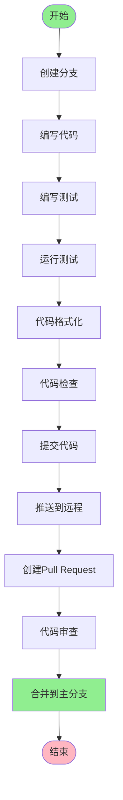

# 开发指南

本文档为钉钉直播回放下载工具的开发指南,涵盖环境搭建、开发流程、常用命令及调试技巧,帮助新团队成员快速上手项目开发。

## 目录

- [一、环境搭建](#一环境搭建)
- [二、项目结构](#二项目结构)
- [三、开发流程](#三开发流程)
- [四、常用命令](#四常用命令)
- [五、调试技巧](#五调试技巧)
- [六、常见问题](#六常见问题)
- [七、最佳实践](#七最佳实践)

---

## 一、环境搭建

### 1.1 系统要求

- **操作系统**: Windows 11(推荐)、Windows 10、macOS、Linux
- **Python版本**: 3.8 或更高版本
- **浏览器**: Microsoft Edge、Google Chrome、Mozilla Firefox(任选其一)
- **内存**: 至少 4GB RAM
- **磁盘空间**: 至少 2GB 可用空间

### 1.2 安装步骤

#### 1.2.1 安装Python

1. 访问 [Python官网](https://www.python.org/downloads/)
2. 下载 Python 3.8 或更高版本
3. 运行安装程序,勾选 "Add Python to PATH"
4. 验证安装:

```bash
python --version
```

#### 1.2.2 克隆项目

```bash
git clone https://github.com/glacier0315/DingTalk-Live-Playback-Download-Tool.git
cd DingTalk-Live-Playback-Download-Tool
```

#### 1.2.3 安装依赖

**方式一: 使用pip安装**

```bash
pip install -r requirements.txt
```

**方式二: 使用pipenv安装**

```bash
pip install pipenv
pipenv install
```

**方式三: 使用poetry安装**

```bash
pip install poetry
poetry install
```

#### 1.2.4 安装浏览器驱动

项目使用Selenium进行浏览器自动化,需要安装对应的浏览器驱动:

**Edge驱动(推荐)**:

1. 访问 [EdgeDriver下载页面](https://developer.microsoft.com/en-us/microsoft-edge/tools/webdriver/)
2. 下载与Edge浏览器版本匹配的驱动
3. 将驱动放置在系统PATH路径中,或项目根目录

**Chrome驱动**:

1. 访问 [ChromeDriver下载页面](https://chromedriver.chromium.org/downloads)
2. 下载与Chrome浏览器版本匹配的驱动
3. 将驱动放置在系统PATH路径中,或项目根目录

**Firefox驱动**:

1. 访问 [GeckoDriver下载页面](https://github.com/mozilla/geckodriver/releases)
2. 下载最新版本的驱动
3. 将驱动放置在系统PATH路径中,或项目根目录

#### 1.2.5 安装N_m3u8DL-RE

1. 访问 [N_m3u8DL-RE发布页面](https://github.com/nilaoda/N_m3u8DL-RE/releases)
2. 下载最新版本的二进制文件
3. 将可执行文件放置在系统PATH路径中,或项目根目录

#### 1.2.6 配置项目

1. 复制配置文件模板:

```bash
copy config\app.yaml.example config\app.yaml
```

2. 根据实际情况修改配置文件:

```yaml
app:
  name: "钉钉直播回放下载工具"
  version: "1.0.0"

browser:
  type: "edge" # edge、chrome、firefox
  headless: false # 是否无头模式

download:
  save_mode: "1" # 1: 默认路径, 2: 手动选择
  default_dir: "D:/Downloads"

logging:
  level: "INFO" # DEBUG、INFO、WARNING、ERROR
  retention_days: 30
```

### 1.3 验证安装

运行以下命令验证安装是否成功:

```bash
python -m dingtalk_downloader.main
```

如果看到欢迎信息,说明安装成功。

---

## 二、项目结构

### 2.1 目录结构

```tree
DingTalk-Live-Playback-Download-Tool/
├── config/                          # 配置文件目录
│   ├── app.yaml                     # 应用配置文件
│   └── app.yaml.example             # 配置文件模板
├── docs/                            # 文档目录
│   ├── architecture.md              # 架构文档
│   ├── development_guide.md         # 开发指南
│   └── development_standard.md      # 开发规范
├── logs/                            # 日志文件目录
├── src/                             # 源代码目录
│   └── dingtalk_downloader/         # 主包
│       ├── __init__.py
│       ├── main.py                  # 程序入口
│       ├── browser/                 # 浏览器自动化模块
│       │   ├── __init__.py
│       │   ├── browser_factory.py   # 浏览器工厂
│       │   ├── browser_driver.py    # 浏览器驱动基类
│       │   ├── edge_driver.py       # Edge驱动
│       │   ├── chrome_driver.py     # Chrome驱动
│       │   └── firefox_driver.py   # Firefox驱动
│       ├── binary/                  # 二进制工具封装模块
│       │   ├── __init__.py
│       │   └── n_m3u8dl_re.py      # N_m3u8DL-RE封装
│       ├── config/                  # 配置管理模块
│       │   ├── __init__.py
│       │   ├── yaml_config.py       # YAML配置管理
│       │   ├── logger_config.py     # 日志配置
│       │   ├── header_manager.py    # 请求头管理
│       │   └── constants.py         # 常量定义
│       ├── core/                    # 核心业务逻辑模块
│       │   ├── __init__.py
│       │   ├── downloader.py        # 下载器(外观类)
│       │   ├── video_download_manager.py  # 视频下载管理器
│       │   ├── cookie_handler.py    # Cookie处理器
│       │   ├── m3u8_parser.py      # M3U8解析器
│       │   ├── m3u8_download_service.py  # M3U8下载服务
│       │   ├── user_interaction_controller.py # 用户交互控制器
│       │   ├── dependency_factory.py # 依赖工厂
│       │   └── exceptions.py        # 自定义异常
│       └── utils/                   # 工具函数模块
│           ├── __init__.py
│           ├── models.py            # 数据模型
│           ├── validator.py         # 输入验证
│           ├── file_reader.py       # 文件读取
│           ├── path_selector.py     # 路径选择
│           ├── path_helper.py       # 路径工具
│           ├── file_validator.py    # 文件验证
│           └── m3u8_file_manager.py  # M3U8文件管理
├── tests/                           # 测试目录
│   ├── unit/                        # 单元测试
│   │   ├── test_models.py
│   │   ├── test_validator.py
│   │   ├── test_file_reader.py
│   │   ├── test_path_helper.py
│   │   ├── test_yaml_config.py
│   │   ├── test_cookie_handler.py
│   │   ├── test_m3u8_parser.py
│   │   ├── test_downloader.py
│   │   ├── test_video_download_manager.py
│   │   ├── test_browser_driver.py
│   │   ├── test_browser_factory.py
│   │   ├── test_edge_driver.py
│   │   ├── test_chrome_driver.py
│   │   ├── test_firefox_driver.py
│   │   ├── test_n_m3u8dl_re.py
│   │   ├── test_path_selector.py
│   │   ├── test_file_validator.py
│   │   ├── test_dependency_factory.py
│   │   ├── test_header_manager.py
│   │   ├── test_logger_config.py
│   │   └── test_user_interaction_controller.py
│   ├── integration/                 # 集成测试
│   │   ├── test_download_flow.py
│   │   └── __init__.py
│   ├── functional/                  # 功能测试
│   │   ├── test_user_interaction_controller.py
│   │   └── __init__.py
│   ├── fixtures/                    # 测试数据
│   │   ├── browser_fixtures.py
│   │   ├── cookie_fixtures.py
│   │   ├── file_fixtures.py
│   │   └── mock_fixtures.py
│   ├── mocks/                       # Mock对象
│   │   ├── mock_binary.py
│   │   ├── mock_browser.py
│   │   └── mock_network.py
│   └── conftest.py                  # pytest配置
├── .gitignore                       # Git忽略文件
├── .trae/                           # Trae配置
│   └── rules/
│       └── project_rules.md        # 项目规则
├── pyproject.toml                   # 项目配置文件
├── pytest.ini                       # pytest配置文件
├── README.md                        # 项目说明文档
└── requirements.txt                 # 依赖列表
```

### 2.2 核心模块说明

| 模块                           | 职责            | 关键类/函数                                             |
| ------------------------------ | --------------- | ------------------------------------------------------- |
| main.py                        | 程序入口        | main(), single_mode(), batch_mode()                     |
| core/downloader.py             | 下载器外观类    | Downloader                                              |
| core/video_download_manager.py | 视频下载管理器  | VideoDownloadManager                                    |
| core/cookie_handler.py         | Cookie处理器    | CookieHandler                                           |
| core/m3u8_parser.py            | M3U8解析器      | M3u8Parser                                              |
| core/m3u8_download_service.py  | M3U8下载服务    | M3u8DownloadService                                     |
| core/user_interaction_controller.py | 用户交互控制器 | UserInteractionController                                 |
| core/dependency_factory.py     | 依赖工厂        | DependencyFactory                                        |
| browser/browser_factory.py     | 浏览器工厂      | BrowserFactory                                          |
| browser/browser_driver.py      | 浏览器驱动基类  | BrowserDriver                                           |
| binary/n_m3u8dl_re.py          | N_m3u8DL-RE封装 | NM3u8DLRE                                               |
| utils/models.py                | 数据模型        | CookieData, HeadersData, M3u8Link, VideoDownloadContext |
| utils/validator.py             | 输入验证        | validate_input(), validate_dingtalk_url()               |
| utils/file_reader.py           | 文件读取        | FileReader                                              |
| utils/path_selector.py         | 路径选择        | PathSelector                                            |
| utils/file_validator.py        | 文件验证        | FileValidator                                           |
| config/yaml_config.py          | YAML配置管理    | YamlConfig                                              |
| config/logger_config.py        | 日志配置        | LoggerConfig                                            |
| config/header_manager.py       | 请求头管理      | HeaderManager                                           |

---

## 三、开发流程

### 3.1 开发流程概述



### 3.2 创建分支

#### 3.2.1 分支命名规范

遵循 `<type>/<功能名>` 格式:

- `feature/新功能名称`: 新功能开发
- `bugfix/问题描述`: Bug修复
- `docs/文档更新`: 文档更新
- `refactor/重构描述`: 代码重构

#### 3.2.2 创建分支示例

```bash
# 创建功能分支
git checkout -b feature/add-batch-download

# 创建Bug修复分支
git checkout -b bugfix/fix-cookie-expiry

# 创建文档更新分支
git checkout -b docs/update-readme
```

### 3.3 编写代码

#### 3.3.1 代码规范

遵循项目代码规范,详见 [development_standard.md](development_standard.md)。

#### 3.3.2 代码模板

创建新模块时,可以使用以下模板:

```python
"""
模块描述
"""

from typing import Optional, List, Dict
from dataclasses import dataclass

class ClassName:
    """类描述"""

    def __init__(self, param: str):
        """初始化方法

        Args:
            param: 参数描述
        """
        self.param = param

    def method_name(self, arg1: str, arg2: Optional[int] = None) -> bool:
        """方法描述

        Args:
            arg1: 参数1描述
            arg2: 参数2描述

        Returns:
            返回值描述
        """
        pass
```

### 3.4 编写测试

#### 3.4.1 测试文件组织

测试文件应放在 `tests/unit/` 目录下,命名格式为 `test_<模块名>.py`。

#### 3.4.2 测试示例

```python
import pytest
from dingtalk_downloader.utils.models import CookieData

class TestCookieData:
    """测试CookieData类"""

    def test_create_cookie_data(self):
        """测试创建CookieData"""
        cookies = {"key1": "value1", "key2": "value2"}
        cookie_data = CookieData(cookies)

        assert cookie_data.cookies == cookies

    def test_to_dict(self):
        """测试to_dict方法"""
        cookies = {"key1": "value1"}
        cookie_data = CookieData(cookies)

        result = cookie_data.to_dict()

        assert result == cookies
        assert result is not cookies  # 确保返回的是副本
```

#### 3.4.3 运行测试

```bash
# 运行所有测试
pytest

# 运行特定测试文件
pytest tests/unit/test_models.py

# 运行特定测试函数
pytest tests/unit/test_models.py::TestCookieData::test_create_cookie_data

# 显示详细输出
pytest -v

# 显示覆盖率
pytest --cov=src/dingtalk_downloader
```

### 3.5 代码格式化

#### 3.5.1 使用Black格式化

```bash
# 格式化所有Python文件
black src/ tests/

# 格式化特定文件
black src/dingtalk_downloader/main.py

# 检查格式(不修改文件)
black --check src/ tests/
```

#### 3.5.2 Black配置

在 `pyproject.toml` 中配置Black:

```toml
[tool.black]
line-length = 79
target-version = ['py38']
include = '\.pyi?$'
```

### 3.6 代码检查

#### 3.6.1 使用Flake8检查

```bash
# 检查所有Python文件
flake8 src/ tests/

# 检查特定文件
flake8 src/dingtalk_downloader/main.py

# 显示错误代码
flake8 src/ tests/ --show-source
```

#### 3.6.2 Flake8配置

在 `pyproject.toml` 中配置Flake8:

```toml
[tool.flake8]
max-line-length = 79
exclude = [
    '.git',
    '__pycache__',
    '.pytest_cache',
    'venv',
    'env',
]
ignore = ['E203', 'W503']
```

### 3.7 提交代码

#### 3.7.1 提交信息规范

遵循 `<type>(<scope>): <subject>` 格式:

- `feat`: 新功能
- `fix`: Bug修复
- `docs`: 文档更新
- `style`: 代码格式调整(不影响功能)
- `refactor`: 重构(不新增功能不修复bug)
- `test`: 补充测试
- `chore`: 构建/依赖调整

#### 3.7.2 提交信息示例

```text
feat(downloader): 添加批量下载功能

- 支持从CSV/Excel文件读取链接
- 支持批量下载多个视频
- 添加下载进度显示
```

#### 3.7.3 提交代码步骤

```bash
# 添加文件到暂存区
git add src/dingtalk_downloader/main.py

# 提交代码
git commit -m "feat(main): 添加批量下载功能"

# 推送到远程
git push origin feature/add-batch-download
```

### 3.8 创建Pull Request

1. 访问项目的GitHub页面
2. 点击 "Pull requests" → "New pull request"
3. 选择分支: `feature/add-batch-download` → `main`
4. 填写PR描述:
   - 标题: 简洁描述本次变更
   - 描述: 详细说明变更内容、测试情况等
5. 提交PR

---

## 四、常用命令

### 4.1 项目管理命令

```bash
# 查看项目状态
git status

# 查看分支
git branch -a

# 创建新分支
git checkout -b feature/new-feature

# 切换分支
git checkout main

# 合并分支
git merge feature/new-feature

# 删除分支
git branch -d feature/new-feature
```

### 4.2 依赖管理命令

```bash
# 安装依赖
pip install -r requirements.txt

# 安装特定包
pip install selenium

# 升级包
pip install --upgrade selenium

# 卸载包
pip uninstall selenium

# 查看已安装的包
pip list

# 导出依赖列表
pip freeze > requirements.txt
```

### 4.3 测试命令

```bash
# 运行所有测试
pytest

# 运行特定测试文件
pytest tests/unit/test_models.py

# 运行特定测试函数
pytest tests/unit/test_models.py::TestCookieData::test_create_cookie_data

# 显示详细输出
pytest -v

# 显示覆盖率
pytest --cov=src/dingtalk_downloader --cov-report=html

# 停止在第一个失败
pytest -x

# 运行标记为slow的测试
pytest -m slow
```

### 4.4 代码质量命令

```bash
# 格式化代码
black src/ tests/

# 检查代码格式
black --check src/ tests/

# 代码检查
flake8 src/ tests/

# 类型检查(如果使用mypy)
mypy src/dingtalk_downloader/

# 生成覆盖率报告
pytest --cov=src/dingtalk_downloader --cov-report=html
```

### 4.5 运行程序命令

```bash
# 运行程序
python -m dingtalk_downloader.main

# 运行特定模块
python -m dingtalk_downloader.core.downloader

# 调试模式运行
python -m pdb dingtalk_downloader/main.py
```

### 4.6 日志查看命令

```bash
# 查看最新日志
tail -f logs/app.log

# 查看错误日志
grep ERROR logs/app.log

# 查看最近100行日志
tail -n 100 logs/app.log

# 清空日志
> logs/app.log
```

---

## 五、调试技巧

### 5.1 日志调试

#### 5.1.1 配置日志级别

在 `config/app.yaml` 中修改日志级别:

```yaml
logging:
  level: "DEBUG" # DEBUG、INFO、WARNING、ERROR
```

#### 5.1.2 添加日志

```python
import logging

logger = logging.getLogger(__name__)

def some_function():
    logger.debug("调试信息")
    logger.info("普通信息")
    logger.warning("警告信息")
    logger.error("错误信息")
```

#### 5.1.3 查看日志

```bash
# 实时查看日志
tail -f logs/app.log

# 查看特定级别的日志
grep ERROR logs/app.log
grep DEBUG logs/app.log
```

### 5.2 断点调试

#### 5.2.1 使用pdb调试

```python
import pdb

def some_function():
    pdb.set_trace()  # 设置断点
    # 代码会在这里暂停
    x = 1
    y = 2
    return x + y
```

#### 5.2.2 pdb常用命令

```bash
# 进入调试模式后,可以使用以下命令:
n  # 执行下一行
s  # 进入函数
c  # 继续执行
p  # 打印变量
l  # 列出代码
q  # 退出调试
```

#### 5.2.3 使用IDE调试

推荐使用VS Code或PyCharm进行调试:

**VS Code**:

1. 在代码行号左侧点击设置断点
2. 按 F5 开始调试
3. 使用调试工具栏控制执行

**PyCharm**:

1. 在代码行号左侧点击设置断点
2. 点击 Debug 按钮
3. 使用调试工具栏控制执行

### 5.3 单元测试调试

#### 5.3.1 调试单个测试

```bash
# 使用pdb调试单个测试
pytest --pdb tests/unit/test_models.py::TestCookieData::test_create_cookie_data

# 使用IDE调试
# 在测试代码中设置断点,然后右键选择"Debug"
```

#### 5.3.2 查看测试输出

```bash
# 显示详细输出
pytest -v

# 显示print输出
pytest -s

# 显示局部变量
pytest --tb=long
```

### 5.4 浏览器自动化调试

#### 5.4.1 使用有头模式

在 `config/app.yaml` 中设置:

```yaml
browser:
  headless: false # 显示浏览器窗口
```

#### 5.4.2 添加延迟

在关键操作后添加延迟:

```python
import time

def some_function():
    time.sleep(2)  # 等待2秒
```

#### 5.4.3 截图调试

```python
def some_function():
    driver.save_screenshot("debug.png")
```

### 5.5 依赖注入调试

#### 5.5.1 查看依赖实例

```python
# 在DependencyFactory中添加调试方法
def debug_instances(self):
    """查看所有缓存的实例"""
    for key, instance in self._instances.items():
        print(f"{key}: {instance}")
```

#### 5.5.2 清除依赖缓存

```python
# 在测试中清除依赖缓存
def test_something():
    factory = DependencyFactory()
    factory.clear_instances()
    # 现在可以创建新的实例
```

### 5.6 性能分析

#### 5.6.1 使用cProfile

```bash
python -m cProfile -o profile.stats -m dingtalk_downloader.main
```

#### 5.6.2 查看性能报告

```python
import pstats

p = pstats.Stats('profile.stats')
p.sort_stats('cumulative')
p.print_stats(10)  # 显示前10个最耗时的函数
```

### 5.7 内存分析

#### 5.7.1 使用memory_profiler

```bash
pip install memory_profiler
```

```python
from memory_profiler import profile

@profile
def some_function():
    pass
```

```bash
python -m memory_profiler dingtalk_downloader/main.py
```

---

## 六、常见问题

### 6.1 安装问题

#### 问题1: pip安装失败

**症状**:

```text
ERROR: Could not find a version that satisfies requirement xxx
```

**解决方案**:

```bash
# 升级pip
python -m pip install --upgrade pip

# 使用国内镜像源
pip install -r requirements.txt -i https://pypi.tuna.tsinghua.edu.cn/simple
```

#### 问题2: 浏览器驱动不匹配

**症状**:

```text
selenium.common.exceptions.SessionNotCreatedException: Message: session not created
```

**解决方案**:

1. 检查浏览器版本
2. 下载对应版本的驱动
3. 将驱动放置在系统PATH路径中

### 6.2 运行问题

#### 问题3: Cookie获取失败

**症状**:

```text
Cookie获取失败,请检查是否已登录
```

**解决方案**:

1. 确保在浏览器中已登录钉钉账号
2. 检查网络连接
3. 查看日志文件了解详细错误

#### 问题4: M3U8链接提取失败

**症状**:

```text
无法从页面中提取M3U8链接
```

**解决方案**:

1. 刷新页面重试
2. 检查网络连接
3. 查看浏览器日志

### 6.3 测试问题

#### 问题5: 测试失败

**症状**:

```text
FAILED tests/unit/test_models.py::TestCookieData::test_create_cookie_data
```

**解决方案**:

```bash
# 查看详细错误信息
pytest tests/unit/test_models.py::TestCookieData::test_create_cookie_data -v

# 使用pdb调试
pytest --pdb tests/unit/test_models.py::TestCookieData::test_create_cookie_data
```

#### 问题6: 覆盖率不达标

**症状**:

```text
Coverage: 80%
```

**解决方案**:

1. 查看覆盖率报告
2. 为未覆盖的代码编写测试
3. 使用 `pytest --cov-report=html` 查看HTML报告

### 6.4 性能问题

#### 问题7: 下载速度慢

**症状**:

下载速度很慢

**解决方案**:

1. 检查网络连接
2. 使用多线程下载
3. 优化N_m3u8DL-RE参数

#### 问题8: 内存占用高

**症状**:

程序运行时内存占用很高

**解决方案**:

1. 使用内存分析工具找出内存泄漏
2. 及时释放不需要的资源
3. 使用生成器代替列表

---

## 七、最佳实践

### 7.1 代码编写

1. **遵循PEP 8规范**: 使用Black自动格式化代码
2. **添加类型提示**: 提高代码可读性和可维护性
3. **编写文档字符串**: 为函数和类添加docstring
4. **使用有意义的命名**: 变量、函数、类名要清晰表达意图
5. **保持函数简短**: 单个函数不超过50行
6. **避免重复代码**: 抽取公共逻辑为函数或类

### 7.2 测试编写

1. **编写单元测试**: 为每个函数编写测试
2. **使用pytest框架**: pytest功能强大,易于使用
3. **测试边界条件**: 测试正常情况和异常情况
4. **使用Mock**: 隔离外部依赖
5. **保持测试独立**: 每个测试应该独立运行
6. **提高覆盖率**: 目标覆盖率90%以上

### 7.3 版本控制

1. **频繁提交**: 小步快跑,频繁提交代码
2. **清晰的提交信息**: 遵循提交信息规范
3. **使用分支**: 每个功能使用独立分支
4. **代码审查**: 提交前进行代码审查
5. **保持主分支稳定**: 主分支应该始终可运行

### 7.4 文档维护

1. **及时更新文档**: 代码变更后同步更新文档
2. **使用Markdown**: Markdown格式易读易写
3. **添加示例**: 为复杂功能添加使用示例
4. **保持文档简洁**: 避免冗余内容
5. **定期审查**: 定期检查文档的准确性

### 7.5 性能优化

1. **避免过早优化**: 先保证正确性,再优化性能
2. **使用性能分析工具**: 使用cProfile、memory_profiler等工具
3. **优化热点代码**: 优化最耗时的部分
4. **使用缓存**: 避免重复计算
5. **使用异步IO**: 对于IO密集型任务使用异步

### 7.6 安全实践

1. **不要硬编码密码**: 使用环境变量或配置文件
2. **验证输入**: 对用户输入进行验证
3. **使用HTTPS**: 使用安全的通信协议
4. **定期更新依赖**: 及时更新第三方库
5. **最小权限原则**: 只给程序必要的权限

### 7.7 依赖注入

1. **使用依赖工厂**: 通过DependencyFactory创建依赖
2. **支持依赖注入**: 在构造函数中注入依赖
3. **便于测试**: 依赖注入使得单元测试更容易
4. **降低耦合**: 减少模块间的直接依赖

---

## 总结

本文档提供了钉钉直播回放下载工具的开发指南,包括环境搭建、开发流程、常用命令及调试技巧。遵循本文档的指导,新团队成员可以快速上手项目开发,提高开发效率和代码质量。

关键要点:

1. **环境搭建**: 按照步骤安装Python、依赖、浏览器驱动等
2. **开发流程**: 遵循分支管理、代码编写、测试、提交的流程
3. **常用命令**: 熟练使用Git、pytest、Black、Flake8等工具
4. **调试技巧**: 掌握日志、断点、性能分析等调试方法
5. **最佳实践**: 遵循代码规范、测试规范、版本控制规范

如有疑问,请参考项目其他文档或联系项目维护者。
