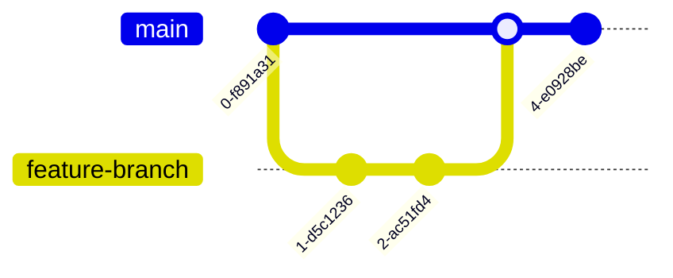
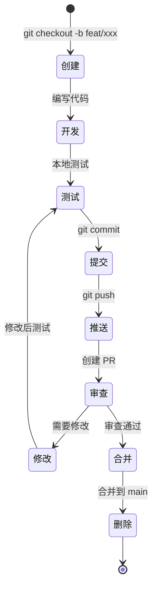

# 项目开发规范

本文档定义了钉钉直播回放下载工具项目的完整开发规范，所有开发人员必须严格遵循，以确保代码质量和项目可维护性。

## 一、命名规范（遵循 PEP 8）

### 1. 文件名/目录名

- **规范**：小写字母+下划线
- **示例**：
  - `binary_handler.py` ✅
  - `core_module/` ✅
  - `download_manager.py` ✅
  - `BinaryHandler.py` ❌
  - `downloadManager.py` ❌

### 2. 变量/函数名

- **规范**：小写字母+下划线（蛇形命名）
- **示例**：
  - `binary_file_path` ✅
  - `execute_binary_task()` ✅
  - `get_browser_cookie()` ✅
  - `binaryFilePath` ❌
  - `executeBinaryTask()` ❌

### 3. 类名

- **规范**：大驼峰命名（PascalCase）
- **示例**：
  - `BinaryProcessor` ✅
  - `DownloadManager` ✅
  - `CookieHandler` ✅
  - `binary_processor` ❌
  - `binaryProcessor` ❌

### 4. 常量

- **规范**：全大写+下划线
- **示例**：
  - `BINARY_FILE_NAME = "xxx.bin"` ✅
  - `MAX_RETRY_COUNT = 5` ✅
  - `DEFAULT_BROWSER_TYPE = "edge"` ✅
  - `binary_file_name = "xxx.bin"` ❌
  - `MaxRetryCount = 5` ❌

### 5. 私有成员

- **规范**：前缀单下划线表示受保护成员，前缀双下划线表示私有成员
- **示例**：
  - `_internal_method()` ✅（受保护）
  - `__private_method()` ✅（私有）
  - `public_method()` ✅（公开）

### 6. 避免无意义命名

- **禁止使用**：`a`、`b`、`func1`、`temp`、`data`等无语义命名
- **推荐使用**：具有描述性的名称
  - `user_input` ✅
  - `download_url` ✅
  - `cookie_dict` ✅
  - `a` ❌
  - `func1` ❌
  - `temp` ❌

### 7. 特殊命名约定

- **布尔变量**：使用`is_`、`has_`、`can_`等前缀
  - `is_valid` ✅
  - `has_cookie` ✅
  - `can_download` ✅
- **集合变量**：使用复数形式
  - `links` ✅
  - `cookies` ✅
  - `headers` ✅
- **迭代变量**：在循环中使用有意义的名称
  - `for idx, link in enumerate(links):` ✅
  - `for i in range(len(links)):` ❌（除非索引确实需要）

## 二、注释规范

### 1. 模块注释

每个`.py`文件顶部必须添加模块说明，包含以下信息：

- **功能描述**：简要说明模块的功能
- **作者**：原作者或维护者
- **依赖**：主要依赖的外部库
- **创建日期**：文件创建日期
- **修改历史**：重要修改记录

**示例**：

```python
"""
钉钉直播回放下载工具 - 浏览器Cookie处理模块

本模块负责通过Selenium自动化浏览器获取钉钉直播回放的Cookie和请求头信息，
支持Edge、Chrome、Firefox三种浏览器。

作者：项目团队
依赖：selenium>=4.6.0
创建日期：2024-12-18
修改历史：
    - 2024-12-18: 初始版本
    - 2025-01-14: 添加Firefox浏览器支持
"""
```

### 2. 类注释

使用 Google 风格文档字符串，包含以下信息：

- **类描述**：类的功能和用途
- **属性**：重要属性的说明
- **方法**：主要方法的简要说明

**示例**：

```python
class BinaryProcessor:
    """
    二进制程序处理器，负责调用和管理外部二进制工具。

    该类封装了N_m3u8DL-RE和FFmpeg等二进制程序的调用逻辑，
    提供统一的接口供上层模块使用。

    Attributes:
        binary_path (str): 二进制程序的路径
        binary_name (str): 二进制程序的名称
        max_retries (int): 最大重试次数
    """

    def __init__(self, binary_path: str, max_retries: int = 3):
        """
        初始化二进制程序处理器。

        Args:
            binary_path: 二进制程序的绝对路径
            max_retries: 最大重试次数，默认为3

        Raises:
            FileNotFoundError: 当二进制程序文件不存在时
        """
        pass
```

### 3. 函数注释

使用 Google 风格文档字符串，包含以下信息：

- **功能描述**：函数的功能和用途
- **参数（Args）**：每个参数的名称、类型和说明
- **返回值（Returns）**：返回值的类型和说明
- **异常（Raises）**：可能抛出的异常及条件
- **示例（Examples）**：使用示例（可选）

**示例**：

```python
def get_browser_cookie(url: str, browser_type: str = 'edge') -> tuple:
    """
    获取浏览器Cookie和请求头信息。

    通过Selenium自动化浏览器访问指定URL，获取登录后的Cookie和请求头信息，
    用于后续的m3u8视频流下载。

    Args:
        url: 钉钉直播回放分享链接
        browser_type: 浏览器类型，可选值为'edge'、'chrome'、'firefox'，默认为'edge'

    Returns:
        tuple: 包含四个元素的元组
            - browser: Selenium浏览器实例
            - cookie_dict: Cookie字典，格式为{cookie_name: cookie_value}
            - headers: 请求头字典，包含User-Agent、Referer等
            - live_name: 直播视频名称

    Raises:
        Exception: 当浏览器启动失败或获取Cookie失败时
        TimeoutException: 当页面加载超时时

    Examples:
        >>> browser, cookies, headers, name = get_browser_cookie(
        ...     "https://n.dingtalk.com/xxx",
        ...     browser_type='edge'
        ... )
        >>> print(cookies)
        {'session_id': 'xxx', 'user_token': 'yyy'}
    """
    pass
```

### 4. 行内注释

- **原则**：仅为复杂逻辑添加注释，避免冗余注释
- **禁止**：注释显而易见的代码（如`a = 1 # 赋值1`）
- **推荐**：解释"为什么"而不是"是什么"

**示例**：

```python
# ❌ 错误示例：冗余注释
count = 0  # 初始化计数器为0
for link in links:  # 遍历所有链接
    count += 1  # 计数加1

# ✅ 正确示例：解释复杂逻辑
# 使用正则表达式从m3u8链接中提取基础URL
# 用于后续下载时构建完整的资源路径
pattern = re.compile(r'(https?://[^/]+/live_hp/[0-9a-f-]+)')
match = pattern.search(m3u8_url)
base_url = match.group(1) if match else m3u8_url
```

### 5. 注释语言

- **规范**：使用中文编写注释
- **例外**：技术术语、API 名称、变量名等保持英文
- **示例**：

  ```python
  # 获取浏览器Cookie  ✅
  # Get browser cookies  ❌（除非是国际化项目）
  ```

### 6. 注释工具

- **推荐**：借助 Trae IDE GLM-4.7 生成注释
- **要求**：保证格式统一，风格一致
- **流程**：
  1. 编写函数/类的基本逻辑
  2. 使用 Trae IDE 的 AI 功能生成注释
  3. 审查并调整注释，确保准确性和完整性
  4. 保持与现有注释风格一致

### 7. TODO 注释

- **格式**：`# TODO: [描述]`
- **用途**：标记待完成的功能或需要改进的代码
- **示例**：

  ```python
  # TODO: 添加对Safari浏览器的支持
  # TODO: 优化批量下载性能，考虑使用多线程
  ```

### 8. FIXME 注释

- **格式**：`# FIXME: [描述]`
- **用途**：标记需要修复的问题或已知的 bug
- **示例**：

  ```python
  # FIXME: 当前重试机制可能导致无限循环，需要添加最大重试次数限制
  ```

### 9. HACK 注释

- **格式**：`# HACK: [描述]`
- **用途**：标记临时解决方案或不够优雅的实现
- **示例**：

  ```python
  # HACK: 由于钉钉页面结构变化，暂时使用XPath获取直播名称
  # 后续需要寻找更稳定的方法
  live_name = browser.find_element(By.XPATH, '//*[@id="live-room"]/div[1]/div[1]/h3').text
  ```

### 10. 注释位置

- **模块注释**：文件顶部，在 import 语句之前
- **类注释**：类定义下方，缩进一级
- **函数注释**：函数定义下方，缩进一级
- **行内注释**：注释所在行的末尾或上一行，与代码对齐

**示例**：

```python
"""
模块注释
"""

import os
import sys


class MyClass:
    """类注释"""

    def my_method(self):
        """方法注释"""
        # 行内注释
        pass
```

## 三、项目结构规范（后续重构目标结构）

### 1. 根目录结构

```markdown
DingTalk-Live-Playback-Download-Tool/
├── src/ # 源代码目录（所有业务代码放入此处）
│ └── dingtalk_downloader/ # 项目包名（与项目名称一致，包含**init**.py）
│ ├── **init**.py # 包初始化文件，简化导入
│ ├── main.py # 程序入口文件
│ ├── core/ # 核心业务逻辑模块
│ │ ├── **init**.py
│ │ ├── downloader.py # 下载器核心逻辑
│ │ ├── cookie_handler.py # Cookie 处理逻辑
│ │ └── m3u8_parser.py # m3u8 解析逻辑
│ ├── utils/ # 工具函数模块
│ │ ├── **init**.py
│ │ ├── file_reader.py # 文件读取工具
│ │ ├── validator.py # 输入验证工具
│ │ └── path_helper.py # 路径处理工具
│ ├── binary/ # 二进制程序调用模块
│ │ ├── **init**.py
│ │ ├── n_m3u8dl_re.py # N_m3u8DL-RE 调用封装
│ │ └── ffmpeg_wrapper.py # FFmpeg 调用封装
│ ├── browser/ # 浏览器自动化模块
│ │ ├── **init**.py
│ │ ├── browser_factory.py # 浏览器工厂
│ │ ├── edge_driver.py # Edge 浏览器驱动
│ │ ├── chrome_driver.py # Chrome 浏览器驱动
│ │ └── firefox_driver.py # Firefox 浏览器驱动
│ └── config/ # 配置管理模块
│ ├── **init**.py
│ ├── settings.py # 配置项定义
│ └── constants.py # 常量定义
├── tests/ # 测试代码目录（与 src 目录结构对应）
│ ├── **init**.py
│ ├── unit/ # 单元测试
│ │ ├── **init**.py
│ │ ├── test_downloader.py
│ │ ├── test_cookie_handler.py
│ │ ├── test_file_reader.py
│ │ └── test_binary_handler.py
│ ├── integration/ # 集成测试
│ │ ├── **init**.py
│ │ └── test_download_flow.py
│ └── fixtures/ # 测试数据
│ ├── sample_links.csv
│ └── sample_links.xlsx
├── assets/ # 静态资源目录
│ ├── bin/ # 外部二进制程序目录
│ │ ├── N_m3u8DL-RE.exe # N_m3u8DL-RE 可执行文件(Windows)
│ │ ├── N_m3u8DL-RE # N_m3u8DL-RE 可执行文件(Linux/macOS)
│ │ ├── ffmpeg.exe # FFmpeg 可执行文件(Windows)
│ │ └── ffmpeg # FFmpeg 可执行文件(Linux/macOS)
│ ├── template/ # 模板文件目录
│ │ └── 批量下载模板.xlsx # 批量下载模板文件
│ └── ICO/ # 图标资源目录
│ ├── icon-512x512.png
│ ├── icon.ico
│ └── icon.png
├── scripts/ # 辅助脚本目录（验证、部署等）
│ ├── setup.py # 安装脚本
│ ├── validate_dependencies.py # 依赖验证脚本
│ └── build_exe.py # 打包为 exe 的脚本
├── docs/ # 文档目录
│ ├── project_status.md # 项目现状记录
│ ├── development_standard.md # 开发规范（本文件）
│ ├── api/ # API 文档
│ │ └── api_reference.md
│ ├── user_guide/ # 用户指南
│ │ └── usage_guide.md
│ └── foundation/ # 基础文档
│ ├── N_m3u8DL-RE.md
│ ├── ffmpeg.md
│ └── 钉钉视频下载记录.md
├── requirements.txt # 依赖清单
├── requirements-dev.txt # 开发依赖清单
├── .gitignore # Git 忽略文件
├── .env.example # 环境变量示例文件
├── README.md # 项目说明
├── LICENSE # 许可证
├── pyproject.toml # 项目配置文件（Python 3.6+）
└── setup.cfg # 安装配置文件
```

### 2. 目录职责说明

#### src/ 源代码目录

- **职责**：存放所有业务代码
- **原则**：所有可执行代码必须在 src 目录下
- **命名**：包名使用小写字母+下划线

#### tests/ 测试代码目录

- **职责**：存放所有测试代码
- **原则**：测试目录结构与 src 目录对应
- **命名**：测试文件以`test_`开头

#### assets/ 静态资源目录

- **职责**:存放外部二进制程序、模板文件和静态资源
- **原则**:所有外部依赖的可执行文件和静态资源统一管理
- **命名**:保持原始文件名,遵循统一的命名规范

##### assets/bin/ 外部二进制程序目录

- **职责**:存放项目所需的外部二进制程序和可执行文件
- **原则**:仅存放可执行文件和必要的依赖文件
- **命名**:使用小写字母、数字、连字符和下划线

##### assets/template/ 模板文件目录

- **职责**:存放项目使用的模板文件
- **原则**:仅存放模板文件,便于用户下载和使用
- **命名**:保持原始文件名,支持中文

##### assets/ICO/ 图标资源目录

- **职责**:存放项目图标和图片资源
- **原则**:仅存放图标和图片文件
- **命名**:使用描述性文件名

### 外部二进制文件管理规范

#### 标准化存放路径

**外部二进制文件标准路径**: `assets/bin/`

#### 核心用途与职责范围

- 存放项目所需的外部二进制程序和可执行文件
- 统一管理跨平台的可执行文件(Windows/Linux/macOS)
- 提供统一的二进制文件访问接口
- 便于版本管理和依赖控制

#### 允许存放的文件类型

- Windows 平台: `.exe` 可执行文件
- Linux/macOS 平台: 无扩展名的可执行文件
- 必要的依赖文件: `.dll`(Windows)、`.so`(Linux)、`.dylib`(macOS)

#### 严格的类型限制

- 仅允许可执行文件和必要的依赖文件
- 不允许配置文件、数据文件、文档文件
- 不允许脚本文件(.bat, .sh, .ps1 等)
- 不允许临时文件和缓存文件

#### 统一的文件命名规范

**命名格式**: 使用小写字母、数字、连字符(-)和下划线(\_)

**长度限制**: 文件名长度不超过 255 个字符

**特殊字符规则**:

- 允许: a-z, 0-9, -, \_
- 不允许: 空格, @, #, $, %, ^, &, \*, (, ), +, =, {, }, [, ], |, \, :, ;, ", ', <, >, ?, /

**示例**:

- ✅ `n_m3u8dl-re.exe`
- ✅ `ffmpeg.exe`
- ❌ `N_m3u8DL-RE.exe`(大写字母)
- ❌ `n m3u8dl re.exe`(空格)
- ❌ `n_m3u8dl-re@v1.0.exe`(特殊字符)

#### 标准路径展示

**N_m3u8DL-RE 工具路径**:

- Windows: `assets/bin/N_m3u8DL-RE.exe`
- Linux/macOS: `assets/bin/N_m3u8DL-RE`

**FFmpeg 工具路径**:

- Windows: `assets/bin/ffmpeg.exe`
- Linux/macOS: `assets/bin/ffmpeg`

### 批量下载模板路径规范

**批量下载模板标准路径**: `assets/template/批量下载模板.xlsx`

该模板文件用于批量下载模式,用户可以填写钉钉直播回放链接,程序会自动读取并批量下载。

### ICO 文件夹路径规范

**ICO 文件夹标准路径**: `assets/ICO/`

**图标文件路径**:

- `assets/ICO/icon-512x512.png`
- `assets/ICO/icon.ico`
- `assets/ICO/icon.png`

该目录存放项目图标和图片资源,用于应用程序的界面展示。

#### scripts/ 辅助脚本目录

- **职责**：存放辅助脚本（安装、部署、验证等）
- **原则**：脚本命名清晰，功能单一
- **命名**：使用动词开头，如`setup.py`、`validate.py`

#### docs/ 文档目录

- **职责**：存放所有项目文档
- **原则**：文档分类清晰，易于查找
- **命名**：使用小写字母+下划线

### 3. 模块组织原则

#### 单一职责原则

- 每个模块只负责一个功能领域
- 模块内部函数和类职责明确
- 避免模块间过度耦合

#### 依赖倒置原则

- 高层模块不依赖低层模块，都依赖抽象
- 通过接口定义模块间交互
- 便于单元测试和模块替换

#### 开闭原则

- 对扩展开放，对修改关闭
- 通过继承和接口扩展功能
- 避免修改已有代码

### 4. 导入规范

#### 导入顺序

1. 标准库导入
2. 第三方库导入
3. 本地应用/库导入

#### 导入分组

- 每组导入之间用空行分隔
- 同组导入按字母顺序排列

#### 示例

```python
# 标准库导入
import os
import sys
from pathlib import Path

# 第三方库导入
import pandas as pd
from selenium import webdriver
from selenium.webdriver.common.by import By

# 本地应用导入
from dingtalk_downloader.core.downloader import Downloader
from dingtalk_downloader.utils.file_reader import FileReader
```

#### 避免使用通配符导入

```python
# ❌ 错误示例
from module import *

# ✅ 正确示例
from module import function1, function2
```

#### 避免循环导入

- 通过重构模块结构解决循环导入
- 使用延迟导入（在函数内部导入）

### 5. 文件组织原则

#### 文件大小限制

- 单个 Python 文件不超过 500 行
- 超过 500 行考虑拆分为多个模块
- 保持文件职责单一

#### 类和函数组织

- 类定义按字母顺序排列
- 公共方法在前，私有方法在后
- 函数按逻辑分组，使用注释分隔

**示例**：

```python
class MyClass:
    """类文档字符串"""

    def __init__(self):
        """初始化方法"""
        pass

    # 公共方法
    def public_method1(self):
        """公共方法1"""
        pass

    def public_method2(self):
        """公共方法2"""
        pass

    # 私有方法
    def _private_method1(self):
        """私有方法1"""
        pass

    def _private_method2(self):
        """私有方法2"""
        pass
```

## 四、Git 提交信息规范（遵循 Conventional Commits）

### 1. 格式规范

```markdown
<type>(<scope>): <description>

[optional body]

[optional footer]
```

### 2. Type（类型）可选值

#### refactor：重构

- **定义**：结构/代码优化，无功能变化
- **示例**：
  - `refactor(core): 拆分下载器模块，提高代码可维护性`
  - `refactor(utils): 提取文件读取逻辑到独立模块`
  - `refactor(binary): 统一二进制程序调用接口`

#### docs：文档修改

- **定义**：文档的添加、修改或删除
- **示例**：
  - `docs: 添加项目开发规范文档`
  - `docs(readme): 更新安装说明和使用指南`
  - `docs(api): 完善API文档`

#### chore：杂项操作

- **定义**：依赖、配置等不改变代码逻辑的操作
- **示例**：
  - `chore: 更新requirements.txt依赖版本`
  - `chore: 添加.gitignore规则`
  - `chore: 配置代码格式化工具`

#### test：添加/修改测试代码

- **定义**：测试代码的添加、修改或删除
- **示例**：
  - `test: 添加下载器单元测试`
  - `test(core): 修复Cookie处理测试用例`
  - `test(integration): 添加批量下载集成测试`

#### fix：修复 bug

- **定义**：修复代码中的 bug 或错误
- **示例**：
  - `fix(core): 修复m3u8链接提取失败问题`
  - `fix(browser): 解决Firefox浏览器兼容性问题`
  - `fix(utils): 修复Excel文件编码解析错误`

#### feat：新功能

- **定义**：添加新功能或特性
- **示例**：
  - `feat: 添加Firefox浏览器支持`
  - `feat(core): 实现断点续传功能`
  - `feat(utils): 支持从剪贴板读取链接`

#### style：代码风格修改

- **定义**：不影响代码逻辑的格式修改
- **示例**：
  - `style: 统一代码缩进和空格`
  - `style: 调整导入顺序`
  - `style: 优化注释格式`

#### perf：性能优化

- **定义**：提高代码性能的修改
- **示例**：
  - `perf: 优化批量下载速度`
  - `perf(core): 减少不必要的网络请求`
  - `perf(browser): 优化浏览器启动时间`

#### revert：回滚提交

- **定义**：回滚之前的提交
- **示例**：
  - `revert: 回滚feat: 添加Firefox浏览器支持`

### 3. Scope（范围）

- **定义**：提交影响的模块或功能区域
- **可选值**：
  - `core`：核心业务逻辑
  - `utils`：工具函数
  - `binary`：二进制程序调用
  - `browser`：浏览器自动化
  - `config`：配置管理
  - `test`：测试代码
  - `docs`：文档
  - `scripts`：辅助脚本

### 4. Description（描述）

- **语言**：使用中文
- **长度**：不超过 50 字
- **原则**：简洁明了，描述做了什么
- **示例**：
  - `refactor(core): 拆分下载器模块，提高代码可维护性` ✅
  - `fix(browser): 修复Edge浏览器Cookie获取失败问题` ✅
  - `docs: 添加API文档` ✅
  - `refactor(core): 修改了代码结构` ❌（太笼统）
  - `fix: 修复bug` ❌（太笼统）

### 5. Body（正文）

- **用途**：详细描述提交内容
- **格式**：每行不超过 72 个字符
- **内容**：
  - 修改原因
  - 修改内容
  - 影响范围
  - 注意事项

**示例**：

```markdown
refactor(core): 拆分下载器模块，提高代码可维护性

将原有的单文件下载器拆分为多个子模块：

- downloader.py: 核心下载逻辑
- cookie_handler.py: Cookie 处理逻辑
- m3u8_parser.py: m3u8 解析逻辑

主要改进：

1. 降低模块耦合度
2. 提高代码可测试性
3. 便于后续功能扩展

影响范围：

- 所有导入下载器的代码需要更新导入路径
- 单元测试需要相应调整
```

### 6. Footer（脚注）

- **用途**：关联 Issue、Breaking Change 等
- **格式**：
  - 关联 Issue：`Closes #123` 或 `Refs #123`
  - 破坏性变更：`BREAKING CHANGE: 详细描述`

**示例**：

```markdown
feat(core): 实现断点续传功能

添加断点续传支持，允许从中断处继续下载。

Closes #45
```

```markdown
refactor(api): 重构下载器接口

BREAKING CHANGE: 下载器接口参数顺序已调整，所有调用代码需要更新。
```

### 7. 完整示例

#### 示例 1：重构提交

```markdown
refactor(core): 拆分下载器模块，提高代码可维护性

将原有的单文件下载器拆分为多个子模块：

- downloader.py: 核心下载逻辑
- cookie_handler.py: Cookie 处理逻辑
- m3u8_parser.py: m3u8 解析逻辑

主要改进：

1. 降低模块耦合度
2. 提高代码可测试性
3. 便于后续功能扩展

影响范围：

- 所有导入下载器的代码需要更新导入路径
- 单元测试需要相应调整
```

#### 示例 2：修复提交

```markdown
fix(browser): 修复 Firefox 浏览器 Cookie 获取失败问题

问题原因：

- Firefox 浏览器的日志获取方式与 Chrome/Edge 不同
- 原有代码未正确处理 Firefox 的日志格式

解决方案：

- 使用 execute_script 获取 performance entries
- 通过正则表达式提取 m3u8 链接

测试验证：

- 在 Firefox 浏览器上测试通过
- Chrome 和 Edge 浏览器功能正常

Closes #78
```

#### 示例 3：功能提交

```markdown
feat(core): 实现断点续传功能

新增功能：

1. 支持从中断处继续下载
2. 自动检测已下载的分片
3. 跳过已完成的分片

实现方式：

- 在下载目录创建临时文件记录进度
- 每次下载前检查临时文件
- 根据进度恢复下载

用户体验：

- 减少重复下载时间
- 提高下载成功率
- 支持网络中断后继续

Closes #45
```

#### 示例 4：文档提交

```markdown
docs: 添加项目开发规范文档

新增文档：

- development_standard.md: 完整的开发规范
- 包含命名规范、注释规范、项目结构规范等

目的：

- 统一团队开发标准
- 提高代码质量
- 便于新成员快速上手
```

#### 示例 5：测试提交

```markdown
test(core): 添加下载器单元测试

新增测试用例：

1. test_download_single_video: 测试单个视频下载
2. test_download_batch_videos: 测试批量下载
3. test_resume_download: 测试断点续传

测试覆盖率：

- 下载器核心逻辑：85%
- Cookie 处理：90%
- m3u8 解析：80%

使用工具：

- pytest
- pytest-cov
- pytest-mock
```

### 8. 提交频率

- **原则**：小步提交，频繁提交
- **粒度**：每次提交只做一件事
- **时机**：
  - 完成一个功能点
  - 修复一个 bug
  - 完成一次重构
  - 添加/修改测试

### 9. 提交检查清单

提交前请确认：

- [ ] 提交信息符合格式规范
- [ ] 提交信息描述清晰准确
- [ ] 代码通过所有测试
- [ ] 代码符合开发规范
- [ ] 无敏感信息（如 API 密钥、密码等）
- [ ] 无调试代码和注释掉的代码
- [ ] 无不必要的文件（如临时文件、日志文件）

### 10. 分支管理规范

#### 分支命名

- `main`：主分支，用于生产环境
- `dev`：开发分支，用于集成开发
- `feature/<feature-name>`：功能分支
- `fix/<bug-name>`：修复分支
- `refactor/<refactor-name>`：重构分支

#### 分支策略

- 从`dev`分支创建功能分支
- 功能开发完成后合并回`dev`
- 定期将`dev`合并到`main`
- 使用 Pull Request 进行代码审查

**示例**：

```markdown
feature/add-firefox-support
fix/cookie-getting-failure
refactor/module-structure-optimization
```

## 五、代码质量规范

### 1. 代码格式化

- **工具**：使用`black`进行代码格式化
- **配置**：遵循默认配置
- **命令**：`black src/ tests/`

### 2. 代码检查

- **工具**：使用`flake8`进行代码检查
- **配置**：遵循 PEP 8 规范
- **命令**：`flake8 src/ tests/`

### 3. 类型检查

- **工具**：使用`mypy`进行类型检查
- **配置**：启用严格模式
- **命令**：`mypy src/`

### 4. 代码复杂度

- **工具**：使用`radon`检查代码复杂度
- **标准**：
  - 圈复杂度 <= 10
  - 认知复杂度 <= 15
- **命令**：`radon cc src/ -a`

### 5. 测试覆盖率

- **工具**：使用`pytest-cov`检查测试覆盖率
- **标准**：核心模块覆盖率 >= 80%
- **命令**：`pytest --cov=src --cov-report=html`

## 六、版本管理规范

### 1. 版本号格式

遵循语义化版本规范（Semantic Versioning）：

```markdown
MAJOR.MINOR.PATCH
```

- **MAJOR**：不兼容的 API 修改
- **MINOR**：向后兼容的功能性新增
- **PATCH**：向后兼容的问题修正

### 2. 版本发布流程

1. 更新版本号
2. 更新 CHANGELOG.md
3. 创建 Git 标签
4. 推送标签到远程仓库
5. 发布新版本

### 3. 示例

```markdown
1.0.0 -> 1.1.0 (新增功能)
1.1.0 -> 1.1.1 (修复 bug)
1.1.1 -> 2.0.0 (不兼容的 API 修改)
```

## 七、安全规范

### 1. 敏感信息管理

- **禁止**：将 API 密钥、密码等敏感信息提交到 Git
- **使用**：`.env`文件管理环境变量
- **示例**：`.env.example`提供模板

### 2. 依赖安全

- **定期**：检查依赖漏洞
- **工具**：使用`pip-audit`或`safety`
- **命令**：`pip-audit` 或 `safety check`

### 3. 输入验证

- **原则**：所有用户输入必须验证
- **内容**：
  - 文件路径验证
  - URL 格式验证
  - 参数范围验证
- **示例**：

  ```python
  def validate_url(url: str) -> bool:
      """验证URL格式"""
      if not url.startswith("https://n.dingtalk.com"):
          raise ValueError("无效的钉钉直播链接")
      return True
  ```

## 八、总结

本开发规范旨在：

1. **统一代码风格**：提高代码可读性和可维护性
2. **规范开发流程**：降低协作成本，提高开发效率
3. **保证代码质量**：通过规范和工具确保代码质量
4. **便于团队协作**：新成员快速上手，减少沟通成本

**重要提醒**：

- 所有开发人员必须严格遵循本规范
- 定期审查代码，确保规范执行
- 持续改进规范，适应项目发展
- 使用工具辅助规范执行（如 black、flake8 等）

**联系方式**：

## 五、代码格式化规范

### 1. Black 代码格式化工具

#### 1.1 工具介绍

Black 是 Python 社区广泛使用的代码格式化工具，具有以下特点：

- **一致性**：自动统一代码风格，消除代码风格争议
- **确定性**：相同的代码总是产生相同的格式化结果
- **自动化**：一键格式化，无需手动调整
- **标准性**：遵循 PEP 8 规范，是 Python 社区的标准工具

#### 1.2 安装和配置

Black 已集成到项目的开发依赖中，通过以下命令安装：

```bash
pip install -r requirements-dev.txt
```

配置文件位于项目根目录的 `pyproject.toml`，包含以下关键配置：

```toml
[tool.black]
line-length = 100                    # 行长度设置为 100 字符
target-version = ['py38']            # 目标 Python 版本为 3.8+
include = '\.pyi?$'                  # 包含 .py 和 .pyi 文件
exclude = '''                         # 排除目录和文件
/(
    \.git
  | \.hg
  | \.mypy_cache
  | \.tox
  | \.venv
  | _build
  | buck-out
  | build
  | dist
)/
'''
```

#### 1.3 使用方法

##### 格式化当前文件

```bash
python -m black 文件名.py
```

##### 格式化整个项目

```bash
python -m black .
```

##### 检查代码格式（不修改文件）

```bash
python -m black --check .
```

##### 查看格式化差异（不修改文件）

```bash
python -m black --diff .
```

##### 格式化指定目录

```bash
python -m black src/
python -m black tests/
```

#### 1.4 开发流程集成

##### 代码提交前检查

在提交代码前，必须运行以下命令确保代码格式正确：

```bash
# 检查代码格式
python -m black --check .

# 如果检查通过，可以提交代码
git add .
git commit -m "feat: 添加新功能"
```

##### 代码格式化后提交

如果检查失败，运行以下命令格式化代码：

```bash
# 格式化代码
python -m black .

# 再次检查
python -m black --check .

# 提交代码
git add .
git commit -m "style: 格式化代码"
```

#### 1.5 代码格式化要求

**强制要求**：

1. **提交前必须格式化**：所有代码在提交前必须通过 Black 格式化检查
2. **不得手动调整**：格式化后的代码不得手动调整，除非有充分的理由
3. **CI/CD 检查**：代码合并前必须通过格式化检查（如果配置了 CI/CD）

**推荐实践**：

1. **定期格式化**：开发过程中定期运行格式化命令，保持代码风格一致
2. **IDE 集成**：配置 IDE 自动格式化，保存时自动运行 Black
3. **团队协作**：团队成员统一使用 Black，避免代码风格冲突

#### 1.6 常见问题

##### Q1: Black 格式化后的代码不符合我的习惯？

**A**: Black 的设计理念是"统一优于个人偏好"。团队统一使用 Black 可以避免代码风格争议，提高代码可读性。建议接受 Black 的格式化结果。

##### Q2: 某些代码不想被格式化怎么办？

**A**: 可以在代码中使用 `# fmt: off` 和 `# fmt: on` 注释来跳过格式化：

```python
# fmt: off
complex_dict = {
    'key1': 'value1',
    'key2': 'value2',
    # ...
}
# fmt: on
```

**注意**：这种用法应该谨慎使用，仅在必要时使用。

##### Q3: Black 改变了代码逻辑怎么办？

**A**: Black 只改变代码格式，不会改变代码逻辑。如果发现逻辑变化，请检查代码本身是否有问题。

##### Q4: 如何在 IDE 中集成 Black？

**A**: 主流 IDE 都支持 Black 集成：

- **VS Code**: 安装 "Black Formatter" 扩展，配置为默认格式化工具
- **PyCharm**: 安装 Black 插件，配置为代码格式化工具
- **Vim/Neovim**: 使用 `black` 插件或配置自动格式化

#### 1.7 格式化示例

##### 格式化前

```python
def calculate_total(items):
    total=0
    for item in items:
        total+=item['price']*item['quantity']
    return total
```

##### 格式化后

```python
def calculate_total(items):
    total = 0
    for item in items:
        total += item["price"] * item["quantity"]
    return total
```

主要变化：

- 运算符周围添加空格
- 单引号改为双引号
- 代码缩进和间距统一

### 2. 代码质量检查流程

#### 2.1 开发前检查

在开始开发新功能或修复 bug 前：

1. 拉取最新代码：`git pull`
2. 运行格式化检查：`python -m black --check .`
3. 运行测试：`pytest`

#### 2.2 开发中检查

在开发过程中：

1. 定期运行格式化：`python -m black .`
2. 定期运行测试：`pytest`
3. 确保代码符合项目规范

#### 2.3 提交前检查

在提交代码前：

1. 运行格式化：`python -m black .`
2. 运行格式化检查：`python -m black --check .`
3. 运行测试：`pytest`
4. 确保所有检查通过

#### 2.4 提交信息规范

提交信息应遵循 Git 提交信息规范（见第四部分），格式化相关的提交使用 `style` 类型：

```bash
git commit -m "style: 格式化代码"
```

如有疑问或建议，请联系项目维护者或在 Issue 中讨论。

## 五、代码质量检查流程

### 5.1 开发前检查

在开始开发新功能或修复 bug 前：

1. 拉取最新代码：`git pull`
2. 运行格式化检查：`python -m black --check .`
3. 运行测试：`pytest`

### 5.2 开发中检查

在开发过程中：

1. 定期运行格式化：`python -m black .`
2. 定期运行测试：`pytest`
3. 确保代码符合项目规范

### 5.3 提交前检查

在提交代码前：

1. 运行格式化：`python -m black .`
2. 运行格式化检查：`python -m black --check .`
3. 运行测试：`pytest`
4. 确保所有检查通过

### 5.4 提交信息规范

提交信息应遵循 Git 提交信息规范（见第四部分），格式化相关的提交使用 `style` 类型：

```bash
git commit -m "style: 格式化代码"
```

## 六、代码审查流程

### 6.1 审查前准备

#### 6.1.1 提交者准备

在提交 Pull Request 前，确保：

1. **代码质量**

   - [ ] 代码已通过 Black 格式化检查
   - [ ] 代码符合项目开发规范
   - [ ] 添加了必要的注释和文档字符串
   - [ ] 变量和函数命名清晰明确

2. **测试覆盖**

   - [ ] 编写了单元测试
   - [ ] 所有测试通过
   - [ ] 测试覆盖率不低于 80%
   - [ ] 添加了边界条件测试

3. **文档更新**

   - [ ] 更新了 API 文档（如有 API 变更）
   - [ ] 更新了用户指南（如有功能变更）
   - [ ] 更新了 README（如有重大变更）

4. **提交信息**
   - [ ] 提交信息符合规范
   - [ ] 提交信息描述清晰
   - [ ] 关联了相关 Issue（如有）

#### 6.1.2 创建 Pull Request

1. **标题格式**：使用规范的提交信息格式

   ```markdown
   feat(core): 实现断点续传功能
   ```

2. **描述模板**：

   ```markdown
   ## 变更说明

   简要描述本次变更的内容和目的。

   ## 变更类型

   - [ ] 新功能
   - [ ] Bug 修复
   - [ ] 重构
   - [ ] 文档更新
   - [ ] 性能优化

   ## 测试情况

   - [ ] 单元测试通过
   - [ ] 集成测试通过
   - [ ] 手动测试通过

   ## 相关 Issue

   Closes #123

   ## 截图（如有）

   （添加相关截图）

   ## 检查清单

   - [ ] 代码符合项目规范
   - [ ] 添加了必要的测试
   - [ ] 更新了相关文档
   - [ ] 提交信息符合规范
   ```

### 6.2 审查过程

#### 6.2.1 审查者检查清单

审查者应从以下方面审查代码：

1. **代码质量**

   - [ ] 代码风格符合项目规范
   - [ ] 变量和函数命名清晰明确
   - [ ] 代码逻辑清晰易懂
   - [ ] 没有明显的代码坏味道

2. **功能正确性**

   - [ ] 功能实现符合需求
   - [ ] 边界条件处理正确
   - [ ] 异常处理完善
   - [ ] 没有引入新的 bug

3. **测试覆盖**

   - [ ] 测试用例充分
   - [ ] 测试覆盖率达标
   - [ ] 测试用例有效
   - [ ] 包含边界条件测试

4. **文档完整性**

   - [ ] API 文档更新完整
   - [ ] 代码注释清晰
   - [ ] 用户指南更新完整
   - [ ] README 更新完整

5. **性能影响**

   - [ ] 没有明显的性能问题
   - [ ] 资源使用合理
   - [ ] 没有内存泄漏
   - [ ] 没有不必要的计算

6. **安全性**
   - [ ] 没有安全漏洞
   - [ ] 敏感信息处理正确
   - [ ] 输入验证完善
   - [ ] 错误信息不泄露敏感信息

#### 6.2.2 审查反馈

审查者应提供清晰、具体的反馈：

**好的反馈示例**：

```markdown
### 代码风格

- 第 45 行：函数名 `get_data` 不够具体，建议改为 `get_user_data`
- 第 78 行：缺少函数文档字符串

### 功能实现

- 第 120 行：当 `user_id` 为 None 时，应该抛出异常而不是返回空列表
- 第 135 行：这里使用了硬编码的值，建议提取为常量

### 测试覆盖

- 缺少对边界条件的测试（如空列表、None 值）
- 建议添加对异常情况的测试

### 文档

- API 文档缺少参数类型说明
- 用户指南需要更新使用示例
```

**不好的反馈示例**：

```markdown
代码有问题，需要修改。
```

### 6.3 审查后处理

#### 6.3.1 提交者处理反馈

1. **理解反馈**

   - 仔细阅读审查者的反馈
   - 不理解的地方及时提问
   - 讨论有争议的地方

2. **修改代码**

   - 根据反馈修改代码
   - 确保所有问题都得到解决
   - 运行测试确保没有引入新问题

3. **更新 PR**
   - 提交修改后的代码
   - 在 PR 中说明修改内容
   - 请求审查者重新审查

#### 6.3.2 审查者确认

1. **重新审查**

   - 检查修改是否解决了所有问题
   - 确认没有引入新问题
   - 运行测试确保通过

2. **批准合并**

   - 确认代码质量达标
   - 确认功能实现正确
   - 确认文档更新完整

3. **合并代码**
   - 使用 Squash and Merge 合并
   - 删除功能分支
   - 关闭相关 Issue

### 6.4 审查最佳实践

#### 6.4.1 提交者最佳实践

1. **保持 PR 小而专注**

   - 每个 PR 只解决一个问题
   - 避免大规模重构
   - 便于审查和测试

2. **及时响应反馈**

   - 收到反馈后及时处理
   - 不理解的地方及时提问
   - 保持良好的沟通

3. **自我审查**
   - 提交前自我审查代码
   - 确保代码质量达标
   - 减少审查者的负担

#### 6.4.2 审查者最佳实践

1. **及时审查**

   - 收到 PR 后及时审查
   - 避免长时间等待
   - 保持项目开发节奏

2. **建设性反馈**

   - 提供清晰、具体的反馈
   - 解释为什么需要修改
   - 给出改进建议

3. **尊重和鼓励**
   - 尊重提交者的工作
   - 鼓励改进和学习
   - 保持良好的团队氛围

## 七、分支管理策略

### 7.1 分支模型

项目采用 **GitHub Flow** 分支模型：



### 7.2 主要分支

#### 7.2.1 main 分支

- **用途**：主分支，始终保持可部署状态
- **保护规则**：
  - 禁止直接推送
  - 必须通过 Pull Request 合并
  - 必须通过 CI 检查
  - 必须至少一人审查通过

#### 7.2.2 develop 分支（可选）

- **用途**：开发分支，用于集成功能
- **使用场景**：当项目需要多个功能集成测试时使用
- **合并规则**：
  - 功能分支合并到 develop
  - develop 测试通过后合并到 main

### 7.3 功能分支

#### 7.3.1 命名规范

功能分支命名格式：`<type>/<short-description>`

**类型（type）**：

- `feat`：新功能
- `fix`：Bug 修复
- `refactor`：重构
- `docs`：文档更新
- `test`：测试相关
- `chore`：杂项操作

**示例**：

- `feat/resume-download`
- `fix/cookie-handler`
- `refactor/downloader-module`
- `docs/api-reference`
- `test/unit-tests`
- `chore/update-dependencies`

#### 7.3.2 创建功能分支

```bash
# 1. 拉取最新代码
git checkout main
git pull origin main

# 2. 创建功能分支
git checkout -b feat/resume-download

# 3. 开发功能
# ... 编写代码 ...

# 4. 提交代码
git add .
git commit -m "feat(core): 实现断点续传功能"

# 5. 推送到远程仓库
git push origin feat/resume-download
```

#### 7.3.3 功能分支生命周期



### 7.4 分支操作流程

#### 7.4.1 开发新功能

```bash
# 1. 切换到 main 分支并拉取最新代码
git checkout main
git pull origin main

# 2. 创建功能分支
git checkout -b feat/new-feature

# 3. 开发功能
# ... 编写代码 ...

# 4. 提交代码
git add .
git commit -m "feat: 添加新功能"

# 5. 推送到远程仓库
git push origin feat/new-feature

# 6. 创建 Pull Request
# 在 GitHub 上创建 PR，请求合并到 main 分支
```

#### 7.4.2 修复 Bug

```bash
# 1. 切换到 main 分支并拉取最新代码
git checkout main
git pull origin main

# 2. 创建修复分支
git checkout -b fix/bug-description

# 3. 修复 Bug
# ... 修复代码 ...

# 4. 提交代码
git add .
git commit -m "fix: 修复 xxx 问题"

# 5. 推送到远程仓库
git push origin fix/bug-description

# 6. 创建 Pull Request
# 在 GitHub 上创建 PR，请求合并到 main 分支
```

#### 7.4.3 重构代码

```bash
# 1. 切换到 main 分支并拉取最新代码
git checkout main
git pull origin main

# 2. 创建重构分支
git checkout -b refactor/module-name

# 3. 重构代码
# ... 重构代码 ...

# 4. 提交代码
git add .
git commit -m "refactor: 重构 xxx 模块"

# 5. 推送到远程仓库
git push origin refactor/module-name

# 6. 创建 Pull Request
# 在 GitHub 上创建 PR，请求合并到 main 分支
```

### 7.5 分支合并策略

#### 7.5.1 合并方式

**推荐使用 Squash and Merge**：

- **优点**：

  - 保持 main 分支历史清晰
  - 将多个提交合并为一个
  - 便于回滚

- **使用场景**：
  - 功能分支有多个提交
  - 需要保持主分支历史简洁

**Merge Commit**：

- **优点**：

  - 保留完整的提交历史
  - 清晰显示分支合并关系

- **使用场景**：
  - 需要保留详细的开发历史
  - 功能分支提交较少

#### 7.5.2 合并前检查

在合并到 main 分支前，确保：

1. **代码质量**

   - [ ] 代码已通过 Black 格式化检查
   - [ ] 代码符合项目开发规范
   - [ ] 没有明显的代码坏味道

2. **测试通过**

   - [ ] 所有单元测试通过
   - [ ] 所有集成测试通过
   - [ ] 测试覆盖率达标

3. **文档完整**

   - [ ] API 文档更新完整
   - [ ] 用户指南更新完整
   - [ ] README 更新完整

4. **审查通过**
   - [ ] 至少一人审查通过
   - [ ] 所有审查意见已解决
   - [ ] 没有未解决的问题

### 7.6 分支清理

#### 7.6.1 本地分支清理

```bash
# 查看所有分支
git branch -a

# 删除已合并的本地分支
git branch -d feat/new-feature

# 强制删除未合并的本地分支
git branch -D feat/new-feature

# 清理已删除的远程分支引用
git remote prune origin
```

#### 7.6.2 远程分支清理

```bash
# 删除远程分支
git push origin --delete feat/new-feature

# 或者使用简写
git push origin :feat/new-feature
```

### 7.7 分支管理最佳实践

1. **保持分支生命周期短**

   - 功能分支应在 1-2 周内完成
   - 避免长期存在的功能分支
   - 及时合并或删除过期的分支

2. **定期同步主分支**

   - 每天拉取主分支最新代码
   - 及时合并主分支的变更
   - 避免分支差异过大

3. **保持分支专注**

   - 每个分支只解决一个问题
   - 避免在分支中混入不相关的修改
   - 保持分支目的明确

4. **及时清理分支**
   - 合并后及时删除功能分支
   - 定期清理过期的分支
   - 保持仓库整洁

## 八、常见问题解决方案

### 8.1 开发环境问题

#### Q1: Python 环境配置失败？

**A**: 按照以下步骤排查：

1. 检查 Python 版本是否满足要求（Python 3.8+）
2. 检查 pip 是否正常工作
3. 尝试使用虚拟环境
4. 检查网络连接和防火墙设置

**解决方案**：

```bash
# 检查 Python 版本
python --version

# 升级 pip
pip install --upgrade pip

# 创建虚拟环境
python -m venv venv
source venv/bin/activate  # Linux/macOS
# 或
venv\Scripts\activate  # Windows

# 重新安装依赖
pip install -r requirements.txt
```

#### Q2: 依赖安装失败？

**A**: 尝试以下解决方案：

1. 使用国内镜像源
2. 升级 pip 到最新版本
3. 检查网络连接
4. 使用虚拟环境

**解决方案**：

```bash
# 使用清华大学镜像源
pip install -r requirements.txt -i https://pypi.tuna.tsinghua.edu.cn/simple

# 升级 pip
pip install --upgrade pip

# 使用虚拟环境
python -m venv venv
source venv/bin/activate
pip install -r requirements.txt
```

#### Q3: 浏览器驱动安装失败？

**A**: 尝试以下解决方案：

1. 检查网络连接
2. 手动下载浏览器驱动
3. 使用代理设置
4. 检查防火墙设置

**解决方案**：

```python
# 使用 webdriver-manager 自动下载
from webdriver_manager.chrome import ChromeDriverManager
from selenium import webdriver

driver = webdriver.Chrome(ChromeDriverManager().install())

# 手动下载并指定路径
from selenium import webdriver
from selenium.webdriver.chrome.service import Service

service = Service('/path/to/chromedriver')
driver = webdriver.Chrome(service=service)
```

### 8.2 代码质量问题

#### Q1: Black 格式化检查失败？

**A**: 按照以下步骤修复：

1. 运行 Black 格式化代码
2. 检查格式化结果
3. 确认没有逻辑变化
4. 提交格式化后的代码

**解决方案**：

```bash
# 格式化代码
python -m black .

# 检查格式化结果
python -m black --check .

# 提交代码
git add .
git commit -m "style: 格式化代码"
```

#### Q2: 测试失败？

**A**: 按照以下步骤排查：

1. 查看错误信息
2. 检查测试代码
3. 检查被测试的代码
4. 使用调试工具

**解决方案**：

```bash
# 运行测试并显示详细输出
pytest -v

# 运行测试并进入调试模式
pytest --pdb

# 运行特定测试
pytest tests/unit/test_downloader.py::test_download_single_video
```

#### Q3: 代码覆盖率不达标？

**A**: 按照以下步骤提高覆盖率：

1. 识别未覆盖的代码
2. 编写相应的测试用例
3. 测试边界条件和异常情况
4. 优化代码结构

**解决方案**：

```bash
# 生成覆盖率报告
pytest --cov=src/dingtalk_downloader --cov-report=html

# 查看覆盖率报告
open htmlcov/index.html

# 查看未覆盖的代码行
pytest --cov=src/dingtalk_downloader --cov-report=term-missing
```

### 8.3 Git 操作问题

#### Q1: 合并冲突？

**A**: 按照以下步骤解决：

1. 拉取最新代码
2. 解决冲突
3. 测试代码
4. 提交合并

**解决方案**：

```bash
# 拉取最新代码
git pull origin main

# 解决冲突（手动编辑冲突文件）
# ... 编辑冲突文件 ...

# 标记冲突已解决
git add .

# 提交合并
git commit -m "fix: 解决合并冲突"

# 推送到远程仓库
git push origin feature-branch
```

#### Q2: 提交信息不规范？

**A**: 按照以下步骤修复：

1. 修改最后一次提交信息
2. 确保符合规范
3. 推送到远程仓库

**解决方案**：

```bash
# 修改最后一次提交信息
git commit --amend

# 修改多次提交信息（交互式变基）
git rebase -i HEAD~n

# 推送到远程仓库（强制推送）
git push origin feature-branch --force
```

#### Q3: 分支管理混乱？

**A**: 按照以下步骤清理：

1. 查看所有分支
2. 删除已合并的分支
3. 清理过期的分支
4. 保持仓库整洁

**解决方案**：

```bash
# 查看所有分支
git branch -a

# 删除已合并的本地分支
git branch -d feat/new-feature

# 删除远程分支
git push origin --delete feat/new-feature

# 清理已删除的远程分支引用
git remote prune origin
```

### 8.4 性能问题

#### Q1: 下载速度慢？

**A**: 尝试以下优化方案：

1. 使用多线程下载
2. 优化网络请求
3. 减少不必要的请求
4. 使用缓存

**解决方案**：

```python
# 使用多线程下载
import concurrent.futures

def download_video(url):
    # 下载逻辑
    pass

with concurrent.futures.ThreadPoolExecutor(max_workers=5) as executor:
    executor.map(download_video, urls)
```

#### Q2: 内存占用高？

**A**: 尝试以下优化方案：

1. 及时释放资源
2. 使用生成器代替列表
3. 优化数据结构
4. 分批处理数据

**解决方案**：

```python
# 使用生成器
def read_large_file(file_path):
    with open(file_path, 'r') as f:
        for line in f:
            yield line

# 及时释放资源
def process_data(data):
    result = process(data)
    del data
    return result
```

#### Q3: 浏览器启动慢？

**A**: 尝试以下优化方案：

1. 使用轻量级浏览器选项
2. 禁用不必要的功能
3. 重用浏览器实例
4. 使用无头模式

**解决方案**：

```python
# 使用无头模式
from selenium import webdriver
from selenium.webdriver.chrome.options import Options

options = Options()
options.add_argument('--headless')
options.add_argument('--disable-gpu')
options.add_argument('--no-sandbox')

driver = webdriver.Chrome(options=options)
```

### 8.5 安全问题

#### Q1: 敏感信息泄露？

**A**: 按照以下步骤修复：

1. 检查代码中的敏感信息
2. 使用环境变量存储敏感信息
3. 添加 .gitignore 规则
4. 撤销已提交的敏感信息

**解决方案**：

```python
# 使用环境变量
import os
from dotenv import load_dotenv

load_dotenv()

api_key = os.getenv('API_KEY')
```

```bash
# .gitignore
.env
*.key
*.pem
```

#### Q2: 输入验证不足？

**A**: 按照以下步骤修复：

1. 添加输入验证
2. 使用白名单验证
3. 处理异常输入
4. 记录异常情况

**解决方案**：

```python
def validate_url(url):
    """验证 URL 格式"""
    import re
    pattern = re.compile(r'^https?://')
    if not pattern.match(url):
        raise ValueError('无效的 URL 格式')
    return url

def process_input(user_input):
    """处理用户输入"""
    try:
        validated_input = validate_url(user_input)
        # 处理逻辑
    except ValueError as e:
        print(f'输入验证失败: {e}')
        return None
```

## 九、最佳实践

### 9.1 编码最佳实践

#### 9.1.1 保持代码简洁

- **原则**：代码应该简洁明了，易于理解
- **方法**：
  - 避免过度设计
  - 使用简单直接的实现
  - 避免不必要的抽象

**示例**：

```python
# ❌ 过度设计
class DataProcessorFactory:
    @staticmethod
    def create_processor(data_type):
        if data_type == 'csv':
            return CSVDataProcessor()
        elif data_type == 'json':
            return JSONDataProcessor()
        # ...

# ✅ 简洁实现
def get_processor(data_type):
    processors = {
        'csv': CSVDataProcessor,
        'json': JSONDataProcessor,
    }
    return processors.get(data_type)()
```

#### 9.1.2 遵循 DRY 原则

- **原则**：不要重复自己（Don't Repeat Yourself）
- **方法**：
  - 提取重复代码为函数
  - 使用继承和组合
  - 使用模板方法模式

**示例**：

```python
# ❌ 重复代码
def process_csv(file_path):
    with open(file_path, 'r') as f:
        data = f.read()
    # 处理逻辑
    return data

def process_json(file_path):
    with open(file_path, 'r') as f:
        data = f.read()
    # 处理逻辑
    return data

# ✅ 提取重复代码
def read_file(file_path):
    with open(file_path, 'r') as f:
        return f.read()

def process_csv(file_path):
    data = read_file(file_path)
    # 处理逻辑
    return data

def process_json(file_path):
    data = read_file(file_path)
    # 处理逻辑
    return data
```

#### 9.1.3 遵循 SOLID 原则

- **单一职责原则（SRP）**：一个类只负责一个功能
- **开闭原则（OCP）**：对扩展开放，对修改关闭
- **里氏替换原则（LSP）**：子类可以替换父类
- **接口隔离原则（ISP）**：不应该依赖不需要的接口
- **依赖倒置原则（DIP）**：依赖抽象而不是具体实现

**示例**：

```python
# ✅ 单一职责原则
class FileReader:
    """负责读取文件"""
    def read(self, file_path):
        pass

class DataParser:
    """负责解析数据"""
    def parse(self, data):
        pass

class DataProcessor:
    """负责处理数据"""
    def process(self, parsed_data):
        pass

# ✅ 依赖倒置原则
class Downloader:
    def __init__(self, browser: BrowserInterface):
        self.browser = browser

class BrowserInterface(ABC):
    @abstractmethod
    def get_cookies(self):
        pass
```

### 9.2 测试最佳实践

#### 9.2.1 测试驱动开发（TDD）

- **原则**：先写测试，再写代码
- **流程**：
  1. 编写失败的测试
  2. 编写最简单的代码使测试通过
  3. 重构代码
  4. 重复以上步骤

**示例**：

```python
# 1. 编写失败的测试
def test_calculate_total():
    items = [{'price': 10, 'quantity': 2}]
    result = calculate_total(items)
    assert result == 20

# 2. 编写最简单的代码使测试通过
def calculate_total(items):
    return 20

# 3. 重构代码
def calculate_total(items):
    total = 0
    for item in items:
        total += item['price'] * item['quantity']
    return total
```

#### 9.2.2 测试覆盖率

- **目标**：测试覆盖率不低于 80%
- **方法**：
  - 覆盖所有主要功能
  - 测试边界条件
  - 测试异常情况

**示例**：

```python
def test_calculate_total():
    # 正常情况
    items = [{'price': 10, 'quantity': 2}]
    assert calculate_total(items) == 20

    # 边界条件
    items = []
    assert calculate_total(items) == 0

    # 异常情况
    items = [{'price': -10, 'quantity': 2}]
    with pytest.raises(ValueError):
        calculate_total(items)
```

#### 9.2.3 Mock 测试

- **原则**：隔离外部依赖
- **方法**：
  - 使用 mock 对象替代真实对象
  - 验证方法调用
  - 模拟异常情况

**示例**：

```python
from unittest.mock import Mock, patch

def test_download_with_mock():
    downloader = Downloader()

    with patch.object(downloader, '_download_video') as mock_download:
        mock_download.return_value = True
        result = downloader.download('https://example.com/video.m3u8')

        assert result is True
        mock_download.assert_called_once_with('https://example.com/video.m3u8')
```

### 9.3 文档最佳实践

#### 9.3.1 文档即代码

- **原则**：文档与代码同步更新
- **方法**：
  - 使用代码注释生成文档
  - 使用自动化工具生成文档
  - 定期审查文档

**示例**：

```python
def download_video(url: str, save_path: str) -> bool:
    """
    下载视频文件。

    Args:
        url: 视频文件的 URL
        save_path: 保存路径

    Returns:
        下载成功返回 True，失败返回 False

    Raises:
        ValueError: URL 或保存路径无效时
        ConnectionError: 网络连接失败时

    Examples:
        >>> download_video('https://example.com/video.mp4', '/path/to/save')
        True
    """
    pass
```

#### 9.3.2 文档结构

- **原则**：文档结构清晰，易于查找
- **方法**：
  - 使用目录和索引
  - 分类组织文档
  - 提供搜索功能

**示例**：

```markdown
# API 文档

## 目录

- [概述](#概述)
- [快速开始](#快速开始)
- [API 参考](#api-参考)
  - [Core 模块](#core-模块)
  - [Utils 模块](#utils-模块)
  - [Binary 模块](#binary-模块)
- [示例](#示例)
- [常见问题](#常见问题)
```

### 9.4 版本控制最佳实践

#### 9.4.1 频繁提交

- **原则**：小步快跑，频繁提交
- **方法**：
  - 每完成一个小功能就提交
  - 提交信息清晰明确
  - 保持提交历史清晰

**示例**：

```bash
# 完成一个小功能就提交
git add .
git commit -m "feat: 添加 URL 验证功能"

# 再完成另一个小功能就提交
git add .
git commit -m "feat: 添加文件路径验证功能"
```

#### 9.4.2 使用分支

- **原则**：每个功能使用独立分支
- **方法**：
  - 从 main 分支创建功能分支
  - 在功能分支上开发
  - 完成后合并到 main 分支

**示例**：

```bash
# 创建功能分支
git checkout -b feat/url-validation

# 开发功能
# ... 编写代码 ...

# 提交代码
git add .
git commit -m "feat: 添加 URL 验证功能"

# 推送到远程仓库
git push origin feat/url-validation

# 创建 Pull Request
```

#### 9.4.3 代码审查

- **原则**：所有代码必须经过审查
- **方法**：
  - 创建 Pull Request
  - 请求团队成员审查
  - 根据反馈修改代码

**示例**：

```bash
# 创建 Pull Request
# 在 GitHub 上创建 PR，请求合并到 main 分支

# 等待审查
# 团队成员审查代码

# 根据反馈修改代码
# ... 修改代码 ...

# 提交修改
git add .
git commit -m "fix: 根据审查意见修改代码"

# 推送到远程仓库
git push origin feat/url-validation

# 等待审查通过后合并
```

## 十、资源链接

### 10.1 官方文档

- [Python 官方文档](https://docs.python.org/zh-cn/3/)
- [PEP 8 编码规范](https://www.python.org/dev/peps/pep-0008/)
- [Selenium 官方文档](https://www.selenium.dev/documentation/)
- [Pytest 官方文档](https://docs.pytest.org/)
- [Black 官方文档](https://black.readthedocs.io/)

### 10.2 工具和库

- [Selenium](https://www.selenium.dev/)
- [Requests](https://requests.readthedocs.io/)
- [Pandas](https://pandas.pydata.org/)
- [OpenPyXL](https://openpyxl.readthedocs.io/)
- [Webdriver Manager](https://github.com/SergeyPirogov/webdriver_manager)

### 10.3 学习资源

- [Python 编程入门](https://www.liaoxuefeng.com/wiki/1016959663602400)
- [Selenium 自动化测试](https://www.selenium.dev/documentation/webdriver/)
- [Git 版本控制](https://git-scm.com/book/zh/v2)
- [测试驱动开发](https://www.agilealliance.org/glossary/tdd/)

### 10.4 社区资源

- [Python 中文社区](https://www.python.org.cn/)
- [Stack Overflow](https://stackoverflow.com/questions/tagged/python)
- [GitHub](https://github.com/)

## 十一、联系方式

如有疑问或建议，请联系项目维护者或在 Issue 中讨论。
