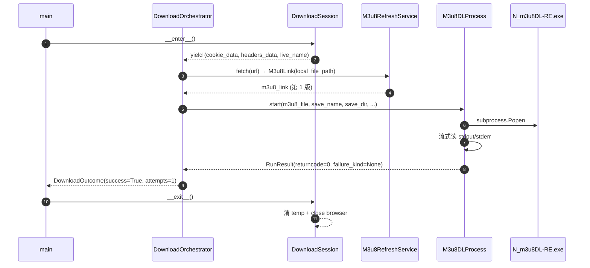
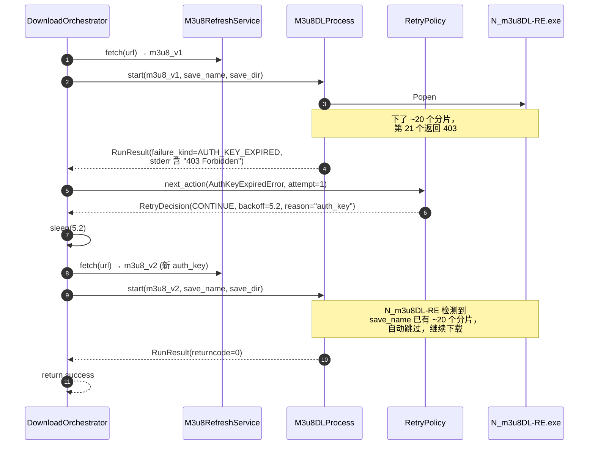
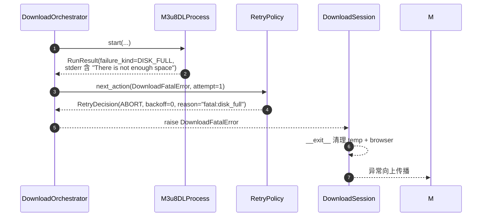

# 钉钉直播下载器：m3u8 auth_key 自动刷新与重试设计

| 字段 | 值 |
|---|---|
| 状态 | 草案，等待用户审阅 |
| 日期 | 2026-06-20 |
| 作者 | Claude（brainstorming 流程产出） |
| 影响范围 | `src/dingtalk_downloader/core/`（重点）、`tests/`（新增） |
| 关联模块 | `core/video_download_manager.py`、`core/m3u8_download_service.py`、`binary/n_m3u8dl_re.py`、`core/exceptions.py` |

---

## 1. 背景与目标

### 1.1 问题

钉钉直播回放的 m3u8 URL 形如：

```
https://dtliving-sz.dingtalk.com/live/<liveUuid>_normal.m3u8?auth_key=<timestamp>-<hash>-<rand>
```

`auth_key` 携带时间戳，**寿命有限**（实测约对应 20 个分片的下载窗口）。N_m3u8DL-RE.exe 在使用含旧 `auth_key` 的 m3u8 时，约下载 20 个分片后开始返回 `403 Forbidden`，整个下载任务失败。

### 1.2 已确认事实

- N_m3u8DL-RE.exe **支持断点续传**：当 `--save-name` + `--save-dir` 指向已存在的同名文件时，会自动跳过已下载分片，只下缺失的部分。
- 项目当前 `process_video` 已实现 20 次外层重试，每次重试前调 `m3u8_parser.fetch_m3u8_link`（内部 5 次 `_refresh_page`）拿新 m3u8。**此机制能跑通**，但存在用户报告的四个痛点（见 1.3）。

### 1.3 痛点

1. **重试逻辑混乱**：`process_video` 内 `for/if/except` 嵌套、多个 `return`，扩展性差。
2. **重试策略不智能**：固定 3-10s 随机 sleep，不区分错误类型（403/网络断/磁盘满用同一种重试）。
3. **资源生命周期混乱**：`CookieHandler` / `M3u8Parser` / `M3u8DownloadService` 复用靠 `if not self.xxx` 隐式守卫。
4. **对 N_m3u8DL-RE 不可见**：`subprocess.run` 一次性等待，看不到分片进度，无法在分片级介入。

### 1.4 目标

把"刷新 m3u8 + 续传"这条已经验证有效的路径**结构化、可观测、可测试**，并把异常分类、退避策略、组件生命周期显式化。

**不做的**（YAGNI）：
- 不替换 N_m3u8DL-RE.exe 为自实现分片下载器
- 不做"主动轮换 m3u8"（不等到 403 才刷新）—— 这要解析 exe 日志、依赖其格式稳定性
- 不引入第三方状态机库

---

## 2. 架构

### 2.1 现状问题

```
main.py
  └─ VideoDownloadManager.process_video     ← 重试逻辑塞在这里
        ├─ CookieHandler                    ← 隐式复用 if not self.xxx
        ├─ M3u8Parser                       ← 同上
        ├─ M3u8DownloadService              ← 同上
        ├─ NM3u8DLRE.download               ← subprocess.run 一次性
        └─ 内部 for attempt in 1..20        ← 重试策略硬编码
```

四个痛点全部集中在 `VideoDownloadManager` + `NM3u8DLRE`。

### 2.2 目标架构

```
main.py
  └─ DownloadOrchestrator                   ← 单一职责：编排一次完整下载
        │
        │  owns lifetime of
        ▼
      DownloadSession (context manager)     ← 资源生命周期显式化
        ├─ CookieHandler                    ← 用完自动 close
        ├─ BrowserDriver                    ← 用完自动 close
        ├─ M3u8RefreshService               ← 拉新 m3u8 + 落盘
        └─ M3u8DLProcess (Popen)            ← 流式监控子进程
        │
        │  delegates retry decision to
        ▼
      RetryPolicy                           ← 单一职责：何时重试、退避多久
        └─ classify(error) → (action, backoff, reason)
```

### 2.3 各组件单一职责

| 组件 | 职责 | 显式不做 |
|---|---|---|
| `DownloadOrchestrator` | 编排"获取 m3u8 → 启动子进程 → 监控 → 失败时刷新 m3u8 → 重试 → 成功收尾" | 不管退避算法；不持有 browser |
| `DownloadSession` | 用 `with` 包住一次下载涉及的全部资源（browser / parser / temp file），退出时确保清理 | 不参与重试决策 |
| `M3u8RefreshService` | 给定 URL，拉取**最新** m3u8（含新 auth_key）到本地临时文件，返回 `M3u8Link` | 不启动 exe；不做重试 |
| `M3u8DLProcess` | 包住 `subprocess.Popen`，流式读 stdout/stderr，按"非零退出 + 关键字"双判定失败，失败时能优雅 `terminate()` | 不重试；不刷 m3u8 |
| `RetryPolicy` | 给定异常类型，返回 `(action, backoff_seconds, reason)` | 不发起任何 IO（纯函数） |

### 2.4 失败 → 刷新 → 重试的状态转移

```
START
  └─ DownloadOrchestrator.run(context)
        │
        ├─[1] M3u8RefreshService.fetch(context.url)         # 拿第一个 m3u8
        │
        ├─[2] loop until success or RetryPolicy.exhausted:
        │     ├─ M3u8DLProcess.run(m3u8_link)              # 启动 exe，监控
        │     │     └─ 成功 → break
        │     │     └─ 失败 e
        │     │           ├─ RetryPolicy.next_action(e) → (action, backoff, reason)
        │     │           │     └─ action == ABORT → raise
        │     │           ├─ time.sleep(backoff)
        │     │           └─ M3u8RefreshService.fetch(context.url)  # 拿新 m3u8
        │     │                 └─ 续传由 N_m3u8DL-RE 负责（同 save_name）
        │     └─ 继续循环
        │
        └─ return DownloadOutcome
```

---

## 3. 关键类与接口

### 3.1 异常族（`core/exceptions.py` 调整）

```python
class DownloadError(Exception):
    """所有下载相关错误的基类。"""

class RecoverableDownloadError(DownloadError):
    """可重试的下载错误基类。"""

class AuthKeyExpiredError(RecoverableDownloadError):
    """m3u8 auth_key 过期（403/Forbidden/401）。"""

class NetworkTransientError(RecoverableDownloadError):
    """瞬时网络问题（连接重置、DNS、5xx）。"""

class ProcessSpawnError(RecoverableDownloadError):
    """N_m3u8DL-RE 启动失败（资源占用、路径错）。"""

class M3u8RefreshError(RecoverableDownloadError):
    """拉取新 m3u8 失败（页面未加载、liveUuid 提取失败）。"""

class DownloadFatalError(DownloadError):
    """不可恢复：磁盘满、权限拒绝、保存路径无效。"""
```

**兼容性**：保留旧的 `DownloadError / NetworkError / M3u8ParseError` 为薄包装，让 `main.py` 现有的 `except (DownloadError, BrowserError, NetworkError, M3u8ParseError)` 仍能捕获。

### 3.2 `M3u8DLProcess`（新文件 `core/m3u8dl_process.py`）

```python
from dataclasses import dataclass
from enum import Enum

class DownloadFailureKind(Enum):
    AUTH_KEY_EXPIRED   = "auth_key_expired"
    NETWORK_TRANSIENT  = "network_transient"
    DISK_FULL          = "disk_full"
    PERMISSION_DENIED  = "permission_denied"
    INVALID_PATH       = "invalid_path"
    EXE_MISSING        = "exe_missing"
    SOFT_FAIL          = "soft_fail"
    NONZERO_EXIT       = "nonzero_exit"
    UNKNOWN            = "unknown"

@dataclass(frozen=True)
class RunResult:
    returncode: int
    stdout_tail: str          # 最后 ~2KB
    stderr_tail: str          # 最后 ~2KB
    failure_kind: Optional[DownloadFailureKind]
    error: Optional[Exception]  # 由 _classify_by_pattern 转换的异常

class M3u8DLProcess:
    """包住 N_m3u8DL-RE 子进程，支持流式监控与优雅终止。

    永远不重试；只负责启动、等、报告、终止。
    """

    FATAL_OUTPUT_PATTERNS = (r"\b403\b", r"Forbidden", r"Unauthorized", r"\b401\b")
    SOFT_FAIL_PATTERNS   = (r"^ERROR:", r"^Failed", r"\[ErrHttp\]")

    def __init__(self, n_m3u8dl_re: NM3u8DLRE, log_path: str,
                 popen_factory: Callable = subprocess.Popen): ...

    def start(self, m3u8_file: str, save_name: str, save_dir: str,
              prefix: str, cookies: dict, headers: dict) -> None: ...

    def wait(self, timeout: Optional[float] = None) -> RunResult:
        """同步等待子进程结束，返回 RunResult。
        内部按"非零退出 + 关键字"双保险判定失败。
        """

    def terminate(self, grace_seconds: float = 5.0) -> None:
        """SIGTERM → 等 grace_seconds → 若仍存活则 SIGKILL。"""

    def is_alive(self) -> bool: ...
```

**双保险失败判定**（`wait` 内部伪代码）：

```python
if proc.returncode != 0:
    failure = _classify_by_pattern(stderr_tail)
    if failure is None:
        failure = DownloadFailureKind.NONZERO_EXIT
else:
    failure = _classify_by_pattern(stdout_tail)  # returncode=0 也要扫
    if "ERROR:" in stdout_tail and failure is None:
        failure = DownloadFailureKind.SOFT_FAIL
```

### 3.3 `M3u8RefreshService`（保留文件名 `m3u8_download_service.py`，类名 `M3u8DownloadService → M3u8RefreshService`）

> **不新建文件、不改路径**——`from ..core.m3u8_download_service import M3u8DownloadService` 仍可用，但类名改了。仅在文件内 `class M3u8DownloadService: → class M3u8RefreshService:` 即可，所有引用点同步更新。这样改动最小，避免动 `dependency_factory.py` 里的导入路径。

```python
class M3u8RefreshService:
    """拉取一个最新的 m3u8（含新 auth_key）并落盘到 temp/ 下。"""

    def __init__(self, browser: BrowserDriver,
                 file_manager: M3u8FileManager,
                 max_attempts: int = 5): ...

    def fetch(self, share_url: str) -> M3u8Link:
        """最多 max_attempts 次 _refresh_page + 性能日志解析。
        失败抛 M3u8RefreshError。
        """
```

### 3.4 `RetryPolicy`（新文件 `core/retry_policy.py`）

```python
from enum import Enum

class RetryAction(Enum):
    CONTINUE = "continue"
    ABORT    = "abort"

@dataclass(frozen=True)
class RetryDecision:
    action: RetryAction
    backoff_seconds: float
    reason: str

class RetryPolicy:
    """纯函数式：根据异常 + 已重试次数返回下一步动作。"""

    def __init__(self, *,
                 max_attempts: int = 20,
                 auth_key_max_attempts: int = 50,
                 run_timeout_seconds: float = 1800.0,  # 30 分钟
                 auth_key_backoff: tuple[float, float] = (3.0, 8.0),
                 network_backoff:   tuple[float, float] = (2.0, 5.0),
                 spawn_backoff:     tuple[float, float] = (10.0, 15.0),
                 soft_fail_backoff: tuple[float, float] = (3.0, 6.0),
                 nonzero_backoff:   tuple[float, float] = (5.0, 10.0),
                 fatal_max: int = 0):  # 致命错误默认 0 次
        ...

    def next_action(self, error: Exception, attempt: int) -> RetryDecision: ...
```

### 3.5 `DownloadSession`（新文件 `core/download_session.py`）

```python
class DownloadSession:
    """一次完整下载的所有资源，with 自动清理。"""

    def __init__(self, browser_type: str, save_mode: str,
                 refresh_service_factory: Callable = M3u8RefreshService): ...

    def __enter__(self) -> "DownloadSession":
        # 1. 创建 CookieHandler
        # 2. 调 cookie_handler.get_cookie(url) 获取 CookieData/HeadersData/live_name
        # 3. 创建 BrowserDriver 实例
        # 4. 注入到 refresh_service
        ...

    def __exit__(self, exc_type, exc_val, exc_tb) -> None:
        # 1. 列出并删除本次下载产生的所有 temp m3u8 文件
        # 2. CookieHandler.close() → browser 关闭
        # 3. 不吞异常，按原样传播

    def cookie_data(self) -> CookieData: ...
    def headers_data(self) -> HeadersData: ...
    def live_name(self) -> str: ...
    def refresh_service(self) -> M3u8RefreshService: ...
```

### 3.6 `DownloadOrchestrator`（新文件 `core/download_orchestrator.py`）

```python
@dataclass
class DownloadOutcome:
    success: bool
    attempts: int
    last_failure_kind: Optional[DownloadFailureKind]
    last_error: Optional[Exception]
    elapsed_seconds: float

class DownloadOrchestrator:
    """单次下载的编排者。"""

    def __init__(self, session: DownloadSession, *,
                 n_m3u8dl_re: NM3u8DLRE,
                 retry_policy: RetryPolicy,
                 save_dir_resolver: Callable[[], Optional[str]]): ...

    def run(self, context: VideoDownloadContext) -> DownloadOutcome:
        # 1. m3u8_link = session.refresh_service().fetch(context.url)
        # 2. loop with attempt counter + monotonic() 计时:
        #      process = M3u8DLProcess(...)
        #      process.start(m3u8_link.local_file_path, context.live_name,
        #                    save_dir, m3u8_link.prefix, cookies, headers)
        #      result = process.wait()
        #      if result.failure_kind is None: return success
        #      decision = retry_policy.next_action(result.error, attempt)
        #      if decision.action == ABORT: return failure
        #      if monotonic() - start > run_timeout: raise DownloadFatalError
        #      sleep(decision.backoff)
        #      m3u8_link = session.refresh_service().fetch(context.url)
        # 3. finally: 若 process.is_alive() → process.terminate()
```

### 3.7 关键不变式

1. `M3u8DLProcess` 永远不重试；只做"启动 + 等 + 报告 + 终止"。
2. `M3u8RefreshService` 不感知 exe；输入 URL，输出本地 m3u8 文件路径。
3. `RetryPolicy` 是纯函数（不依赖时间/IO），便于单测。
4. `DownloadSession` 不参与重试决策；`__exit__` 只清理。
5. 整个重试链中 `save_name` **不变**——这是 N_m3u8DL-RE 续传的唯一锚点。
6. `save_dir` 不变；`__exit__` 不删 `save_dir` 下的内容，只删 `temp/` 下临时文件。
7. `M3u8RefreshService.fetch` 每次生成的本地 m3u8 用**新 UUID 命名**——`DownloadSession.__exit__` 要清 temp，重复文件名会被覆盖。
8. N_m3u8DL-RE 的 `--log-file-path` 每次重试用**新路径**——便于排查哪次重试下了多少分片。

---

## 4. 数据流与时序

### 4.1 单次成功



### 4.2 失败 → 刷新 → 续传



### 4.3 致命错误（磁盘满）



---

## 5. 错误处理与退避策略

### 5.1 失败分类（`M3u8DLProcess._classify_by_pattern`）

| `failure_kind` | 触发关键字（正则，大小写不敏感） | 异常映射 | 可重试 |
|---|---|---|---|
| `AUTH_KEY_EXPIRED` | `\b403\b`, `Forbidden`, `Unauthorized`, `\b401\b` | `AuthKeyExpiredError` | ✅ |
| `NETWORK_TRANSIENT` | `Connection reset`, `Connection aborted`, `Timeout`, `Could not resolve`, `502 Bad Gateway`, `503 Service`, `504 Gateway` | `NetworkTransientError` | ✅ |
| `DISK_FULL` | `There is not enough space`, `No space left`, `disk full`, `磁盘空间不足` | `DownloadFatalError` | ❌ |
| `PERMISSION_DENIED` | `Access is denied`, `Permission denied`, `UnauthorizedAccess` | `DownloadFatalError` | ❌ |
| `INVALID_PATH` | `Could not find a part of the path`, `The system cannot find the path`, `Invalid filename` | `DownloadFatalError` | ❌ |
| `EXE_MISSING` | `WindowsError\[2\]`, `系统找不到指定的文件`（启动失败） | `ProcessSpawnError` | ✅ |
| `SOFT_FAIL` | `^ERROR:`, `^Failed`, `\[ErrHttp\]` | `RecoverableDownloadError` | ✅ |
| `NONZERO_EXIT` | 上述都不匹配 | `RecoverableDownloadError` | ✅ |
| `UNKNOWN` | 兜底 | `DownloadFatalError` | ❌ |

**匹配优先级**：DISK_FULL > PERMISSION_DENIED > INVALID_PATH > EXE_MISSING > NETWORK_TRANSIENT > AUTH_KEY_EXPIRED > SOFT_FAIL > NONZERO_EXIT > UNKNOWN。

### 5.2 退避表（`RetryPolicy` 默认值）

| `failure_kind` | backoff (min, max) 秒 | max_attempts |
|---|---|---|
| `AUTH_KEY_EXPIRED` | (3.0, 8.0) | 50 |
| `NETWORK_TRANSIENT` | (2.0, 5.0) | 10 |
| `EXE_MISSING` | (10.0, 15.0) | 3 |
| `SOFT_FAIL` | (3.0, 6.0) | 20 |
| `NONZERO_EXIT` | (5.0, 10.0) | 10 |
| `DISK_FULL` | (0, 0) | 0 |
| `PERMISSION_DENIED` | (0, 0) | 0 |
| `INVALID_PATH` | (0, 0) | 0 |
| `UNKNOWN` | (0, 0) | 0 |

退避时间用 `random.uniform(min, max)`，**非指数退避**——auth_key 寿命固定，等更久不会让下次活得更长。

### 5.3 用户可见的重试日志

```
[retry 3/50] failure_kind=AUTH_KEY_EXPIRED, sleeping 5.2s before next attempt. reason: auth_key
[retry 3/50] refreshing m3u8 from URL: https://n.dingtalk.com/...
[retry 3/50] starting N_m3u8DL-RE attempt 3 with new m3u8
```

### 5.4 键盘中断路径

```python
# DownloadOrchestrator.run 的 try/except/finally
try:
    while not done:
        result = process.wait()
        ...
except KeyboardInterrupt:
    logger.warning("用户中断，正在终止子进程...")
    raise
finally:
    if process and process.is_alive():
        process.terminate(grace_seconds=2.0)
        if process.is_alive():
            process.kill()
```

子进程必须在 `finally` 里被无条件杀——N_m3u8DL-RE 持有 temp 文件句柄会让 `os.remove(temp_file)` 在 Windows 上抛 `PermissionError`。

### 5.5 上限保护

| 上限 | 默认值 | 含义 |
|---|---|---|
| `max_attempts` | 20 | 单视频总重试次数（兼容旧行为） |
| `AUTH_KEY_EXPIRED` 子上限 | 50 | 长视频可能需要更多 |
| 单次运行时长 | 30 分钟 | 防止死循环 |
| temp 文件数量 | 50 | 防止 leak |

运行时长用 `time.monotonic()`；超过就 `raise DownloadFatalError("timeout: exceeded 30min")`。

---

## 6. 测试策略

### 6.1 测试分层

```
tests/
├── unit/                                    # 纯逻辑，可 CI
│   ├── test_retry_policy.py
│   ├── test_failure_classifier.py
│   ├── test_download_orchestrator.py
│   ├── test_m3u8dl_process.py
│   └── test_download_session.py
├── integration/                             # 跑真 exe + 真 m3u8，需环境
│   ├── test_m3u8_refresh_service.py
│   └── test_end_to_end.py
└── fixtures/
    ├── n_m3u8dl_re_stderr/                  # 真实 exe 输出样本
    │   ├── auth_key_expired.txt
    │   ├── disk_full.txt
    │   ├── network_reset.txt
    │   └── success.txt
    └── fake_proc.py                         # 模拟 Popen 的可脚本化对象
```

### 6.2 必跑单测清单

| 测试 | 验证点 |
|---|---|
| `test_retry_policy::test_classify_auth_key_expired` | `next_action(AuthKeyExpiredError, 1)` 返回 `CONTINUE` + backoff ∈ [3, 8] |
| `test_retry_policy::test_exhausted` | attempt 超过 max_attempts 返回 `ABORT` |
| `test_retry_policy::test_fatal_no_retry` | `DownloadFatalError` 第一次就 `ABORT` |
| `test_retry_policy::test_run_timeout` | 超过 `run_timeout_seconds` 抛 `DownloadFatalError` |
| `test_failure_classifier::test_pattern_priority` | DISK_FULL 优先于 NONZERO_EXIT |
| `test_failure_classifier::test_chinese_keywords` | `磁盘空间不足` 匹配 DISK_FULL |
| `test_failure_classifier::test_403_variants` | `403` / `HTTP/1.1 403` / `STATUS:403` 都匹配 |
| `test_m3u8dl_process::test_terminate_grace_period` | `terminate(5.0)` 调 SIGTERM，5s 内不死才 SIGKILL |
| `test_m3u8dl_process::test_terminate_called_in_finally` | KeyboardInterrupt 路径下子进程一定被杀 |
| `test_m3u8dl_process::test_soft_fail_detection` | returncode=0 但 stdout 含 `ERROR:` 仍判失败 |
| `test_m3u8dl_process::test_popen_factory_injection` | 注入 fake_proc 后不真正启动 exe |
| `test_download_orchestrator::test_success_first_try` | 单次成功返回 `outcome.success=True` |
| `test_download_orchestrator::test_refresh_after_auth_key` | 第一次失败 → 调 refresh → 第二次成功；`save_name` 不变 |
| `test_download_orchestrator::test_refresh_failure_raises` | 刷新 m3u8 失败抛 `M3u8RefreshError`，已下分片保留 |
| `test_download_orchestrator::test_fatal_abort_no_retry` | 致命错误只跑一次就退出 |
| `test_download_session::test_cleanup_on_exception` | `__exit__` 在异常路径下仍清 temp + close browser |
| `test_download_session::test_keyboard_interrupt_cleanup` | Ctrl+C 时子进程先被杀再清 temp |

### 6.3 Fake Popen 模式

`tests/fixtures/fake_proc.py`：

```python
class FakePopen:
    def __init__(self, *, returncode=0, stdout="", stderr="",
                 terminate_after: Optional[float] = None): ...
    def communicate(self, timeout=None): return (self._stdout, self._stderr)
    def poll(self): return self.returncode if not self._alive else None
    def terminate(self): self.terminate_calls += 1; self._alive = False
    def kill(self): self.kill_calls += 1; self._alive = False
```

`M3u8DLProcess` 在测试里接受 `popen_factory` 注入，避免 `monkeypatch subprocess.Popen`。

### 6.4 fixture 收集规范

`tests/fixtures/n_m3u8dl_re_stderr/*.txt` **必须用真实跑挂的输出**填充：

1. 用户本地用 N_m3u8DL-RE 跑一个已知会触发 403 的直播，截取最后 200 行 stderr
2. 保存为 `auth_key_expired.txt`
3. 同样方法收集 disk_full、permission_denied 等
4. commit message 注明来源（哪个钉钉直播 + 日期）

手写 fixture 会让关键字表和实际输出永远有偏差。

### 6.5 集成测试（不进 CI）

`tests/integration/` 用 `@pytest.mark.integration` 标记，CI 跳过。本地：

```bash
pytest tests/integration/test_end_to_end.py --url=https://n.dingtalk.com/...
```

需要真实浏览器已登录钉钉、`assets/bin/N_m3u8DL-RE.exe` 存在。

### 6.6 验证清单（重构完成判定）

| 项 | 验证方法 |
|---|---|
| 所有新单测通过 | `pytest tests/unit/ -v` 退出码 0 |
| 覆盖率 ≥ 90% on 新增模块 | `pytest --cov=src/dingtalk_downloader/core` |
| 关键字表覆盖真实 stderr | 每个 fixture 都有对应 `test_*` |
| 旧 20 次重试行为兼容 | 跑老格式 URL 仍能下完 |
| 资源不泄漏 | 跑 10 次连续下载，`ls temp/ \| wc -l == 0` |
| 子进程不残留 | `tasklist \| grep N_m3u8DL` 在 `__exit__` 后为空 |

---

## 7. 文件清单

### 7.1 新增

| 文件 | 职责 |
|---|---|
| `src/dingtalk_downloader/core/m3u8dl_process.py` | `M3u8DLProcess`、`DownloadFailureKind`、`RunResult` |
| `src/dingtalk_downloader/core/retry_policy.py` | `RetryPolicy`、`RetryDecision`、`RetryAction` |
| `src/dingtalk_downloader/core/download_session.py` | `DownloadSession` 上下文管理器 |
| `src/dingtalk_downloader/core/download_orchestrator.py` | `DownloadOrchestrator`、`DownloadOutcome` |
| `tests/unit/test_retry_policy.py` | 见 6.2 |
| `tests/unit/test_failure_classifier.py` | 见 6.2 |
| `tests/unit/test_m3u8dl_process.py` | 见 6.2 |
| `tests/unit/test_download_orchestrator.py` | 见 6.2 |
| `tests/unit/test_download_session.py` | 见 6.2 |
| `tests/fixtures/fake_proc.py` | `FakePopen` |
| `tests/fixtures/n_m3u8dl_re_stderr/*.txt` | 真实 stderr 样本 |
| `docs/superpowers/specs/2026-06-20-auth-key-refresh-retry-design.md` | 本文件 |

### 7.2 修改

| 文件 | 改动 |
|---|---|
| `src/dingtalk_downloader/core/exceptions.py` | 新增 `RecoverableDownloadError` / `AuthKeyExpiredError` / `NetworkTransientError` / `ProcessSpawnError` / `M3u8RefreshError` / `DownloadFatalError`；旧 `DownloadError` / `NetworkError` / `M3u8ParseError` 保留为薄包装 |
| `src/dingtalk_downloader/core/video_download_manager.py` | 改为薄包装：保留 `__init__` / `process_video` / `close` / `cleanup_context` 四个公开方法；`process_video` 内部构造 `DownloadSession` + `DownloadOrchestrator` 并委托；`__init__` 签名不变（接受相同 DI 参数），不真正使用旧的内部组件；具体委托逻辑示例见 7.4 |
| `src/dingtalk_downloader/core/m3u8_download_service.py` | 文件路径保留；类名 `M3u8DownloadService → M3u8RefreshService`；方法 `fetch_and_download_m3u8 → fetch`（语义从"拉一次"变为"刷一次"）；`__init__` 接受 `BrowserDriver` 而非 `M3u8Parser`（依赖反转） |
| `src/dingtalk_downloader/binary/n_m3u8dl_re.py` | 不变；`NM3u8DLRE.build_command` 仍被 `M3u8DLProcess.start` 调用 |
| `src/dingtalk_downloader/config/constants.py` | 新增 `RUN_TIMEOUT_SECONDS = 1800`、`AUTH_KEY_MAX_ATTEMPTS = 50` 等可配项 |

### 7.3 不动

- `browser/`（Selenium 抽象）
- `utils/`（除 `models.py` 可能增加 `DownloadOutcome`）
- `config/yaml_config.py`、`config/header_manager.py`
- `main.py`（调用接口兼容；具体调用点可能需小调以传入新依赖）

### 7.4 `VideoDownloadManager.process_video` 委托示例

```python
# video_download_manager.py 薄包装示例
def process_video(self, context: VideoDownloadContext) -> bool:
    """委托给 DownloadOrchestrator；保留旧签名以兼容 main.py。"""
    with DownloadSession(
        browser_type=self.browser_type,
        save_mode=self.save_mode,
    ) as session:
        n_m3u8dl_re = self.n_m3u8dl_re or NM3u8DLRE()
        retry_policy = RetryPolicy()  # 默认值；可从 config 读
        orchestrator = DownloadOrchestrator(
            session=session,
            n_m3u8dl_re=n_m3u8dl_re,
            retry_policy=retry_policy,
            save_dir_resolver=self._get_save_dir_resolver(),
        )
        outcome = orchestrator.run(context)
        return outcome.success
```

---

## 8. 待校准项（不阻塞 spec 落地，但实现时必须确认）

1. **关键字表**：4.1 节列的正则是初稿。用户跑一次真实 403 失败后，把 stderr 贴回来，校准 `AUTH_KEY_EXPIRED` 关键字（可能要加 `HTTP/1.1 403`、`STATUS:403`、`accs denied` 等变体）。
2. **N_m3u8DL-RE 中文输出**：磁盘满的提示可能是 `磁盘空间不足` 而非英文。已加中文关键字，但需要真实样本确认。
3. **`live_name` 中的 Windows 非法字符**（`:` `?` `*` 等）：若 N_m3u8DL-RE 不自动 sanitize，会导致 `save_name` 异常。需要确认是否需要在 `DownloadSession` 入口做一次 `sanitize_filename`。
4. **运行时长上限**：默认 30 分钟。用户的实际最长视频在录时常是几分钟、几十分钟、还是更长？决定该值。
5. **N_m3u8DL-RE 续传边界**：当旧的 `save_name.mp4` 存在但 m3u8 的分片列表变化时（钉钉中途切片重组），exe 行为未知。需要一次人工验证。

---

## 9. 风险与回退

| 风险 | 影响 | 缓解 |
|---|---|---|
| N_m3u8DL-RE 续传在分片列表变化时出错 | 已下载进度作废 | `DownloadSession.__exit__` 保留 `save_dir` 不删；用户可手动恢复 |
| 关键字表未覆盖真实输出 | 错误被误判为 `UNKNOWN`，立即 ABORT | 用户拿真实 stderr 后可热修关键字表 |
| 子进程未被杀导致 Windows 锁文件 | `__exit__` 删 temp 抛异常 | `finally` 块里先 `terminate` 再清 temp；加单测覆盖 |
| `M3u8DLProcess.wait` 阻塞太久 | 总下载时长不可控 | `run_timeout_seconds=1800` 上限保护 |
| 重试次数过多导致日志爆炸 | `logs/` 目录快速膨胀 | `--log-file-path` 每次新路径；老路径不删，留给日志清理任务（已在 `logger_config.py` 处理） |

**回退方案**：如果新架构在生产跑挂，可临时把 `DownloadOrchestrator.run` 的 `RetryPolicy` 替换为旧的"20 次硬重试"实现，老 `process_video` 路径保留为兼容入口。

---

## 10. 不在本次范围

- 替换 N_m3u8DL-RE.exe 为自实现分片下载器（方案 C，搁置）
- 主动轮换 m3u8（不等 403 才刷新）—— 需要解析 exe 日志，依赖其格式稳定性
- 多视频并发下载（batch 模式并行化）
- 断点续传到云端 / 远程
- `live_name` 用户自定义（当前依赖钉钉页面 DOM 抓取）
