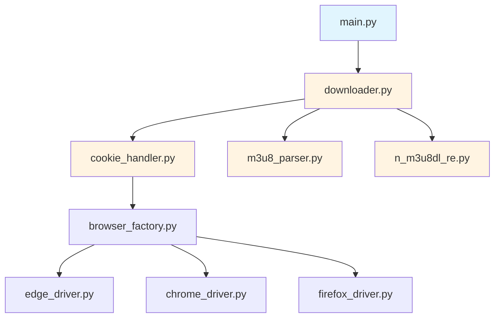

# 优化日志输出 - 设计文档

## 整体架构图

由于本任务不改变系统架构，仅优化现有日志输出，整体架构保持不变。



## 分层设计和核心组件

### 1. 主程序层

**模块**: `main.py`

**职责**: 程序入口，协调各模块

**日志优化方案**:

| 当前日志 | 问题 | 优化后 | 级别 |
|---------|------|--------|------|
| `logger.info(f"用户输入链接: {dingtalk_url}")` | 可能包含敏感信息 | `logger.info("用户已输入链接")` | INFO |
| `logger.info(f"用户选择保存模式: {save_mode}")` | 信息过于详细 | `logger.info(f"保存模式: {save_mode}")` | INFO |
| `logger.info(f"用户选择浏览器选项: {browser_option}")` | 信息过于详细 | `logger.info(f"浏览器选项: {browser_option}")` | INFO |
| `logger.info(f"浏览器类型: {browser_type}")` | 与上一条重复 | 删除 | - |
| `logger.info("下载器创建成功")` | 缺少上下文 | `logger.info(f"下载器创建成功 - 浏览器: {browser_type}, 保存模式: {save_mode}")` | INFO |

### 2. 核心层

#### 2.1 下载器模块

**模块**: `downloader.py`

**职责**: 协调 Cookie 获取、m3u8 解析、视频下载

**日志优化方案**:

| 当前日志 | 问题 | 优化后 | 级别 |
|---------|------|--------|------|
| `logger.info(f"下载器初始化完成 - 浏览器类型: {browser_type}, 保存模式: {save_mode}")` | 无 | 保持不变 | INFO |
| `logger.info(f"开始下载单个视频: {url}")` | 可能包含敏感信息 | `logger.info("开始下载单个视频")` | INFO |
| `logger.info(f"获取到 Cookie 和请求头，直播名称: {live_name}")` | 信息过于详细 | `logger.info(f"获取到 Cookie 和请求头 - 直播名称: {live_name}")` | INFO |
| `logger.info("m3u8 解析器创建成功")` | 无 | 保持不变 | INFO |
| `logger.info("开始获取 m3u8 链接")` | 无 | 保持不变 | INFO |
| `logger.info(f"获取到 {len(m3u8_links)} 个 m3u8 链接")` | 无 | 保持不变 | INFO |
| `logger.info(f"处理 m3u8 链接: {link}")` | 在循环中重复 | 删除（保留 DEBUG） | DEBUG |
| `logger.info(f"m3u8 文件下载成功: {m3u8_file}")` | 无 | 保持不变 | INFO |
| `logger.info(f"提取到基础 URL: {prefix}")` | 无 | 保持不变 | INFO |
| `logger.info(f"视频下载完成: {live_name}")` | 无 | 保持不变 | INFO |
| `logger.error(f"视频下载失败: {live_name}")` | 无 | 保持不变 | ERROR |
| `logger.warning("未找到包含 'm3u8' 字符的请求链接")` | 无 | 保持不变 | WARNING |
| `logger.info(f"用户输入新链接: {url}")` | 可能包含敏感信息 | `logger.info("用户已输入新链接")` | INFO |
| `logger.info(f"开始批量下载视频，共 {len(urls)} 个链接")` | 无 | 保持不变 | INFO |
| `logger.info(f"共提取到 {total_links} 个钉钉直播回放分享链接")` | 与上一条重复 | 删除 | - |
| `logger.info(f"正在下载第 1 个视频，共 {total_links} 个视频")` | 无 | 保持不变 | INFO |
| `logger.info(f"正在下载第 {idx + 1} 个视频，共 {total_links} 个视频")` | 无 | 保持不变 | INFO |
| `logger.info("第 1 个视频下载完成")` | 与"视频下载完成"重复 | 删除 | - |
| `logger.info(f"第 {idx + 1} 个视频下载完成")` | 与"视频下载完成"重复 | 删除 | - |
| `logger.info(f"开始下载视频 - 文件名: {save_name}")` | 无 | 保持不变 | INFO |
| `logger.info(f"使用默认保存目录: {save_dir}")` | 信息过于详细 | `logger.debug(f"使用默认保存目录: {save_dir}")` | DEBUG |
| `logger.info(f"使用手动选择目录: {save_dir}")` | 信息过于详细 | `logger.debug(f"使用手动选择目录: {save_dir}")` | DEBUG |
| `logger.error(f"无效的保存模式: {self.save_mode}")` | 无 | 保持不变 | ERROR |
| `logger.warning("用户取消了目录选择")` | 无 | 保持不变 | WARNING |
| `logger.info(f"调用 N_m3u8DL-RE 下载视频")` | 无 | 保持不变 | INFO |
| `logger.info(f"视频下载成功完成 - 保存路径: {save_dir}")` | 与"视频下载完成"重复 | 删除 | - |
| `logger.error(f"视频下载失败 - 文件名: {save_name}")` | 无 | 保持不变 | ERROR |
| `logger.info("进入继续下载循环")` | 无 | 保持不变 | INFO |
| `logger.info(f"用户输入文件路径: {file_path}")` | 可能包含敏感信息 | `logger.info("用户已输入文件路径")` | INFO |
| `logger.info(f"从文件中读取到 {len(new_links_dict)} 个链接")` | 无 | 保持不变 | INFO |
| `logger.info("开始释放下载器资源")` | 无 | 保持不变 | INFO |
| `logger.info("下载器资源释放完成")` | 无 | 保持不变 | INFO |

#### 2.2 Cookie 处理模块

**模块**: `cookie_handler.py`

**职责**: 获取和管理 Cookie

**日志优化方案**:

| 当前日志 | 问题 | 优化后 | 级别 |
|---------|------|--------|------|
| `logger.debug(f"Cookie 处理器初始化 - 浏览器类型: {browser_type}")` | 无 | 保持不变 | DEBUG |
| `logger.info(f"开始获取 Cookie - URL: {url}")` | 可能包含敏感信息 | `logger.info("开始获取 Cookie")` | INFO |
| `logger.info("浏览器实例创建成功")` | 缺少上下文 | `logger.info(f"浏览器实例创建成功 - 类型: {self.browser_type}")` | INFO |
| `logger.info("浏览器驱动创建成功")` | 无 | 保持不变 | INFO |
| `logger.info("导航到指定 URL")` | 无 | 保持不变 | INFO |
| `logger.debug(f"User-Agent: {user_agent}")` | 无 | 保持不变 | DEBUG |
| `logger.debug(f"Referer: {referer}")` | 无 | 保持不变 | DEBUG |
| `logger.info("请求头构建完成")` | 信息过于详细 | `logger.debug("请求头构建完成")` | DEBUG |
| `logger.info(f"直播名称: {live_name}")` | 无 | 保持不变 | INFO |
| `logger.info(f"获取到 {len(cookie_dict)} 个 Cookie")` | 无 | 保持不变 | INFO |
| `logger.info(f"重复获取 Cookie - URL: {url}")` | 可能包含敏感信息 | `logger.info("重复获取 Cookie")` | INFO |
| `logger.warning("浏览器实例不存在，调用 get_cookie")` | 无 | 保持不变 | WARNING |
| `logger.info("视频加载完成")` | 无 | 保持不变 | INFO |
| `logger.warning(f"等待视频加载时发生错误: {e}")` | 无 | 保持不变 | WARNING |
| `logger.debug(f"通过 XPath 获取直播名称: {live_name}")` | 无 | 保持不变 | DEBUG |
| `logger.debug(f"XPath 获取失败: {e}")` | 无 | 保持不变 | DEBUG |
| `logger.debug(f"通过 CSS Selector 获取直播名称: {live_name}")` | 无 | 保持不变 | DEBUG |
| `logger.warning(f"CSS Selector 获取失败: {e}")` | 无 | 保持不变 | WARNING |
| `logger.info("开始释放 Cookie 处理器资源")` | 无 | 保持不变 | INFO |
| `logger.info("Cookie 处理器资源释放完成")` | 无 | 保持不变 | INFO |

#### 2.3 m3u8 解析模块

**模块**: `m3u8_parser.py`

**职责**: 从浏览器网络日志中提取 m3u8 链接和基础 URL

**日志优化方案**:

| 当前日志 | 问题 | 优化后 | 级别 |
|---------|------|--------|------|
| `logger.error("未能从 URL 提取 liveUuid，程序将退出")` | 无 | 保持不变 | ERROR |
| `logger.debug(f"获取到m3u8链接: {cleaned_link}")` | 无 | 保持不变 | DEBUG |
| `logger.debug(f"获取到m3u8链接: {m3u8_url}")` | 无 | 保持不变 | DEBUG |
| `logger.error(f"处理日志时发生错误: {e}", exc_info=True)` | 无 | 保持不变 | ERROR |
| `logger.warning(f"第 {attempt + 1} 次尝试未获取到 m3u8 链接，重试中")` | 应该是 DEBUG | `logger.debug(f"第 {attempt + 1} 次尝试未获取到 m3u8 链接，重试中")` | DEBUG |
| `logger.error(f"获取 m3u8 链接时发生错误: {e}", exc_info=True)` | 无 | 保持不变 | ERROR |
| `logger.error(f"下载 m3u8 文件时发生错误: {e}", exc_info=True)` | 无 | 保持不变 | ERROR |
| `logger.debug("页面已刷新")` | 无 | 保持不变 | DEBUG |
| `logger.error(f"刷新页面时发生错误: {e}", exc_info=True)` | 无 | 保持不变 | ERROR |

**重试日志优化**:

在 `fetch_m3u8_links()` 方法中，添加最终失败的 WARNING 日志：

```python
if not m3u8_links:
    logger.warning(f"经过 {self.max_retries} 次重试后仍未获取到 m3u8 链接")
    return None
```

### 3. 工具层

#### 3.1 N_m3u8DL-RE 调用模块

**模块**: `n_m3u8dl_re.py`

**职责**: 调用 N_m3u8DL-RE 工具下载 m3u8 视频流

**日志优化方案**:

| 当前日志 | 问题 | 优化后 | 级别 |
|---------|------|--------|------|
| `logger.debug(f"N_m3u8DL-RE 调用器初始化 - 可执行文件: {self.executable_path}")` | 无 | 保持不变 | DEBUG |
| `logger.info(f"开始下载视频 - 文件名: {save_name}, 保存目录: {save_dir}")` | 无 | 保持不变 | INFO |
| `logger.debug(f"执行命令: {' '.join(command)}")` | 无 | 保持不变 | DEBUG |
| `logger.error(f"视频下载失败 - 子进程退出码: {result.returncode}")` | 无 | 保持不变 | ERROR |
| `logger.error(f"视频下载失败")` | 无 | 保持不变 | ERROR |
| `logger.error(f"错误信息:\n{error_info}")` | 无 | 保持不变 | ERROR |
| `logger.info(f"视频下载成功完成。文件保存路径: {save_dir}")` | 无 | 保持不变 | INFO |
| `logger.error(f"下载视频时发生错误: {e}", exc_info=True)` | 无 | 保持不变 | ERROR |

**请求头日志合并**:

在 `build_command()` 方法中，合并多个"已添加 XXX 请求头"日志：

```python
headers_added = []

if cookies_data:
    cookie_string = "; ".join([f"{name}={value}" for name, value in cookies_data.items()])
    command.extend(["-H", f"Cookie: {cookie_string}"])
    headers_added.append("Cookie")

if headers:
    if "User-Agent" in headers:
        command.extend(["-H", f"User-Agent: {headers['User-Agent']}"])
        headers_added.append("User-Agent")
    if "Referer" in headers:
        command.extend(["-H", f"Referer: {headers['Referer']}"])
        headers_added.append("Referer")
    if "Accept" in headers:
        command.extend(["-H", f"Accept: {headers['Accept']}"])
        headers_added.append("Accept")
    if "Accept-Language" in headers:
        command.extend(["-H", f"Accept-Language: {headers['Accept-Language']}"])
        headers_added.append("Accept-Language")
    if "Accept-Encoding" in headers:
        command.extend(["-H", f"Accept-Encoding: {headers['Accept-Encoding']}"])
        headers_added.append("Accept-Encoding")
else:
    command.extend([
        "-H",
        "User-Agent: Mozilla/5.0 (Windows NT 10.0; Win64; x64) AppleWebKit/537.36 (KHTML, like Gecko) Chrome/120.0.0.0 Safari/537.36",
    ])
    command.extend(["-H", "Referer: https://n.dingtalk.com/"])
    command.extend(["-H", "Accept: application/vnd.apple.mpegurl, text/plain, */*"])
    headers_added.extend(["User-Agent (默认)", "Referer (默认)", "Accept (默认)"])

if headers_added:
    logger.debug(f"已添加请求头: {', '.join(headers_added)}")
```

## 接口契约定义

由于本任务不修改接口，仅优化日志输出，接口契约保持不变。

## 数据流向图

由于本任务不改变数据流向，数据流向保持不变。

## 异常处理策略

由于本任务不改变异常处理逻辑，异常处理策略保持不变。

## 设计原则

1. **严格按照任务范围**：只优化日志输出，不修改核心业务逻辑
2. **确保与现有系统架构一致**：不改变系统架构和数据流向
3. **复用现有组件和模式**：保持现有代码风格和规范
4. **避免过度设计**：只进行必要的优化，不添加不必要的功能

## 质量门控

- ✅ 架图清晰准确
- ✅ 接口定义完整（保持不变）
- ✅ 与现有系统无冲突
- ✅ 设计可行性验证
- ✅ 日志优化方案具体可执行
- ✅ 日志级别调整合理
- ✅ 日志合并策略清晰
- ✅ 日志信息改进标准明确
