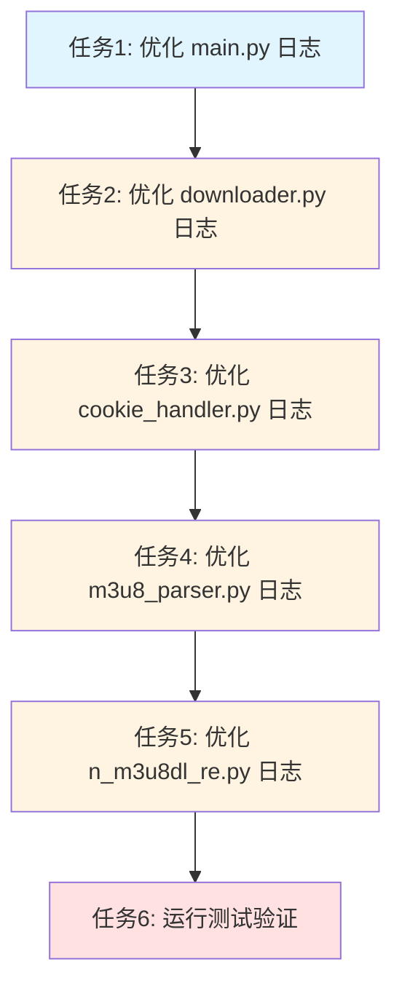

# 优化日志输出 - 任务文档

## 任务依赖图



## 原子任务列表

### 任务1: 优化 main.py 日志

**输入契约**:
- 前置依赖: 无
- 输入数据: `src/dingtalk_downloader/main.py` 文件
- 环境依赖: Python 环境

**输出契约**:
- 输出数据: 优化后的 `src/dingtalk_downloader/main.py` 文件
- 交付物: 优化后的代码
- 验收标准:
  1. 移除可能包含敏感信息的日志（如完整 URL）
  2. 合并重复的日志（如"浏览器类型"与"浏览器选项"）
  3. 添加上下文信息到"下载器创建成功"日志
  4. 代码符合项目规范
  5. 无语法错误

**实现约束**:
- 技术栈: Python
- 接口规范: 不修改接口，仅优化日志
- 质量要求: 保持代码风格一致

**依赖关系**:
- 后置任务: 任务2

**具体操作**:
1. 修改 `logger.info(f"用户输入链接: {dingtalk_url}")` 为 `logger.info("用户已输入链接")`
2. 修改 `logger.info(f"用户选择保存模式: {save_mode}")` 为 `logger.info(f"保存模式: {save_mode}")`
3. 修改 `logger.info(f"用户选择浏览器选项: {browser_option}")` 为 `logger.info(f"浏览器选项: {browser_option}")`
4. 删除 `logger.info(f"浏览器类型: {browser_type}")`
5. 修改 `logger.info("下载器创建成功")` 为 `logger.info(f"下载器创建成功 - 浏览器: {browser_type}, 保存模式: {save_mode}")`
6. 修改 `logger.info(f"用户输入新链接: {url}")` 为 `logger.info("用户已输入新链接")`
7. 修改 `logger.info(f"用户输入文件路径: {file_path}")` 为 `logger.info("用户已输入文件路径")`

---

### 任务2: 优化 downloader.py 日志

**输入契约**:
- 前置依赖: 任务1
- 输入数据: `src/dingtalk_downloader/core/downloader.py` 文件
- 环境依赖: Python 环境

**输出契约**:
- 输出数据: 优化后的 `src/dingtalk_downloader/core/downloader.py` 文件
- 交付物: 优化后的代码
- 验收标准:
  1. 移除可能包含敏感信息的日志（如完整 URL）
  2. 合并重复的日志（如"视频下载完成"与"第 N 个视频下载完成"）
  3. 调整日志级别（保存目录日志改为 DEBUG）
  4. 代码符合项目规范
  5. 无语法错误

**实现约束**:
- 技术栈: Python
- 接口规范: 不修改接口，仅优化日志
- 质量要求: 保持代码风格一致

**依赖关系**:
- 后置任务: 任务3

**具体操作**:
1. 修改 `logger.info(f"开始下载单个视频: {url}")` 为 `logger.info("开始下载单个视频")`
2. 修改 `logger.info(f"获取到 Cookie 和请求头，直播名称: {live_name}")` 为 `logger.info(f"获取到 Cookie 和请求头 - 直播名称: {live_name}")`
3. 删除循环中的 `logger.info(f"处理 m3u8 链接: {link}")`（保留 DEBUG 级别）
4. 修改 `logger.info(f"使用默认保存目录: {save_dir}")` 为 `logger.debug(f"使用默认保存目录: {save_dir}")`
5. 修改 `logger.info(f"使用手动选择目录: {save_dir}")` 为 `logger.debug(f"使用手动选择目录: {save_dir}")`
6. 删除 `logger.info("第 1 个视频下载完成")`
7. 删除 `logger.info(f"第 {idx + 1} 个视频下载完成")`
8. 删除 `logger.info(f"视频下载成功完成 - 保存路径: {save_dir}")`
9. 删除 `logger.info(f"共提取到 {total_links} 个钉钉直播回放分享链接")`
10. 修改 `logger.info(f"用户输入文件路径: {file_path}")` 为 `logger.info("用户已输入文件路径")`

---

### 任务3: 优化 cookie_handler.py 日志

**输入契约**:
- 前置依赖: 任务2
- 输入数据: `src/dingtalk_downloader/core/cookie_handler.py` 文件
- 环境依赖: Python 环境

**输出契约**:
- 输出数据: 优化后的 `src/dingtalk_downloader/core/cookie_handler.py` 文件
- 交付物: 优化后的代码
- 验收标准:
  1. 移除可能包含敏感信息的日志（如完整 URL）
  2. 添加上下文信息到"浏览器实例创建成功"日志
  3. 调整日志级别（"请求头构建完成"改为 DEBUG）
  4. 代码符合项目规范
  5. 无语法错误

**实现约束**:
- 技术栈: Python
- 接口规范: 不修改接口，仅优化日志
- 质量要求: 保持代码风格一致

**依赖关系**:
- 后置任务: 任务4

**具体操作**:
1. 修改 `logger.info(f"开始获取 Cookie - URL: {url}")` 为 `logger.info("开始获取 Cookie")`
2. 修改 `logger.info("浏览器实例创建成功")` 为 `logger.info(f"浏览器实例创建成功 - 类型: {self.browser_type}")`
3. 修改 `logger.info("请求头构建完成")` 为 `logger.debug("请求头构建完成")`
4. 修改 `logger.info(f"重复获取 Cookie - URL: {url}")` 为 `logger.info("重复获取 Cookie")`

---

### 任务4: 优化 m3u8_parser.py 日志

**输入契约**:
- 前置依赖: 任务3
- 输入数据: `src/dingtalk_downloader/core/m3u8_parser.py` 文件
- 环境依赖: Python 环境

**输出契约**:
- 输出数据: 优化后的 `src/dingtalk_downloader/core/m3u8_parser.py` 文件
- 交付物: 优化后的代码
- 验收标准:
  1. 调整日志级别（重试日志改为 DEBUG）
  2. 添加最终失败的 WARNING 日志
  3. 代码符合项目规范
  4. 无语法错误

**实现约束**:
- 技术栈: Python
- 接口规范: 不修改接口，仅优化日志
- 质量要求: 保持代码风格一致

**依赖关系**:
- 后置任务: 任务5

**具体操作**:
1. 修改 `logger.warning(f"第 {attempt + 1} 次尝试未获取到 m3u8 链接，重试中")` 为 `logger.debug(f"第 {attempt + 1} 次尝试未获取到 m3u8 链接，重试中")`
2. 在 `fetch_m3u8_links()` 方法返回前添加：
   ```python
   if not m3u8_links:
       logger.warning(f"经过 {self.max_retries} 次重试后仍未获取到 m3u8 链接")
       return None
   ```

---

### 任务5: 优化 n_m3u8dl_re.py 日志

**输入契约**:
- 前置依赖: 任务4
- 输入数据: `src/dingtalk_downloader/binary/n_m3u8dl_re.py` 文件
- 环境依赖: Python 环境

**输出契约**:
- 输出数据: 优化后的 `src/dingtalk_downloader/binary/n_m3u8dl_re.py` 文件
- 交付物: 优化后的代码
- 验收标准:
  1. 合并多个"已添加 XXX 请求头"日志为一条
  2. 代码符合项目规范
  3. 无语法错误

**实现约束**:
- 技术栈: Python
- 接口规范: 不修改接口，仅优化日志
- 质量要求: 保持代码风格一致

**依赖关系**:
- 后置任务: 任务6

**具体操作**:
1. 在 `build_command()` 方法中，删除所有单独的 `logger.debug("已添加 XXX 请求头")`
2. 在添加完所有请求头后，添加一条合并的日志：
   ```python
   if headers_added:
       logger.debug(f"已添加请求头: {', '.join(headers_added)}")
   ```

---

### 任务6: 运行测试验证

**输入契约**:
- 前置依赖: 任务5
- 输入数据: 所有优化后的代码文件
- 环境依赖: Python 环境、测试环境

**输出契约**:
- 输出数据: 测试结果
- 交付物: 测试报告
- 验收标准:
  1. 所有测试通过
  2. 无语法错误
  3. 日志输出清晰、简洁
  4. 关键信息不遗漏
  5. 冗余日志已减少

**实现约束**:
- 技术栈: Python、pytest
- 质量要求: 确保所有测试通过

**依赖关系**:
- 无后置任务

**具体操作**:
1. 运行所有测试：`pytest tests/ -v`
2. 检查测试结果
3. 如果有测试失败，分析原因并修复
4. 验证日志输出是否符合预期

---

## 任务统计

- **任务总数**: 6
- **并行任务**: 0（所有任务有依赖关系）
- **预计时间**: 约 30 分钟

## 质量门控

- ✅ 任务覆盖完整需求
- ✅ 依赖关系无循环
- ✅ 每个任务都可独立验证
- ✅ 复杂度评估合理
- ✅ 任务拆分粒度适中
