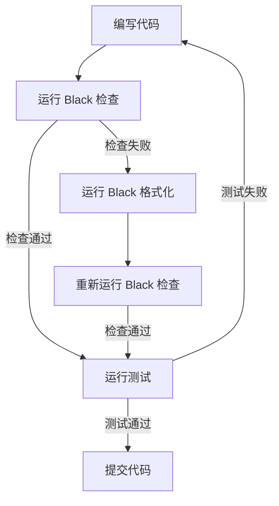

# CONSENSUS_Black集成

## 一、需求描述

### 1.1 核心需求

将 Black 代码格式化工具集成到 DingTalk-Live-Playback-Download-Tool 项目的开发流程中，确保代码格式统一且符合 PEP 8 规范。同时，更新项目开发指南文档，提供详细的 Black 使用说明。

### 1.2 需求分解

#### 需求 1：集成 Black 代码格式化工具

**具体要求**：
1. 配置 Black 工具的格式化规则
2. 确保配置符合项目编码规范
3. 提供使用指南和最佳实践

#### 需求 2：更新项目开发指南文档

**具体要求**：
1. 详细说明 Black 工具的使用方法
2. 说明 Black 在开发流程中的集成方式
3. 明确代码格式化标准
4. 提供命令示例和常见问题解决方法
5. 明确代码提交前必须通过 Black 格式化检查的要求

### 1.3 需求优先级

- **高优先级**：配置 Black 工具，确保代码格式统一
- **高优先级**：更新开发指南文档，提供清晰的使用说明
- **中优先级**：验证 Black 配置与项目编码规范的一致性

## 二、技术实现方案

### 2.1 技术选型

#### 2.1.1 Black 工具

**版本**：black>=23.0.0

**选择理由**：
- 项目已在 `requirements-dev.txt` 中包含 black>=23.0.0
- Black 是 Python 社区广泛使用的代码格式化工具
- 自动化程度高，减少手动调整
- 配置简单，易于集成

#### 2.1.2 配置文件格式

**选择**：`pyproject.toml`

**选择理由**：
- Python 项目的标准配置文件
- 可以在一个文件中管理多个工具的配置
- 被大多数 Python 工具支持
- 配置结构清晰，易于理解和维护

### 2.2 Black 配置方案

#### 2.2.1 配置参数

```toml
[tool.black]
line-length = 100
target-version = ['py38']
include = '\.pyi?$'
exclude = '''
/(
    \.git
  | \.hg
  | \.mypy_cache
  | \.tox
  | \.venv
  | _build
  | buck-out
  | build
  | dist
)/
'''
```

#### 2.2.2 配置参数说明

**line-length = 100**
- **含义**：代码行最大长度为 100 字符
- **理由**：平衡可读性和屏幕利用率，适合现代显示器
- **对比**：PEP 8 默认 79 字符，Black 默认 88 字符

**target-version = ['py38']**
- **含义**：目标 Python 版本为 3.8+
- **理由**：项目支持 Python 3.8+，确保代码兼容性
- **扩展**：未来可升级到 py39、py310 等

**include = '\.pyi?$'**
- **含义**：仅格式化 .py 和 .pyi 文件
- **理由**：避免格式化其他文件类型

**exclude**
- **含义**：排除不需要格式化的目录和文件
- **包含**：版本控制、缓存、虚拟环境、构建产物等

### 2.3 开发流程集成方案

#### 2.3.1 开发流程设计

将 Black 集成到开发流程中，形成以下流程：



#### 2.3.2 开发流程说明

1. **编写代码**：开发者编写代码
2. **运行 Black 检查**：运行 `black --check src/ tests/` 检查代码格式
3. **格式化代码**：如果检查失败，运行 `black src/ tests/` 格式化代码
4. **运行测试**：运行 pytest 测试
5. **提交代码**：提交到 Git 仓库

#### 2.3.3 常用命令

**检查代码格式**：
```bash
black --check src/ tests/
```

**格式化代码**：
```bash
black src/ tests/
```

**查看差异**：
```bash
black --diff src/ tests/
```

**格式化单个文件**：
```bash
black src/dingtalk_downloader/main.py
```

### 2.4 文档更新方案

#### 2.4.1 文档清单

更新以下文档：

1. **docs/development_standard.md**
   - 添加 "代码格式化规范" 章节
   - 说明 Black 工具的使用方法
   - 明确代码提交前必须通过 Black 格式化检查的要求

2. **docs/development_guide.md**（新建）
   - 提供详细的 Black 使用指南
   - 包含安装步骤、命令示例、常见问题解决方法
   - 说明 Black 在开发流程中的具体应用场景

3. **README.md**
   - 添加 "代码质量工具" 章节
   - 说明项目使用的代码质量工具（Black、flake8、mypy）
   - 提供快速开始指南

#### 2.4.2 文档结构

**docs/development_guide.md** 结构：

```markdown
# 开发者指南

## 一、开发环境搭建

### 1.1 安装依赖
### 1.2 配置开发环境

## 二、开发流程

### 2.1 代码编写
### 2.2 代码格式化
### 2.3 代码测试
### 2.4 代码提交

## 三、代码质量工具

### 3.1 Black 代码格式化
#### 3.1.1 安装
#### 3.1.2 配置
#### 3.1.3 使用方法
#### 3.1.4 常见问题

### 3.2 Flake8 代码规范检查
### 3.3 Mypy 类型检查

## 四、最佳实践

### 4.1 代码编写规范
### 4.2 测试编写规范
### 4.3 Git 提交规范

## 五、常见问题

### 5.1 环境问题
### 5.2 工具使用问题
### 5.3 代码规范问题
```

## 三、技术约束

### 3.1 必须遵守的约束

#### 3.1.1 PEP 8 规范

- Black 配置必须符合 PEP 8 规范
- 代码格式化后必须符合 PEP 8 规范
- 不引入 PEP 8 规范违规

#### 3.1.2 项目编码规范

- Black 配置必须与 `docs/development_standard.md` 保持一致
- 不与现有编码规范冲突
- 保持代码风格一致性

#### 3.1.3 Python 版本

- 支持 Python 3.8+
- 配置目标版本为 py38
- 确保代码兼容性

#### 3.1.4 跨平台兼容

- 配置必须在 Windows、Linux、macOS 上正常工作
- 不依赖平台特定的功能
- 确保跨平台一致性

### 3.2 配置参数约束

#### 3.2.1 行长度

- **设置**：100 字符
- **理由**：平衡可读性和屏幕利用率
- **验证**：格式化后的代码行长度不超过 100 字符

#### 3.2.2 目标版本

- **设置**：Python 3.8+
- **理由**：项目支持 Python 3.8+
- **验证**：格式化后的代码兼容 Python 3.8+

#### 3.2.3 排除目录

- **包含**：`.git`、`__pycache__`、`.venv`、`build`、`dist` 等
- **理由**：这些目录不需要格式化
- **验证**：排除目录中的文件不会被格式化

#### 3.2.4 包含文件

- **包含**：`.py` 和 `.pyi` 文件
- **理由**：仅格式化 Python 源文件和类型存根文件
- **验证**：其他文件类型不会被格式化

## 四、任务边界限制

### 4.1 包含在任务范围内

#### 4.1.1 Black 工具配置

- 创建 `pyproject.toml` 配置文件
- 配置 Black 格式化规则（行长度、目标版本、排除目录等）
- 验证 Black 配置与项目编码规范的一致性

#### 4.1.2 开发流程集成

- 在 `requirements-dev.txt` 中确认 Black 依赖（已存在）
- 创建使用指南文档
- 提供命令示例和最佳实践

#### 4.1.3 文档更新

- 更新 `docs/development_standard.md`，添加 Black 使用规范
- 创建 `docs/development_guide.md`（开发者指南），包含 Black 使用说明
- 更新 `README.md`，添加代码质量工具说明

#### 4.1.4 验证与测试

- 运行 Black 检查，验证配置正确性
- 格式化现有代码，确保符合规范
- 生成格式化报告

### 4.2 不包含在任务范围内

#### 4.2.1 CI/CD 流程配置

- 不配置 GitHub Actions、GitLab CI 等持续集成流程
- 不配置自动化部署流程
- **理由**：超出任务范围，需要额外的配置和维护成本

#### 4.2.2 Pre-commit 钩子配置

- 不配置 Git pre-commit 钩子
- 不配置自动格式化提交
- **理由**：超出任务范围，可能影响开发体验

#### 4.2.3 其他代码质量工具配置

- 不配置 flake8、mypy 等其他工具
- 不配置代码覆盖率目标
- **理由**：超出任务范围，这些工具已在 TODO 清单中

#### 4.2.4 代码重构

- 不重构现有代码结构
- 不修改代码逻辑
- **理由**：超出任务范围，仅进行代码格式化

## 五、验收标准

### 5.1 功能验收标准

#### 5.1.1 Black 配置文件

- [ ] 创建 `pyproject.toml` 文件
- [ ] 包含完整的 Black 配置
- [ ] 配置参数合理且符合项目规范
- [ ] 配置文件格式正确

#### 5.1.2 代码格式化

- [ ] 运行 `black src/ tests/` 能够格式化所有代码
- [ ] 格式化后的代码符合 PEP 8 规范
- [ ] 不改变代码逻辑
- [ ] 格式化结果可重复

#### 5.1.3 格式化检查

- [ ] 运行 `black --check src/ tests/` 能够检查代码格式
- [ ] 检查结果准确无误
- [ ] 检查失败时提供明确的错误信息

#### 5.1.4 文档完整性

- [ ] 更新 `docs/development_standard.md`，添加 Black 使用规范
- [ ] 创建 `docs/development_guide.md`，包含详细的 Black 使用说明
- [ ] 更新 `README.md`，添加代码质量工具说明
- [ ] 文档内容准确、清晰、易于理解
- [ ] 文档包含安装步骤、命令示例、常见问题解决方法

### 5.2 质量验收标准

#### 5.2.1 配置正确性

- [ ] Black 配置参数正确
- [ ] 与项目编码规范一致
- [ ] 跨平台兼容
- [ ] 配置文件格式正确

#### 5.2.2 文档质量

- [ ] 文档结构清晰
- [ ] 内容完整准确
- [ ] 示例代码可运行
- [ ] 常见问题有解决方案
- [ ] 文档语言统一（中文）

#### 5.2.3 代码质量

- [ ] 格式化后的代码符合 PEP 8 规范
- [ ] 不引入新的代码问题
- [ ] 不改变代码逻辑
- [ ] 代码风格一致

### 5.3 性能验收标准

#### 5.3.1 格式化性能

- [ ] 格式化整个项目代码在合理时间内完成（< 10 秒）
- [ ] 格式化单个文件在合理时间内完成（< 1 秒）

#### 5.3.2 检查性能

- [ ] 检查整个项目代码格式在合理时间内完成（< 5 秒）
- [ ] 检查单个文件格式在合理时间内完成（< 0.5 秒）

### 5.4 可用性验收标准

#### 5.4.1 易用性

- [ ] 命令简单易懂
- [ ] 错误信息清晰明确
- [ ] 文档易于理解

#### 5.4.2 可维护性

- [ ] 配置文件易于理解和修改
- [ ] 文档易于更新和维护
- [ ] 工具易于升级和替换

## 六、集成方案

### 6.1 与现有系统的集成

#### 6.1.1 与开发规范的集成

- Black 配置与 `docs/development_standard.md` 保持一致
- 不与现有编码规范冲突
- 补充现有编码规范

#### 6.1.2 与开发工具的集成

- 与 pytest、flake8、mypy 等工具协同工作
- 不影响现有工具的使用
- 提供统一的开发体验

#### 6.1.3 与项目结构的集成

- 不改变项目结构
- 不影响现有模块和功能
- 与现有代码风格一致

### 6.2 与未来扩展的集成

#### 6.2.1 CI/CD 集成准备

- 配置文件易于集成到 CI/CD 流程
- 提供清晰的命令和脚本
- 便于自动化检查

#### 6.2.2 Pre-commit 钩子准备

- 配置文件易于集成到 pre-commit 钩子
- 提供清晰的命令和脚本
- 便于自动化格式化

#### 6.2.3 其他工具集成

- 配置文件易于集成其他代码质量工具
- 提供统一的配置管理
- 便于工具链扩展

## 七、风险与应对

### 7.1 潜在风险

#### 7.1.1 配置冲突风险

**风险描述**：Black 配置可能与现有编码规范冲突

**应对措施**：
- 仔细审查 Black 配置与现有编码规范的一致性
- 在小范围内测试配置
- 及时调整配置参数

#### 7.1.2 代码格式化风险

**风险描述**：格式化可能改变代码逻辑或引入问题

**应对措施**：
- 格式化前备份代码
- 格式化后运行测试
- 使用版本控制管理代码变更

#### 7.1.3 文档更新风险

**风险描述**：文档更新可能不准确或不完整

**应对措施**：
- 仔细审查文档内容
- 验证文档中的命令和示例
- 定期更新文档

### 7.2 风险缓解策略

#### 7.2.1 测试策略

- 在小范围内测试配置
- 格式化后运行测试
- 验证格式化结果

#### 7.2.2 回滚策略

- 使用版本控制管理代码变更
- 格式化前创建备份
- 出现问题时及时回滚

#### 7.2.3 文档验证策略

- 验证文档中的命令和示例
- 定期更新文档
- 收集用户反馈

## 八、总结

### 8.1 任务概述

本任务的目标是将 Black 代码格式化工具集成到 DingTalk-Live-Playback-Download-Tool 项目的开发流程中，确保代码格式统一且符合 PEP 8 规范。同时，更新项目开发指南文档，提供详细的 Black 使用说明。

### 8.2 关键决策点

1. **配置文件**：使用 `pyproject.toml`
2. **行长度**：设置为 100 字符（已确认）
3. **目标版本**：Python 3.8+
4. **CI/CD 流程**：不配置（已确认）
5. **Pre-commit 钩子**：不配置（已确认）

### 8.3 验收标准

- Black 配置文件创建完成
- 代码格式化功能正常
- 文档更新完成
- 所有验收标准满足

### 8.4 下一步行动

1. 进入 Architect 阶段：设计 Black 集成架构和配置方案
2. 进入 Atomize 阶段：拆分子任务，明确依赖关系
3. 进入 Approve 阶段：审查任务计划的完整性和可行性
4. 进入 Automate 阶段：按任务依赖顺序执行
5. 进入 Assess 阶段：验证执行结果，生成最终交付物
