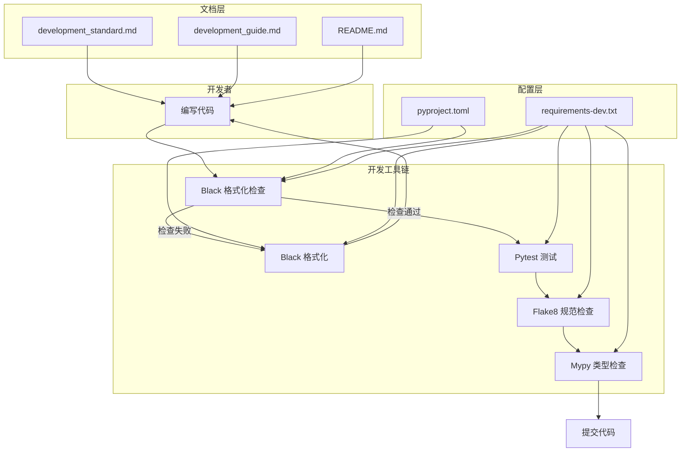
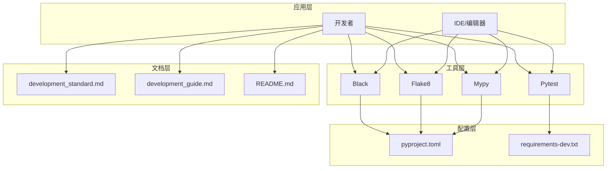
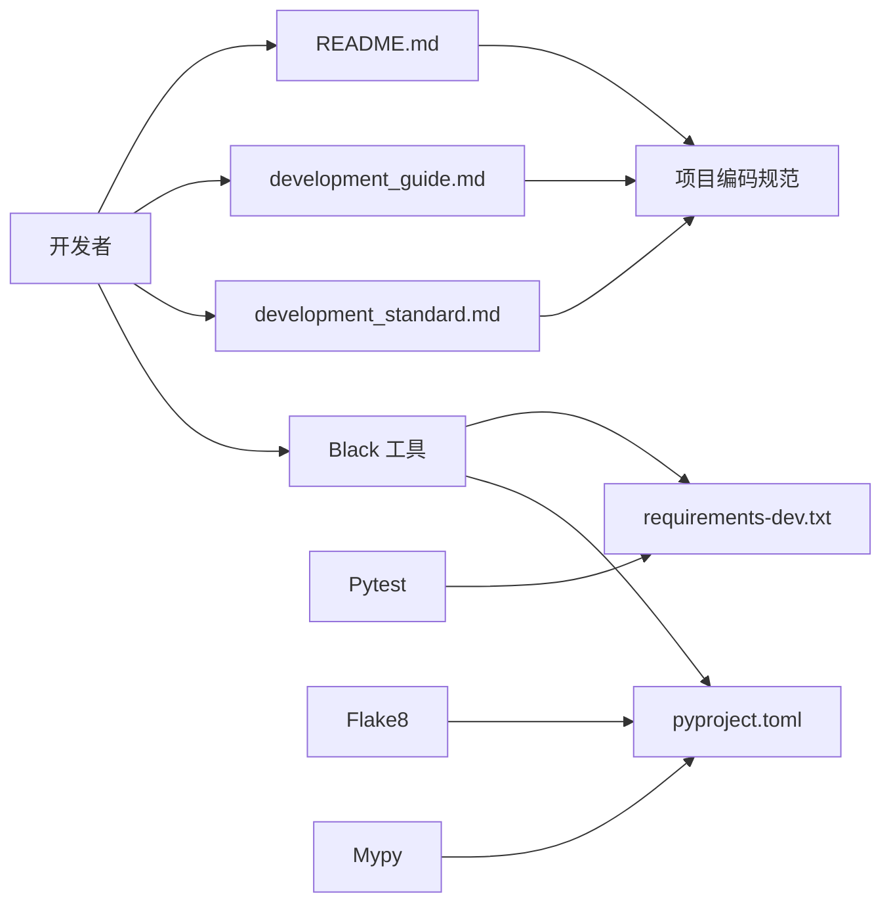
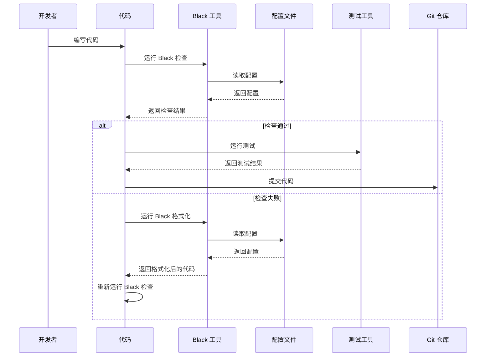
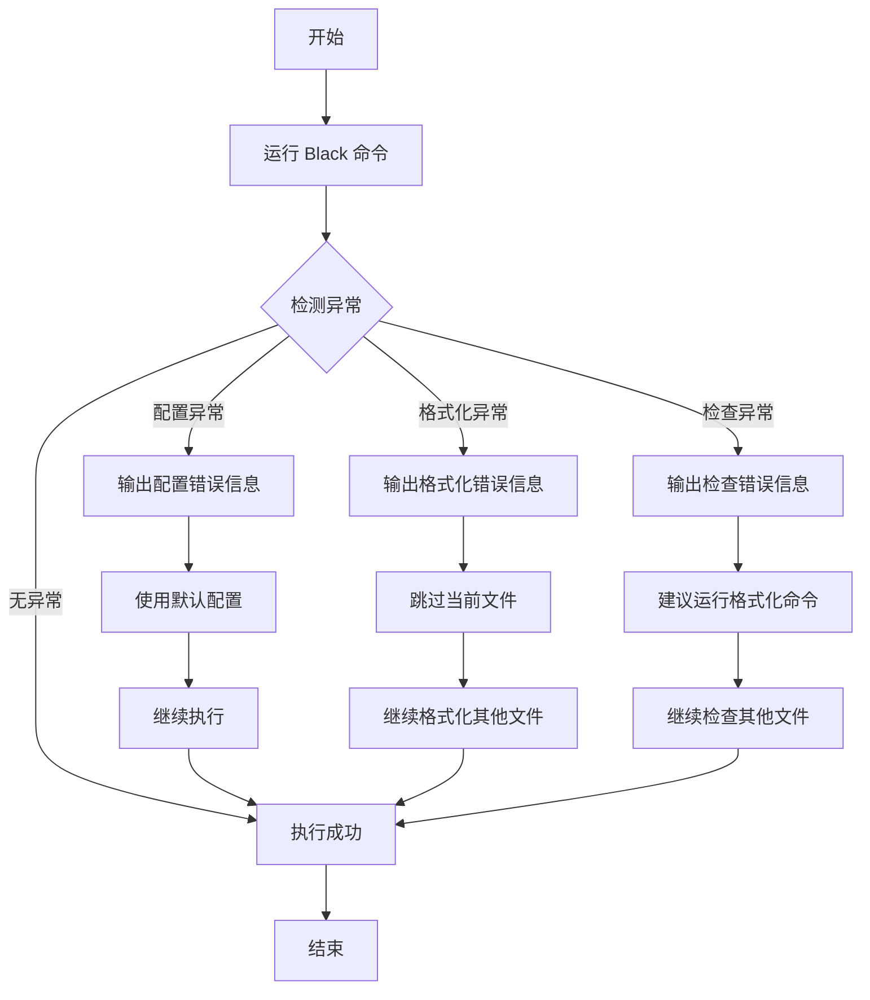

# DESIGN_Black集成

## 一、整体架构设计

### 1.1 架构概览

Black 集成架构采用**工具链集成模式**，将 Black 作为开发工具链的一部分，与现有开发流程无缝集成。架构设计遵循**最小侵入原则**，不改变现有项目结构，仅添加配置和文档。



### 1.2 架构层次

Black 集成架构分为四个层次：

#### 1.2.1 开发者层

- **职责**：开发者编写代码
- **输入**：业务需求
- **输出**：Python 代码

#### 1.2.2 工具链层

- **职责**：代码质量检查和格式化
- **包含工具**：
  - Black：代码格式化
  - Pytest：单元测试
  - Flake8：代码规范检查
  - Mypy：类型检查
- **输入**：Python 代码
- **输出**：格式化后的代码、测试结果、检查报告

#### 1.2.3 配置层

- **职责**：工具配置管理
- **包含文件**：
  - `pyproject.toml`：Black、Flake8、Mypy 配置
  - `requirements-dev.txt`：开发依赖
- **输入**：配置参数
- **输出**：工具配置

#### 1.2.4 文档层

- **职责**：开发指南和规范说明
- **包含文件**：
  - `docs/development_standard.md`：开发规范
  - `docs/development_guide.md`：开发者指南
  - `README.md`：项目说明
- **输入**：开发规范和最佳实践
- **输出**：文档

### 1.3 核心组件

#### 1.3.1 Black 配置组件

**职责**：管理 Black 工具的配置

**配置文件**：`pyproject.toml`

**配置参数**：
- `line-length`：代码行最大长度
- `target-version`：目标 Python 版本
- `include`：包含的文件类型
- `exclude`：排除的目录和文件

**接口**：
- 命令行接口：`black [options] <src>`
- 配置文件接口：`pyproject.toml`

#### 1.3.2 文档组件

**职责**：提供 Black 使用指南和规范说明

**文档文件**：
- `docs/development_standard.md`：开发规范
- `docs/development_guide.md`：开发者指南
- `README.md`：项目说明

**内容**：
- 安装步骤
- 使用方法
- 命令示例
- 常见问题解决方法
- 代码提交前检查要求

#### 1.3.3 集成组件

**职责**：将 Black 集成到开发流程中

**集成方式**：
- 手动集成：开发者手动运行 Black 命令
- 文档集成：通过文档指导开发者使用 Black

**流程**：
1. 编写代码
2. 运行 Black 检查
3. 格式化代码（如果需要）
4. 运行测试
5. 提交代码

## 二、分层设计

### 2.1 分层架构



### 2.2 层次职责

#### 2.2.1 应用层

**职责**：
- 开发者编写代码
- IDE/编辑器提供代码编辑和运行环境

**接口**：
- 命令行接口：运行 Black 命令
- IDE 插件接口：集成 Black 到 IDE

**依赖**：
- 依赖工具层提供的工具
- 依赖文档层提供的文档

#### 2.2.2 工具层

**职责**：
- Black：代码格式化
- Pytest：单元测试
- Flake8：代码规范检查
- Mypy：类型检查

**接口**：
- 命令行接口：提供命令行工具
- 配置接口：读取配置文件

**依赖**：
- 依赖配置层提供的配置

#### 2.2.3 配置层

**职责**：
- 管理工具配置
- 管理开发依赖

**接口**：
- 配置文件接口：提供配置文件
- 依赖文件接口：提供依赖文件

**依赖**：
- 无依赖

#### 2.2.4 文档层

**职责**：
- 提供开发规范
- 提供开发者指南
- 提供项目说明

**接口**：
- 文档接口：提供文档文件

**依赖**：
- 无依赖

## 三、模块依赖关系

### 3.1 模块依赖图



### 3.2 依赖关系说明

#### 3.2.1 Black 工具依赖

- **依赖**：`pyproject.toml`、`requirements-dev.txt`
- **原因**：Black 需要读取配置文件和依赖文件

#### 3.2.2 开发者依赖

- **依赖**：Black 工具、文档文件
- **原因**：开发者需要使用 Black 工具和参考文档

#### 3.2.3 文档依赖

- **依赖**：项目编码规范
- **原因**：文档需要遵循项目编码规范

#### 3.2.4 其他工具依赖

- **Pytest 依赖**：`requirements-dev.txt`
- **Flake8 依赖**：`pyproject.toml`
- **Mypy 依赖**：`pyproject.toml`

## 四、接口契约定义

### 4.1 Black 工具接口

#### 4.1.1 命令行接口

**接口名称**：Black 命令行工具

**接口类型**：命令行接口（CLI）

**输入参数**：

| 参数名 | 类型 | 必填 | 说明 |
|--------|------|------|------|
| `src` | string | 是 | 源代码文件或目录 |
| `--check` | flag | 否 | 检查代码格式，不修改文件 |
| `--diff` | flag | 否 | 显示格式化差异 |
| `--line-length` | int | 否 | 代码行最大长度 |
| `--target-version` | string | 否 | 目标 Python 版本 |
| `--include` | string | 否 | 包含的文件模式 |
| `--exclude` | string | 否 | 排除的目录或文件 |

**输出**：

- **成功**：返回 0，输出格式化结果或检查结果
- **失败**：返回 1，输出错误信息

**示例**：

```bash
# 格式化代码
black src/ tests/

# 检查代码格式
black --check src/ tests/

# 查看格式化差异
black --diff src/ tests/

# 格式化单个文件
black src/dingtalk_downloader/main.py
```

#### 4.1.2 配置文件接口

**接口名称**：Black 配置文件

**接口类型**：配置文件接口

**配置文件**：`pyproject.toml`

**配置格式**：

```toml
[tool.black]
line-length = 100
target-version = ['py38']
include = '\.pyi?$'
exclude = '''
/(
    \.git
  | \.hg
  | \.mypy_cache
  | \.tox
  | \.venv
  | _build
  | buck-out
  | build
  | dist
)/
'''
```

**配置参数说明**：

| 参数名 | 类型 | 必填 | 默认值 | 说明 |
|--------|------|------|--------|------|
| `line-length` | int | 否 | 88 | 代码行最大长度 |
| `target-version` | list | 否 | ['py38'] | 目标 Python 版本 |
| `include` | string | 否 | '\.pyi?$' | 包含的文件模式 |
| `exclude` | string | 否 | '' | 排除的目录或文件 |

### 4.2 文档接口

#### 4.2.1 开发规范文档接口

**接口名称**：开发规范文档

**接口类型**：文档接口

**文档文件**：`docs/development_standard.md`

**文档内容**：

- 命名规范
- 注释规范
- 项目结构规范
- 导入规范
- 代码格式化规范（新增）

**更新方式**：

- 添加 "代码格式化规范" 章节
- 说明 Black 工具的使用方法
- 明确代码提交前必须通过 Black 格式化检查的要求

#### 4.2.2 开发者指南文档接口

**接口名称**：开发者指南

**接口类型**：文档接口

**文档文件**：`docs/development_guide.md`（新建）

**文档内容**：

- 开发环境搭建
- 开发流程
- 代码质量工具（Black、Flake8、Mypy）
- 最佳实践
- 常见问题

**创建方式**：

- 创建新文档文件
- 提供详细的 Black 使用指南
- 包含安装步骤、命令示例、常见问题解决方法

#### 4.2.3 项目说明文档接口

**接口名称**：项目说明

**接口类型**：文档接口

**文档文件**：`README.md`

**文档内容**：

- 项目简介
- 功能特性
- 安装说明
- 使用指南
- 项目结构
- 开发指南
- 代码质量工具（新增）

**更新方式**：

- 添加 "代码质量工具" 章节
- 说明项目使用的代码质量工具（Black、Flake8、Mypy）
- 提供快速开始指南

## 五、数据流向图

### 5.1 开发流程数据流



### 5.2 数据流说明

#### 5.2.1 代码编写流程

1. **开发者**编写代码
2. **代码**运行 Black 检查
3. **Black 工具**读取配置文件
4. **配置文件**返回配置
5. **Black 工具**返回检查结果

#### 5.2.2 格式化流程

1. **代码**运行 Black 格式化
2. **Black 工具**读取配置文件
3. **配置文件**返回配置
4. **Black 工具**返回格式化后的代码
5. **代码**重新运行 Black 检查

#### 5.2.3 提交流程

1. **代码**运行测试
2. **测试工具**返回测试结果
3. **代码**提交到 Git 仓库

## 六、异常处理策略

### 6.1 异常分类

#### 6.1.1 配置异常

**异常类型**：配置文件错误

**异常原因**：
- 配置文件格式错误
- 配置参数不合法
- 配置文件不存在

**处理策略**：

1. **检测**：Black 工具启动时检测配置文件
2. **提示**：输出明确的错误信息
3. **恢复**：使用默认配置
4. **文档**：在文档中说明配置文件格式

**示例**：

```bash
$ black src/
error: cannot parse pyproject.toml: invalid syntax at line 10
```

#### 6.1.2 格式化异常

**异常类型**：格式化失败

**异常原因**：
- 代码语法错误
- 文件权限问题
- 磁盘空间不足

**处理策略**：

1. **检测**：Black 工具格式化时检测异常
2. **提示**：输出明确的错误信息
3. **跳过**：跳过格式化失败的文件
4. **继续**：继续格式化其他文件

**示例**：

```bash
$ black src/
error: cannot format src/dingtalk_downloader/main.py: syntax error at line 10
1 file left unchanged.
```

#### 6.1.3 检查异常

**异常类型**：检查失败

**异常原因**：
- 代码格式不符合规范
- 代码行长度超过限制

**处理策略**：

1. **检测**：Black 工具检查时检测异常
2. **提示**：输出明确的错误信息
3. **建议**：建议运行格式化命令
4. **继续**：继续检查其他文件

**示例**：

```bash
$ black --check src/
would reformat src/dingtalk_downloader/main.py
Oh no! 💥 💥 💥
1 file would be reformatted.
```

### 6.2 异常处理流程



### 6.3 异常处理最佳实践

#### 6.3.1 配置异常处理

1. **验证配置文件**：在提交前验证配置文件格式
2. **提供配置示例**：在文档中提供配置示例
3. **使用默认配置**：配置文件错误时使用默认配置
4. **输出明确错误信息**：帮助开发者快速定位问题

#### 6.3.2 格式化异常处理

1. **备份代码**：格式化前备份代码
2. **跳过错误文件**：跳过格式化失败的文件
3. **输出明确错误信息**：帮助开发者快速定位问题
4. **继续格式化其他文件**：不影响其他文件的格式化

#### 6.3.3 检查异常处理

1. **输出明确错误信息**：帮助开发者快速定位问题
2. **建议运行格式化命令**：提供解决方案
3. **继续检查其他文件**：不影响其他文件的检查
4. **生成检查报告**：提供完整的检查报告

## 七、设计原则

### 7.1 最小侵入原则

**原则说明**：不改变现有项目结构，仅添加配置和文档

**应用**：
- 不修改现有代码
- 不改变项目结构
- 仅添加配置文件和文档

### 7.2 配置驱动原则

**原则说明**：通过配置文件管理工具行为

**应用**：
- 使用 `pyproject.toml` 管理配置
- 配置参数清晰明确
- 易于理解和修改

### 7.3 文档优先原则

**原则说明**：通过文档指导开发者使用工具

**应用**：
- 提供详细的文档
- 包含安装步骤、使用方法、常见问题
- 易于理解和遵循

### 7.4 向后兼容原则

**原则说明**：不影响现有代码和工具的使用

**应用**：
- 不修改现有代码
- 不改变现有工具的使用方式
- 与现有工具协同工作

### 7.5 可扩展原则

**原则说明**：便于未来扩展和集成其他工具

**应用**：
- 配置文件易于扩展
- 文档易于更新
- 工具链易于扩展

## 八、总结

### 8.1 架构设计总结

Black 集成架构采用**工具链集成模式**，将 Black 作为开发工具链的一部分，与现有开发流程无缝集成。架构设计遵循**最小侵入原则**，不改变现有项目结构，仅添加配置和文档。

### 8.2 核心设计要点

1. **分层设计**：应用层、工具层、配置层、文档层
2. **模块依赖**：Black 工具依赖配置文件，开发者依赖工具和文档
3. **接口契约**：命令行接口、配置文件接口、文档接口
4. **数据流向**：代码编写 → Black 检查 → 格式化 → 测试 → 提交
5. **异常处理**：配置异常、格式化异常、检查异常

### 8.3 设计原则

1. **最小侵入原则**：不改变现有项目结构
2. **配置驱动原则**：通过配置文件管理工具行为
3. **文档优先原则**：通过文档指导开发者使用工具
4. **向后兼容原则**：不影响现有代码和工具的使用
5. **可扩展原则**：便于未来扩展和集成其他工具

### 8.4 下一步行动

1. 进入 Atomize 阶段：拆分子任务，明确依赖关系
2. 进入 Approve 阶段：审查任务计划的完整性和可行性
3. 进入 Automate 阶段：按任务依赖顺序执行
4. 进入 Assess 阶段：验证执行结果，生成最终交付物
