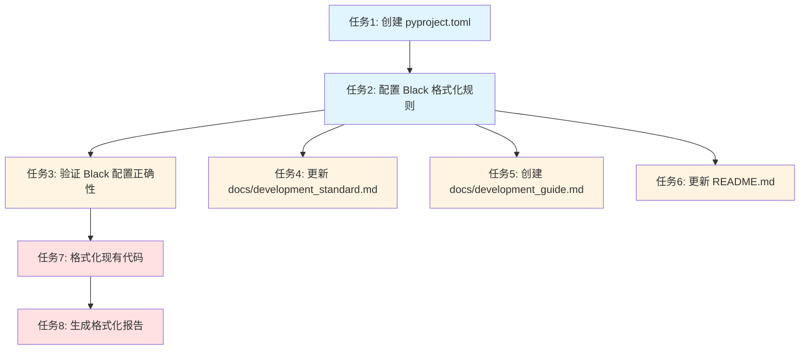

# TASK_Black集成

## 一、任务拆分概述

基于 DESIGN_Black集成.md 文档，将 Black 集成任务拆分为以下原子任务：

1. **任务 1**：创建 pyproject.toml 配置文件
2. **任务 2**：配置 Black 格式化规则
3. **任务 3**：验证 Black 配置正确性
4. **任务 4**：更新 docs/development_standard.md
5. **任务 5**：创建 docs/development_guide.md
6. **任务 6**：更新 README.md
7. **任务 7**：格式化现有代码
8. **任务 8**：生成格式化报告

## 二、原子任务定义

### 任务 1：创建 pyproject.toml 配置文件

#### 输入契约

**前置依赖**：
- 无

**输入数据**：
- Black 配置参数（从 CONSENSUS 文档获取）
- 项目根目录路径：`d:\dev\works\git\github\DingTalk-Live-Playback-Download-Tool`

**环境依赖**：
- Python 3.8+
- 文件系统写入权限

#### 输出契约

**输出数据**：
- `pyproject.toml` 文件（位于项目根目录）

**交付物**：
- `d:\dev\works\git\github\DingTalk-Live-Playback-Download-Tool\pyproject.toml`

**验收标准**：
- [ ] 文件创建成功
- [ ] 文件格式正确（TOML 格式）
- [ ] 包含 `[tool.black]` 配置节
- [ ] 配置参数正确（line-length、target-version、include、exclude）

#### 实现约束

**技术栈**：
- Python 3.8+
- TOML 配置格式

**接口规范**：
- 使用标准 TOML 格式
- 遵循 Black 配置规范

**质量要求**：
- 配置参数准确无误
- 配置格式正确
- 配置易于理解和修改

#### 依赖关系

**后置任务**：
- 任务 2：配置 Black 格式化规则（依赖任务 1 的输出）

**并行任务**：
- 无

---

### 任务 2：配置 Black 格式化规则

#### 输入契约

**前置依赖**：
- 任务 1：创建 pyproject.toml 配置文件

**输入数据**：
- `pyproject.toml` 文件（从任务 1 获取）
- Black 配置参数（从 CONSENSUS 文档获取）

**环境依赖**：
- Python 3.8+
- 文件系统读写权限

#### 输出契约

**输出数据**：
- 更新后的 `pyproject.toml` 文件

**交付物**：
- `d:\dev\works\git\github\DingTalk-Live-Playback-Download-Tool\pyproject.toml`

**验收标准**：
- [ ] 配置参数正确
- [ ] line-length = 100
- [ ] target-version = ['py38']
- [ ] include = '\.pyi?$'
- [ ] exclude 包含正确的目录和文件
- [ ] 配置格式正确

#### 实现约束

**技术栈**：
- Python 3.8+
- TOML 配置格式

**接口规范**：
- 遵循 Black 配置规范
- 使用标准 TOML 格式

**质量要求**：
- 配置参数准确无误
- 配置格式正确
- 配置易于理解和修改

#### 依赖关系

**后置任务**：
- 任务 3：验证 Black 配置正确性（依赖任务 2 的输出）

**并行任务**：
- 无

---

### 任务 3：验证 Black 配置正确性

#### 输入契约

**前置依赖**：
- 任务 2：配置 Black 格式化规则

**输入数据**：
- `pyproject.toml` 文件（从任务 2 获取）
- 项目源代码目录：`src/`
- 项目测试目录：`tests/`

**环境依赖**：
- Python 3.8+
- Black 工具已安装（black>=23.0.0）
- 命令行执行权限

#### 输出契约

**输出数据**：
- Black 检查结果（控制台输出）
- 格式化报告（可选）

**交付物**：
- Black 检查结果记录

**验收标准**：
- [ ] Black 检查命令执行成功
- [ ] 配置文件读取成功
- [ ] 无配置错误
- [ ] 检查结果符合预期

#### 实现约束

**技术栈**：
- Python 3.8+
- Black 工具（black>=23.0.0）

**接口规范**：
- 使用 Black 命令行接口
- 使用 `black --check` 命令

**质量要求**：
- 检查结果准确
- 错误信息清晰
- 检查性能良好

#### 依赖关系

**后置任务**：
- 任务 7：格式化现有代码（依赖任务 3 的验证结果）

**并行任务**：
- 任务 4：更新 docs/development_standard.md（可并行执行）
- 任务 5：创建 docs/development_guide.md（可并行执行）
- 任务 6：更新 README.md（可并行执行）

---

### 任务 4：更新 docs/development_standard.md

#### 输入契约

**前置依赖**：
- 任务 2：配置 Black 格式化规则

**输入数据**：
- `docs/development_standard.md` 文件（现有文件）
- Black 配置参数（从任务 2 获取）
- Black 使用规范（从 CONSENSUS 文档获取）

**环境依赖**：
- Python 3.8+
- 文件系统读写权限

#### 输出契约

**输出数据**：
- 更新后的 `docs/development_standard.md` 文件

**交付物**：
- `d:\dev\works\git\github\DingTalk-Live-Playback-Download-Tool\docs\development_standard.md`

**验收标准**：
- [ ] 添加 "代码格式化规范" 章节
- [ ] 说明 Black 工具的使用方法
- [ ] 明确代码提交前必须通过 Black 格式化检查的要求
- [ ] 内容准确、清晰、易于理解
- [ ] 文档语言统一（中文）

#### 实现约束

**技术栈**：
- Python 3.8+
- Markdown 格式

**接口规范**：
- 遵循现有文档格式
- 使用 Markdown 格式

**质量要求**：
- 内容准确完整
- 格式规范统一
- 易于理解

#### 依赖关系

**后置任务**：
- 无

**并行任务**：
- 任务 3：验证 Black 配置正确性（可并行执行）
- 任务 5：创建 docs/development_guide.md（可并行执行）
- 任务 6：更新 README.md（可并行执行）

---

### 任务 5：创建 docs/development_guide.md

#### 输入契约

**前置依赖**：
- 任务 2：配置 Black 格式化规则

**输入数据**：
- Black 配置参数（从任务 2 获取）
- Black 使用指南（从 CONSENSUS 文档获取）
- 项目开发流程（从 DESIGN 文档获取）

**环境依赖**：
- Python 3.8+
- 文件系统写入权限

#### 输出契约

**输出数据**：
- `docs/development_guide.md` 文件（新建）

**交付物**：
- `d:\dev\works\git\github\DingTalk-Live-Playback-Download-Tool\docs\development_guide.md`

**验收标准**：
- [ ] 文档创建成功
- [ ] 包含 "开发环境搭建" 章节
- [ ] 包含 "开发流程" 章节
- [ ] 包含 "代码质量工具" 章节（Black、Flake8、Mypy）
- [ ] 包含 "最佳实践" 章节
- [ ] 包含 "常见问题" 章节
- [ ] 提供详细的 Black 使用指南
- [ ] 包含安装步骤、命令示例、常见问题解决方法
- [ ] 内容准确、清晰、易于理解
- [ ] 文档语言统一（中文）

#### 实现约束

**技术栈**：
- Python 3.8+
- Markdown 格式

**接口规范**：
- 使用 Markdown 格式
- 遵循文档编写规范

**质量要求**：
- 内容准确完整
- 格式规范统一
- 易于理解

#### 依赖关系

**后置任务**：
- 无

**并行任务**：
- 任务 3：验证 Black 配置正确性（可并行执行）
- 任务 4：更新 docs/development_standard.md（可并行执行）
- 任务 6：更新 README.md（可并行执行）

---

### 任务 6：更新 README.md

#### 输入契约

**前置依赖**：
- 任务 2：配置 Black 格式化规则

**输入数据**：
- `README.md` 文件（现有文件）
- Black 配置参数（从任务 2 获取）
- 项目代码质量工具说明（从 CONSENSUS 文档获取）

**环境依赖**：
- Python 3.8+
- 文件系统读写权限

#### 输出契约

**输出数据**：
- 更新后的 `README.md` 文件

**交付物**：
- `d:\dev\works\git\github\DingTalk-Live-Playback-Download-Tool\README.md`

**验收标准**：
- [ ] 添加 "代码质量工具" 章节
- [ ] 说明项目使用的代码质量工具（Black、Flake8、Mypy）
- [ ] 提供快速开始指南
- [ ] 内容准确、清晰、易于理解
- [ ] 文档语言统一（中文）

#### 实现约束

**技术栈**：
- Python 3.8+
- Markdown 格式

**接口规范**：
- 遵循现有文档格式
- 使用 Markdown 格式

**质量要求**：
- 内容准确完整
- 格式规范统一
- 易于理解

#### 依赖关系

**后置任务**：
- 无

**并行任务**：
- 任务 3：验证 Black 配置正确性（可并行执行）
- 任务 4：更新 docs/development_standard.md（可并行执行）
- 任务 5：创建 docs/development_guide.md（可并行执行）

---

### 任务 7：格式化现有代码

#### 输入契约

**前置依赖**：
- 任务 3：验证 Black 配置正确性

**输入数据**：
- `pyproject.toml` 文件（从任务 2 获取）
- 项目源代码目录：`src/`
- 项目测试目录：`tests/`
- Black 检查结果（从任务 3 获取）

**环境依赖**：
- Python 3.8+
- Black 工具已安装（black>=23.0.0）
- 命令行执行权限
- 文件系统读写权限

#### 输出契约

**输出数据**：
- 格式化后的代码文件
- 格式化报告（控制台输出）

**交付物**：
- 格式化后的所有 Python 文件

**验收标准**：
- [ ] 格式化命令执行成功
- [ ] 所有 Python 文件格式化完成
- [ ] 格式化后的代码符合 PEP 8 规范
- [ ] 格式化后的代码行长度不超过 100 字符
- [ ] 不改变代码逻辑
- [ ] 格式化结果可重复

#### 实现约束

**技术栈**：
- Python 3.8+
- Black 工具（black>=23.0.0）

**接口规范**：
- 使用 Black 命令行接口
- 使用 `black src/ tests/` 命令

**质量要求**：
- 格式化结果准确
- 不改变代码逻辑
- 格式化性能良好

#### 依赖关系

**后置任务**：
- 任务 8：生成格式化报告（依赖任务 7 的格式化结果）

**并行任务**：
- 无

---

### 任务 8：生成格式化报告

#### 输入契约

**前置依赖**：
- 任务 7：格式化现有代码

**输入数据**：
- 格式化结果（从任务 7 获取）
- 项目源代码目录：`src/`
- 项目测试目录：`tests/`

**环境依赖**：
- Python 3.8+
- Black 工具已安装（black>=23.0.0）
- 命令行执行权限

#### 输出契约

**输出数据**：
- 格式化报告（控制台输出或文件）

**交付物**：
- 格式化报告记录

**验收标准**：
- [ ] 格式化报告生成成功
- [ ] 报告包含格式化的文件数量
- [ ] 报告包含格式化的行数
- [ ] 报告包含格式化时间
- [ ] 报告内容准确、清晰

#### 实现约束

**技术栈**：
- Python 3.8+
- Black 工具（black>=23.0.0）

**接口规范**：
- 使用 Black 命令行接口
- 使用 `black --diff` 或 `black --check` 命令

**质量要求**：
- 报告内容准确
- 报告格式清晰
- 报告易于理解

#### 依赖关系

**后置任务**：
- 无

**并行任务**：
- 无

---

## 三、任务依赖图

### 依赖关系说明

#### 串行依赖

1. **任务 1 → 任务 2**：任务 2 依赖任务 1 创建的 `pyproject.toml` 文件
2. **任务 2 → 任务 3**：任务 3 依赖任务 2 配置的 Black 格式化规则
3. **任务 3 → 任务 7**：任务 7 依赖任务 3 的验证结果
4. **任务 7 → 任务 8**：任务 8 依赖任务 7 的格式化结果

#### 并行依赖

1. **任务 3、任务 4、任务 5、任务 6**：这四个任务可以并行执行，都依赖任务 2 的输出

## 四、任务执行顺序

### 第一阶段：配置准备

1. **任务 1**：创建 pyproject.toml 配置文件
2. **任务 2**：配置 Black 格式化规则

### 第二阶段：验证与文档（并行）

3. **任务 3**：验证 Black 配置正确性
4. **任务 4**：更新 docs/development_standard.md
5. **任务 5**：创建 docs/development_guide.md
6. **任务 6**：更新 README.md

### 第三阶段：格式化与报告

7. **任务 7**：格式化现有代码
8. **任务 8**：生成格式化报告

## 五、任务复杂度评估

### 任务复杂度分级

- **低复杂度**：任务 1、任务 8
- **中复杂度**：任务 2、任务 3、任务 6
- **高复杂度**：任务 4、任务 5、任务 7

### 复杂度说明

#### 任务 1：创建 pyproject.toml 配置文件（低复杂度）

**原因**：
- 任务简单明确
- 只需创建一个配置文件
- 配置参数已确定

#### 任务 2：配置 Black 格式化规则（中复杂度）

**原因**：
- 需要配置多个参数
- 需要确保配置正确性
- 需要遵循 Black 配置规范

#### 任务 3：验证 Black 配置正确性（中复杂度）

**原因**：
- 需要运行 Black 命令
- 需要检查配置文件
- 需要验证配置参数

#### 任务 4：更新 docs/development_standard.md（高复杂度）

**原因**：
- 需要理解现有文档结构
- 需要添加新的章节
- 需要确保内容准确完整

#### 任务 5：创建 docs/development_guide.md（高复杂度）

**原因**：
- 需要创建新的文档
- 需要包含多个章节
- 需要提供详细的指南

#### 任务 6：更新 README.md（中复杂度）

**原因**：
- 需要理解现有文档结构
- 需要添加新的章节
- 需要确保内容准确完整

#### 任务 7：格式化现有代码（高复杂度）

**原因**：
- 需要格式化多个文件
- 需要确保不改变代码逻辑
- 需要验证格式化结果

#### 任务 8：生成格式化报告（低复杂度）

**原因**：
- 任务简单明确
- 只需运行 Black 命令
- 只需记录结果

## 六、任务验收标准汇总

### 功能验收标准

- [ ] 所有任务完成
- [ ] 所有交付物创建成功
- [ ] 所有验收标准满足

### 质量验收标准

- [ ] 配置文件正确
- [ ] 文档准确完整
- [ ] 代码格式化正确
- [ ] 报告内容准确

### 性能验收标准

- [ ] 格式化性能良好
- [ ] 检查性能良好
- [ ] 报告生成性能良好

### 可用性验收标准

- [ ] 命令简单易懂
- [ ] 错误信息清晰
- [ ] 文档易于理解

## 七、总结

### 7.1 任务拆分总结

将 Black 集成任务拆分为 8 个原子任务，每个任务都有明确的输入契约、输出契约、实现约束和依赖关系。

### 7.2 任务依赖关系

- **串行依赖**：任务 1 → 任务 2 → 任务 3 → 任务 7 → 任务 8
- **并行依赖**：任务 3、任务 4、任务 5、任务 6 可以并行执行

### 7.3 任务执行顺序

1. 第一阶段：配置准备（任务 1、任务 2）
2. 第二阶段：验证与文档（任务 3、任务 4、任务 5、任务 6）
3. 第三阶段：格式化与报告（任务 7、任务 8）

### 7.4 任务复杂度

- **低复杂度**：任务 1、任务 8
- **中复杂度**：任务 2、任务 3、任务 6
- **高复杂度**：任务 4、任务 5、任务 7

### 7.5 下一步行动

1. 进入 Approve 阶段：审查任务计划的完整性和可行性
2. 进入 Automate 阶段：按任务依赖顺序执行
3. 进入 Assess 阶段：验证执行结果，生成最终交付物
