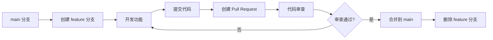

# 文档体系完善 - 共识文档

## 一、明确的需求描述

### 1.1 总体目标

全面完善 DingTalk-Live-Playback-Download-Tool 项目的文档体系，确保文档内容准确无误、结构清晰、语言专业且易于理解，符合行业最佳实践标准。

### 1.2 具体需求

#### 1.2.1 API 文档

**目标**：为所有公共接口提供详细的 API 文档

**范围**：
- 核心模块的公共类和方法
- 工具模块的公共函数
- 配置模块的常量和配置项

**内容要求**：
- 接口名称和功能描述
- 请求参数（参数名、类型、是否必填、默认值、说明）
- 返回值（类型、格式、说明）
- 异常（异常类型、触发条件、处理建议）
- 使用示例（代码示例）
- 注意事项

**文档结构**：
```
docs/api/
├── core/
│   ├── downloader.md
│   ├── cookie_handler.md
│   └── m3u8_parser.md
├── utils/
│   ├── file_reader.md
│   ├── validator.md
│   └── path_helper.md
├── binary/
│   ├── n_m3u8dl_re.md
│   └── ffmpeg_wrapper.md
├── browser/
│   ├── browser_factory.md
│   ├── edge_driver.md
│   ├── chrome_driver.md
│   └── firefox_driver.md
└── config/
    ├── settings.md
    └── constants.md
```

#### 1.2.2 开发者指南

**目标**：为开发者提供完整的开发流程和规范

**范围**：
- 开发环境搭建（完善现有内容）
- 编码规范（补充现有内容）
- 提交规范（补充现有内容）
- 分支管理策略（新增）
- 常见问题解决方案（新增）
- 代码审查流程（新增）

**内容要求**：
- 详细的步骤说明
- 命令示例
- 最佳实践
- 常见问题和解决方案
- 流程图和架构图

**文档结构**：
```
docs/development_guide.md（更新现有文档）
```

#### 1.2.3 README 文件

**目标**：为用户提供清晰的项目介绍和使用指南

**范围**：
- 项目概述（优化）
- 核心功能介绍（优化）
- 快速开始指南（优化）
- 环境要求（优化）
- 安装步骤（优化）
- 基本使用示例（优化）
- 贡献指南（优化）

**内容要求**：
- 清晰的项目描述
- 功能特性列表
- 快速上手步骤
- 详细的使用示例
- 截图和演示
- 贡献流程

**文档结构**：
```
README.md（更新现有文档）
```

## 二、技术实现方案

### 2.1 文档格式和工具

**文档格式**：
- 使用 Markdown 格式
- 支持 Mermaid 图表（流程图、架构图）
- 支持代码高亮（Python）

**文档工具**：
- 手动编写文档
- 使用 Mermaid 绘制图表
- 使用 VS Code 或其他 Markdown 编辑器

**文档托管**：
- 直接托管在 GitHub 上
- 通过 GitHub Pages 可选地提供在线文档

### 2.2 分支管理策略

**采用 GitHub Flow**：



**分支说明**：
- **main**：主分支，始终保持可部署状态
- **feature/xxx**：功能分支，从 main 分支创建，开发完成后合并回 main

**分支命名规范**：
- 功能分支：`feature/功能描述`
- 修复分支：`fix/问题描述`
- 文档分支：`docs/文档描述`

**工作流程**：
1. 从 main 分支创建 feature 分支
2. 在 feature 分支上开发功能
3. 提交代码到 feature 分支
4. 创建 Pull Request 到 main 分支
5. 进行代码审查
6. 审查通过后合并到 main 分支
7. 删除 feature 分支

### 2.3 代码审查流程

**审查清单**：
- [ ] 代码符合开发规范
- [ ] 代码已通过 Black 格式化检查
- [ ] 所有测试通过
- [ ] 添加了必要的注释和文档字符串
- [ ] 提交信息符合规范
- [ ] 没有引入新的技术债务
- [ ] 没有引入安全漏洞

**审查流程**：
1. 开发者创建 Pull Request
2. 至少一名维护者进行代码审查
3. 提出修改意见（如有）
4. 开发者根据意见修改代码
5. 审查通过后合并代码

### 2.4 文档编写规范

**Markdown 规范**：
- 使用一级标题（#）作为文档标题
- 使用二级标题（##）作为章节标题
- 使用三级标题（###）作为小节标题
- 使用四级标题（####）作为小节子标题
- 使用列表（- 或 1.）组织内容
- 使用代码块（```）展示代码示例
- 使用表格（|）展示结构化数据

**Mermaid 图表规范**：
- 使用流程图（graph）展示流程
- 使用时序图（sequenceDiagram）展示交互
- 使用类图（classDiagram）展示类结构
- 使用状态图（stateDiagram）展示状态转换

**代码示例规范**：
- 使用 Python 代码块
- 添加必要的注释
- 提供完整可运行的示例
- 标注示例的输入和输出

**语言规范**：
- 使用中文编写文档
- 技术术语保持英文
- 代码注释使用中文
- 变量名和函数名保持英文

### 2.5 文档目录结构

**最终文档结构**：
```
docs/
├── api/                          # API 文档（新增）
│   ├── core/
│   │   ├── downloader.md
│   │   ├── cookie_handler.md
│   │   └── m3u8_parser.md
│   ├── utils/
│   │   ├── file_reader.md
│   │   ├── validator.md
│   │   └── path_helper.md
│   ├── binary/
│   │   ├── n_m3u8dl_re.md
│   │   └── ffmpeg_wrapper.md
│   ├── browser/
│   │   ├── browser_factory.md
│   │   ├── edge_driver.md
│   │   ├── chrome_driver.md
│   │   └── firefox_driver.md
│   └── config/
│       ├── settings.md
│       └── constants.md
├── development_guide.md          # 开发者指南（更新）
├── development_standard.md       # 开发规范（保持不变）
├── project_status.md            # 项目状态（保持不变）
└── foundation/                   # 基础文档（保持不变）
    ├── N_m3u8DL-RE.md
    ├── ffmpeg.md
    └── 钉钉视频下载记录.md
```

## 三、技术约束和集成方案

### 3.1 技术约束

**文档格式约束**：
- 必须使用 Markdown 格式
- 必须支持 Mermaid 图表
- 必须支持代码高亮

**文档语言约束**：
- 必须使用中文编写
- 技术术语保持英文
- 代码注释使用中文

**文档结构约束**：
- 必须遵循统一的文档结构
- 必须包含必要的章节和内容
- 必须易于查找和维护

**文档质量约束**：
- 内容必须准确无误
- 结构必须清晰
- 语言必须专业且易于理解
- 必须符合行业最佳实践

### 3.2 集成方案

**与现有文档的集成**：
- 保留现有文档（development_guide.md、development_standard.md）
- 更新现有文档的内容
- 新增 API 文档目录
- 保持文档风格一致

**与代码的集成**：
- API 文档与代码保持同步
- 代码变更时更新文档
- 文档变更时验证代码

**与开发流程的集成**：
- 开发前阅读开发指南
- 开发时遵循编码规范
- 提交前检查文档更新
- 代码审查时检查文档

### 3.3 维护方案

**文档更新时机**：
- 代码变更时更新 API 文档
- 功能变更时更新 README
- 流程变更时更新开发指南
- 定期审查文档准确性

**文档审查机制**：
- 每季度进行一次文档审查
- 检查文档的准确性和完整性
- 更新过时的内容
- 补充缺失的内容

**文档版本控制**：
- 使用 Git 进行版本控制
- 每次文档变更提交记录
- 保留文档历史版本
- 支持文档回滚

## 四、任务边界限制

### 4.1 包含的内容

**API 文档**：
- 所有公共类和方法的文档
- 所有公共函数的文档
- 所有配置项的文档
- 使用示例和最佳实践

**开发者指南**：
- 开发环境搭建（完善）
- 编码规范（补充）
- 提交规范（补充）
- 分支管理策略（新增）
- 常见问题解决方案（新增）
- 代码审查流程（新增）

**README 文件**：
- 项目概述（优化）
- 核心功能介绍（优化）
- 快速开始指南（优化）
- 环境要求（优化）
- 安装步骤（优化）
- 基本使用示例（优化）
- 贡献指南（优化）

### 4.2 不包含的内容

**用户手册**：
- 详细的使用教程
- 视频教程
- 常见问题解答（用户视角）

**运维文档**：
- 部署文档
- 监控文档
- 故障排除文档（运维视角）

**商业文档**：
- 市场分析
- 竞品分析
- 商业计划

**内部流程文档**：
- 项目管理流程
- 团队协作流程
- 会议记录

### 4.3 任务优先级

**高优先级**：
1. API 文档（核心接口）
2. README 文件（项目概述、快速开始）
3. 开发者指南（环境搭建、分支管理）

**中优先级**：
1. API 文档（完整接口）
2. README 文件（使用示例）
3. 开发者指南（常见问题）

**低优先级**：
1. API 文档（高级用法）
2. README 文件（贡献指南）
3. 开发者指南（代码审查流程）

## 五、验收标准

### 5.1 API 文档验收标准

- [ ] 所有公共类都有详细的文档
- [ ] 所有公共方法都有详细的文档
- [ ] 所有公共函数都有详细的文档
- [ ] 所有配置项都有详细的文档
- [ ] 每个接口都包含功能描述、参数、返回值、异常、示例
- [ ] 文档结构清晰，易于查找
- [ ] 代码示例完整可运行
- [ ] 文档与代码保持同步

### 5.2 开发者指南验收标准

- [ ] 开发环境搭建步骤详细清晰
- [ ] 编码规范完整明确
- [ ] 提交规范详细说明
- [ ] 分支管理策略清晰易懂
- [ ] 常见问题解决方案完善
- [ ] 代码审查流程明确
- [ ] 包含流程图和架构图
- [ ] 命令示例完整准确

### 5.3 README 文件验收标准

- [ ] 项目概述清晰准确
- [ ] 核心功能介绍全面
- [ ] 快速开始指南简洁明了
- [ ] 环境要求明确
- [ ] 安装步骤详细
- [ ] 使用示例丰富
- [ ] 贡献指南完善
- [ ] 包含截图和演示

### 5.4 整体验收标准

- [ ] 所有文档内容准确无误
- [ ] 文档结构清晰
- [ ] 语言专业且易于理解
- [ ] 符合行业最佳实践
- [ ] 文档风格统一
- [ ] 文档易于维护
- [ ] 文档与代码保持同步

## 六、不确定性确认

### 6.1 已确认的问题

**问题 1**：API 文档的格式和工具？
- **确认**：使用 Markdown 格式手动编写

**问题 2**：分支管理策略？
- **确认**：使用 GitHub Flow

**问题 3**：README 文件的语言？
- **确认**：仅中文

**问题 4**：文档的详细程度？
- **确认**：适中（包含核心内容）

### 6.2 无需确认的问题

以下问题已基于现有项目内容和行业最佳实践进行决策：

1. 文档目录结构：基于现有文档结构进行扩展
2. 文档命名规范：遵循现有命名规范
3. 文档格式：统一使用 Markdown 格式
4. 代码示例：使用 Python 代码块
5. 图表和流程图：使用 Mermaid 语法

### 6.3 确认结论

所有不确定性已解决，可以进入下一阶段（架构设计）。
