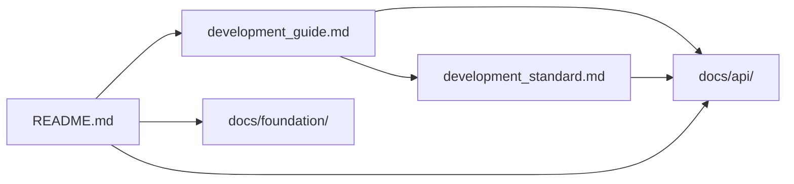
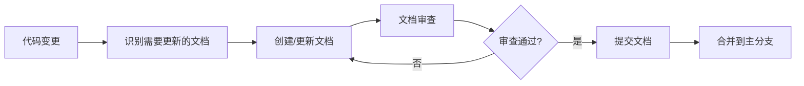
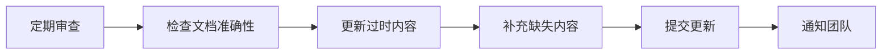
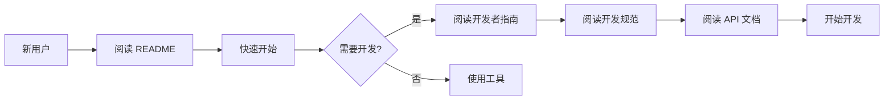

# 文档体系完善 - 设计文档

## 一、整体架构设计

### 1.1 文档体系架构图

```mermaid
graph TB
    A[文档体系] --> B[README.md]
    A --> C[开发者指南]
    A --> D[API 文档]
    A --> E[开发规范]
    A --> F[基础文档]

    B --> B1[项目概述]
    B --> B2[核心功能]
    B --> B3[快速开始]
    B --> B4[环境要求]
    B --> B5[安装步骤]
    B --> B6[使用示例]
    B --> B7[贡献指南]

    C --> C1[环境搭建]
    C --> C2[开发流程]
    C --> C3[代码质量工具]
    C --> C4[测试指南]
    C --> C5[分支管理]
    C --> C6[代码审查]
    C --> C7[常见问题]

    D --> D1[Core 模块]
    D --> D2[Utils 模块]
    D --> D3[Binary 模块]
    D --> D4[Browser 模块]
    D --> D5[Config 模块]

    E --> E1[命名规范]
    E --> E2[注释规范]
    E --> E3[项目结构规范]
    E --> E4[Git 提交规范]

    F --> F1[N_m3u8DL-RE]
    F --> F2[FFmpeg]
    F --> F3[钉钉视频下载记录]
```



### 1.2 文档分层设计

**第一层：用户文档**
- README.md：面向最终用户
- 内容：项目介绍、快速开始、使用示例

**第二层：开发者文档**
- development_guide.md：面向开发者
- 内容：环境搭建、开发流程、工具使用

**第三层：技术文档**
- development_standard.md：面向开发者
- 内容：编码规范、项目结构、提交规范

**第四层：API 文档**
- docs/api/：面向开发者
- 内容：接口说明、参数、返回值、示例

**第五层：基础文档**
- docs/foundation/：面向所有人员
- 内容：第三方工具说明、技术背景

### 1.3 核心组件

**文档生成组件**：
- Markdown 编辑器
- Mermaid 图表渲染器
- 代码高亮组件

**文档管理组件**：
- Git 版本控制
- 文档审查流程
- 文档更新机制

**文档发布组件**：
- GitHub 托管
- GitHub Pages（可选）
- 在线文档搜索（可选）

## 二、模块依赖关系图

### 2.1 文档依赖关系



**依赖说明**：
- README.md 引用 development_guide.md（开发相关内容）
- development_guide.md 引用 development_standard.md（规范相关内容）
- development_guide.md 引用 docs/api/（API 相关内容）
- development_standard.md 引用 docs/api/（API 相关内容）
- README.md 引用 docs/api/（API 相关内容）
- README.md 引用 docs/foundation/（第三方工具说明）

### 2.2 模块间依赖

**API 文档模块**：
- docs/api/core/：依赖 src/dingtalk_downloader/core/
- docs/api/utils/：依赖 src/dingtalk_downloader/utils/
- docs/api/binary/：依赖 src/dingtalk_downloader/binary/
- docs/api/browser/：依赖 src/dingtalk_downloader/browser/
- docs/api/config/：依赖 src/dingtalk_downloader/config/

**开发者指南模块**：
- 依赖 src/（源代码）
- 依赖 tests/（测试代码）
- 依赖 requirements.txt（依赖清单）
- 依赖 pyproject.toml（项目配置）

**README 模块**：
- 依赖 docs/api/（API 文档）
- 依赖 docs/development_guide.md（开发者指南）
- 依赖 docs/foundation/（基础文档）

## 三、接口契约定义

### 3.1 API 文档接口契约

**文档格式**：
```markdown
# 模块名称

## 概述
简要描述模块的功能和用途

## 类/函数列表
列出所有公共类或函数

## 详细说明

### 类名/函数名
**功能描述**：描述类或函数的功能

**参数**：
| 参数名 | 类型 | 必填 | 默认值 | 说明 |
|--------|------|------|--------|------|
| param1 | str | 是 | - | 参数说明 |
| param2 | int | 否 | 10 | 参数说明 |

**返回值**：
| 类型 | 说明 |
|------|------|
| bool | 返回值说明 |

**异常**：
| 异常类型 | 触发条件 | 处理建议 |
|----------|----------|----------|
| ValueError | 参数无效 | 检查参数格式 |

**示例**：
```python
# 示例代码
```

**注意事项**：
- 注意事项1
- 注意事项2
```

### 3.2 开发者指南接口契约

**文档格式**：
```markdown
# 章节标题

## 概述
简要描述章节内容

## 步骤
1. 步骤1
2. 步骤2
3. 步骤3

## 命令示例
```bash
# 命令示例
```

## 流程图
```mermaid
# 流程图
```

## 常见问题
### 问题1
**问题描述**：问题描述
**解决方案**：解决方案
```

### 3.3 README 接口契约

**文档格式**：
```markdown
# 项目名称

## 项目概述
项目描述

## 核心功能
- 功能1
- 功能2
- 功能3

## 快速开始
### 环境要求
- 要求1
- 要求2

### 安装步骤
1. 步骤1
2. 步骤2

### 使用示例
```bash
# 使用示例
```

## 截图和演示


## 贡献指南
贡献流程说明
```

## 四、数据流向图

### 4.1 文档创建流程



### 4.2 文档维护流程



### 4.3 文档使用流程



## 五、异常处理策略

### 5.1 文档异常处理

**文档不一致**：
- 检测：定期审查文档与代码的一致性
- 处理：更新文档以匹配代码
- 预防：代码变更时同步更新文档

**文档缺失**：
- 检测：代码审查时检查文档完整性
- 处理：补充缺失的文档
- 预防：建立文档清单，确保所有接口都有文档

**文档错误**：
- 检测：用户反馈、代码审查
- 处理：修正错误的文档内容
- 预防：文档审查流程

### 5.2 文档版本控制

**版本策略**：
- 使用 Git 进行版本控制
- 每次文档变更提交记录
- 保留文档历史版本
- 支持文档回滚

**版本标签**：
- 使用语义化版本（Semantic Versioning）
- 主版本号：不兼容的 API 变更
- 次版本号：向下兼容的功能性新增
- 修订号：向下兼容的问题修正

### 5.3 文档审查机制

**审查时机**：
- 新增文档时
- 更新文档时
- 定期审查（每季度）

**审查内容**：
- 文档准确性
- 文档完整性
- 文档清晰度
- 文档一致性

**审查流程**：
1. 提交 Pull Request
2. 至少一名维护者审查
3. 提出修改意见（如有）
4. 修改后重新审查
5. 审查通过后合并

## 六、设计原则

### 6.1 设计原则

**简洁性**：
- 文档内容简洁明了
- 避免冗余信息
- 突出重点内容

**一致性**：
- 文档风格统一
- 命名规范统一
- 格式规范统一

**可维护性**：
- 文档结构清晰
- 易于查找和更新
- 支持版本控制

**可读性**：
- 语言通俗易懂
- 结构层次分明
- 使用图表辅助说明

**完整性**：
- 覆盖所有公共接口
- 包含必要的使用示例
- 提供常见问题解答

### 6.2 与现有系统架构一致

**遵循现有规范**：
- 使用现有的文档格式
- 遵循现有的命名规范
- 保持与现有文档风格一致

**复用现有组件**：
- 复用现有的 Markdown 格式
- 复用现有的 Mermaid 图表
- 复用现有的代码示例

**避免过度设计**：
- 不引入复杂的文档生成工具
- 不引入复杂的文档管理系统
- 保持简单易用

### 6.3 质量保证

**文档质量检查**：
- 拼写和语法检查
- 格式检查
- 链接检查
- 代码示例检查

**文档测试**：
- 验证代码示例可以运行
- 验证命令示例可以执行
- 验证链接可以访问

**文档反馈**：
- 收集用户反馈
- 收集开发者反馈
- 持续改进文档质量

## 七、实施计划

### 7.1 实施步骤

**阶段 1：API 文档创建**
1. 创建 docs/api/ 目录结构
2. 为每个模块创建 API 文档
3. 编写接口说明、参数、返回值、异常、示例
4. 审查和完善文档

**阶段 2：开发者指南更新**
1. 完善开发环境搭建步骤
2. 补充编码规范和提交规范
3. 新增分支管理策略
4. 新增常见问题解决方案
5. 新增代码审查流程
6. 添加流程图和架构图

**阶段 3：README 文件优化**
1. 优化项目概述和核心功能介绍
2. 优化快速开始指南
3. 优化环境要求和安装步骤
4. 优化基本使用示例
5. 优化贡献指南
6. 添加截图和演示

**阶段 4：文档审查和发布**
1. 全面审查所有文档
2. 修正错误和不一致
3. 提交到主分支
4. 通知团队

### 7.2 时间估算

**API 文档创建**：3-4 天
- 创建目录结构：0.5 天
- 编写 Core 模块文档：1 天
- 编写 Utils 模块文档：0.5 天
- 编写 Binary 模块文档：0.5 天
- 编写 Browser 模块文档：0.5 天
- 编写 Config 模块文档：0.5 天
- 审查和完善：0.5 天

**开发者指南更新**：2-3 天
- 完善开发环境搭建：0.5 天
- 补充编码规范和提交规范：0.5 天
- 新增分支管理策略：0.5 天
- 新增常见问题解决方案：0.5 天
- 新增代码审查流程：0.5 天
- 添加流程图和架构图：0.5 天

**README 文件优化**：1-2 天
- 优化项目概述和核心功能：0.5 天
- 优化快速开始指南：0.5 天
- 优化环境要求和安装步骤：0.5 天
- 优化使用示例和贡献指南：0.5 天

**文档审查和发布**：1 天
- 全面审查所有文档：0.5 天
- 修正错误和不一致：0.5 天

**总计**：7-10 天

### 7.3 资源需求

**人力资源**：
- 文档编写者：1 人
- 代码审查者：1 人
- 测试者：1 人

**工具资源**：
- Markdown 编辑器：VS Code
- 图表工具：Mermaid
- 版本控制：Git
- 代码托管：GitHub

**时间资源**：
- 文档编写：7-10 天
- 文档审查：1-2 天
- 文档测试：1-2 天

## 八、风险评估

### 8.1 潜在风险

**风险 1：文档与代码不同步**
- 概率：高
- 影响：中
- 缓解措施：建立文档更新机制，代码变更时同步更新文档

**风险 2：文档质量不高**
- 概率：中
- 影响：高
- 缓解措施：建立文档审查机制，定期审查文档质量

**风险 3：文档维护成本高**
- 概率：中
- 影响：中
- 缓解措施：简化文档结构，使用自动化工具

**风险 4：文档使用率低**
- 概率：低
- 影响：低
- 缓解措施：提高文档质量，加强文档宣传

### 8.2 应对策略

**文档与代码不同步**：
- 建立 CI/CD 流程，代码变更时检查文档
- 定期审查文档与代码的一致性
- 建立文档更新提醒机制

**文档质量不高**：
- 建立文档审查流程
- 收集用户反馈，持续改进
- 参考行业最佳实践

**文档维护成本高**：
- 使用自动化工具生成部分文档
- 简化文档结构
- 建立文档模板

**文档使用率低**：
- 提高文档质量
- 加强文档宣传
- 提供文档搜索功能

## 九、成功标准

### 9.1 定量标准

- API 文档覆盖率：100%（所有公共接口都有文档）
- 文档准确性：95%以上（文档与代码一致）
- 文档完整性：90%以上（包含必要的内容）
- 文档可读性：85%以上（用户能够理解）

### 9.2 定性标准

- 文档结构清晰，易于查找
- 文档内容准确，与代码一致
- 文档语言专业，易于理解
- 文档风格统一，符合规范
- 文档易于维护，支持版本控制

### 9.3 用户满意度

- 新用户能够在 10 分钟内快速上手
- 开发者能够在 30 分钟内开始开发
- 文档问题能够在 24 小时内得到解决
- 用户满意度达到 80%以上
