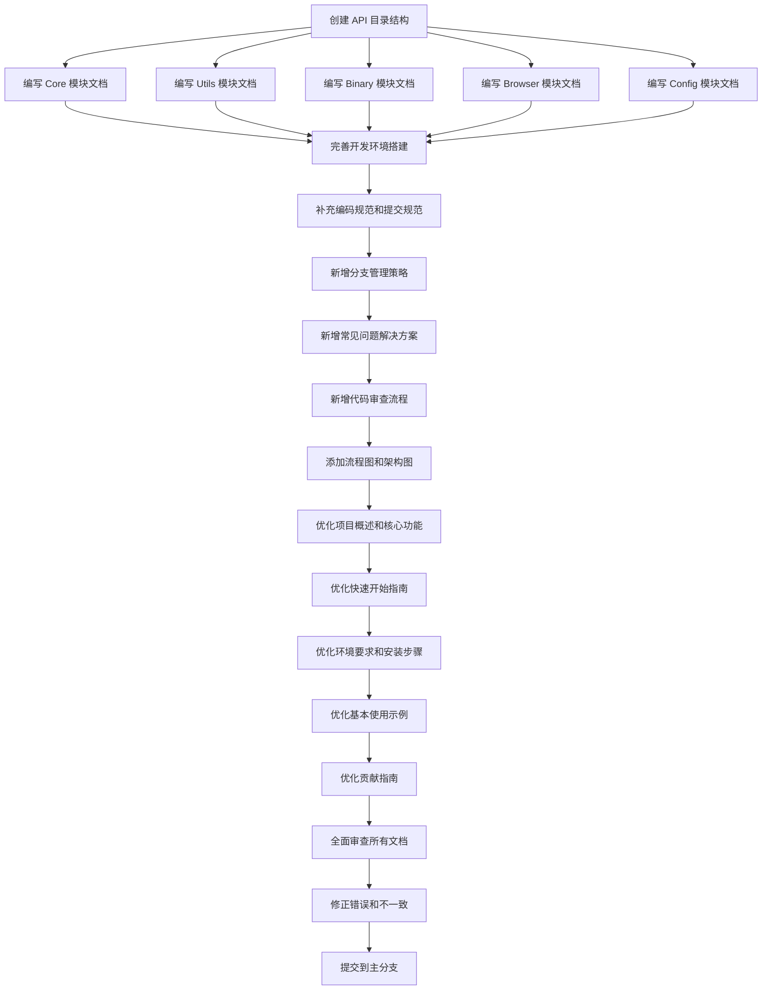

# 文档体系完善 - 任务文档

## 一、任务拆分

### 1.1 任务概述

根据 DESIGN 文档，将文档体系完善任务拆分为以下原子任务：

1. **API 文档创建任务**（6 个子任务）
2. **开发者指南更新任务**（6 个子任务）
3. **README 文件优化任务**（5 个子任务）
4. **文档审查和发布任务**（3 个子任务）

总计：20 个原子任务

### 1.2 任务依赖关系

## 二、原子任务详细说明

### 2.1 API 文档创建任务

#### 任务 1：创建 API 目录结构

**任务 ID**：API-001

**任务名称**：创建 API 目录结构

**任务描述**：创建 docs/api/ 目录结构，包括 core、utils、binary、browser、config 子目录

**输入契约**：
- 前置依赖：无
- 输入数据：无
- 环境依赖：docs/ 目录存在

**输出契约**：
- 输出数据：docs/api/ 目录结构
- 交付物：docs/api/ 目录及其子目录
- 验收标准：
  - docs/api/ 目录存在
  - docs/api/core/ 目录存在
  - docs/api/utils/ 目录存在
  - docs/api/binary/ 目录存在
  - docs/api/browser/ 目录存在
  - docs/api/config/ 目录存在

**实现约束**：
- 技术栈：无
- 接口规范：无
- 质量要求：目录结构清晰

**依赖关系**：
- 后置任务：API-002、API-003、API-004、API-005、API-006
- 并行任务：无

**预计时间**：0.5 小时

---

#### 任务 2：编写 Core 模块文档

**任务 ID**：API-002

**任务名称**：编写 Core 模块文档

**任务描述**：为 Core 模块的所有公共类和方法编写详细的 API 文档

**输入契约**：
- 前置依赖：API-001
- 输入数据：src/dingtalk_downloader/core/ 源代码
- 环境依赖：docs/api/core/ 目录存在

**输出契约**：
- 输出数据：Core 模块的 API 文档
- 交付物：
  - docs/api/core/downloader.md
  - docs/api/core/cookie_handler.md
  - docs/api/core/m3u8_parser.md
- 验收标准：
  - 所有公共类都有文档
  - 所有公共方法都有文档
  - 包含功能描述、参数、返回值、异常、示例
  - 代码示例完整可运行

**实现约束**：
- 技术栈：Markdown
- 接口规范：遵循 API 文档接口契约
- 质量要求：文档准确、清晰、完整

**依赖关系**：
- 后置任务：DEV-001
- 并行任务：API-003、API-004、API-005、API-006

**预计时间**：2 小时

---

#### 任务 3：编写 Utils 模块文档

**任务 ID**：API-003

**任务名称**：编写 Utils 模块文档

**任务描述**：为 Utils 模块的所有公共函数编写详细的 API 文档

**输入契约**：
- 前置依赖：API-001
- 输入数据：src/dingtalk_downloader/utils/ 源代码
- 环境依赖：docs/api/utils/ 目录存在

**输出契约**：
- 输出数据：Utils 模块的 API 文档
- 交付物：
  - docs/api/utils/file_reader.md
  - docs/api/utils/validator.md
  - docs/api/utils/path_helper.md
- 验收标准：
  - 所有公共函数都有文档
  - 包含功能描述、参数、返回值、异常、示例
  - 代码示例完整可运行

**实现约束**：
- 技术栈：Markdown
- 接口规范：遵循 API 文档接口契约
- 质量要求：文档准确、清晰、完整

**依赖关系**：
- 后置任务：DEV-001
- 并行任务：API-002、API-004、API-005、API-006

**预计时间**：1 小时

---

#### 任务 4：编写 Binary 模块文档

**任务 ID**：API-004

**任务名称**：编写 Binary 模块文档

**任务描述**：为 Binary 模块的所有公共类和方法编写详细的 API 文档

**输入契约**：
- 前置依赖：API-001
- 输入数据：src/dingtalk_downloader/binary/ 源代码
- 环境依赖：docs/api/binary/ 目录存在

**输出契约**：
- 输出数据：Binary 模块的 API 文档
- 交付物：
  - docs/api/binary/n_m3u8dl_re.md
  - docs/api/binary/ffmpeg_wrapper.md
- 验收标准：
  - 所有公共类都有文档
  - 所有公共方法都有文档
  - 包含功能描述、参数、返回值、异常、示例
  - 代码示例完整可运行

**实现约束**：
- 技术栈：Markdown
- 接口规范：遵循 API 文档接口契约
- 质量要求：文档准确、清晰、完整

**依赖关系**：
- 后置任务：DEV-001
- 并行任务：API-002、API-003、API-005、API-006

**预计时间**：1 小时

---

#### 任务 5：编写 Browser 模块文档

**任务 ID**：API-005

**任务名称**：编写 Browser 模块文档

**任务描述**：为 Browser 模块的所有公共类和方法编写详细的 API 文档

**输入契约**：
- 前置依赖：API-001
- 输入数据：src/dingtalk_downloader/browser/ 源代码
- 环境依赖：docs/api/browser/ 目录存在

**输出契约**：
- 输出数据：Browser 模块的 API 文档
- 交付物：
  - docs/api/browser/browser_factory.md
  - docs/api/browser/edge_driver.md
  - docs/api/browser/chrome_driver.md
  - docs/api/browser/firefox_driver.md
- 验收标准：
  - 所有公共类都有文档
  - 所有公共方法都有文档
  - 包含功能描述、参数、返回值、异常、示例
  - 代码示例完整可运行

**实现约束**：
- 技术栈：Markdown
- 接口规范：遵循 API 文档接口契约
- 质量要求：文档准确、清晰、完整

**依赖关系**：
- 后置任务：DEV-001
- 并行任务：API-002、API-003、API-004、API-006

**预计时间**：1 小时

---

#### 任务 6：编写 Config 模块文档

**任务 ID**：API-006

**任务名称**：编写 Config 模块文档

**任务描述**：为 Config 模块的所有常量和配置项编写详细的 API 文档

**输入契约**：
- 前置依赖：API-001
- 输入数据：src/dingtalk_downloader/config/ 源代码
- 环境依赖：docs/api/config/ 目录存在

**输出契约**：
- 输出数据：Config 模块的 API 文档
- 交付物：
  - docs/api/config/settings.md
  - docs/api/config/constants.md
- 验收标准：
  - 所有常量都有文档
  - 所有配置项都有文档
  - 包含功能描述、类型、默认值、说明

**实现约束**：
- 技术栈：Markdown
- 接口规范：遵循 API 文档接口契约
- 质量要求：文档准确、清晰、完整

**依赖关系**：
- 后置任务：DEV-001
- 并行任务：API-002、API-003、API-004、API-005

**预计时间**：1 小时

---

### 2.2 开发者指南更新任务

#### 任务 7：完善开发环境搭建

**任务 ID**：DEV-001

**任务名称**：完善开发环境搭建步骤

**任务描述**：完善 development_guide.md 中的开发环境搭建步骤，使其更加详细和清晰

**输入契约**：
- 前置依赖：API-002、API-003、API-004、API-005、API-006
- 输入数据：docs/development_guide.md、requirements.txt、pyproject.toml
- 环境依赖：docs/development_guide.md 存在

**输出契约**：
- 输出数据：更新后的开发环境搭建章节
- 交付物：docs/development_guide.md（更新）
- 验收标准：
  - 环境搭建步骤详细清晰
  - 包含所有必要的依赖安装
  - 包含命令示例
  - 包含常见问题解决方案

**实现约束**：
- 技术栈：Markdown
- 接口规范：遵循开发者指南接口契约
- 质量要求：步骤详细、易于理解

**依赖关系**：
- 后置任务：DEV-002
- 并行任务：无

**预计时间**：1 小时

---

#### 任务 8：补充编码规范和提交规范

**任务 ID**：DEV-002

**任务名称**：补充编码规范和提交规范

**任务描述**：在 development_guide.md 中补充编码规范和提交规范的详细说明

**输入契约**：
- 前置依赖：DEV-001
- 输入数据：docs/development_guide.md、docs/development_standard.md
- 环境依赖：docs/development_guide.md 存在

**输出契约**：
- 输出数据：更新后的编码规范和提交规范章节
- 交付物：docs/development_guide.md（更新）
- 验收标准：
  - 编码规范详细明确
  - 提交规范详细明确
  - 包含命令示例
  - 包含最佳实践

**实现约束**：
- 技术栈：Markdown
- 接口规范：遵循开发者指南接口契约
- 质量要求：规范清晰、易于理解

**依赖关系**：
- 后置任务：DEV-003
- 并行任务：无

**预计时间**：1 小时

---

#### 任务 9：新增分支管理策略

**任务 ID**：DEV-003

**任务名称**：新增分支管理策略

**任务描述**：在 development_guide.md 中新增分支管理策略章节，详细说明 GitHub Flow 工作流程

**输入契约**：
- 前置依赖：DEV-002
- 输入数据：docs/development_guide.md
- 环境依赖：docs/development_guide.md 存在

**输出契约**：
- 输出数据：新增的分支管理策略章节
- 交付物：docs/development_guide.md（更新）
- 验收标准：
  - 分支管理策略清晰易懂
  - 包含流程图
  - 包含分支命名规范
  - 包含工作流程说明

**实现约束**：
- 技术栈：Markdown、Mermaid
- 接口规范：遵循开发者指南接口契约
- 质量要求：策略清晰、易于理解

**依赖关系**：
- 后置任务：DEV-004
- 并行任务：无

**预计时间**：1 小时

---

#### 任务 10：新增常见问题解决方案

**任务 ID**：DEV-004

**任务名称**：新增常见问题解决方案

**任务描述**：在 development_guide.md 中新增常见问题解决方案章节，列出开发过程中的常见问题和解决方案

**输入契约**：
- 前置依赖：DEV-003
- 输入数据：docs/development_guide.md、项目历史问题记录
- 环境依赖：docs/development_guide.md 存在

**输出契约**：
- 输出数据：新增的常见问题解决方案章节
- 交付物：docs/development_guide.md（更新）
- 验收标准：
  - 常见问题列表完整
  - 解决方案详细有效
  - 包含命令示例
  - 易于查找和理解

**实现约束**：
- 技术栈：Markdown
- 接口规范：遵循开发者指南接口契约
- 质量要求：问题全面、方案有效

**依赖关系**：
- 后置任务：DEV-005
- 并行任务：无

**预计时间**：1 小时

---

#### 任务 11：新增代码审查流程

**任务 ID**：DEV-005

**任务名称**：新增代码审查流程

**任务描述**：在 development_guide.md 中新增代码审查流程章节，详细说明代码审查的流程和标准

**输入契约**：
- 前置依赖：DEV-004
- 输入数据：docs/development_guide.md
- 环境依赖：docs/development_guide.md 存在

**输出契约**：
- 输出数据：新增的代码审查流程章节
- 交付物：docs/development_guide.md（更新）
- 验收标准：
  - 代码审查流程清晰
  - 审查清单完整
  - 包含流程图
  - 易于理解和执行

**实现约束**：
- 技术栈：Markdown、Mermaid
- 接口规范：遵循开发者指南接口契约
- 质量要求：流程清晰、标准明确

**依赖关系**：
- 后置任务：DEV-006
- 并行任务：无

**预计时间**：1 小时

---

#### 任务 12：添加流程图和架构图

**任务 ID**：DEV-006

**任务名称**：添加流程图和架构图

**任务描述**：在 development_guide.md 中添加流程图和架构图，使文档更加直观易懂

**输入契约**：
- 前置依赖：DEV-005
- 输入数据：docs/development_guide.md、项目架构
- 环境依赖：docs/development_guide.md 存在

**输出契约**：
- 输出数据：添加的流程图和架构图
- 交付物：docs/development_guide.md（更新）
- 验收标准：
  - 流程图清晰准确
  - 架构图清晰准确
  - 使用 Mermaid 语法
  - 易于理解

**实现约束**：
- 技术栈：Markdown、Mermaid
- 接口规范：遵循开发者指南接口契约
- 质量要求：图表清晰、准确

**依赖关系**：
- 后置任务：README-001
- 并行任务：无

**预计时间**：1 小时

---

### 2.3 README 文件优化任务

#### 任务 13：优化项目概述和核心功能

**任务 ID**：README-001

**任务名称**：优化项目概述和核心功能介绍

**任务描述**：优化 README.md 中的项目概述和核心功能介绍，使其更加清晰和吸引人

**输入契约**：
- 前置依赖：DEV-006
- 输入数据：README.md、项目功能列表
- 环境依赖：README.md 存在

**输出契约**：
- 输出数据：优化后的项目概述和核心功能章节
- 交付物：README.md（更新）
- 验收标准：
  - 项目概述清晰准确
  - 核心功能介绍全面
  - 语言简洁易懂
  - 吸引用户兴趣

**实现约束**：
- 技术栈：Markdown
- 接口规范：遵循 README 接口契约
- 质量要求：内容清晰、吸引人

**依赖关系**：
- 后置任务：README-002
- 并行任务：无

**预计时间**：1 小时

---

#### 任务 14：优化快速开始指南

**任务 ID**：README-002

**任务名称**：优化快速开始指南

**任务描述**：优化 README.md 中的快速开始指南，使新用户能够快速上手

**输入契约**：
- 前置依赖：README-001
- 输入数据：README.md、安装和使用流程
- 环境依赖：README.md 存在

**输出契约**：
- 输出数据：优化后的快速开始指南章节
- 交付物：README.md（更新）
- 验收标准：
  - 快速开始指南简洁明了
  - 步骤清晰易懂
  - 包含命令示例
  - 新用户能够在 10 分钟内快速上手

**实现约束**：
- 技术栈：Markdown
- 接口规范：遵循 README 接口契约
- 质量要求：步骤清晰、易于理解

**依赖关系**：
- 后置任务：README-003
- 并行任务：无

**预计时间**：1 小时

---

#### 任务 15：优化环境要求和安装步骤

**任务 ID**：README-003

**任务名称**：优化环境要求和安装步骤

**任务描述**：优化 README.md 中的环境要求和安装步骤，使其更加详细和准确

**输入契约**：
- 前置依赖：README-002
- 输入数据：README.md、requirements.txt、pyproject.toml
- 环境依赖：README.md 存在

**输出契约**：
- 输出数据：优化后的环境要求和安装步骤章节
- 交付物：README.md（更新）
- 验收标准：
  - 环境要求明确
  - 安装步骤详细
  - 包含命令示例
  - 易于理解和执行

**实现约束**：
- 技术栈：Markdown
- 接口规范：遵循 README 接口契约
- 质量要求：要求明确、步骤详细

**依赖关系**：
- 后置任务：README-004
- 并行任务：无

**预计时间**：1 小时

---

#### 任务 16：优化基本使用示例

**任务 ID**：README-004

**任务名称**：优化基本使用示例

**任务描述**：优化 README.md 中的基本使用示例，使其更加丰富和实用

**输入契约**：
- 前置依赖：README-003
- 输入数据：README.md、使用场景
- 环境依赖：README.md 存在

**输出契约**：
- 输出数据：优化后的基本使用示例章节
- 交付物：README.md（更新）
- 验收标准：
  - 使用示例丰富
  - 包含单个下载示例
  - 包含批量下载示例
  - 包含命令示例和输出示例

**实现约束**：
- 技术栈：Markdown
- 接口规范：遵循 README 接口契约
- 质量要求：示例丰富、实用

**依赖关系**：
- 后置任务：README-005
- 并行任务：无

**预计时间**：1 小时

---

#### 任务 17：优化贡献指南

**任务 ID**：README-005

**任务名称**：优化贡献指南

**任务描述**：优化 README.md 中的贡献指南，使其更加详细和友好

**输入契约**：
- 前置依赖：README-004
- 输入数据：README.md、贡献流程
- 环境依赖：README.md 存在

**输出契约**：
- 输出数据：优化后的贡献指南章节
- 交付物：README.md（更新）
- 验收标准：
  - 贡献指南详细
  - 包含贡献流程
  - 包含代码规范
  - 包含 Pull Request 流程

**实现约束**：
- 技术栈：Markdown
- 接口规范：遵循 README 接口契约
- 质量要求：指南详细、友好

**依赖关系**：
- 后置任务：REVIEW-001
- 并行任务：无

**预计时间**：1 小时

---

### 2.4 文档审查和发布任务

#### 任务 18：全面审查所有文档

**任务 ID**：REVIEW-001

**任务名称**：全面审查所有文档

**任务描述**：全面审查所有文档，检查文档的准确性、完整性、清晰度和一致性

**输入契约**：
- 前置依赖：README-005
- 输入数据：所有文档文件
- 环境依赖：所有文档文件存在

**输出契约**：
- 输出数据：文档审查报告
- 交付物：docs/tasks/文档体系完善/DOCUMENTATION_REVIEW_REPORT.md
- 验收标准：
  - 审查所有文档
  - 列出所有问题
  - 提供修改建议
  - 报告清晰详细

**实现约束**：
- 技术栈：Markdown
- 接口规范：无
- 质量要求：审查全面、报告详细

**依赖关系**：
- 后置任务：REVIEW-002
- 并行任务：无

**预计时间**：2 小时

---

#### 任务 19：修正错误和不一致

**任务 ID**：REVIEW-002

**任务名称**：修正错误和不一致

**任务描述**：根据文档审查报告，修正所有文档中的错误和不一致

**输入契约**：
- 前置依赖：REVIEW-001
- 输入数据：文档审查报告、所有文档文件
- 环境依赖：所有文档文件存在

**输出契约**：
- 输出数据：修正后的所有文档
- 交付物：所有文档文件（更新）
- 验收标准：
  - 所有错误已修正
  - 所有不一致已修正
  - 文档准确一致
  - 代码示例可运行

**实现约束**：
- 技术栈：Markdown
- 接口规范：遵循各文档接口契约
- 质量要求：修正准确、无遗漏

**依赖关系**：
- 后置任务：REVIEW-003
- 并行任务：无

**预计时间**：2 小时

---

#### 任务 20：提交到主分支

**任务 ID**：REVIEW-003

**任务名称**：提交到主分支

**任务描述**：将所有文档提交到主分支，完成文档体系完善任务

**输入契约**：
- 前置依赖：REVIEW-002
- 输入数据：所有文档文件
- 环境依赖：Git 环境

**输出契约**：
- 输出数据：Git 提交记录
- 交付物：Git 提交
- 验收标准：
  - 所有文档已提交
  - 提交信息符合规范
  - 提交到主分支
  - 无未提交的更改

**实现约束**：
- 技术栈：Git
- 接口规范：遵循 Git 提交规范
- 质量要求：提交规范、无遗漏

**依赖关系**：
- 后置任务：无
- 并行任务：无

**预计时间**：0.5 小时

---

## 三、任务优先级

### 3.1 高优先级任务

- API-001：创建 API 目录结构
- API-002：编写 Core 模块文档
- README-001：优化项目概述和核心功能
- README-002：优化快速开始指南
- DEV-001：完善开发环境搭建
- DEV-003：新增分支管理策略

### 3.2 中优先级任务

- API-003：编写 Utils 模块文档
- API-004：编写 Binary 模块文档
- API-005：编写 Browser 模块文档
- API-006：编写 Config 模块文档
- README-003：优化环境要求和安装步骤
- README-004：优化基本使用示例
- DEV-002：补充编码规范和提交规范
- DEV-004：新增常见问题解决方案

### 3.3 低优先级任务

- DEV-005：新增代码审查流程
- DEV-006：添加流程图和架构图
- README-005：优化贡献指南
- REVIEW-001：全面审查所有文档
- REVIEW-002：修正错误和不一致
- REVIEW-003：提交到主分支

## 四、任务时间估算

### 4.1 总时间估算

**API 文档创建任务**：6.5 小时
- API-001：0.5 小时
- API-002：2 小时
- API-003：1 小时
- API-004：1 小时
- API-005：1 小时
- API-006：1 小时

**开发者指南更新任务**：6 小时
- DEV-001：1 小时
- DEV-002：1 小时
- DEV-003：1 小时
- DEV-004：1 小时
- DEV-005：1 小时
- DEV-006：1 小时

**README 文件优化任务**：5 小时
- README-001：1 小时
- README-002：1 小时
- README-003：1 小时
- README-004：1 小时
- README-005：1 小时

**文档审查和发布任务**：4.5 小时
- REVIEW-001：2 小时
- REVIEW-002：2 小时
- REVIEW-003：0.5 小时

**总计**：22 小时（约 3 个工作日）

### 4.2 并行执行时间估算

如果并行执行部分任务，可以缩短总时间：

**第一阶段**（API 文档创建）：6.5 小时
- API-001：0.5 小时
- API-002、API-003、API-004、API-005、API-006：并行执行，2 小时

**第二阶段**（开发者指南更新）：6 小时
- DEV-001：1 小时
- DEV-002：1 小时
- DEV-003：1 小时
- DEV-004：1 小时
- DEV-005：1 小时
- DEV-006：1 小时

**第三阶段**（README 文件优化）：5 小时
- README-001：1 小时
- README-002：1 小时
- README-003：1 小时
- README-004：1 小时
- README-005：1 小时

**第四阶段**（文档审查和发布）：4.5 小时
- REVIEW-001：2 小时
- REVIEW-002：2 小时
- REVIEW-003：0.5 小时

**总计**：22 小时（约 3 个工作日）

## 五、任务执行计划

### 5.1 执行顺序

按照任务依赖关系，按以下顺序执行：

1. **第一阶段**：API 文档创建（API-001 到 API-006）
2. **第二阶段**：开发者指南更新（DEV-001 到 DEV-006）
3. **第三阶段**：README 文件优化（README-001 到 README-005）
4. **第四阶段**：文档审查和发布（REVIEW-001 到 REVIEW-003）

### 5.2 并行执行策略

在第一阶段，API-002 到 API-006 可以并行执行，缩短第一阶段的时间。

在其他阶段，任务之间有依赖关系，需要按顺序执行。

### 5.3 风险控制

**风险 1**：文档编写时间超出预期
- 缓解措施：预留缓冲时间，优先完成高优先级任务

**风险 2**：文档审查发现问题较多
- 缓解措施：在编写过程中及时审查，减少后期修改

**风险 3**：代码变更导致文档需要更新
- 缓解措施：在文档编写期间暂停代码变更，或及时更新文档

## 六、验收标准

### 6.1 整体验收标准

- [ ] 所有原子任务已完成
- [ ] 所有文档已创建或更新
- [ ] 所有文档已通过审查
- [ ] 所有文档已提交到主分支
- [ ] 所有文档符合接口契约
- [ ] 所有文档符合质量要求

### 6.2 API 文档验收标准

- [ ] 所有公共类都有文档
- [ ] 所有公共方法都有文档
- [ ] 所有公共函数都有文档
- [ ] 所有配置项都有文档
- [ ] 每个接口都包含功能描述、参数、返回值、异常、示例
- [ ] 代码示例完整可运行
- [ ] 文档结构清晰，易于查找
- [ ] 文档与代码保持同步

### 6.3 开发者指南验收标准

- [ ] 开发环境搭建步骤详细清晰
- [ ] 编码规范完整明确
- [ ] 提交规范详细说明
- [ ] 分支管理策略清晰易懂
- [ ] 常见问题解决方案完善
- [ ] 代码审查流程明确
- [ ] 包含流程图和架构图
- [ ] 命令示例完整准确

### 6.4 README 文件验收标准

- [ ] 项目概述清晰准确
- [ ] 核心功能介绍全面
- [ ] 快速开始指南简洁明了
- [ ] 环境要求明确
- [ ] 安装步骤详细
- [ ] 使用示例丰富
- [ ] 贡献指南完善

### 6.5 文档审查验收标准

- [ ] 所有文档已审查
- [ ] 所有错误已修正
- [ ] 所有不一致已修正
- [ ] 文档准确一致
- [ ] 代码示例可运行
- [ ] 文档质量符合要求
