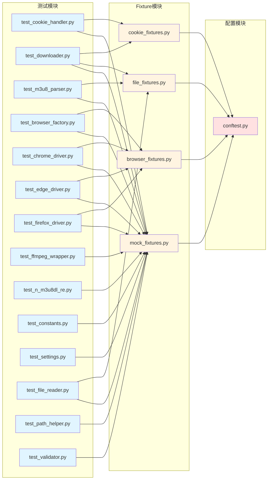
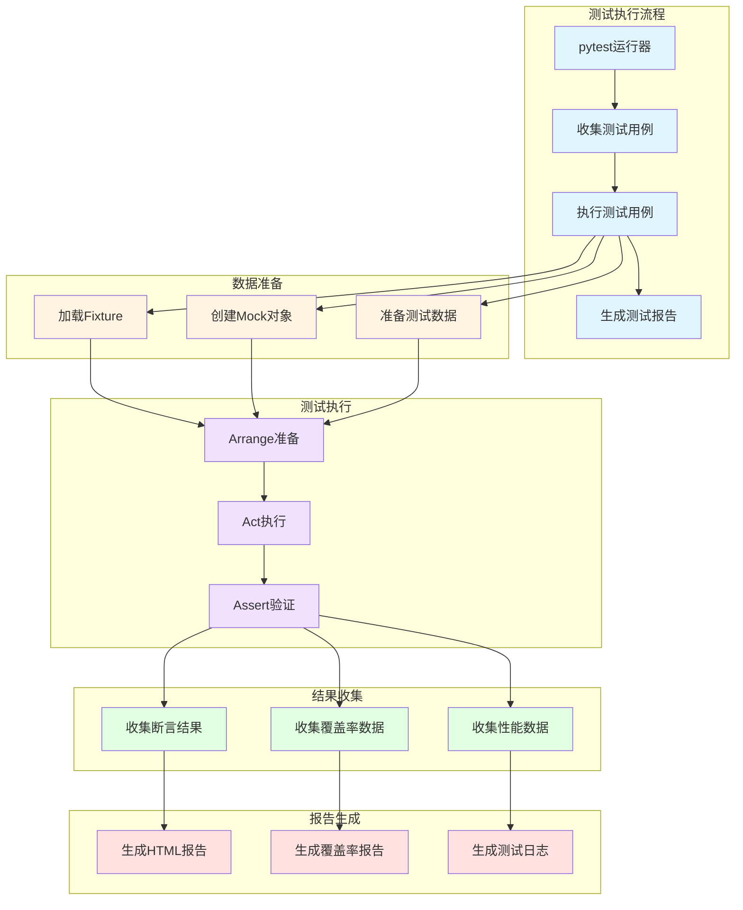

# 测试覆盖率提升 - 设计文档

## 系统分层设计

### 测试架构整体设计

```mermaid
graph TB
    subgraph "测试层"
        A[单元测试<br/>Unit Tests]
        B[集成测试<br/>Integration Tests]
        C[端到端测试<br/>E2E Tests]
    end

    subgraph "测试工具层"
        D[pytest<br/>测试框架]
        E[pytest-mock<br/>Mock工具]
        F[pytest-cov<br/>覆盖率工具]
        G[pytest-xdist<br/>并行测试]
    end

    subgraph "Mock层"
        H[浏览器Mock<br/>Browser Mock]
        I[二进制工具Mock<br/>Binary Tool Mock]
        J[文件系统Mock<br/>File System Mock]
        K[网络请求Mock<br/>Network Mock]
    end

    subgraph "测试数据层"
        L[测试Fixture<br/>Test Fixtures]
        M[测试数据工厂<br/>Test Data Factory]
        N[测试配置<br/>Test Config]
    end

    subgraph "被测系统层"
        O[核心业务层<br/>Core Layer]
        P[浏览器自动化层<br/>Browser Layer]
        Q[工具层<br/>Utils Layer]
        R[配置层<br/>Config Layer]
        S[二进制工具层<br/>Binary Layer]
    end

    A --> D
    B --> D
    C --> D

    A --> E
    B --> E
    C --> E

    A --> F
    B --> F

    A --> G

    A --> H
    A --> I
    A --> J
    A --> K

    B --> H
    B --> I
    B --> J
    B --> K

    A --> L
    B --> L

    A --> M
    B --> M

    A --> N
    B --> N

    A --> O
    A --> P
    A --> Q
    A --> R
    A --> S

    B --> O
    B --> P
    B --> Q
    B --> R
    B --> S

    style A fill:#e1f5ff
    style B fill:#e1f5ff
    style C fill:#e1f5ff
    style D fill:#fff4e1
    style E fill:#fff4e1
    style F fill:#fff4e1
    style G fill:#fff4e1
    style H fill:#f0e1ff
    style I fill:#f0e1ff
    style J fill:#f0e1ff
    style K fill:#f0e1ff
    style L fill:#e1ffe1
    style M fill:#e1ffe1
    style N fill:#e1ffe1
    style O fill:#ffe1e1
    style P fill:#ffe1e1
    style Q fill:#ffe1e1
    style R fill:#ffe1e1
    style S fill:#ffe1e1
```



## 核心组件设计

### 1. 测试框架配置

#### pytest 配置

```ini
[tool.pytest.ini_options]
testpaths = ["tests"]
python_files = ["test_*.py"]
python_classes = ["Test*"]
python_functions = ["test_*"]
addopts = "-v --cov=src --cov-report=html --cov-report=term-missing --cov-fail-under=80"
markers = [
    "unit: 单元测试",
    "integration: 集成测试",
    "slow: 慢速测试",
    "browser: 需要浏览器的测试",
]
```

#### 覆盖率配置

```ini
[tool.coverage.run]
source = ["src"]
omit = [
    "tests/*",
    "*/__init__.py",
]

[tool.coverage.report]
exclude_lines = [
    "pragma: no cover",
    "def __repr__",
    "raise AssertionError",
    "raise NotImplementedError",
    "if __name__ == .__main__.:",
    "if TYPE_CHECKING:",
]
```

### 2. 测试目录结构

```
tests/
├── unit/                           # 单元测试
│   ├── core/                       # 核心业务模块测试
│   │   ├── test_cookie_handler.py
│   │   ├── test_downloader.py
│   │   └── test_m3u8_parser.py
│   ├── browser/                    # 浏览器模块测试
│   │   ├── test_browser_factory.py
│   │   ├── test_chrome_driver.py
│   │   ├── test_edge_driver.py
│   │   └── test_firefox_driver.py
│   ├── binary/                     # 二进制工具模块测试
│   │   ├── test_ffmpeg_wrapper.py
│   │   └── test_n_m3u8dl_re.py
│   ├── config/                     # 配置模块测试
│   │   ├── test_constants.py
│   │   └── test_settings.py
│   └── utils/                      # 工具模块测试
│       ├── test_file_reader.py
│       ├── test_path_helper.py
│       └── test_validator.py
├── integration/                    # 集成测试
│   ├── test_download_flow.py
│   └── test_cookie_flow.py
├── fixtures/                       # 测试Fixture
│   ├── browser_fixtures.py
│   ├── cookie_fixtures.py
│   ├── file_fixtures.py
│   └── mock_fixtures.py
├── conftest.py                     # pytest配置文件
└── __init__.py
```

### 3. Mock 策略设计

#### 3.1 浏览器 Mock

```python
# Mock浏览器驱动
@pytest.fixture
def mock_edge_driver(mocker):
    """Mock Edge浏览器驱动"""
    mock_driver = mocker.MagicMock()
    mock_driver.get_cookies.return_value = [
        {'name': 'test_cookie', 'value': 'test_value'}
    ]
    return mock_driver

@pytest.fixture
def mock_browser_factory(mocker):
    """Mock浏览器工厂"""
    mock_factory = mocker.MagicMock()
    mock_factory.create_driver.return_value = mocker.MagicMock()
    return mock_factory
```

#### 3.2 二进制工具 Mock

```python
# Mock FFmpeg
@pytest.fixture
def mock_ffmpeg_wrapper(mocker):
    """Mock FFmpeg包装器"""
    mock_wrapper = mocker.MagicMock()
    mock_wrapper.merge_videos.return_value = True
    return mock_wrapper

# Mock N_m3u8DL-RE
@pytest.fixture
def mock_n_m3u8dl_re(mocker):
    """Mock N_m3u8DL-RE包装器"""
    mock_wrapper = mocker.MagicMock()
    mock_wrapper.download.return_value = True
    return mock_wrapper
```

#### 3.3 文件系统 Mock

```python
# Mock文件操作
@pytest.fixture
def mock_file_operations(mocker):
    """Mock文件操作"""
    mock_open = mocker.mock_open()
    mocker.patch('builtins.open', mock_open)
    return mock_open
```

#### 3.4 网络请求 Mock

```python
# Mock网络请求
@pytest.fixture
def mock_requests(mocker):
    """Mock requests库"""
    mock_response = mocker.MagicMock()
    mock_response.status_code = 200
    mock_response.text = "test response"
    mocker.patch('requests.get', return_value=mock_response)
    return mock_response
```

### 4. 测试数据设计

#### 4.1 测试 Fixture

```python
# conftest.py
@pytest.fixture
def sample_dingtalk_link():
    """示例钉钉链接"""
    return "https://n.dingtalk.com/live/1234567890"

@pytest.fixture
def sample_m3u8_content():
    """示例M3U8内容"""
    return """#EXTM3U
#EXT-X-VERSION:3
#EXT-X-TARGETDURATION:10
#EXTINF:10.0,
segment1.ts
#EXTINF:10.0,
segment2.ts
#EXT-X-ENDLIST
"""

@pytest.fixture
def sample_cookies():
    """示例Cookie"""
    return {
        'cookie1': 'value1',
        'cookie2': 'value2'
    }
```

#### 4.2 测试数据工厂

```python
# test_data_factory.py
class TestDataFactory:
    """测试数据工厂"""

    @staticmethod
    def create_dingtalk_link(link_id="1234567890"):
        """创建钉钉链接"""
        return f"https://n.dingtalk.com/live/{link_id}"

    @staticmethod
    def create_m3u8_content(segment_count=10):
        """创建M3U8内容"""
        content = "#EXTM3U\n#EXT-X-VERSION:3\n#EXT-X-TARGETDURATION:10\n"
        for i in range(segment_count):
            content += f"#EXTINF:10.0,\nsegment{i+1}.ts\n"
        content += "#EXT-X-ENDLIST\n"
        return content

    @staticmethod
    def create_cookies(cookie_count=5):
        """创建Cookie"""
        cookies = {}
        for i in range(cookie_count):
            cookies[f'cookie{i+1}'] = f'value{i+1}'
        return cookies
```

## 模块依赖关系图



## 接口契约定义

### 测试用例接口

#### 单元测试接口

```python
def test_<function_name>_<scenario>(
    mocker,  # pytest-mock fixture
    sample_data,  # 测试数据fixture
    mock_dependency  # Mock依赖
):
    """
    测试用例模板

    Args:
        mocker: pytest-mock fixture
        sample_data: 测试数据
        mock_dependency: Mock依赖

    Returns:
        None

    Raises:
        AssertionError: 断言失败
    """
    # Arrange - 准备测试数据
    # Act - 执行被测函数
    # Assert - 验证结果
```

#### 集成测试接口

```python
@pytest.mark.integration
def test_<feature_name>_flow(
    mocker,
    sample_data,
    mock_dependencies
):
    """
    集成测试模板

    Args:
        mocker: pytest-mock fixture
        sample_data: 测试数据
        mock_dependencies: Mock依赖列表

    Returns:
        None

    Raises:
        AssertionError: 断言失败
    """
    # Arrange - 准备测试环境和数据
    # Act - 执行完整流程
    # Assert - 验证最终结果
```

## 数据流向图



## 异常处理策略

### 1. 测试异常处理

#### 测试失败处理

```python
@pytest.fixture(autouse=True)
def handle_test_failure(request):
    """处理测试失败"""
    yield
    if request.node.rep_call.failed:
        # 记录失败信息
        print(f"测试失败: {request.node.name}")
        # 保存失败时的状态
        save_failure_state(request.node)
```

#### Mock 失败处理

```python
@pytest.fixture
def safe_mock(mocker):
    """安全的Mock对象"""
    def _safe_mock(target, **kwargs):
        try:
            return mocker.patch(target, **kwargs)
        except Exception as e:
            pytest.fail(f"Mock创建失败: {e}")
    return _safe_mock
```

### 2. 测试数据异常处理

#### 文件操作异常处理

```python
@pytest.fixture
def safe_temp_file():
    """安全的临时文件"""
    import tempfile
    import os

    fd, path = tempfile.mkstemp()
    try:
        yield path
    finally:
        try:
            os.close(fd)
            os.unlink(path)
        except:
            pass
```

#### 网络请求异常处理

```python
@pytest.fixture
def mock_network_error(mocker):
    """Mock网络错误"""
    def _mock_error(error_code=500, error_message="Network Error"):
        mock_response = mocker.MagicMock()
        mock_response.status_code = error_code
        mock_response.text = error_message
        mock_response.raise_for_status.side_effect = requests.HTTPError(error_message)
        return mock_response
    return _mock_error
```

## 设计原则

### 1. 测试隔离原则

- 每个测试用例独立运行
- 不依赖其他测试用例的执行顺序
- 使用 fixture 管理共享资源

### 2. Mock 最小化原则

- 只 Mock 外部依赖
- 不 Mock 被测系统的内部逻辑
- 优先使用真实对象

### 3. 测试可读性原则

- 使用清晰的测试名称
- 使用 Arrange-Act-Assert 模式
- 添加必要的注释

### 4. 测试可维护性原则

- 使用 fixture 管理测试数据
- 使用参数化测试减少重复代码
- 定期重构测试代码

### 5. 覆盖率优先原则

- 优先测试核心业务逻辑
- 优先测试低覆盖率模块
- 优先测试复杂算法

## 质量门控

### 1. 代码质量门控

- ✅ 测试代码符合 Black 格式化规范
- ✅ 测试代码符合 Flake8 检查规范
- ✅ 测试代码符合 Mypy 类型检查规范

### 2. 测试质量门控

- ✅ 所有测试用例通过
- ✅ 总体测试覆盖率达到 80%以上
- ✅ 每个模块的测试覆盖率达到 80%以上
- ✅ 关键业务逻辑覆盖率达到 90%以上

### 3. 测试稳定性门控

- ✅ 无随机失败情况
- ✅ 测试执行时间合理（<5 分钟）
- ✅ 测试隔离性良好

### 4. 文档质量门控

- ✅ 生成测试覆盖率报告（HTML 格式）
- ✅ 更新测试文档
- ✅ 记录未覆盖的代码部分
