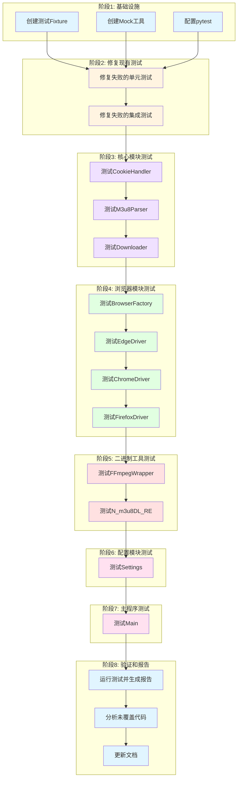

# 测试覆盖率提升 - 任务拆分文档

## 任务依赖图



## 原子任务列表

### 阶段 1: 基础设施

#### TASK-001: 创建测试 Fixture

**输入契约**：

- 前置依赖：pytest 已安装
- 输入数据：无
- 环境依赖：Python 3.8+

**输出契约**：

- 输出数据：tests/fixtures/conftest.py
- 交付物：测试 Fixture 文件
- 验收标准：
  - 创建 browser_fixtures.py
  - 创建 cookie_fixtures.py
  - 创建 file_fixtures.py
  - 创建 mock_fixtures.py
  - 所有 Fixture 可正常导入和使用

**实现约束**：

- 技术栈：pytest, pytest-mock
- 接口规范：遵循 pytest fixture 规范
- 质量要求：每个 Fixture 都有文档字符串

**依赖关系**：

- 后置任务：TASK-004
- 并行任务：TASK-002, TASK-003

**详细内容**：

```python
# tests/fixtures/browser_fixtures.py
@pytest.fixture
def mock_edge_driver(mocker):
    """Mock Edge浏览器驱动"""
    pass

@pytest.fixture
def mock_chrome_driver(mocker):
    """Mock Chrome浏览器驱动"""
    pass

@pytest.fixture
def mock_firefox_driver(mocker):
    """Mock Firefox浏览器驱动"""
    pass

# tests/fixtures/cookie_fixtures.py
@pytest.fixture
def sample_cookies():
    """示例Cookie"""
    pass

@pytest.fixture
def sample_headers():
    """示例请求头"""
    pass

# tests/fixtures/file_fixtures.py
@pytest.fixture
def sample_csv_file():
    """示例CSV文件"""
    pass

@pytest.fixture
def sample_excel_file():
    """示例Excel文件"""
    pass

# tests/fixtures/mock_fixtures.py
@pytest.fixture
def mock_requests(mocker):
    """Mock requests库"""
    pass

@pytest.fixture
def mock_subprocess(mocker):
    """Mock subprocess模块"""
    pass
```

---

#### TASK-002: 创建 Mock 工具

**输入契约**：

- 前置依赖：pytest-mock 已安装
- 输入数据：无
- 环境依赖：Python 3.8+

**输出契约**：

- 输出数据：tests/utils/mock_helpers.py
- 交付物：Mock 工具类
- 验收标准：
  - 创建 MockHelper 类
  - 提供常用的 Mock 方法
  - 所有 Mock 方法可正常使用

**实现约束**：

- 技术栈：pytest-mock
- 接口规范：提供统一的 Mock 接口
- 质量要求：每个方法都有文档字符串

**依赖关系**：

- 后置任务：TASK-004
- 并行任务：TASK-001, TASK-003

**详细内容**：

```python
# tests/utils/mock_helpers.py
class MockHelper:
    """Mock工具类"""

    @staticmethod
    def mock_browser_driver(mocker, browser_type="edge"):
        """Mock浏览器驱动"""
        pass

    @staticmethod
    def mock_network_request(mocker, status_code=200, response_data=None):
        """Mock网络请求"""
        pass

    @staticmethod
    def mock_subprocess_call(mocker, return_code=0, output=""):
        """Mock子进程调用"""
        pass
```

---

#### TASK-003: 配置 pytest

**输入契约**：

- 前置依赖：pytest 已安装
- 输入数据：pyproject.toml
- 环境依赖：Python 3.8+

**输出契约**：

- 输出数据：更新的 pyproject.toml
- 交付物：pytest 配置
- 验收标准：
  - 配置 pytest 测试路径
  - 配置覆盖率工具
  - 配置测试标记
  - 配置覆盖率阈值（80%）

**实现约束**：

- 技术栈：pytest, pytest-cov
- 接口规范：遵循 pytest 配置规范
- 质量要求：配置清晰易读

**依赖关系**：

- 后置任务：TASK-004
- 并行任务：TASK-001, TASK-002

**详细内容**：

```toml
[tool.pytest.ini_options]
testpaths = ["tests"]
python_files = ["test_*.py"]
python_classes = ["Test*"]
python_functions = ["test_*"]
addopts = "-v --cov=src --cov-report=html --cov-report=term-missing --cov-fail-under=80"
markers = [
    "unit: 单元测试",
    "integration: 集成测试",
    "slow: 慢速测试",
    "browser: 需要浏览器的测试",
]
```

---

### 阶段 2: 修复现有测试

#### TASK-004: 修复失败的单元测试

**输入契约**：

- 前置依赖：TASK-001, TASK-002, TASK-003
- 输入数据：现有测试文件
- 环境依赖：Python 3.8+, pytest

**输出契约**：

- 输出数据：修复后的测试文件
- 交付物：所有单元测试通过
- 验收标准：
  - 修复 test_cookie_handler.py 中的失败测试
  - 修复 test_downloader.py 中的失败测试
  - 修复 test_file_reader.py 中的失败测试
  - 所有单元测试通过

**实现约束**：

- 技术栈：pytest, pytest-mock
- 接口规范：遵循 AAA 模式
- 质量要求：测试代码清晰易读

**依赖关系**：

- 后置任务：TASK-005
- 并行任务：无

**详细内容**：

1. 修复 test_cookie_handler_get_cookie - Cookie 数量断言失败
2. 修复 test_cookie_handler_close - SystemExit 错误
3. 修复 test_downloader_close - Close 方法未被调用
4. 修复 test_file_reader_csv - SystemExit 错误

---

#### TASK-005: 修复失败的集成测试

**输入契约**：

- 前置依赖：TASK-004
- 输入数据：现有集成测试文件
- 环境依赖：Python 3.8+, pytest

**输出契约**：

- 输出数据：修复后的集成测试文件
- 交付物：所有集成测试通过
- 验收标准：
  - 修复 test_single_download_flow
  - 修复 test_batch_download_flow
  - 所有集成测试通过

**实现约束**：

- 技术栈：pytest, pytest-mock
- 接口规范：遵循 AAA 模式
- 质量要求：测试代码清晰易读

**依赖关系**：

- 后置任务：TASK-006
- 并行任务：无

**详细内容**：

1. 修复 test_single_download_flow - Cookie 获取未被调用
2. 修复 test_batch_download_flow - 缺少 FileReader 属性

---

### 阶段 3: 核心模块测试

#### TASK-006: 测试 CookieHandler

**输入契约**：

- 前置依赖：TASK-005
- 输入数据：src/dingtalk_downloader/core/cookie_handler.py
- 环境依赖：Python 3.8+, pytest, pytest-mock

**输出契约**：

- 输出数据：tests/unit/core/test_cookie_handler.py
- 交付物：完整的 CookieHandler 测试
- 验收标准：
  - 覆盖率达到 80%以上
  - 测试所有公共方法
  - 测试边界条件和异常处理
  - 所有测试通过

**实现约束**：

- 技术栈：pytest, pytest-mock
- 接口规范：遵循 AAA 模式
- 质量要求：测试代码清晰易读

**依赖关系**：

- 后置任务：TASK-007
- 并行任务：无

**详细内容**：

```python
# 测试方法列表
- test_cookie_handler_init
- test_cookie_handler_get_cookie_success
- test_cookie_handler_get_cookie_failure
- test_cookie_handler_get_cookie_retry
- test_cookie_handler_close
- test_cookie_handler_get_headers
- test_cookie_handler_get_live_name
```

---

#### TASK-007: 测试 M3u8Parser

**输入契约**：

- 前置依赖：TASK-006
- 输入数据：src/dingtalk_downloader/core/m3u8_parser.py
- 环境依赖：Python 3.8+, pytest, pytest-mock

**输出契约**：

- 输出数据：tests/unit/core/test_m3u8_parser.py
- 交付物：完整的 M3u8Parser 测试
- 验收标准：
  - 覆盖率达到 80%以上
  - 测试所有公共方法
  - 测试边界条件和异常处理
  - 所有测试通过

**实现约束**：

- 技术栈：pytest, pytest-mock
- 接口规范：遵循 AAA 模式
- 质量要求：测试代码清晰易读

**依赖关系**：

- 后置任务：TASK-008
- 并行任务：无

**详细内容**：

```python
# 测试方法列表
- test_m3u8_parser_init
- test_m3u8_parser_parse_success
- test_m3u8_parser_parse_failure
- test_m3u8_parser_parse_retry
- test_m3u8_parser_extract_base_url
- test_m3u8_parser_extract_m3u8_links
- test_m3u8_parser_validate_m3u8_link
```

---

#### TASK-008: 测试 Downloader

**输入契约**：

- 前置依赖：TASK-007
- 输入数据：src/dingtalk_downloader/core/downloader.py
- 环境依赖：Python 3.8+, pytest, pytest-mock

**输出契约**：

- 输出数据：tests/unit/core/test_downloader.py
- 交付物：完整的 Downloader 测试
- 验收标准：
  - 覆盖率达到 80%以上
  - 测试所有公共方法
  - 测试边界条件和异常处理
  - 所有测试通过

**实现约束**：

- 技术栈：pytest, pytest-mock
- 接口规范：遵循 AAA 模式
- 质量要求：测试代码清晰易读

**依赖关系**：

- 后置任务：TASK-009
- 并行任务：无

**详细内容**：

```python
# 测试方法列表
- test_downloader_init
- test_downloader_download_single_success
- test_downloader_download_single_failure
- test_downloader_download_batch_success
- test_downloader_download_batch_failure
- test_downloader_parse_link
- test_downloader_close
- test_downloader_handle_error
```

---

### 阶段 4: 浏览器模块测试

#### TASK-009: 测试 BrowserFactory

**输入契约**：

- 前置依赖：TASK-008
- 输入数据：src/dingtalk_downloader/browser/browser_factory.py
- 环境依赖：Python 3.8+, pytest, pytest-mock

**输出契约**：

- 输出数据：tests/unit/browser/test_browser_factory.py
- 交付物：完整的 BrowserFactory 测试
- 验收标准：
  - 覆盖率达到 80%以上
  - 测试所有公共方法
  - 测试边界条件和异常处理
  - 所有测试通过

**实现约束**：

- 技术栈：pytest, pytest-mock
- 接口规范：遵循 AAA 模式
- 质量要求：测试代码清晰易读

**依赖关系**：

- 后置任务：TASK-010
- 并行任务：无

**详细内容**：

```python
# 测试方法列表
- test_browser_factory_create_edge
- test_browser_factory_create_chrome
- test_browser_factory_create_firefox
- test_browser_factory_create_invalid
```

---

#### TASK-010: 测试 EdgeDriver

**输入契约**：

- 前置依赖：TASK-009
- 输入数据：src/dingtalk_downloader/browser/edge_driver.py
- 环境依赖：Python 3.8+, pytest, pytest-mock

**输出契约**：

- 输出数据：tests/unit/browser/test_edge_driver.py
- 交付物：完整的 EdgeDriver 测试
- 验收标准：
  - 覆盖率达到 80%以上
  - 测试所有公共方法
  - 测试边界条件和异常处理
  - 所有测试通过

**实现约束**：

- 技术栈：pytest, pytest-mock
- 接口规范：遵循 AAA 模式
- 质量要求：测试代码清晰易读

**依赖关系**：

- 后置任务：TASK-011
- 并行任务：无

**详细内容**：

```python
# 测试方法列表
- test_edge_driver_init
- test_edge_driver_start
- test_edge_driver_stop
- test_edge_driver_get_cookies
- test_edge_driver_get_network_logs
- test_edge_driver_navigate
- test_edge_driver_wait_for_element
```

---

#### TASK-011: 测试 ChromeDriver

**输入契约**：

- 前置依赖：TASK-010
- 输入数据：src/dingtalk_downloader/browser/chrome_driver.py
- 环境依赖：Python 3.8+, pytest, pytest-mock

**输出契约**：

- 输出数据：tests/unit/browser/test_chrome_driver.py
- 交付物：完整的 ChromeDriver 测试
- 验收标准：
  - 覆盖率达到 80%以上
  - 测试所有公共方法
  - 测试边界条件和异常处理
  - 所有测试通过

**实现约束**：

- 技术栈：pytest, pytest-mock
- 接口规范：遵循 AAA 模式
- 质量要求：测试代码清晰易读

**依赖关系**：

- 后置任务：TASK-012
- 并行任务：无

**详细内容**：

```python
# 测试方法列表
- test_chrome_driver_init
- test_chrome_driver_start
- test_chrome_driver_stop
- test_chrome_driver_get_cookies
- test_chrome_driver_get_network_logs
- test_chrome_driver_navigate
- test_chrome_driver_wait_for_element
```

---

#### TASK-012: 测试 FirefoxDriver

**输入契约**：

- 前置依赖：TASK-011
- 输入数据：src/dingtalk_downloader/browser/firefox_driver.py
- 环境依赖：Python 3.8+, pytest, pytest-mock

**输出契约**：

- 输出数据：tests/unit/browser/test_firefox_driver.py
- 交付物：完整的 FirefoxDriver 测试
- 验收标准：
  - 覆盖率达到 80%以上
  - 测试所有公共方法
  - 测试边界条件和异常处理
  - 所有测试通过

**实现约束**：

- 技术栈：pytest, pytest-mock
- 接口规范：遵循 AAA 模式
- 质量要求：测试代码清晰易读

**依赖关系**：

- 后置任务：TASK-013
- 并行任务：无

**详细内容**：

```python
# 测试方法列表
- test_firefox_driver_init
- test_firefox_driver_start
- test_firefox_driver_stop
- test_firefox_driver_get_cookies
- test_firefox_driver_get_network_logs
- test_firefox_driver_navigate
- test_firefox_driver_wait_for_element
```

---

### 阶段 5: 二进制工具测试

#### TASK-013: 测试 FFmpegWrapper

**输入契约**：

- 前置依赖：TASK-012
- 输入数据：src/dingtalk_downloader/binary/ffmpeg_wrapper.py
- 环境依赖：Python 3.8+, pytest, pytest-mock

**输出契约**：

- 输出数据：tests/unit/binary/test_ffmpeg_wrapper.py
- 交付物：完整的 FFmpegWrapper 测试
- 验收标准：
  - 覆盖率达到 80%以上
  - 测试所有公共方法
  - 测试边界条件和异常处理
  - 所有测试通过

**实现约束**：

- 技术栈：pytest, pytest-mock
- 接口规范：遵循 AAA 模式
- 质量要求：测试代码清晰易读

**依赖关系**：

- 后置任务：TASK-014
- 并行任务：无

**详细内容**：

```python
# 测试方法列表
- test_ffmpeg_wrapper_init
- test_ffmpeg_wrapper_merge_videos_success
- test_ffmpeg_wrapper_merge_videos_failure
- test_ffmpeg_wrapper_convert_video_success
- test_ffmpeg_wrapper_convert_video_failure
- test_ffmpeg_wrapper_check_ffmpeg_installed
- test_ffmpeg_wrapper_execute_command
```

---

#### TASK-014: 测试 N_m3u8DL_RE

**输入契约**：

- 前置依赖：TASK-013
- 输入数据：src/dingtalk_downloader/binary/n_m3u8dl_re.py
- 环境依赖：Python 3.8+, pytest, pytest-mock

**输出契约**：

- 输出数据：tests/unit/binary/test_n_m3u8dl_re.py
- 交付物：完整的 N_m3u8DL_RE 测试
- 验收标准：
  - 覆盖率达到 80%以上
  - 测试所有公共方法
  - 测试边界条件和异常处理
  - 所有测试通过

**实现约束**：

- 技术栈：pytest, pytest-mock
- 接口规范：遵循 AAA 模式
- 质量要求：测试代码清晰易读

**依赖关系**：

- 后置任务：TASK-015
- 并行任务：无

**详细内容**：

```python
# 测试方法列表
- test_n_m3u8dl_re_init
- test_n_m3u8dl_re_download_success
- test_n_m3u8dl_re_download_failure
- test_n_m3u8dl_re_parse_m3u8
- test_n_m3u8dl_re_select_quality
- test_n_m3u8dl_re_check_tool_installed
- test_n_m3u8dl_re_execute_command
```

---

### 阶段 6: 配置模块测试

#### TASK-015: 测试 Settings

**输入契约**：

- 前置依赖：TASK-014
- 输入数据：src/dingtalk_downloader/config/settings.py
- 环境依赖：Python 3.8+, pytest, pytest-mock

**输出契约**：

- 输出数据：tests/unit/config/test_settings.py
- 交付物：完整的 Settings 测试
- 验收标准：
  - 覆盖率达到 80%以上
  - 测试所有公共方法
  - 测试边界条件和异常处理
  - 所有测试通过

**实现约束**：

- 技术栈：pytest, pytest-mock
- 接口规范：遵循 AAA 模式
- 质量要求：测试代码清晰易读

**依赖关系**：

- 后置任务：TASK-016
- 并行任务：无

**详细内容**：

```python
# 测试方法列表
- test_settings_init
- test_settings_get_browser_type
- test_settings_set_browser_type
- test_settings_get_download_path
- test_settings_set_download_path
- test_settings_get_max_retries
- test_settings_set_max_retries
- test_settings_load_from_file
- test_settings_save_to_file
```

---

### 阶段 7: 主程序测试

#### TASK-016: 测试 Main

**输入契约**：

- 前置依赖：TASK-015
- 输入数据：src/dingtalk_downloader/main.py
- 环境依赖：Python 3.8+, pytest, pytest-mock

**输出契约**：

- 输出数据：tests/unit/test_main.py
- 交付物：完整的 Main 测试
- 验收标准：
  - 覆盖率达到 80%以上
  - 测试所有公共方法
  - 测试边界条件和异常处理
  - 所有测试通过

**实现约束**：

- 技术栈：pytest, pytest-mock
- 接口规范：遵循 AAA 模式
- 质量要求：测试代码清晰易读

**依赖关系**：

- 后置任务：TASK-017
- 并行任务：无

**详细内容**：

```python
# 测试方法列表
- test_main_single_download
- test_main_batch_download
- test_main_invalid_input
- test_main_keyboard_interrupt
- test_main_exception_handling
```

---

### 阶段 8: 验证和报告

#### TASK-017: 运行测试并生成报告

**输入契约**：

- 前置依赖：TASK-016
- 输入数据：所有测试文件
- 环境依赖：Python 3.8+, pytest, pytest-cov

**输出契约**：

- 输出数据：htmlcov/目录
- 交付物：测试覆盖率报告
- 验收标准：
  - 所有测试通过
  - 生成 HTML 覆盖率报告
  - 生成终端覆盖率报告
  - 总体覆盖率达到 80%以上

**实现约束**：

- 技术栈：pytest, pytest-cov
- 接口规范：遵循 pytest 命令规范
- 质量要求：报告清晰易读

**依赖关系**：

- 后置任务：TASK-018
- 并行任务：无

**详细内容**：

```bash
# 运行测试命令
python -m pytest --cov=src --cov-report=html --cov-report=term-missing -v
```

---

#### TASK-018: 分析未覆盖代码

**输入契约**：

- 前置依赖：TASK-017
- 输入数据：htmlcov/目录
- 环境依赖：Python 3.8+

**输出契约**：

- 输出数据：docs/tasks/测试覆盖率提升/COVERAGE_ANALYSIS.md
- 交付物：覆盖率分析报告
- 验收标准：
  - 分析所有未覆盖的代码
  - 说明未覆盖的原因
  - 提供改进建议

**实现约束**：

- 技术栈：Markdown
- 接口规范：遵循文档规范
- 质量要求：分析清晰准确

**依赖关系**：

- 后置任务：TASK-019
- 并行任务：无

**详细内容**：

```markdown
# 覆盖率分析报告

## 未覆盖代码分析

### 模块 1: xxx.py

- 未覆盖行数: XX
- 未覆盖原因: ...
- 改进建议: ...

### 模块 2: xxx.py

- 未覆盖行数: XX
- 未覆盖原因: ...
- 改进建议: ...
```

---

#### TASK-019: 更新文档

**输入契约**：

- 前置依赖：TASK-018
- 输入数据：所有测试文件和报告
- 环境依赖：Python 3.8+

**输出契约**：

- 输出数据：更新的文档文件
- 交付物：完整的测试文档
- 验收标准：
  - 更新 README.md
  - 更新开发指南
  - 更新 API 文档
  - 所有文档准确完整

**实现约束**：

- 技术栈：Markdown
- 接口规范：遵循文档规范
- 质量要求：文档清晰准确

**依赖关系**：

- 后置任务：无
- 并行任务：无

**详细内容**：

```markdown
# 更新文档列表

1. README.md - 添加测试说明
2. docs/development_guide.md - 添加测试指南
3. docs/api/ - 更新 API 文档
4. docs/tasks/测试覆盖率提升/FINAL\_测试覆盖率提升.md - 项目总结
```

---

## 任务优先级

### 高优先级（必须完成）

- TASK-001: 创建测试 Fixture
- TASK-002: 创建 Mock 工具
- TASK-003: 配置 pytest
- TASK-004: 修复失败的单元测试
- TASK-005: 修复失败的集成测试
- TASK-006: 测试 CookieHandler
- TASK-007: 测试 M3u8Parser
- TASK-008: 测试 Downloader

### 中优先级（应该完成）

- TASK-009: 测试 BrowserFactory
- TASK-010: 测试 EdgeDriver
- TASK-011: 测试 ChromeDriver
- TASK-012: 测试 FirefoxDriver
- TASK-013: 测试 FFmpegWrapper
- TASK-014: 测试 N_m3u8DL_RE
- TASK-015: 测试 Settings

### 低优先级（可以完成）

- TASK-016: 测试 Main
- TASK-017: 运行测试并生成报告
- TASK-018: 分析未覆盖代码
- TASK-019: 更新文档

## 预估时间

### 阶段 1: 基础设施

- TASK-001: 1 小时
- TASK-002: 1 小时
- TASK-003: 0.5 小时
- 小计: 2.5 小时

### 阶段 2: 修复现有测试

- TASK-004: 2 小时
- TASK-005: 1.5 小时
- 小计: 3.5 小时

### 阶段 3: 核心模块测试

- TASK-006: 3 小时
- TASK-007: 3 小时
- TASK-008: 4 小时
- 小计: 10 小时

### 阶段 4: 浏览器模块测试

- TASK-009: 1 小时
- TASK-010: 2 小时
- TASK-011: 2 小时
- TASK-012: 2 小时
- 小计: 7 小时

### 阶段 5: 二进制工具测试

- TASK-013: 2 小时
- TASK-014: 3 小时
- 小计: 5 小时

### 阶段 6: 配置模块测试

- TASK-015: 2 小时
- 小计: 2 小时

### 阶段 7: 主程序测试

- TASK-016: 2 小时
- 小计: 2 小时

### 阶段 8: 验证和报告

- TASK-017: 0.5 小时
- TASK-018: 1 小时
- TASK-019: 1 小时
- 小计: 2.5 小时

### 总计: 34.5 小时

## 风险评估

### 高风险任务

- TASK-008: 测试 Downloader（复杂度高）
- TASK-014: 测试 N_m3u8DL_RE（外部依赖多）

### 中风险任务

- TASK-006: 测试 CookieHandler（浏览器自动化）
- TASK-007: 测试 M3u8Parser（网络日志解析）

### 低风险任务

- TASK-009: 测试 BrowserFactory（逻辑简单）
- TASK-015: 测试 Settings（配置管理）
