# DESIGN_钉钉视频下载指南

## 整体架构设计

### 文档层次结构

```mermaid
graph TB
    A[钉钉视频下载指南] --> B[概述]
    A --> C[技术架构]
    A --> D[钉钉鉴权机制]
    A --> E[输入参数规范]
    A --> F[Cookie获取流程]
    A --> G[M3U8解析流程]
    A --> H[N_m3u8DL-RE配置]
    A --> I[FFmpeg合并方案]
    A --> J[错误处理方案]
    A --> K[常见问题排查]
    A --> L[完整示例]
    A --> M[附录]

    B --> B1[背景介绍]
    B --> B2[技术栈]
    B --> B3[适用场景]

    C --> C1[架构图]
    C --> C2[模块设计]
    C --> C3[数据流向]

    D --> D1[Cookie鉴权]
    D --> D2[auth_key鉴权]
    D --> D3[请求头验证]

    E --> E1[链接格式]
    E --> E2[参数说明]
    E --> E3[验证规则]

    F --> F1[流程图]
    F --> F2[代码实现]
    F --> F3[注意事项]

    G --> G1[流程图]
    G --> G2[代码实现]
    G --> G3[解析技巧]

    H --> H1[核心参数]
    H --> H2[配置示例]
    H --> H3[性能优化]

    I --> I1[合并命令]
    I --> I2[参数说明]
    I --> I3[进阶用法]

    J --> J1[错误分类]
    J --> J2[处理策略]
    J --> J3[重试机制]

    K --> K1[网络问题]
    K --> K2[鉴权问题]
    K --> K3[下载问题]
    K --> K4[合并问题]

    L --> L1[单个下载]
    L --> L2[批量下载]
    L --> L3[完整代码]

    M --> M1[参数参考]
    M --> M2[工具下载]
    M --> M3[版本信息]
```



## 分层设计

### 第1层: 概述 (Overview)

**目标**: 提供项目背景和技术栈介绍

**内容**:
1. 背景介绍
   - 钉钉直播回放下载的需求
   - 技术挑战和解决方案
   - 本指南的目标和范围

2. 技术栈
   - Python 3.8+
   - Selenium 4.x
   - N_m3u8DL-RE
   - FFmpeg
   - Edge/Chrome/Firefox

3. 适用场景
   - 开发者学习钉钉视频下载技术
   - 技术人员部署和维护下载工具
   - 研究人员了解钉钉鉴权机制

### 第2层: 技术架构 (Technical Architecture)

**目标**: 展示系统的整体架构和模块设计

**内容**:
1. 架构图
   - 使用Mermaid绘制整体架构图
   - 展示各模块之间的关系
   - 标注数据流向

2. 模块设计
   - 用户交互层
   - 浏览器自动化层
   - 鉴权处理层
   - 视频解析层
   - 下载处理层
   - 视频合并层

3. 数据流向
   - 从输入到输出的完整数据流
   - 各层之间的数据传递
   - 关键数据结构

### 第3层: 钉钉鉴权机制 (DingTalk Authentication)

**目标**: 详细解析钉钉平台的鉴权机制

**内容**:
1. Cookie鉴权
   - Cookie的作用和重要性
   - 主要Cookie字段说明
   - Cookie获取方法
   - Cookie有效期管理

2. auth_key鉴权
   - auth_key的格式和组成
   - auth_key的作用
   - auth_key的获取和使用
   - auth_key有效期

3. 请求头验证
   - User-Agent设置
   - Referer设置
   - Accept设置
   - 其他重要请求头

### 第4层: 输入参数规范 (Input Parameters)

**目标**: 说明钉钉直播回放链接的格式和验证规则

**内容**:
1. 链接格式
   - 标准格式: `https://n.dingtalk.com/dingding/live-room/index.html?roomId=xxx&liveUuid=xxx`
   - 参数说明: roomId、liveUuid
   - 其他可选参数

2. 参数说明
   - roomId: 直播间ID
   - liveUuid: 直播UUID
   - 参数获取方法

3. 验证规则
   - URL格式验证
   - 参数完整性验证
   - 参数有效性验证

### 第5层: Cookie获取流程 (Cookie Acquisition)

**目标**: 说明如何获取和管理钉钉登录Cookie

**内容**:
1. 流程图
   - 使用Mermaid绘制Cookie获取流程
   - 包含浏览器启动、登录、提取等步骤

2. 代码实现
   - Selenium浏览器初始化
   - 页面导航
   - 等待用户登录
   - Cookie提取
   - Cookie保存

3. 注意事项
   - 浏览器驱动版本管理
   - 登录超时处理
   - Cookie有效期管理
   - 多浏览器支持

### 第6层: M3U8解析流程 (M3U8 Parsing)

**目标**: 说明如何解析M3U8视频流地址

**内容**:
1. 流程图
   - 使用Mermaid绘制M3U8解析流程
   - 包含网络日志提取、链接过滤、文件下载等步骤

2. 代码实现
   - 浏览器网络日志获取
   - M3U8链接提取
   - M3U8文件下载
   - M3U8内容解析
   - 视频片段URL提取

3. 解析技巧
   - 正则表达式匹配
   - 主M3U8和子M3U8处理
   - 相对路径和绝对路径处理
   - 基础URL提取

### 第7层: N_m3u8DL-RE配置 (N_m3u8DL-RE Configuration)

**目标**: 详细说明N_m3u8DL-RE工具的配置参数

**内容**:
1. 核心参数
   - `--save-name`: 保存文件名
   - `--save-dir`: 保存目录
   - `--base-url`: 基础URL
   - `-H`: 请求头
   - `--thread-count`: 下载线程数
   - `--download-retry-count`: 重试次数

2. 配置示例
   - 基本配置
   - 高级配置
   - 性能优化配置

3. 性能优化
   - 线程数调整
   - 重试策略
   - 网络优化
   - 磁盘IO优化

### 第8层: FFmpeg合并方案 (FFmpeg Merging)

**目标**: 说明如何使用FFmpeg合并视频片段

**内容**:
1. 合并命令
   - 基本合并命令
   - 高级合并命令
   - 批量合并命令

2. 参数说明
   - `-i`: 输入文件
   - `-c copy`: 直接复制,不重新编码
   - 输出格式选项
   - 元信息设置

3. 进阶用法
   - 添加元信息
   - 视频质量调整
   - 格式转换
   - 批量处理

### 第9层: 错误处理方案 (Error Handling)

**目标**: 提供全面的错误处理方案

**内容**:
1. 错误分类
   - 网络错误
   - 鉴权错误
   - 下载错误
   - 合并错误
   - 系统错误

2. 处理策略
   - 错误检测
   - 错误日志记录
   - 错误恢复
   - 用户提示

3. 重试机制
   - 自动重试
   - 重试次数配置
   - 重试间隔
   - 重试失败处理

### 第10层: 常见问题排查 (Troubleshooting)

**目标**: 提供常见问题的诊断和解决方案

**内容**:
1. 网络问题
   - 连接超时
   - 下载速度慢
   - 网络不稳定
   - 代理设置

2. 鉴权问题
   - Cookie过期
   - auth_key无效
   - 登录失败
   - 权限不足

3. 下载问题
   - M3U8解析失败
   - 视频片段下载失败
   - 下载不完整
   - 下载速度慢

4. 合并问题
   - FFmpeg未安装
   - 合并失败
   - 视频无法播放
   - 视频质量问题

### 第11层: 完整示例 (Complete Examples)

**目标**: 提供完整的代码示例

**内容**:
1. 单个下载
   - 完整的代码实现
   - 详细的注释说明
   - 运行步骤

2. 批量下载
   - 完整的代码实现
   - Excel/CSV文件读取
   - 批量处理逻辑

3. 完整代码
   - 整合所有功能
   - 错误处理
   - 日志记录
   - 进度显示

### 第12层: 附录 (Appendix)

**目标**: 提供参考资料和工具下载

**内容**:
1. 参数参考
   - N_m3u8DL-RE完整参数列表
   - FFmpeg常用参数
   - Selenium WebDriver参数

2. 工具下载
   - N_m3u8DL-RE下载地址
   - FFmpeg下载地址
   - 浏览器驱动下载地址

3. 版本信息
   - 文档版本
   - 工具版本
   - 更新日志

## 核心组件设计

### 流程图设计原则

1. **清晰性**: 流程图应该清晰易懂,避免过于复杂
2. **完整性**: 流程图应该覆盖所有关键步骤
3. **准确性**: 流程图应该准确反映实际流程
4. **美观性**: 使用合适的颜色和布局

### 代码示例设计原则

1. **完整性**: 代码示例应该完整可运行
2. **可读性**: 代码应该有清晰的注释
3. **实用性**: 代码应该解决实际问题
4. **可维护性**: 代码应该易于理解和修改

### 表格设计原则

1. **清晰性**: 表格应该有清晰的表头和结构
2. **完整性**: 表格应该包含所有必要信息
3. **可读性**: 表格应该易于阅读和理解
4. **美观性**: 使用合适的格式和样式

## 接口契约定义

### 文档接口

1. **输入**: 钉钉直播回放链接
2. **输出**: 完整的视频文件
3. **依赖**: N_m3u8DL-RE、FFmpeg、浏览器驱动

### 代码接口

1. **Cookie获取接口**:
   ```python
   def get_cookie(url: str) -> Tuple[Dict, Dict, str]:
       pass
   ```

2. **M3U8解析接口**:
   ```python
   def parse_m3u8(url: str, headers: Dict) -> List[str]:
       pass
   ```

3. **视频下载接口**:
   ```python
   def download_video(m3u8_file: str, output_dir: str, config: Dict) -> bool:
       pass
   ```

4. **视频合并接口**:
   ```python
   def merge_video(input_files: List[str], output_file: str) -> bool:
       pass
   ```

## 数据流向图


## 异常处理策略

### 异常分类

1. **用户输入异常**: 链接格式错误、参数缺失
2. **网络异常**: 连接超时、下载失败
3. **鉴权异常**: Cookie过期、auth_key无效
4. **系统异常**: 工具未安装、权限不足

### 处理策略

1. **用户输入异常**: 提示用户重新输入
2. **网络异常**: 自动重试,提示用户检查网络
3. **鉴权异常**: 提示用户重新登录
4. **系统异常**: 提示用户安装必要工具

## 质量门控

### 文档完整性检查

- ✅ 包含所有12个主要章节
- ✅ 每个章节包含完整的内容
- ✅ 包含必要的流程图
- ✅ 包含实用的代码示例
- ✅ 包含详细的参数说明

### 文档准确性检查

- ✅ 所有技术细节准确无误
- ✅ 所有代码示例可以运行
- ✅ 所有流程图准确反映实际流程
- ✅ 所有参数说明准确

### 文档可读性检查

- ✅ 结构清晰,层次分明
- ✅ 语言简洁,易于理解
- ✅ 示例代码有清晰注释
- ✅ 流程图美观易懂

## 设计原则

1. **用户中心**: 以用户需求为中心,提供实用的信息
2. **技术准确**: 确保所有技术细节准确无误
3. **易于理解**: 使用清晰的语言和示例
4. **完整全面**: 覆盖所有必要的技术细节
5. **实用导向**: 提供可操作的代码示例和命令

## 下一步行动

设计文档已完成,可以进入编写阶段,开始创建"钉钉视频下载指南.md"文档。
