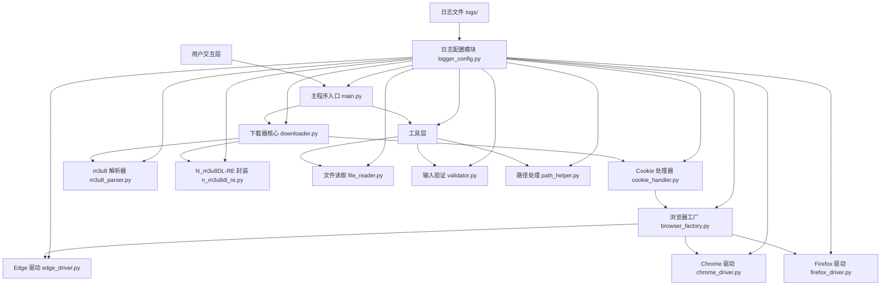
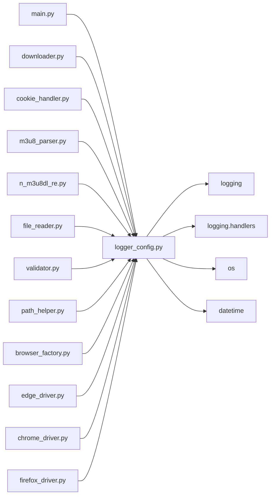
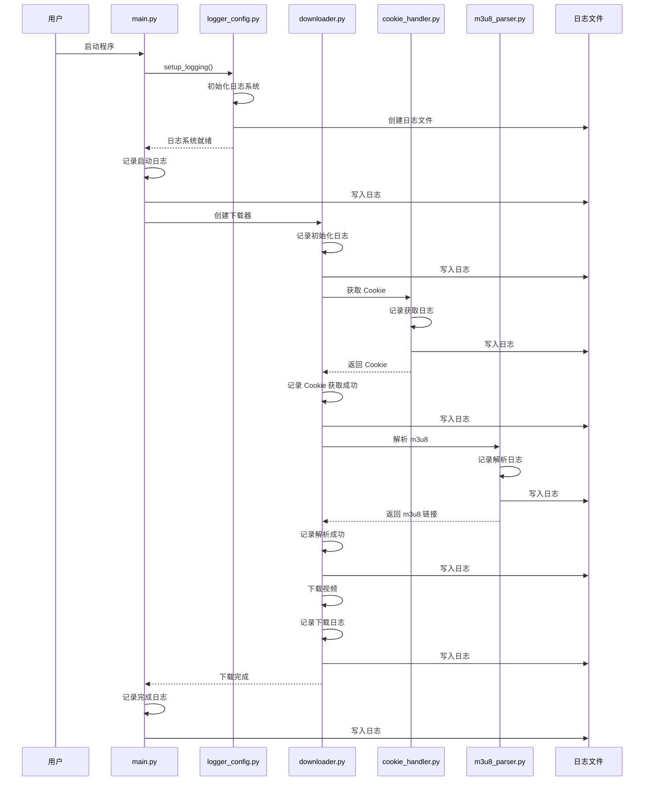

# 日志系统集成 - 设计文档

## 整体架构图



## 分层设计

### 1. 日志配置层
**模块**: `config/logger_config.py`

**职责**:
- 初始化日志系统
- 配置日志格式和输出
- 管理日志文件
- 清理过期日志

**核心组件**:
- `setup_logging()`: 初始化日志系统
- `get_logger()`: 获取 logger 实例
- `clean_old_logs()`: 清理过期日志

### 2. 应用层
**模块**: `main.py`, `downloader.py`, `cookie_handler.py`, `m3u8_parser.py`, `n_m3u8dl_re.py`

**职责**:
- 核心业务逻辑
- 使用日志记录关键节点

**日志使用**:
- 导入 logger: `logger = logging.getLogger(__name__)`
- 记录日志: `logger.info()`, `logger.error()`, 等

### 3. 工具层
**模块**: `file_reader.py`, `validator.py`, `path_helper.py`

**职责**:
- 提供工具函数
- 使用日志记录操作状态

### 4. 浏览器驱动层
**模块**: `browser_factory.py`, `edge_driver.py`, `chrome_driver.py`, `firefox_driver.py`

**职责**:
- 浏览器自动化
- 使用日志记录浏览器操作

## 核心组件

### 1. 日志配置模块 (logger_config.py)

```python
class LoggerConfig:
    """日志配置类"""

    @staticmethod
    def setup_logging(log_level: str = None) -> None:
        """
        初始化日志系统

        Args:
            log_level: 日志级别，默认从环境变量 LOG_LEVEL 读取
        """

    @staticmethod
    def get_logger(name: str) -> logging.Logger:
        """
        获取 logger 实例

        Args:
            name: logger 名称，通常使用 __name__

        Returns:
            logger 实例
        """

    @staticmethod
    def clean_old_logs(days: int = 30) -> None:
        """
        清理过期日志文件

        Args:
            days: 保留天数，默认 30 天
        """
```

### 2. 日志格式化器

```python
class CustomFormatter(logging.Formatter):
    """自定义日志格式化器"""

    def format(self, record: logging.LogRecord) -> str:
        """
        格式化日志记录

        Args:
            record: 日志记录

        Returns:
            格式化后的日志字符串
        """
```

### 3. 日志文件处理器

```python
class RotatingFileHandlerWithCleanup(logging.handlers.RotatingFileHandler):
    """带清理功能的文件处理器"""

    def __init__(self, filename: str, max_bytes: int = 10*1024*1024, backup_count: int = 5):
        """
        初始化文件处理器

        Args:
            filename: 日志文件名
            max_bytes: 单个文件最大字节数，默认 10MB
            backup_count: 备份文件数量，默认 5
        """
```

## 模块依赖关系图



## 接口契约定义

### 1. setup_logging()

**输入契约**:
- 前置依赖: 无
- 输入数据: `log_level: str = None`
- 环境依赖: 环境变量 `LOG_LEVEL`（可选）

**输出契约**:
- 输出数据: 无
- 交付物: 初始化后的日志系统
- 验收标准: 日志系统正常工作，日志文件正常生成

### 2. get_logger()

**输入契约**:
- 前置依赖: 日志系统已初始化
- 输入数据: `name: str`
- 环境依赖: 无

**输出契约**:
- 输出数据: `logging.Logger` 实例
- 交付物: logger 实例
- 验收标准: 返回的 logger 可以正常记录日志

### 3. clean_old_logs()

**输入契约**:
- 前置依赖: 日志目录存在
- 输入数据: `days: int = 30`
- 环境依赖: 日志目录路径

**输出契约**:
- 输出数据: 无
- 交付物: 清理后的日志目录
- 验收标准: 过期日志文件已删除

## 数据流向图



## 异常处理策略

### 1. 日志系统初始化异常
**异常类型**: `Exception`
**处理策略**:
- 记录错误日志
- 使用默认日志配置（仅输出到控制台）
- 继续执行程序

### 2. 日志文件写入异常
**异常类型**: `IOError`, `PermissionError`
**处理策略**:
- 记录错误日志
- 尝试写入到临时目录
- 如果失败，仅输出到控制台

### 3. 日志文件清理异常
**异常类型**: `Exception`
**处理策略**:
- 记录警告日志
- 跳过清理操作
- 继续执行程序

### 4. 日志级别配置异常
**异常类型**: `ValueError`
**处理策略**:
- 记录警告日志
- 使用默认日志级别（INFO）
- 继续执行程序

## 设计原则

### 1. 严格遵循任务范围
- 只添加日志记录，不修改核心业务逻辑
- 不重构代码结构
- 不添加新功能

### 2. 确保与现有系统架构一致
- 使用 Python 标准库 `logging`
- 不引入新的第三方依赖
- 保持现有代码风格

### 3. 复用现有组件和模式
- 复用现有的工具函数
- 复用现有的配置管理方式
- 复用现有的异常处理模式

## 质量门控

### 1. 架构图清晰准确
- ✅ 整体架构图清晰
- ✅ 分层设计合理
- ✅ 模块依赖关系明确

### 2. 接口定义完整
- ✅ 输入契约完整
- ✅ 输出契约完整
- ✅ 验收标准明确

### 3. 与现有系统无冲突
- ✅ 不影响现有功能
- ✅ 保持 API 兼容
- ✅ 不引入新依赖

### 4. 设计可行性验证
- ✅ 使用标准库，可行性高
- ✅ 日志系统成熟稳定
- ✅ 易于维护和扩展
