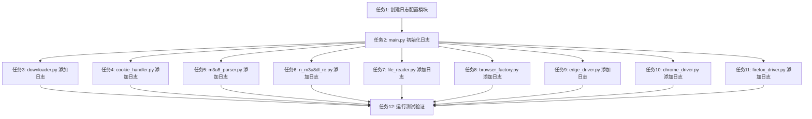

# 日志系统集成 - 任务分解文档

## 任务依赖图

## 原子任务列表

### 任务1: 创建日志配置模块

**任务描述**: 创建 `config/logger_config.py` 模块，实现日志系统的初始化、配置和管理功能。

**输入契约**:
- 前置依赖: 无
- 输入数据: 无
- 环境依赖: 环境变量 `LOG_LEVEL`（可选）

**输出契约**:
- 输出数据: `config/logger_config.py` 文件
- 交付物: 日志配置模块
- 验收标准:
  - 模块创建成功
  - `setup_logging()` 函数正常工作
  - `get_logger()` 函数正常工作
  - `clean_old_logs()` 函数正常工作
  - 日志文件正常生成到 `logs` 目录
  - 日志格式符合规范

**实现约束**:
- 技术栈: Python 标准库 `logging`
- 接口规范: 符合设计文档中的接口定义
- 质量要求: 代码符合项目规范，添加中文注释

**依赖关系**:
- 后置任务: 任务2、任务3、任务4、任务5、任务6、任务7、任务8、任务9、任务10、任务11
- 并行任务: 无

---

### 任务2: main.py 初始化日志系统

**任务描述**: 在 `main.py` 中初始化日志系统，并在程序入口和出口、条件分支关键节点添加日志记录。

**输入契约**:
- 前置依赖: 任务1完成
- 输入数据: 无
- 环境依赖: 日志配置模块已创建

**输出契约**:
- 输出数据: 修改后的 `main.py` 文件
- 交付物: 带有日志记录的主程序入口
- 验收标准:
  - 程序启动时记录日志
  - 程序退出时记录日志
  - 下载模式选择时记录日志
  - 保存模式选择时记录日志
  - 浏览器类型选择时记录日志
  - 异常捕获时记录错误日志
  - 所有日志格式统一

**实现约束**:
- 技术栈: Python 标准库 `logging`
- 接口规范: 使用 `logging.getLogger(__name__)` 获取 logger
- 质量要求: 代码符合项目规范，添加中文注释

**依赖关系**:
- 后置任务: 任务3、任务4、任务5、任务6、任务7、任务8、任务9、任务10、任务11
- 并行任务: 无

---

### 任务3: downloader.py 添加日志记录

**任务描述**: 在 `downloader.py` 中添加日志记录，包括核心函数调用与返回、条件分支关键节点、循环执行状态、异常捕获与处理位置、资源分配与释放操作。

**输入契约**:
- 前置依赖: 任务1、任务2完成
- 输入数据: 无
- 环境依赖: 日志系统已初始化

**输出契约**:
- 输出数据: 修改后的 `downloader.py` 文件
- 交付物: 带有日志记录的下载器核心模块
- 验收标准:
  - `__init__()` 记录初始化参数
  - `download_single_video()` 记录调用和返回
  - `download_batch_videos()` 记录调用和返回
  - `_download_video()` 记录调用和返回
  - `close()` 记录资源释放
  - m3u8 链接获取成功/失败时记录日志
  - 保存模式判断时记录日志
  - 用户取消下载时记录日志
  - 循环执行状态记录日志
  - 异常捕获时记录错误日志
  - 所有日志格式统一

**实现约束**:
- 技术栈: Python 标准库 `logging`
- 接口规范: 使用 `logging.getLogger(__name__)` 获取 logger
- 质量要求: 代码符合项目规范，添加中文注释

**依赖关系**:
- 后置任务: 任务12
- 并行任务: 任务4、任务5、任务6、任务7、任务8、任务9、任务10、任务11

---

### 任务4: cookie_handler.py 添加日志记录

**任务描述**: 在 `cookie_handler.py` 中添加日志记录，包括核心函数调用与返回、条件分支关键节点、数据转换/处理前后、异常捕获与处理位置、资源分配与释放操作。

**输入契约**:
- 前置依赖: 任务1、任务2完成
- 输入数据: 无
- 环境依赖: 日志系统已初始化

**输出契约**:
- 输出数据: 修改后的 `cookie_handler.py` 文件
- 交付物: 带有日志记录的 Cookie 处理模块
- 验收标准:
  - `__init__()` 记录初始化参数
  - `get_cookie()` 记录调用和返回
  - `repeat_get_cookie()` 记录调用和返回
  - `_get_live_name()` 记录调用和返回
  - `close()` 记录资源释放
  - Cookie 列表转换为字典时记录日志
  - 请求头构建时记录日志
  - 直播名称获取成功/失败时记录日志
  - 异常捕获时记录错误日志
  - Cookie 值已过滤（只记录名称和数量）
  - 所有日志格式统一

**实现约束**:
- 技术栈: Python 标准库 `logging`
- 接口规范: 使用 `logging.getLogger(__name__)` 获取 logger
- 质量要求: 代码符合项目规范，添加中文注释

**依赖关系**:
- 后置任务: 任务12
- 并行任务: 任务3、任务5、任务6、任务7、任务8、任务9、任务10、任务11

---

### 任务5: m3u8_parser.py 添加日志记录

**任务描述**: 在 `m3u8_parser.py` 中添加日志记录，包括核心函数调用与返回、条件分支关键节点、循环执行状态、数据转换/处理前后、异常捕获与处理位置。

**输入契约**:
- 前置依赖: 任务1、任务2完成
- 输入数据: 无
- 环境依赖: 日志系统已初始化

**输出契约**:
- 输出数据: 修改后的 `m3u8_parser.py` 文件
- 交付物: 带有日志记录的 m3u8 解析模块
- 验收标准:
  - `__init__()` 记录初始化参数
  - `fetch_m3u8_links()` 记录调用和返回
  - `download_m3u8_file()` 记录调用和返回
  - `extract_prefix()` 记录调用和返回
  - URL 解析提取 liveUuid 时记录日志
  - m3u8 链接提取和清理时记录日志
  - 基础 URL 提取时记录日志
  - 重试循环执行状态记录日志
  - 异常捕获时记录错误日志
  - 所有日志格式统一

**实现约束**:
- 技术栈: Python 标准库 `logging`
- 接口规范: 使用 `logging.getLogger(__name__)` 获取 logger
- 质量要求: 代码符合项目规范，添加中文注释

**依赖关系**:
- 后置任务: 任务12
- 并行任务: 任务3、任务4、任务6、任务7、任务8、任务9、任务10、任务11

---

### 任务6: n_m3u8dl_re.py 添加日志记录

**任务描述**: 在 `n_m3u8dl_re.py` 中添加日志记录，包括核心函数调用与返回、数据转换/处理前后、异常捕获与处理位置。

**输入契约**:
- 前置依赖: 任务1、任务2完成
- 输入数据: 无
- 环境依赖: 日志系统已初始化

**输出契约**:
- 输出数据: 修改后的 `n_m3u8dl_re.py` 文件
- 交付物: 带有日志记录的 N_m3u8DL-RE 封装模块
- 验收标准:
  - `__init__()` 记录初始化参数
  - `download()` 记录调用和返回
  - `build_command()` 记录调用和返回
  - Cookie 字典转换为字符串时记录日志
  - 下载命令构建时记录日志
  - 请求头添加时记录日志
  - 异常捕获时记录错误日志
  - 所有日志格式统一

**实现约束**:
- 技术栈: Python 标准库 `logging`
- 接口规范: 使用 `logging.getLogger(__name__)` 获取 logger
- 质量要求: 代码符合项目规范，添加中文注释

**依赖关系**:
- 后置任务: 任务12
- 并行任务: 任务3、任务4、任务5、任务7、任务8、任务9、任务10、任务11

---

### 任务7: file_reader.py 添加日志记录

**任务描述**: 在 `file_reader.py` 中添加日志记录，包括核心函数调用与返回、数据转换/处理前后、异常捕获与处理位置。

**输入契约**:
- 前置依赖: 任务1、任务2完成
- 输入数据: 无
- 环境依赖: 日志系统已初始化

**输出契约**:
- 输出数据: 修改后的 `file_reader.py` 文件
- 交付物: 带有日志记录的文件读取模块
- 验收标准:
  - `__init__()` 记录初始化参数
  - `read_links()` 记录调用和返回
  - `_read_csv()` 记录调用和返回
  - `_read_excel()` 记录调用和返回
  - `_extract_links_from_dataframe()` 记录调用和返回
  - 文件路径清理时记录日志
  - DataFrame 链接提取时记录日志
  - 异常捕获时记录错误日志
  - 所有日志格式统一

**实现约束**:
- 技术栈: Python 标准库 `logging`
- 接口规范: 使用 `logging.getLogger(__name__)` 获取 logger
- 质量要求: 代码符合项目规范，添加中文注释

**依赖关系**:
- 后置任务: 任务12
- 并行任务: 任务3、任务4、任务5、任务6、任务8、任务9、任务10、任务11

---

### 任务8: browser_factory.py 添加日志记录

**任务描述**: 在 `browser_factory.py` 中添加日志记录，包括核心函数调用与返回、资源分配操作。

**输入契约**:
- 前置依赖: 任务1、任务2完成
- 输入数据: 无
- 环境依赖: 日志系统已初始化

**输出契约**:
- 输出数据: 修改后的 `browser_factory.py` 文件
- 交付物: 带有日志记录的浏览器工厂模块
- 验收标准:
  - `create_browser()` 记录调用和返回
  - 浏览器实例创建时记录日志
  - 浏览器类型记录日志
  - 所有日志格式统一

**实现约束**:
- 技术栈: Python 标准库 `logging`
- 接口规范: 使用 `logging.getLogger(__name__)` 获取 logger
- 质量要求: 代码符合项目规范，添加中文注释

**依赖关系**:
- 后置任务: 任务12
- 并行任务: 任务3、任务4、任务5、任务6、任务7、任务9、任务10、任务11

---

### 任务9: edge_driver.py 添加日志记录

**任务描述**: 在 `edge_driver.py` 中添加日志记录，包括核心函数调用与返回、资源分配与释放操作。

**输入契约**:
- 前置依赖: 任务1、任务2完成
- 输入数据: 无
- 环境依赖: 日志系统已初始化

**输出契约**:
- 输出数据: 修改后的 `edge_driver.py` 文件
- 交付物: 带有日志记录的 Edge 浏览器驱动模块
- 验收标准:
  - `__init__()` 记录初始化
  - `create_driver()` 记录调用和返回
  - `close()` 记录资源释放
  - 浏览器驱动创建时记录日志
  - 浏览器驱动关闭时记录日志
  - 所有日志格式统一

**实现约束**:
- 技术栈: Python 标准库 `logging`
- 接口规范: 使用 `logging.getLogger(__name__)` 获取 logger
- 质量要求: 代码符合项目规范，添加中文注释

**依赖关系**:
- 后置任务: 任务12
- 并行任务: 任务3、任务4、任务5、任务6、任务7、任务8、任务10、任务11

---

### 任务10: chrome_driver.py 添加日志记录

**任务描述**: 在 `chrome_driver.py` 中添加日志记录，包括核心函数调用与返回、资源分配与释放操作。

**输入契约**:
- 前置依赖: 任务1、任务2完成
- 输入数据: 无
- 环境依赖: 日志系统已初始化

**输出契约**:
- 输出数据: 修改后的 `chrome_driver.py` 文件
- 交付物: 带有日志记录的 Chrome 浏览器驱动模块
- 验收标准:
  - `__init__()` 记录初始化
  - `create_driver()` 记录调用和返回
  - `close()` 记录资源释放
  - 浏览器驱动创建时记录日志
  - 浏览器驱动关闭时记录日志
  - 所有日志格式统一

**实现约束**:
- 技术栈: Python 标准库 `logging`
- 接口规范: 使用 `logging.getLogger(__name__)` 获取 logger
- 质量要求: 代码符合项目规范，添加中文注释

**依赖关系**:
- 后置任务: 任务12
- 并行任务: 任务3、任务4、任务5、任务6、任务7、任务8、任务9、任务11

---

### 任务11: firefox_driver.py 添加日志记录

**任务描述**: 在 `firefox_driver.py` 中添加日志记录，包括核心函数调用与返回、资源分配与释放操作。

**输入契约**:
- 前置依赖: 任务1、任务2完成
- 输入数据: 无
- 环境依赖: 日志系统已初始化

**输出契约**:
- 输出数据: 修改后的 `firefox_driver.py` 文件
- 交付物: 带有日志记录的 Firefox 浏览器驱动模块
- 验收标准:
  - `__init__()` 记录初始化
  - `create_driver()` 记录调用和返回
  - `close()` 记录资源释放
  - 浏览器驱动创建时记录日志
  - 浏览器驱动关闭时记录日志
  - 所有日志格式统一

**实现约束**:
- 技术栈: Python 标准库 `logging`
- 接口规范: 使用 `logging.getLogger(__name__)` 获取 logger
- 质量要求: 代码符合项目规范，添加中文注释

**依赖关系**:
- 后置任务: 任务12
- 并行任务: 任务3、任务4、任务5、任务6、任务7、任务8、任务9、任务10

---

### 任务12: 运行测试验证

**任务描述**: 运行测试验证日志系统集成是否正常工作，确保所有功能正常，所有测试通过。

**输入契约**:
- 前置依赖: 任务3、任务4、任务5、任务6、任务7、任务8、任务9、任务10、任务11完成
- 输入数据: 无
- 环境依赖: 测试环境已配置

**输出契约**:
- 输出数据: 测试结果
- 交付物: 测试报告
- 验收标准:
  - 所有单元测试通过
  - 所有集成测试通过
  - 日志文件正常生成
  - 日志格式符合规范
  - 程序功能正常
  - 无性能影响

**实现约束**:
- 技术栈: pytest
- 接口规范: 使用项目现有的测试框架
- 质量要求: 测试覆盖率不低于现有水平

**依赖关系**:
- 后置任务: 无
- 并行任务: 无

---

## 拆分原则

### 1. 复杂度可控
- 每个任务专注于一个模块的日志添加
- 任务之间相互独立，便于并行执行
- 每个任务都可以独立验证

### 2. 按功能模块分解
- 每个模块对应一个独立的任务
- 确保任务原子性和独立性
- 避免任务之间的耦合

### 3. 明确的验收标准
- 每个任务都有具体的验收标准
- 验收标准可测试、可验证
- 确保任务完成质量

### 4. 依赖关系清晰
- 任务1是所有其他任务的前置依赖
- 任务2是任务3-11的前置依赖
- 任务3-11可以并行执行
- 任务12是所有任务的后置任务

## 质量门控

### 1. 任务覆盖完整需求
- ✅ 所有模块都有对应的任务
- ✅ 所有关键位置都有日志记录
- ✅ 所有异常处理位置都有日志记录

### 2. 依赖关系无循环
- ✅ 任务依赖关系清晰
- ✅ 无循环依赖
- ✅ 可以按顺序执行

### 3. 每个任务都可独立验证
- ✅ 每个任务都有明确的验收标准
- ✅ 每个任务都可以独立测试
- ✅ 每个任务都可以独立完成

### 4. 复杂度评估合理
- ✅ 每个任务复杂度可控
- ✅ 每个任务都可以在短时间内完成
- ✅ 每个任务都可以独立调试
