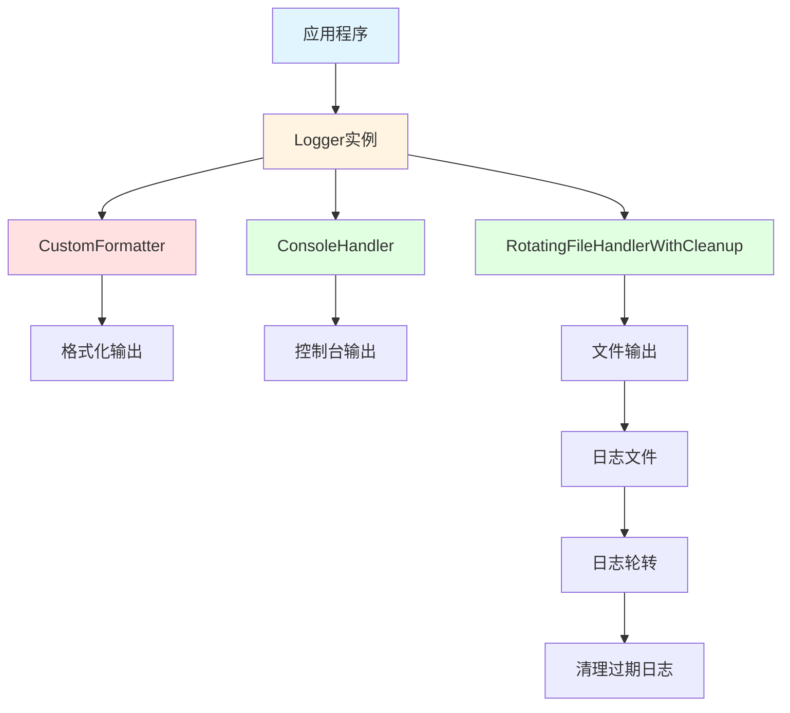
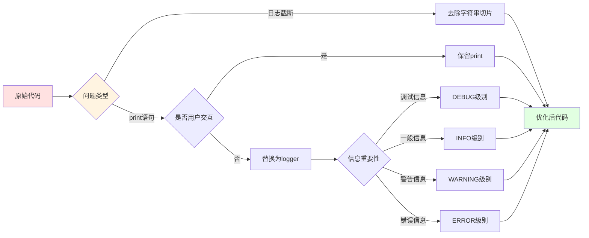
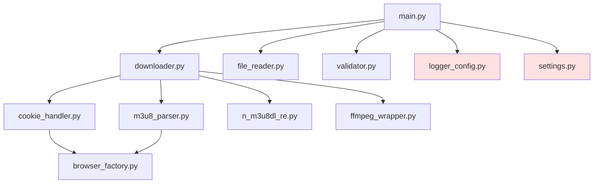
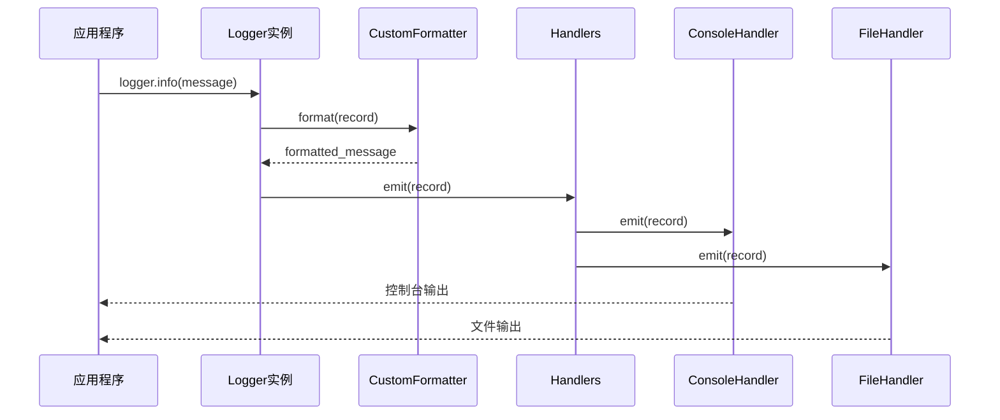
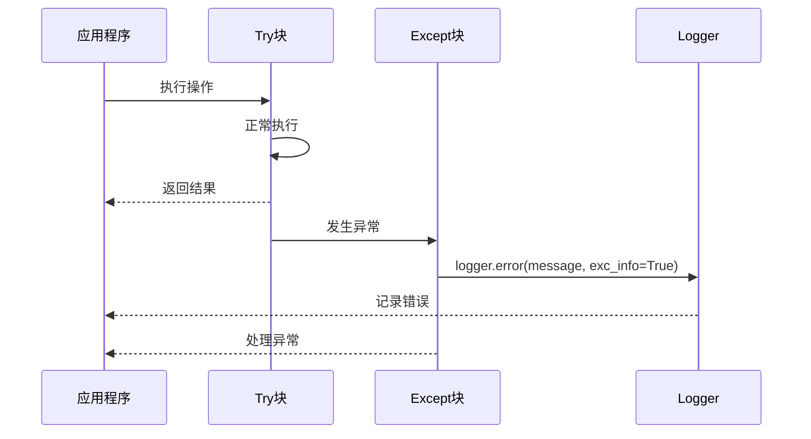

# 日志优化任务 - 设计文档

## 整体架构设计

### 日志系统架构图



### 优化策略架构



## 分层设计

### 1. 日志格式化层

#### CustomFormatter改进
- **现状**: 已有自定义格式化器
- **优化**: 无需修改，已满足需求
- **功能**: 添加模块名称标识

#### 日志格式
```
[YYYY-MM-DD HH:MM:SS.mmm] [LEVEL    ] [MODULE_NAME          ] MESSAGE
```

### 2. 日志处理层

#### ConsoleHandler
- **功能**: 控制台输出
- **级别**: 根据配置动态调整
- **格式**: 使用CustomFormatter

#### RotatingFileHandlerWithCleanup
- **功能**: 文件输出，支持轮转和清理
- **最大文件大小**: 10MB
- **备份数量**: 5个
- **清理策略**: 保留30天

### 3. 日志记录层

#### Logger实例
- **获取方式**: `logging.getLogger(__name__)`
- **级别设置**: 根据配置动态调整
- **传播**: 允许传播到根logger

## 核心组件

### 1. 日志截断修复组件

#### 修复策略
```python
# 修复前
logger.info(f"处理 m3u8 链接: {link[:80]}...")

# 修复后
logger.info(f"处理 m3u8 链接: {link}")
```

#### 修复位置
- **downloader.py**: 8处截断
- **n_m3u8dl_re.py**: 1处截断
- **cookie_handler.py**: 4处截断
- **main.py**: 1处截断

### 2. print替换组件

#### 替换策略
```python
# 修复前
print(f"获取到m3u8链接: {m3u8_url}")

# 修复后
logger.debug(f"获取到m3u8链接: {m3u8_url}")
```

#### 日志级别映射
| 信息类型 | 日志级别 | 示例 |
|---------|---------|------|
| 调试信息 | DEBUG | 获取到m3u8链接、处理日志 |
| 一般信息 | INFO | 开始下载、下载完成 |
| 警告信息 | WARNING | headers中没有User-Agent |
| 错误信息 | ERROR | 下载失败、读取失败 |

#### 替换位置
- **main.py**: 2处
- **downloader.py**: 8处
- **n_m3u8dl_re.py**: 13处
- **m3u8_parser.py**: 8处
- **file_reader.py**: 2处
- **ffmpeg_wrapper.py**: 2处
- **cookie_handler.py**: 0处（用户交互保留）
- **logger_config.py**: 1处
- **settings.py**: 2处

## 模块依赖关系



## 接口契约定义

### 1. 日志记录接口

#### 接口定义
```python
logger.debug(message, *args, **kwargs)
logger.info(message, *args, **kwargs)
logger.warning(message, *args, **kwargs)
logger.error(message, *args, **kwargs)
logger.critical(message, *args, **kwargs)
```

#### 参数说明
- **message**: 日志消息字符串
- **args**: 格式化参数
- **kwargs**: 额外参数（如exc_info用于记录异常）

### 2. 日志配置接口

#### 接口定义
```python
LoggerConfig.setup_logging(log_level: Optional[str] = None) -> None
LoggerConfig.get_logger(name: str) -> logging.Logger
LoggerConfig.clean_old_logs(days: int = 30) -> None
```

#### 参数说明
- **log_level**: 日志级别（DEBUG/INFO/WARNING/ERROR/CRITICAL）
- **name**: logger名称（通常使用__name__）
- **days**: 保留天数

## 数据流向

### 日志数据流



### 错误处理流



## 异常处理策略

### 1. 日志记录异常

#### 策略
- **记录异常**: 使用`logger.error(message, exc_info=True)`
- **包含堆栈**: `exc_info=True`自动包含堆栈信息
- **上下文信息**: 包含关键参数和状态

#### 示例
```python
try:
    result = some_operation()
except Exception as e:
    logger.error(f"操作失败: {e}", exc_info=True)
    raise
```

### 2. 日志系统异常

#### 策略
- **降级处理**: 如果日志系统初始化失败，使用基本配置
- **错误输出**: 使用print输出错误信息
- **继续运行**: 不影响主程序运行

#### 示例
```python
try:
    LoggerConfig.setup_logging()
except Exception as e:
    print(f"日志系统初始化失败: {e}")
    # 使用基本配置继续运行
```

## 设计原则

### 1. 最小化修改原则
- 只修改必要的代码
- 不改变现有架构
- 保持向后兼容

### 2. 日志完整性原则
- 确保日志内容完整
- 不截断任何信息
- 包含必要的上下文

### 3. 日志级别合理原则
- DEBUG: 详细调试信息
- INFO: 一般信息
- WARNING: 警告信息
- ERROR: 错误信息
- CRITICAL: 严重错误

### 4. 用户交互保持原则
- 保留用户交互的print语句
- 不改变用户输入输出流程
- 保持良好的用户体验

## 质量保证

### 1. 代码质量
- 遵循项目现有代码规范
- 保持代码风格一致
- 添加必要的注释

### 2. 测试覆盖
- 确保现有测试通过
- 验证日志输出正确
- 检查日志格式规范

### 3. 性能影响
- 最小化性能影响
- 避免过度日志
- 合理设置日志级别

## 实施计划

### 阶段1: 日志截断修复
1. 修复downloader.py中的截断
2. 修复n_m3u8dl_re.py中的截断
3. 修复cookie_handler.py中的截断
4. 修复main.py中的截断

### 阶段2: print语句替换
1. 替换main.py中的print
2. 替换downloader.py中的print
3. 替换n_m3u8dl_re.py中的print
4. 替换m3u8_parser.py中的print
5. 替换file_reader.py中的print
6. 替换ffmpeg_wrapper.py中的print
7. 替换logger_config.py中的print
8. 替换settings.py中的print

### 阶段3: 验证测试
1. 运行现有测试
2. 验证日志输出
3. 检查日志格式
4. 测试用户交互
