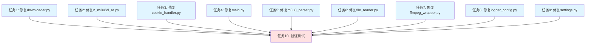

# 日志优化任务 - 任务拆分文档

## 任务依赖图

## 原子任务列表

### 任务1: 修复downloader.py中的日志截断和print语句

#### 输入契约
- **前置依赖**: 无
- **输入数据**: downloader.py源文件
- **环境依赖**: Python 3.8+, logging模块

#### 输出契约
- **输出数据**: 修改后的downloader.py文件
- **交付物**: 
  - 修复8处日志截断问题
  - 替换8处print语句为日志输出
  - 删除3处分隔符print语句
- **验收标准**:
  - 所有URL、链接、基础URL完整记录
  - 所有调试信息使用DEBUG级别
  - 所有错误信息使用ERROR级别并包含堆栈信息
  - 用户交互print语句保留

#### 实现约束
- **技术栈**: Python 3.8+, logging模块
- **接口规范**: 使用logging.getLogger(__name__)
- **质量要求**: 遵循项目现有代码规范

#### 依赖关系
- **后置任务**: 任务10（验证测试）
- **并行任务**: 任务2-9

#### 具体修改清单
1. Line 78: `logger.info(f"开始下载单个视频: {url[:50]}...")` → `logger.info(f"开始下载单个视频: {url}")`
2. Line 94: `logger.info(f"处理 m3u8 链接: {link[:80]}...")` → `logger.info(f"处理 m3u8 链接: {link}")`
3. Line 101: `logger.info(f"提取到基础 URL: {prefix[:80]}...")` → `logger.info(f"提取到基础 URL: {prefix}")`
4. Line 114: 删除 `print("=" * 100)`
5. Line 117: `logger.info(f"用户输入新链接: {url[:50]}...")` → `logger.info(f"用户输入新链接: {url}")`
6. Line 134: `print(f"共提取到 {total_links} 个钉钉直播回放分享链接。")` → `logger.info(f"共提取到 {total_links} 个钉钉直播回放分享链接")`
7. Line 143: `print(f"正在下载第 1 个视频，共 {total_links} 个视频。")` → `logger.info(f"正在下载第 1 个视频，共 {total_links} 个视频")`
8. Line 161: 删除 `print("=" * 100)`
9. Line 166: `print(f"正在下载第 {idx + 1} 个视频，共 {total_links} 个视频。")` → `logger.info(f"正在下载第 {idx + 1} 个视频，共 {total_links} 个视频")`
10. Line 168: `logger.info(f"处理 m3u8 链接: {link[:80]}...")` → `logger.info(f"处理 m3u8 链接: {link}")`
11. Line 175: `logger.info(f"提取到基础 URL: {prefix[:80]}...")` → `logger.info(f"提取到基础 URL: {prefix}")`
12. Line 184: 删除 `print("=" * 100)`
13. Line 195: `print(f"发生错误: {e}")` → `logger.error(f"发生错误: {e}", exc_info=True)`
14. Line 197: `logger.info(f"处理 m3u8 链接: {link[:80]}...")` → `logger.info(f"处理 m3u8 链接: {link}")`
15. Line 204: `logger.info(f"提取到基础 URL: {prefix[:80]}...")` → `logger.info(f"提取到基础 URL: {prefix}")`
16. Line 247: `print("无效的保存模式")` → `logger.error("无效的保存模式")`

---

### 任务2: 修复n_m3u8dl_re.py中的日志截断和print语句

#### 输入契约
- **前置依赖**: 无
- **输入数据**: n_m3u8dl_re.py源文件
- **环境依赖**: Python 3.8+, logging模块

#### 输出契约
- **输出数据**: 修改后的n_m3u8dl_re.py文件
- **交付物**: 
  - 修复1处日志截断问题
  - 替换13处print语句为日志输出
- **验收标准**:
  - 命令行参数完整记录
  - 所有调试信息使用DEBUG级别
  - 所有警告信息使用WARNING级别
  - 所有错误信息使用ERROR级别并包含堆栈信息

#### 实现约束
- **技术栈**: Python 3.8+, logging模块
- **接口规范**: 使用logging.getLogger(__name__)
- **质量要求**: 遵循项目现有代码规范

#### 依赖关系
- **后置任务**: 任务10（验证测试）
- **并行任务**: 任务1, 3-9

#### 具体修改清单
1. Line 79: `logger.debug(f"执行命令: {' '.join(command[:5])}...")` → `logger.debug(f"执行命令: {' '.join(command)}")`
2. Line 98: `print(f"已添加 Cookie 请求头")` → `logger.debug("已添加 Cookie 请求头")`
3. Line 101: `print(f"已添加 User-Agent 请求头")` → `logger.debug("已添加 User-Agent 请求头")`
4. Line 102: `print("警告: headers 中没有 User-Agent")` → `logger.warning("headers 中没有 User-Agent")`
5. Line 105: `print(f"已添加 Referer 请求头")` → `logger.debug("已添加 Referer 请求头")`
6. Line 107: `print(f"已添加默认 Referer 请求头")` → `logger.debug("已添加默认 Referer 请求头")`
7. Line 110: `print(f"已添加 Accept 请求头")` → `logger.debug("已添加 Accept 请求头")`
8. Line 113: `print(f"已添加 Accept-Language 请求头")` → `logger.debug("已添加 Accept-Language 请求头")`
9. Line 116: `print(f"已添加 Accept-Encoding 请求头")` → `logger.debug("已添加 Accept-Encoding 请求头")`
10. Line 119: `print("已添加默认请求头")` → `logger.debug("已添加默认请求头")`
11. Line 121: `print(f"总共添加了 {len(headers_added)} 个请求头: {', '.join(headers_added)}")` → `logger.debug(f"总共添加了 {len(headers_added)} 个请求头: {', '.join(headers_added)}")`
12. Line 137: `print(f"下载视频时发生错误: {e}")` → `logger.error(f"下载视频时发生错误: {e}", exc_info=True)`

---

### 任务3: 修复cookie_handler.py中的日志截断

#### 输入契约
- **前置依赖**: 无
- **输入数据**: cookie_handler.py源文件
- **环境依赖**: Python 3.8+, logging模块

#### 输出契约
- **输出数据**: 修改后的cookie_handler.py文件
- **交付物**: 
  - 修复4处日志截断问题
- **验收标准**:
  - URL完整记录
  - User-Agent完整记录
  - 保留用户交互print语句

#### 实现约束
- **技术栈**: Python 3.8+, logging模块
- **接口规范**: 使用logging.getLogger(__name__)
- **质量要求**: 遵循项目现有代码规范

#### 依赖关系
- **后置任务**: 任务10（验证测试）
- **并行任务**: 任务1-2, 4-9

#### 具体修改清单
1. Line 74: `logger.info(f"开始获取 Cookie - URL: {url[:50]}...")` → `logger.info(f"开始获取 Cookie - URL: {url}")`
2. Line 90: `logger.debug(f"User-Agent: {user_agent[:50]}...")` → `logger.debug(f"User-Agent: {user_agent}")`
3. Line 141: `logger.info(f"重复获取 Cookie - URL: {url[:50]}...")` → `logger.info(f"重复获取 Cookie - URL: {url}")`
4. Line 160: `logger.debug(f"User-Agent: {user_agent[:50]}...")` → `logger.debug(f"User-Agent: {user_agent}")`

---

### 任务4: 修复main.py中的日志截断和print语句

#### 输入契约
- **前置依赖**: 无
- **输入数据**: main.py源文件
- **环境依赖**: Python 3.8+, logging模块

#### 输出契约
- **输出数据**: 修改后的main.py文件
- **交付物**: 
  - 修复1处日志截断问题
  - 替换2处print语句为日志输出
- **验收标准**:
  - URL完整记录
  - 所有错误信息使用ERROR级别并包含堆栈信息
  - 保留用户交互print语句（欢迎信息、程序终止信息）

#### 实现约束
- **技术栈**: Python 3.8+, logging模块
- **接口规范**: 使用logging.getLogger(__name__)
- **质量要求**: 遵循项目现有代码规范

#### 依赖关系
- **后置任务**: 任务10（验证测试）
- **并行任务**: 任务1-3, 5-9

#### 具体修改清单
1. Line 60: `logger.info(f"用户输入链接: {dingtalk_url[:50]}...")` → `logger.info(f"用户输入链接: {dingtalk_url}")`
2. Line 85: `print(f"发生错误: {e}")` → `logger.error(f"发生错误: {e}", exc_info=True)`
3. Line 121: `print(f"发生错误: {e}")` → `logger.error(f"发生错误: {e}", exc_info=True)`

---

### 任务5: 修复m3u8_parser.py中的print语句

#### 输入契约
- **前置依赖**: 无
- **输入数据**: m3u8_parser.py源文件
- **环境依赖**: Python 3.8+, logging模块

#### 输出契约
- **输出数据**: 修改后的m3u8_parser.py文件
- **交付物**: 
  - 替换8处print语句为日志输出
- **验收标准**:
  - 所有调试信息使用DEBUG级别
  - 所有警告信息使用WARNING级别
  - 所有错误信息使用ERROR级别并包含堆栈信息

#### 实现约束
- **技术栈**: Python 3.8+, logging模块
- **接口规范**: 使用logging.getLogger(__name__)
- **质量要求**: 遵循项目现有代码规范

#### 依赖关系
- **后置任务**: 任务10（验证测试）
- **并行任务**: 任务1-4, 6-9

#### 具体修改清单
1. Line 76: `print("未能从 URL 提取 liveUuid，程序将退出。")` → `logger.error("未能从 URL 提取 liveUuid，程序将退出")`
2. Line 95: `print(f"获取到m3u8链接: {cleaned_link}")` → `logger.debug(f"获取到m3u8链接: {cleaned_link}")`
3. Line 104: `print(f"获取到m3u8链接: {m3u8_url}")` → `logger.debug(f"获取到m3u8链接: {m3u8_url}")`
4. Line 109: `print(f"处理日志时发生错误: {e}")` → `logger.error(f"处理日志时发生错误: {e}", exc_info=True)`
5. Line 113: `print(f"第 {attempt + 1} 次尝试未获取到 m3u8 链接，重试中...")` → `logger.warning(f"第 {attempt + 1} 次尝试未获取到 m3u8 链接，重试中")`
6. Line 116: `print(f"获取 m3u8 链接时发生错误: {e}")` → `logger.error(f"获取 m3u8 链接时发生错误: {e}", exc_info=True)`
7. Line 147: `print(f"下载 m3u8 文件时发生错误: {e}")` → `logger.error(f"下载 m3u8 文件时发生错误: {e}", exc_info=True)`
8. Line 156: `print("页面已刷新")` → `logger.debug("页面已刷新")`
9. Line 160: `print(f"刷新页面时发生错误: {e}")` → `logger.error(f"刷新页面时发生错误: {e}", exc_info=True)`

---

### 任务6: 修复file_reader.py中的print语句

#### 输入契约
- **前置依赖**: 无
- **输入数据**: file_reader.py源文件
- **环境依赖**: Python 3.8+, logging模块

#### 输出契约
- **输出数据**: 修改后的file_reader.py文件
- **交付物**: 
  - 替换2处print语句为日志输出
- **验收标准**:
  - 所有警告信息使用WARNING级别
  - 所有错误信息使用ERROR级别并包含堆栈信息

#### 实现约束
- **技术栈**: Python 3.8+, logging模块
- **接口规范**: 使用logging.getLogger(__name__)
- **质量要求**: 遵循项目现有代码规范

#### 依赖关系
- **后置任务**: 任务10（验证测试）
- **并行任务**: 任务1-5, 7-9

#### 具体修改清单
1. Line 70: `print(f"文件 {self.file_path} 使用的编码无法识别，请尝试其他编码格式。")` → `logger.warning(f"文件 {self.file_path} 使用的编码无法识别，请尝试其他编码格式")`
2. Line 87: `print(f"读取文件时发生错误: {e}")` → `logger.error(f"读取文件时发生错误: {e}", exc_info=True)`

---

### 任务7: 修复ffmpeg_wrapper.py中的print语句

#### 输入契约
- **前置依赖**: 无
- **输入数据**: ffmpeg_wrapper.py源文件
- **环境依赖**: Python 3.8+, logging模块

#### 输出契约
- **输出数据**: 修改后的ffmpeg_wrapper.py文件
- **交付物**: 
  - 替换2处print语句为日志输出
- **验收标准**:
  - 所有一般信息使用INFO级别
  - 所有错误信息使用ERROR级别并包含堆栈信息

#### 实现约束
- **技术栈**: Python 3.8+, logging模块
- **接口规范**: 使用logging.getLogger(__name__)
- **质量要求**: 遵循项目现有代码规范

#### 依赖关系
- **后置任务**: 任务10（验证测试）
- **并行任务**: 任务1-6, 8-9

#### 具体修改清单
1. Line 52: `print(f"音视频转换成功完成。输出文件: {output_file}")` → `logger.info(f"音视频转换成功完成。输出文件: {output_file}")`
2. Line 56: `print(f"转换音视频时发生错误: {e}")` → `logger.error(f"转换音视频时发生错误: {e}", exc_info=True)`

---

### 任务8: 修复logger_config.py中的print语句

#### 输入契约
- **前置依赖**: 无
- **输入数据**: logger_config.py源文件
- **环境依赖**: Python 3.8+, logging模块

#### 输出契约
- **输出数据**: 修改后的logger_config.py文件
- **交付物**: 
  - 替换1处print语句为日志输出
- **验收标准**:
  - 所有错误信息使用ERROR级别并包含堆栈信息

#### 实现约束
- **技术栈**: Python 3.8+, logging模块
- **接口规范**: 使用logging.getLogger(__name__)
- **质量要求**: 遵循项目现有代码规范

#### 依赖关系
- **后置任务**: 任务10（验证测试）
- **并行任务**: 任务1-7, 9

#### 具体修改清单
1. Line 83: `print(f"日志系统初始化失败: {e}")` → `logger.error(f"日志系统初始化失败: {e}", exc_info=True)`

---

### 任务9: 修复settings.py中的print语句

#### 输入契约
- **前置依赖**: 无
- **输入数据**: settings.py源文件
- **环境依赖**: Python 3.8+, logging模块

#### 输出契约
- **输出数据**: 修改后的settings.py文件
- **交付物**: 
  - 替换2处print语句为日志输出
- **验收标准**:
  - 所有错误信息使用ERROR级别并包含堆栈信息

#### 实现约束
- **技术栈**: Python 3.8+, logging模块
- **接口规范**: 使用logging.getLogger(__name__)
- **质量要求**: 遵循项目现有代码规范

#### 依赖关系
- **后置任务**: 任务10（验证测试）
- **并行任务**: 任务1-8

#### 具体修改清单
1. Line 44: `print(f"加载配置文件失败: {e}")` → `logger.error(f"加载配置文件失败: {e}", exc_info=True)`
2. Line 53: `print(f"保存配置文件失败: {e}")` → `logger.error(f"保存配置文件失败: {e}", exc_info=True)`

---

### 任务10: 验证所有修改并运行测试

#### 输入契约
- **前置依赖**: 任务1-9
- **输入数据**: 所有修改后的源文件
- **环境依赖**: Python 3.8+, pytest（如果存在）

#### 输出契约
- **输出数据**: 测试结果报告
- **交付物**: 
  - 所有测试通过
  - 日志输出验证通过
  - 日志格式验证通过
  - 用户交互测试通过
- **验收标准**:
  - 所有日志输出完整显示，无截断
  - 所有非用户交互的print语句已替换为日志输出
  - 日志级别设置合理
  - 日志包含时间戳、模块信息和必要上下文
  - 用户交互体验保持不变
  - 代码通过现有测试

#### 实现约束
- **技术栈**: Python 3.8+, pytest（如果存在）
- **接口规范**: 使用pytest运行测试
- **质量要求**: 所有测试必须通过

#### 依赖关系
- **后置任务**: 无
- **并行任务**: 无

#### 验证步骤
1. 运行现有测试套件
2. 验证日志输出完整性
3. 验证日志格式规范性
4. 测试用户交互流程
5. 检查日志级别设置
6. 验证异常处理和堆栈信息

---

## 任务执行顺序

### 并行执行组
- **组1**: 任务1-9可以并行执行（相互独立）

### 串行执行
- **步骤1**: 并行执行任务1-9
- **步骤2**: 执行任务10（验证测试）

## 复杂度评估

### 任务1-9
- **复杂度**: 低
- **预估时间**: 每个任务5-10分钟
- **风险**: 低

### 任务10
- **复杂度**: 中
- **预估时间**: 20-30分钟
- **风险**: 中（可能发现需要回退的问题）

## 总体评估

### 任务覆盖
- ✅ 覆盖所有日志截断问题（14处）
- ✅ 覆盖所有非用户交互print语句（38处）
- ✅ 覆盖所有无用分隔符print语句（3处）

### 依赖关系
- ✅ 无循环依赖
- ✅ 任务1-9可并行执行
- ✅ 任务10依赖任务1-9

### 可验证性
- ✅ 每个任务都有明确的验收标准
- ✅ 每个任务都有具体的修改清单
- ✅ 最终任务10进行全面验证

### 复杂度可控
- ✅ 每个任务都是小规模修改
- ✅ 修改点明确，易于验证
- ✅ 风险可控，易于回退
