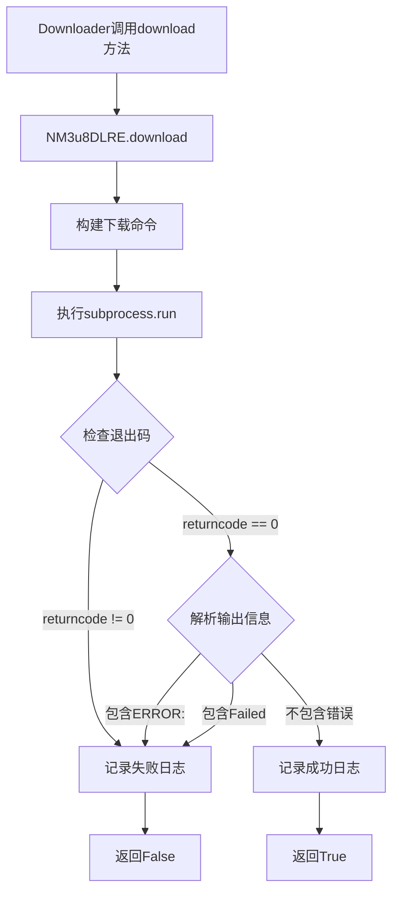
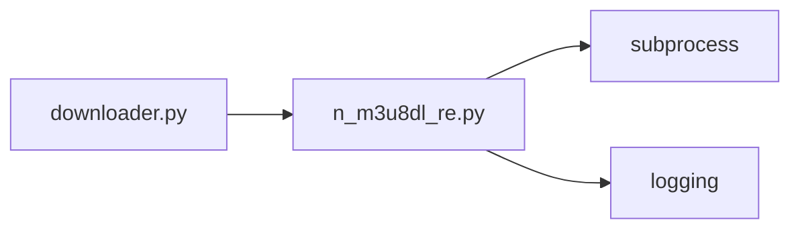
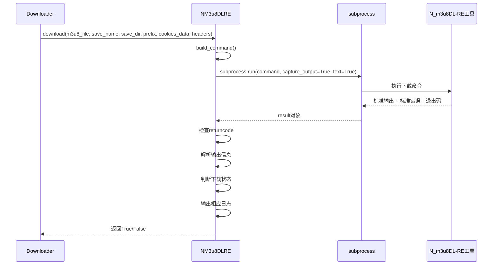
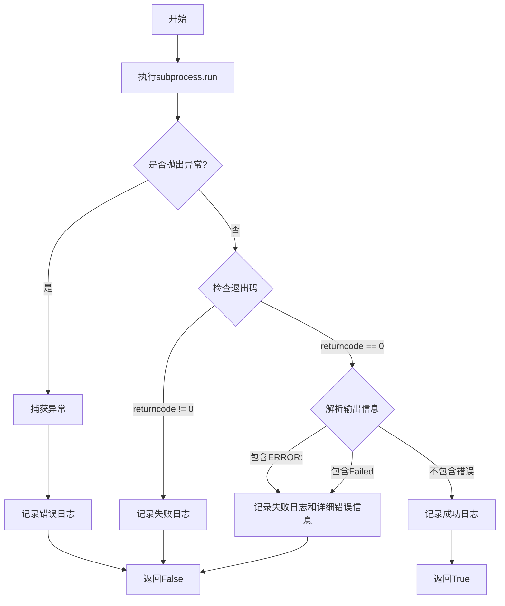

# 下载状态判断错误问题 - 架构设计文档

## 整体架构图



## 分层设计

### 核心组件

1. **NM3u8DLRE类**
   - 负责调用N_m3u8DL-RE工具
   - 负责判断下载状态
   - 负责输出相应的日志

2. **download方法**
   - 构建下载命令
   - 执行下载命令
   - 捕获子进程输出
   - 判断下载状态
   - 输出相应日志

3. **状态判断逻辑**
   - 检查退出码
   - 解析输出信息
   - 判断下载是否成功

## 模块依赖关系图



## 接口契约定义

### download方法

**输入契约**：
- `m3u8_file` (str): m3u8文件路径
- `save_name` (str): 保存文件名
- `save_dir` (str): 保存目录
- `prefix` (str): 基础URL
- `cookies_data` (Optional[Dict[str, str]]): Cookie字典
- `headers` (Optional[Dict[str, str]]): 请求头字典

**输出契约**：
- `success` (bool): 下载是否成功
- 日志输出：成功时输出INFO级别日志，失败时输出ERROR级别日志

**实现约束**：
- 必须捕获子进程的标准输出和标准错误输出
- 必须检查子进程的退出码
- 必须解析输出信息判断下载状态
- 必须根据下载状态输出相应的日志

## 数据流向图



## 异常处理策略

### 异常分类

1. **子进程异常**
   - 子进程返回非0退出码
   - 处理方式：记录失败日志，返回False

2. **输出解析异常**
   - 输出中包含"ERROR:"关键字
   - 输出中包含"Failed"关键字
   - 处理方式：记录失败日志和详细错误信息，返回False

3. **其他异常**
   - subprocess.run()抛出异常
   - 处理方式：捕获异常，记录错误日志，返回False

### 异常处理流程



## 设计原则

### 1. 严格按照任务范围

- 只修改n_m3u8dl_re.py中的download方法
- 不修改其他模块
- 不修改N_m3u8DL-RE工具本身

### 2. 确保与现有系统架构一致

- 保持API接口不变
- 保持代码风格一致
- 保持日志格式一致
- 保持异常处理方式一致

### 3. 复用现有组件和模式

- 复用现有的logging模块
- 复用现有的subprocess模块
- 复用现有的异常处理模式

## 核心算法设计

### 状态判断算法

```python
def is_download_success(result: subprocess.CompletedProcess) -> tuple[bool, str]:
    """
    判断下载是否成功

    Args:
        result: subprocess.run()的返回结果

    Returns:
        (是否成功, 错误信息)
    """
    # 检查退出码
    if result.returncode != 0:
        error_info = f"子进程退出码: {result.returncode}"
        return False, error_info

    # 解析输出信息
    output = result.stdout + result.stderr

    # 检查是否包含错误标识
    error_lines = []
    for line in output.split('\n'):
        if 'ERROR:' in line or 'Failed' in line:
            error_lines.append(line.strip())

    if error_lines:
        error_info = '\n'.join(error_lines)
        return False, error_info

    # 没有错误，下载成功
    return True, ""
```

### 日志输出算法

```python
def log_download_result(success: bool, save_dir: str, error_info: str = "") -> None:
    """
    记录下载结果日志

    Args:
        success: 是否成功
        save_dir: 保存目录
        error_info: 错误信息
    """
    if success:
        logger.info(f"视频下载成功完成。文件保存路径: {save_dir}")
    else:
        logger.error(f"视频下载失败")
        if error_info:
            logger.error(f"错误信息:\n{error_info}")
```

## 性能考虑

### 1. 输出解析性能

- 使用字符串操作而非正则表达式，提高性能
- 只遍历输出一次，避免多次遍历
- 使用生成器而非列表，减少内存占用

### 2. 日志输出性能

- 只在失败时输出详细错误信息
- 成功时只输出一行日志
- 避免重复输出相同信息

## 安全考虑

### 1. 输入验证

- 验证m3u8_file是否存在
- 验证save_dir是否可写
- 验证prefix是否为有效URL

### 2. 输出处理

- 避免输出敏感信息（如Cookie、Token）
- 限制错误信息的长度，避免日志过大
- 过滤特殊字符，避免日志注入

## 可维护性考虑

### 1. 代码结构

- 将状态判断逻辑提取为独立方法
- 将日志输出逻辑提取为独立方法
- 保持download方法简洁清晰

### 2. 注释和文档

- 添加详细的注释说明算法逻辑
- 更新方法文档字符串
- 保持代码自解释

### 3. 测试友好

- 状态判断逻辑独立，便于单元测试
- 日志输出逻辑独立，便于单元测试
- 便于模拟subprocess.run()的返回结果

## 扩展性考虑

### 1. 支持更多错误标识

- 将错误标识定义为常量，便于扩展
- 支持自定义错误标识
- 支持正则表达式匹配错误标识

### 2. 支持更详细的错误信息

- 支持提取错误码
- 支持提取错误位置
- 支持提取错误时间戳

### 3. 支持自定义日志格式

- 支持自定义成功日志格式
- 支持自定义失败日志格式
- 支持自定义错误信息格式
