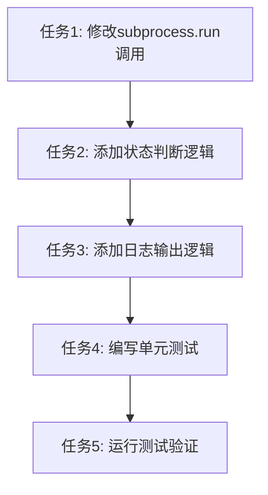

# 下载状态判断错误问题 - 任务拆分文档

## 任务依赖图



## 原子任务列表

### 任务1: 修改subprocess.run()调用，捕获输出

**任务描述**：
修改n_m3u8dl_re.py中的download方法，将subprocess.run()调用修改为捕获标准输出和标准错误输出。

**输入契约**：
- 前置依赖：无
- 输入数据：现有的download方法代码
- 环境依赖：Python 3.x, subprocess模块

**输出契约**：
- 输出数据：修改后的download方法代码
- 交付物：subprocess.run()调用已修改为capture_output=True和text=True
- 验收标准：
  - subprocess.run()调用包含capture_output=True参数
  - subprocess.run()调用包含text=True参数
  - 返回值赋值给result变量
  - 代码能够正常编译运行

**实现约束**：
- 技术栈：Python 3.x, subprocess
- 接口规范：保持API接口不变
- 质量要求：代码风格与现有代码一致

**依赖关系**：
- 后置任务：任务2（添加状态判断逻辑）
- 并行任务：无

**实现要点**：
```python
# 修改前
subprocess.run(command)

# 修改后
result = subprocess.run(command, capture_output=True, text=True)
```

---

### 任务2: 添加状态判断逻辑

**任务描述**：
在n_m3u8dl_re.py中的download方法中，添加状态判断逻辑，检查退出码和输出信息，判断下载是否成功。

**输入契约**：
- 前置依赖：任务1（修改subprocess.run()调用）
- 输入数据：result对象（subprocess.run()的返回值）
- 环境依赖：Python 3.x, subprocess模块

**输出契约**：
- 输出数据：状态判断逻辑代码
- 交付物：能够准确判断下载是否成功的逻辑
- 验收标准：
  - 检查result.returncode是否为0
  - 解析result.stdout和result.stderr
  - 检查输出中是否包含"ERROR:"关键字
  - 检查输出中是否包含"Failed"关键字
  - 返回True/False表示下载是否成功
  - 代码能够正常编译运行

**实现约束**：
- 技术栈：Python 3.x, subprocess
- 接口规范：保持API接口不变
- 质量要求：代码风格与现有代码一致

**依赖关系**：
- 后置任务：任务3（添加日志输出逻辑）
- 并行任务：无

**实现要点**：
```python
# 检查退出码
if result.returncode != 0:
    return False

# 解析输出信息
output = result.stdout + result.stderr

# 检查是否包含错误标识
if "ERROR:" in output or "Failed" in output:
    return False

# 下载成功
return True
```

---

### 任务3: 添加日志输出逻辑

**任务描述**：
在n_m3u8dl_re.py中的download方法中，添加日志输出逻辑，根据下载状态输出相应的日志（成功/失败）。

**输入契约**：
- 前置依赖：任务2（添加状态判断逻辑）
- 输入数据：下载状态（True/False），错误信息（如果有）
- 环境依赖：Python 3.x, logging模块

**输出契约**：
- 输出数据：日志输出逻辑代码
- 交付物：能够根据下载状态输出相应日志的逻辑
- 验收标准：
  - 下载成功时输出INFO级别日志："视频下载成功完成。文件保存路径: {save_dir}"
  - 下载失败时输出ERROR级别日志："视频下载失败"
  - 下载失败时输出详细的错误信息（包含所有ERROR:行）
  - 代码能够正常编译运行

**实现约束**：
- 技术栈：Python 3.x, logging
- 接口规范：保持API接口不变
- 质量要求：代码风格与现有代码一致

**依赖关系**：
- 后置任务：任务4（编写单元测试）
- 并行任务：无

**实现要点**：
```python
# 下载成功
if success:
    logger.info(f"视频下载成功完成。文件保存路径: {save_dir}")
    return True

# 下载失败
else:
    logger.error(f"视频下载失败")
    if error_info:
        logger.error(f"错误信息:\n{error_info}")
    return False
```

---

### 任务4: 编写单元测试

**任务描述**：
为n_m3u8dl_re.py中的download方法编写单元测试，测试下载状态判断逻辑和日志输出逻辑。

**输入契约**：
- 前置依赖：任务3（添加日志输出逻辑）
- 输入数据：download方法的代码
- 环境依赖：Python 3.x, pytest, unittest.mock

**输出契约**：
- 输出数据：单元测试代码
- 交付物：完整的单元测试用例
- 验收标准：
  - 测试下载成功的情况
  - 测试下载失败的情况（退出码非0）
  - 测试下载失败的情况（输出包含ERROR:）
  - 测试下载失败的情况（输出包含Failed）
  - 所有测试用例通过
  - 测试覆盖率不低于80%

**实现约束**：
- 技术栈：Python 3.x, pytest, unittest.mock
- 接口规范：遵循pytest测试规范
- 质量要求：测试用例完整、清晰、可维护

**依赖关系**：
- 后置任务：任务5（运行测试验证）
- 并行任务：无

**实现要点**：
```python
# 测试下载成功
def test_download_success(mock_subprocess_run):
    mock_subprocess_run.return_value = subprocess.CompletedProcess(
        args=[], returncode=0, stdout="INFO: 下载成功", stderr=""
    )
    result = downloader.download(...)
    assert result is True

# 测试下载失败（退出码非0）
def test_download_failure_nonzero_exit_code(mock_subprocess_run):
    mock_subprocess_run.return_value = subprocess.CompletedProcess(
        args=[], returncode=1, stdout="", stderr="ERROR: 下载失败"
    )
    result = downloader.download(...)
    assert result is False

# 测试下载失败（输出包含ERROR:）
def test_download_failure_error_in_output(mock_subprocess_run):
    mock_subprocess_run.return_value = subprocess.CompletedProcess(
        args=[], returncode=0, stdout="ERROR: 分片数量校验不通过", stderr=""
    )
    result = downloader.download(...)
    assert result is False

# 测试下载失败（输出包含Failed）
def test_download_failure_failed_in_output(mock_subprocess_run):
    mock_subprocess_run.return_value = subprocess.CompletedProcess(
        args=[], returncode=0, stdout="ERROR: Failed", stderr=""
    )
    result = downloader.download(...)
    assert result is False
```

---

### 任务5: 运行测试验证

**任务描述**：
运行所有测试，验证下载状态判断优化是否正确实现。

**输入契约**：
- 前置依赖：任务4（编写单元测试）
- 输入数据：所有测试用例
- 环境依赖：Python 3.x, pytest

**输出契约**：
- 输出数据：测试结果
- 交付物：测试通过报告
- 验收标准：
  - 所有现有测试通过
  - 所有新增测试通过
  - 测试覆盖率不低于80%
  - 代码能够正常编译运行

**实现约束**：
- 技术栈：Python 3.x, pytest
- 接口规范：遵循pytest测试规范
- 质量要求：所有测试必须通过

**依赖关系**：
- 后置任务：无
- 并行任务：无

**实现要点**：
```bash
# 运行所有测试
pytest tests/ -v

# 查看测试覆盖率
pytest tests/ --cov=src --cov-report=html

# 查看覆盖率报告
open htmlcov/index.html
```

---

## 任务拆分原则

### 1. 复杂度可控

每个任务的复杂度都控制在合理范围内，便于AI高成功率交付：
- 任务1：修改一行代码
- 任务2：添加几行状态判断逻辑
- 任务3：添加几行日志输出逻辑
- 任务4：编写几个测试用例
- 任务5：运行测试命令

### 2. 按功能模块分解

每个任务都专注于一个特定的功能模块：
- 任务1：修改subprocess.run()调用
- 任务2：添加状态判断逻辑
- 任务3：添加日志输出逻辑
- 任务4：编写单元测试
- 任务5：运行测试验证

### 3. 有明确的验收标准

每个任务都有明确的验收标准，便于验证：
- 任务1：检查subprocess.run()调用是否正确修改
- 任务2：检查状态判断逻辑是否正确
- 任务3：检查日志输出逻辑是否正确
- 任务4：检查测试用例是否完整
- 任务5：检查测试是否全部通过

### 4. 依赖关系清晰

任务之间的依赖关系清晰明确：
- 任务1 → 任务2 → 任务3 → 任务4 → 任务5
- 每个任务都依赖前一个任务的完成
- 没有循环依赖

## 质量门控

### 1. 任务覆盖完整需求

- ✅ 修改subprocess.run()调用，捕获输出
- ✅ 添加状态判断逻辑
- ✅ 添加日志输出逻辑
- ✅ 编写单元测试
- ✅ 运行测试验证

### 2. 依赖关系无循环

- ✅ 任务1 → 任务2 → 任务3 → 任务4 → 任务5
- ✅ 没有循环依赖

### 3. 每个任务都可独立验证

- ✅ 任务1：检查subprocess.run()调用是否正确修改
- ✅ 任务2：检查状态判断逻辑是否正确
- ✅ 任务3：检查日志输出逻辑是否正确
- ✅ 任务4：检查测试用例是否完整
- ✅ 任务5：检查测试是否全部通过

### 4. 复杂度评估合理

- ✅ 每个任务的复杂度都控制在合理范围内
- ✅ 便于AI高成功率交付
- ✅ 便于人工审查和验证
