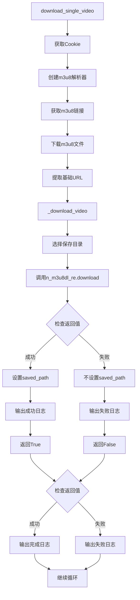
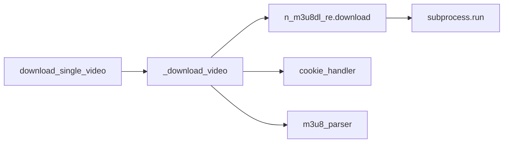
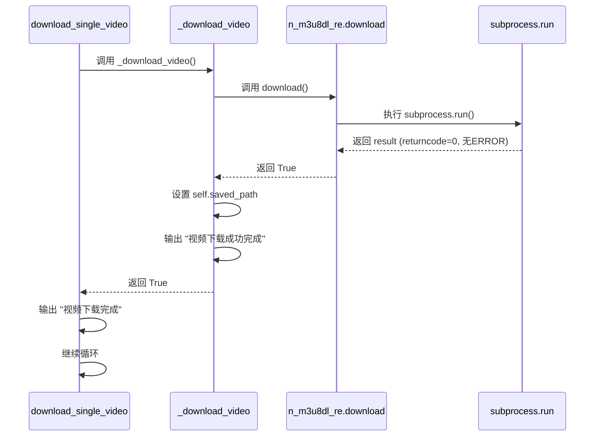
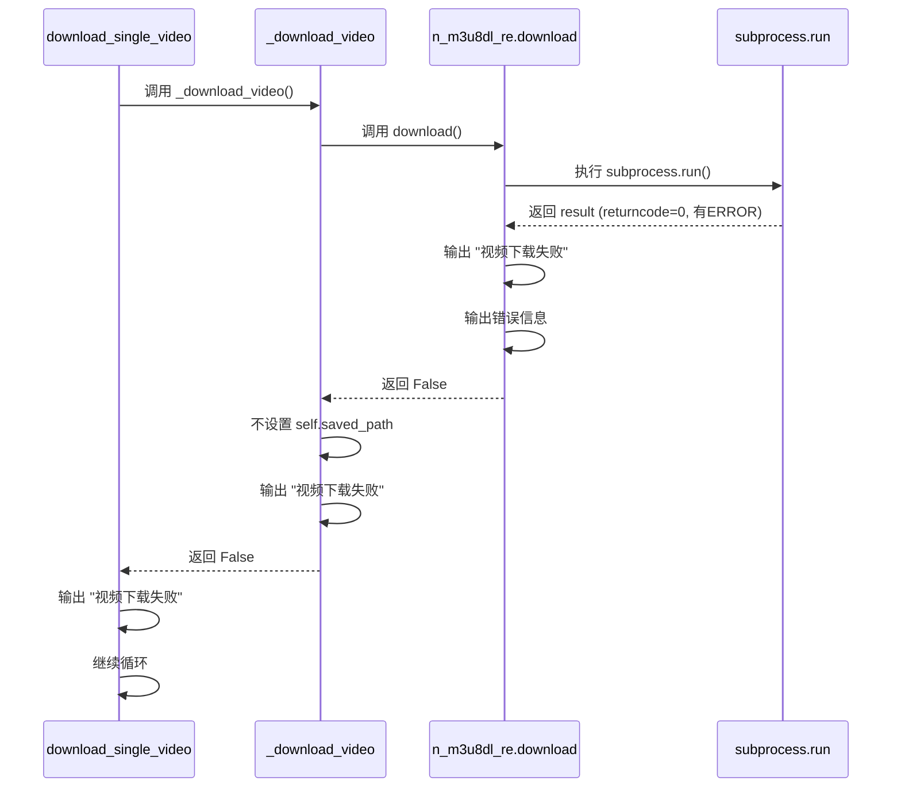

# 下载状态判断逻辑矛盾修复 - 架构设计文档

## 整体架构图



## 分层设计和核心组件

### 1. 调用层（download_single_video）

**职责**：

- 协调整个下载流程
- 检查 `_download_video()` 的返回值
- 根据返回值输出相应的日志
- 根据返回值决定是否跳过后续操作

**核心组件**：

- `download_single_video()` 方法
- 返回值检查逻辑
- 日志输出逻辑

### 2. 业务逻辑层（\_download_video）

**职责**：

- 选择保存目录
- 调用 `n_m3u8dl_re.download()` 下载视频
- 检查返回值
- 根据返回值设置 `self.saved_path`
- 根据返回值输出相应的日志
- 返回下载状态

**核心组件**：

- `_download_video()` 方法
- 返回值检查逻辑
- 日志输出逻辑
- 状态返回逻辑

### 3. 工具层（n_m3u8dl_re）

**职责**：

- 调用 N_m3u8DL-RE 工具下载视频
- 检查子进程退出码
- 解析输出信息
- 判断下载状态
- 输出详细的错误信息
- 返回下载状态

**核心组件**：

- `download()` 方法
- 状态判断逻辑
- 错误信息提取逻辑

## 模块依赖关系图



## 接口契约定义

### 1. \_download_video() 方法

**修改前**：

```python
def _download_video(
    self,
    m3u8_file: str,
    save_name: str,
    prefix: str,
    cookies_data: Dict[str, str],
    m3u8_headers: Dict[str, str],
) -> None:
```

**修改后**：

```python
def _download_video(
    self,
    m3u8_file: str,
    save_name: str,
    prefix: str,
    cookies_data: Dict[str, str],
    m3u8_headers: Dict[str, str],
) -> bool:
```

**返回值**：

- `True`：下载成功
- `False`：下载失败

**行为**：

- 下载成功时：设置 `self.saved_path`，输出成功日志，返回 `True`
- 下载失败时：不设置 `self.saved_path`，输出失败日志，返回 `False`

### 2. download_single_video() 方法

**修改前**：

```python
def download_single_video(self, url: str) -> None:
```

**修改后**：

```python
def download_single_video(self, url: str) -> None:
```

**返回值**：

- 无返回值（保持不变）

**行为**：

- 检查 `_download_video()` 的返回值
- 下载成功时：输出完成日志，继续循环
- 下载失败时：输出失败日志，继续循环

## 数据流向图

### 成功场景



### 失败场景



## 异常处理策略

### 1. \_download_video() 方法

**异常处理**：

- 捕获 `n_m3u8dl_re.download()` 抛出的异常
- 记录异常日志
- 返回 `False`

**边界条件**：

- 保存目录为空：输出警告日志，返回 `False`
- 保存模式无效：输出错误日志，返回 `False`

### 2. download_single_video() 方法

**异常处理**：

- 捕获 `_download_video()` 抛出的异常
- 记录异常日志
- 继续循环或退出

**边界条件**：

- 用户中断：捕获 `KeyboardInterrupt`，清理资源，退出程序
- 其他异常：记录异常日志，清理资源，继续循环或退出

## 设计原则

### 1. 严格按照任务范围，避免过度设计

- 只修改 `downloader.py` 中的两个方法
- 不修改其他模块
- 不改变现有接口（除了返回值类型）

### 2. 确保与现有系统架构一致

- 使用 logging 模块输出日志
- 使用返回值表示操作成功/失败
- 保持与现有代码风格一致

### 3. 复用现有组件和模式

- 复用 `n_m3u8dl_re.download()` 的状态判断逻辑
- 复用现有的日志输出模式
- 复用现有的异常处理模式

## 修复方案

### 1. 修改 \_download_video() 方法

**修改内容**：

1. 修改返回值类型为 `bool`
2. 检查 `n_m3u8dl_re.download()` 的返回值
3. 根据返回值输出相应的日志
4. 根据返回值决定是否设置 `self.saved_path`
5. 根据返回值返回下载状态

**代码示例**：

```python
def _download_video(
    self,
    m3u8_file: str,
    save_name: str,
    prefix: str,
    cookies_data: Dict[str, str],
    m3u8_headers: Dict[str, str],
) -> bool:
    """
    下载视频。

    根据保存模式选择保存路径，然后调用 N_m3u8DL-RE 下载视频。

    Args:
        m3u8_file: m3u8 文件路径
        save_name: 保存文件名
        prefix: 基础 URL
        cookies_data: Cookie 字典
        m3u8_headers: 请求头字典

    Returns:
        bool: 下载成功返回 True，下载失败返回 False
    """
    logger.info(f"开始下载视频 - 文件名: {save_name}")

    if self.save_mode == SAVE_MODE_DEFAULT:
        save_dir = self._get_default_download_dir()
        logger.info(f"使用默认保存目录: {save_dir}")
    elif self.save_mode == SAVE_MODE_MANUAL:
        save_dir = self._get_manual_download_dir()
        logger.info(f"使用手动选择目录: {save_dir}")
    else:
        logger.error(f"无效的保存模式: {self.save_mode}")
        return False

    if not save_dir:
        logger.warning("用户取消了目录选择")
        print("用户取消了选择。视频下载已中止。")
        return False

    logger.info(f"调用 N_m3u8DL-RE 下载视频")
    download_success = self.n_m3u8dl_re.download(
        m3u8_file, save_name, save_dir, prefix, cookies_data, m3u8_headers
    )

    if download_success:
        self.saved_path = save_dir
        logger.info(f"视频下载成功完成 - 保存路径: {save_dir}")
        return True
    else:
        logger.error(f"视频下载失败 - 文件名: {save_name}")
        return False
```

### 2. 修改 download_single_video() 方法

**修改内容**：

1. 检查 `_download_video()` 的返回值
2. 根据返回值输出相应的日志
3. 根据返回值决定是否跳过后续操作

**代码示例**：

```python
def download_single_video(self, url: str) -> None:
    """
    下载单个视频。

    协调 Cookie 获取、m3u8 解析、视频下载。

    Args:
        url: 钉钉直播回放分享链接

    Raises:
        Exception: 下载失败时
    """
    logger.info(f"开始下载单个视频: {url}")

    try:
        browser, cookies_data, m3u8_headers, live_name = self.cookie_handler.get_cookie(url)
        logger.info(f"获取到 Cookie 和请求头，直播名称: {live_name}")

        self.m3u8_parser = M3u8Parser(browser, self.browser_type)
        logger.info("m3u8 解析器创建成功")

        while True:
            logger.info("开始获取 m3u8 链接")
            m3u8_links = self.m3u8_parser.fetch_m3u8_links(url)

            if m3u8_links:
                logger.info(f"获取到 {len(m3u8_links)} 个 m3u8 链接")
                for link in m3u8_links:
                    logger.info(f"处理 m3u8 链接: {link}")
                    m3u8_file = self.m3u8_parser.download_m3u8_file(
                        link, TEMP_M3U8_FILE, m3u8_headers
                    )
                    logger.info(f"m3u8 文件下载成功: {m3u8_file}")

                    prefix = self.m3u8_parser.extract_prefix(link)
                    logger.info(f"提取到基础 URL: {prefix}")

                    download_success = self._download_video(
                        m3u8_file, live_name, prefix, cookies_data, m3u8_headers
                    )

                    if download_success:
                        logger.info(f"视频下载完成: {live_name}")
                    else:
                        logger.error(f"视频下载失败: {live_name}")
            else:
                logger.warning("未找到包含 'm3u8' 字符的请求链接")

            url = input("请继续输入钉钉直播分享链接，或输入q退出程序: ")
            if url.lower() == "q":
                logger.info("用户选择退出程序")
                self.close()
                print("程序已退出。")
                break
            logger.info(f"用户输入新链接: {url}")
            cookies_data, m3u8_headers, live_name = self.cookie_handler.repeat_get_cookie(url)
            logger.info(f"获取到 Cookie 和请求头，直播名称: {live_name}")

    except KeyboardInterrupt:
        logger.warning("用户中断下载")
        print("\n程序已被用户终止。")
        self.close()
        sys.exit(0)

    except Exception as e:
        logger.error(f"下载单个视频时发生错误: {e}", exc_info=True)
        print(f"发生错误: {e}")
        self.close()
```

## 质量门控

- ✅ 架构图清晰准确
- ✅ 接口定义完整
- ✅ 与现有系统无冲突
- ✅ 设计可行性验证
