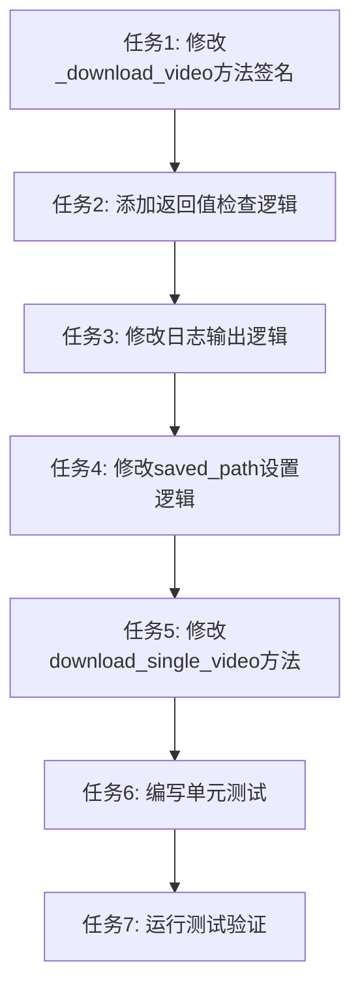

# 下载状态判断逻辑矛盾修复 - 任务拆分文档

## 任务依赖图



## 原子任务列表

### 任务 1: 修改 \_download_video() 方法签名

**输入契约**：

- 前置依赖：无
- 输入数据：无
- 环境依赖：Python 3.x

**输出契约**：

- 输出数据：修改后的 `_download_video()` 方法签名
- 交付物：修改后的 `downloader.py` 文件
- 验收标准：
  - 返回值类型从 `None` 改为 `bool`
  - 方法文档字符串更新

**实现约束**：

- 技术栈：Python
- 接口规范：保持方法名和参数不变，只修改返回值类型
- 质量要求：保持与现有代码风格一致

**依赖关系**：

- 后置任务：任务 2
- 并行任务：无

### 任务 2: 添加返回值检查逻辑

**输入契约**：

- 前置依赖：任务 1 完成
- 输入数据：修改后的 `_download_video()` 方法
- 环境依赖：Python 3.x

**输出契约**：

- 输出数据：添加返回值检查逻辑的 `_download_video()` 方法
- 交付物：修改后的 `downloader.py` 文件
- 验收标准：
  - 调用 `n_m3u8dl_re.download()` 时保存返回值
  - 检查返回值并执行相应逻辑

**实现约束**：

- 技术栈：Python
- 接口规范：使用 `download_success` 变量保存返回值
- 质量要求：保持与现有代码风格一致

**依赖关系**：

- 后置任务：任务 3
- 并行任务：无

### 任务 3: 修改日志输出逻辑

**输入契约**：

- 前置依赖：任务 2 完成
- 输入数据：添加返回值检查逻辑的 `_download_video()` 方法
- 环境依赖：Python 3.x

**输出契约**：

- 输出数据：修改日志输出逻辑的 `_download_video()` 方法
- 交付物：修改后的 `downloader.py` 文件
- 验收标准：
  - 下载成功时输出 "视频下载成功完成"
  - 下载失败时输出 "视频下载失败"

**实现约束**：

- 技术栈：Python
- 接口规范：使用 logging 模块输出日志
- 质量要求：保持与现有代码风格一致

**依赖关系**：

- 后置任务：任务 4
- 并行任务：无

### 任务 4: 修改 saved_path 设置逻辑

**输入契约**：

- 前置依赖：任务 3 完成
- 输入数据：修改日志输出逻辑的 `_download_video()` 方法
- 环境依赖：Python 3.x

**输出契约**：

- 输出数据：修改 saved_path 设置逻辑的 `_download_video()` 方法
- 交付物：修改后的 `downloader.py` 文件
- 验收标准：
  - 下载成功时设置 `self.saved_path`
  - 下载失败时不设置 `self.saved_path`

**实现约束**：

- 技术栈：Python
- 接口规范：只在下载成功时设置 `self.saved_path`
- 质量要求：保持与现有代码风格一致

**依赖关系**：

- 后置任务：任务 5
- 并行任务：无

### 任务 5: 修改 download_single_video() 方法

**输入契约**：

- 前置依赖：任务 4 完成
- 输入数据：修改后的 `_download_video()` 方法
- 环境依赖：Python 3.x

**输出契约**：

- 输出数据：修改后的 `download_single_video()` 方法
- 交付物：修改后的 `downloader.py` 文件
- 验收标准：
  - 调用 `_download_video()` 时保存返回值
  - 检查返回值并执行相应逻辑
  - 下载成功时输出 "视频下载完成"
  - 下载失败时输出 "视频下载失败"

**实现约束**：

- 技术栈：Python
- 接口规范：使用 `download_success` 变量保存返回值
- 质量要求：保持与现有代码风格一致

**依赖关系**：

- 后置任务：任务 6
- 并行任务：无

### 任务 6: 编写单元测试

**输入契约**：

- 前置依赖：任务 5 完成
- 输入数据：修改后的 `downloader.py` 文件
- 环境依赖：Python 3.x, pytest

**输出契约**：

- 输出数据：单元测试文件
- 交付物：`test_downloader.py` 文件
- 验收标准：
  - 测试 `_download_video()` 方法返回 `True` 的情况
  - 测试 `_download_video()` 方法返回 `False` 的情况
  - 测试 `download_single_video()` 方法的日志输出

**实现约束**：

- 技术栈：Python, pytest
- 接口规范：使用 mock 模拟 `n_m3u8dl_re.download()` 的返回值
- 质量要求：测试覆盖率 >= 80%

**依赖关系**：

- 后置任务：任务 7
- 并行任务：无

### 任务 7: 运行测试验证

**输入契约**：

- 前置依赖：任务 6 完成
- 输入数据：单元测试文件
- 环境依赖：Python 3.x, pytest

**输出契约**：

- 输出数据：测试结果
- 交付物：测试报告
- 验收标准：
  - 所有测试通过
  - 测试覆盖率 >= 80%

**实现约束**：

- 技术栈：Python, pytest
- 接口规范：使用 pytest 运行测试
- 质量要求：所有测试通过

**依赖关系**：

- 后置任务：无
- 并行任务：无

## 任务详细说明

### 任务 1: 修改 \_download_video() 方法签名

**详细说明**：

- 修改 `_download_video()` 方法的返回值类型从 `None` 改为 `bool`
- 更新方法文档字符串，说明返回值含义
- 不修改方法名和参数

**代码示例**：

```python
def _download_video(
    self,
    m3u8_file: str,
    save_name: str,
    prefix: str,
    cookies_data: Dict[str, str],
    m3u8_headers: Dict[str, str],
) -> bool:
    """
    下载视频。

    根据保存模式选择保存路径，然后调用 N_m3u8DL-RE 下载视频。

    Args:
        m3u8_file: m3u8 文件路径
        save_name: 保存文件名
        prefix: 基础 URL
        cookies_data: Cookie 字典
        m3u8_headers: 请求头字典

    Returns:
        bool: 下载成功返回 True，下载失败返回 False
    """
```

### 任务 2: 添加返回值检查逻辑

**详细说明**：

- 调用 `n_m3u8dl_re.download()` 时保存返回值到 `download_success` 变量
- 检查 `download_success` 的值并执行相应逻辑

**代码示例**：

```python
logger.info(f"调用 N_m3u8DL-RE 下载视频")
download_success = self.n_m3u8dl_re.download(
    m3u8_file, save_name, save_dir, prefix, cookies_data, m3u8_headers
)

if download_success:
    # 下载成功逻辑
else:
    # 下载失败逻辑
```

### 任务 3: 修改日志输出逻辑

**详细说明**：

- 下载成功时输出 "视频下载成功完成 - 保存路径: {save_dir}"
- 下载失败时输出 "视频下载失败 - 文件名: {save_name}"

**代码示例**：

```python
if download_success:
    logger.info(f"视频下载成功完成 - 保存路径: {save_dir}")
else:
    logger.error(f"视频下载失败 - 文件名: {save_name}")
```

### 任务 4: 修改 saved_path 设置逻辑

**详细说明**：

- 下载成功时设置 `self.saved_path = save_dir`
- 下载失败时不设置 `self.saved_path`

**代码示例**：

```python
if download_success:
    self.saved_path = save_dir
    logger.info(f"视频下载成功完成 - 保存路径: {save_dir}")
    return True
else:
    logger.error(f"视频下载失败 - 文件名: {save_name}")
    return False
```

### 任务 5: 修改 download_single_video() 方法

**详细说明**：

- 调用 `_download_video()` 时保存返回值到 `download_success` 变量
- 检查 `download_success` 的值并执行相应逻辑
- 下载成功时输出 "视频下载完成: {live_name}"
- 下载失败时输出 "视频下载失败: {live_name}"

**代码示例**：

```python
download_success = self._download_video(
    m3u8_file, live_name, prefix, cookies_data, m3u8_headers
)

if download_success:
    logger.info(f"视频下载完成: {live_name}")
else:
    logger.error(f"视频下载失败: {live_name}")
```

### 任务 6: 编写单元测试

**详细说明**：

- 测试 `_download_video()` 方法返回 `True` 的情况
- 测试 `_download_video()` 方法返回 `False` 的情况
- 测试 `download_single_video()` 方法的日志输出
- 使用 mock 模拟 `n_m3u8dl_re.download()` 的返回值

**代码示例**：

```python
import pytest
from unittest.mock import Mock, patch
from dingtalk_downloader.core.downloader import Downloader

class TestDownloaderDownloadVideo:
    """测试 _download_video 方法"""

    @patch('dingtalk_downloader.core.downloader.NM3u8DLRE')
    def test_download_video_success(self, mock_n_m3u8dl_re):
        """测试下载成功"""
        mock_download = Mock()
        mock_download.return_value = True
        mock_n_m3u8dl_re.return_value = mock_download

        downloader = Downloader(browser_type="edge", save_mode=1)
        result = downloader._download_video(
            m3u8_file="test.m3u8",
            save_name="test",
            prefix="https://example.com",
            cookies_data={},
            m3u8_headers={}
        )

        assert result is True
        assert downloader.saved_path is not None

    @patch('dingtalk_downloader.core.downloader.NM3u8DLRE')
    def test_download_video_failure(self, mock_n_m3u8dl_re):
        """测试下载失败"""
        mock_download = Mock()
        mock_download.return_value = False
        mock_n_m3u8dl_re.return_value = mock_download

        downloader = Downloader(browser_type="edge", save_mode=1)
        result = downloader._download_video(
            m3u8_file="test.m3u8",
            save_name="test",
            prefix="https://example.com",
            cookies_data={},
            m3u8_headers={}
        )

        assert result is False
        assert downloader.saved_path is None
```

### 任务 7: 运行测试验证

**详细说明**：

- 运行所有单元测试
- 检查测试结果
- 检查测试覆盖率

**命令示例**：

```bash
pytest tests/unit/test_downloader.py -v
pytest tests/ --cov=src/dingtalk_downloader --cov-report=term-missing
```

## 拆分原则

- 复杂度可控，便于 AI 高成功率交付
- 按功能模块分解，确保任务原子性和独立性
- 有明确的验收标准，尽量可以独立编译和测试
- 依赖关系清晰

## 质量门控

- ✅ 任务覆盖完整需求
- ✅ 依赖关系无循环
- ✅ 每个任务都可独立验证
- ✅ 复杂度评估合理
