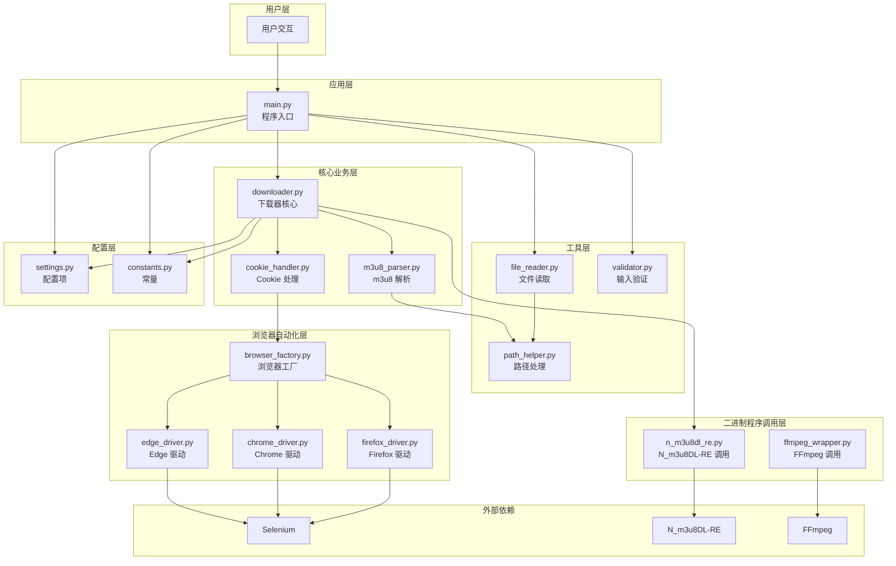
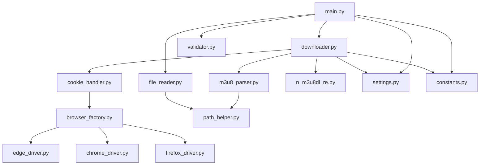
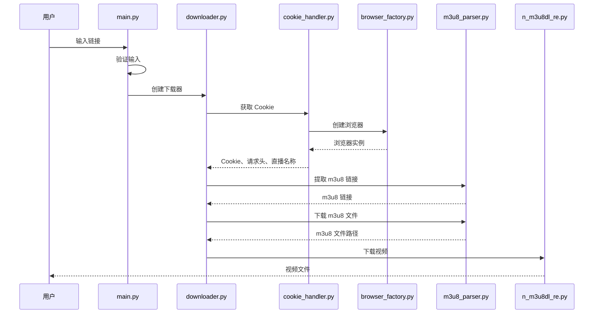
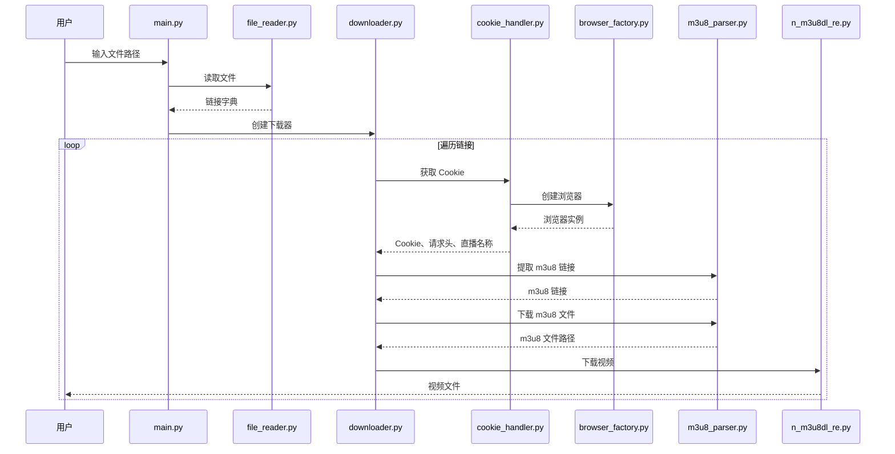

# DESIGN_代码重构与测试

## 一、整体架构设计

### 1.1 架构图



### 1.2 分层设计

#### 1.2.1 用户层

**职责**：处理用户输入和输出

**组件**：
- 命令行界面（CLI）
- 文件选择对话框

#### 1.2.2 应用层

**职责**：协调各模块，实现业务流程

**组件**：
- `main.py`：程序入口，协调各模块

#### 1.2.3 核心业务层

**职责**：实现核心业务逻辑

**组件**：
- `downloader.py`：下载器核心逻辑
- `cookie_handler.py`：Cookie 处理逻辑
- `m3u8_parser.py`：m3u8 解析逻辑

#### 1.2.4 工具层

**职责**：提供通用工具函数

**组件**：
- `file_reader.py`：文件读取工具
- `validator.py`：输入验证工具
- `path_helper.py`：路径处理工具

#### 1.2.5 浏览器自动化层

**职责**：封装浏览器自动化逻辑

**组件**：
- `browser_factory.py`：浏览器工厂
- `edge_driver.py`：Edge 浏览器驱动
- `chrome_driver.py`：Chrome 浏览器驱动
- `firefox_driver.py`：Firefox 浏览器驱动

#### 1.2.6 二进制程序调用层

**职责**：封装外部二进制程序调用

**组件**：
- `n_m3u8dl_re.py`：N_m3u8DL-RE 调用封装
- `ffmpeg_wrapper.py`：FFmpeg 调用封装

#### 1.2.7 配置层

**职责**：管理配置和常量

**组件**：
- `settings.py`：配置项定义
- `constants.py`：常量定义

### 1.3 核心组件说明

#### 1.3.1 main.py

**职责**：程序入口，协调各模块

**主要功能**：
- 显示欢迎信息
- 获取用户输入（下载模式、保存模式、浏览器类型、链接/文件路径）
- 调用相应的下载模式（单个/批量）
- 处理异常和错误

#### 1.3.2 downloader.py

**职责**：下载器核心逻辑

**主要功能**：
- 协调 Cookie 获取、m3u8 解析、视频下载
- 处理单个视频下载
- 处理批量下载
- 管理下载流程

#### 1.3.3 cookie_handler.py

**职责**：Cookie 处理逻辑

**主要功能**：
- 获取浏览器 Cookie
- 获取请求头信息
- 获取直播视频名称
- 管理 Cookie 生命周期

#### 1.3.4 m3u8_parser.py

**职责**：m3u8 解析逻辑

**主要功能**：
- 从浏览器网络日志中提取 m3u8 链接
- 提取基础 URL
- 下载 m3u8 文件
- 重试机制

#### 1.3.5 file_reader.py

**职责**：文件读取工具

**主要功能**：
- 从 CSV 文件读取链接
- 从 Excel 文件读取链接
- 处理不同编码（utf-8、gbk）
- 提取钉钉直播链接

#### 1.3.6 validator.py

**职责**：输入验证工具

**主要功能**：
- 验证用户输入
- 验证文件路径
- 验证 URL 格式
- 提供默认选项

#### 1.3.7 path_helper.py

**职责**：路径处理工具

**主要功能**：
- 清理文件路径
- 拼接路径
- 处理跨平台路径

#### 1.3.8 browser_factory.py

**职责**：浏览器工厂

**主要功能**：
- 根据浏览器类型创建浏览器实例
- 统一浏览器创建逻辑
- 管理浏览器配置

#### 1.3.9 edge_driver.py

**职责**：Edge 浏览器驱动

**主要功能**：
- 创建 Edge 浏览器实例
- 配置 Edge 浏览器选项
- 获取 Edge 浏览器日志

#### 1.3.10 chrome_driver.py

**职责**：Chrome 浏览器驱动

**主要功能**：
- 创建 Chrome 浏览器实例
- 配置 Chrome 浏览器选项
- 获取 Chrome 浏览器日志

#### 1.3.11 firefox_driver.py

**职责**：Firefox 浏览器驱动

**主要功能**：
- 创建 Firefox 浏览器实例
- 配置 Firefox 浏览器选项
- 获取 Firefox 浏览器日志

#### 1.3.12 n_m3u8dl_re.py

**职责**：N_m3u8DL-RE 调用封装

**主要功能**：
- 构建 N_m3u8DL-RE 命令
- 调用 N_m3u8DL-RE 工具
- 处理下载结果

#### 1.3.13 ffmpeg_wrapper.py

**职责**：FFmpeg 调用封装

**主要功能**：
- 构建 FFmpeg 命令
- 调用 FFmpeg 工具
- 处理转换结果

#### 1.3.14 settings.py

**职责**：配置项定义

**主要功能**：
- 定义配置项
- 加载配置
- 保存配置

#### 1.3.15 constants.py

**职责**：常量定义

**主要功能**：
- 定义浏览器类型常量
- 定义下载模式常量
- 定义保存模式常量
- 定义其他常量

## 二、模块依赖关系

### 2.1 依赖关系图



### 2.2 依赖说明

#### 2.2.1 main.py 依赖

- `downloader.py`：下载器核心逻辑
- `file_reader.py`：文件读取工具
- `validator.py`：输入验证工具
- `settings.py`：配置项
- `constants.py`：常量

#### 2.2.2 downloader.py 依赖

- `cookie_handler.py`：Cookie 处理逻辑
- `m3u8_parser.py`：m3u8 解析逻辑
- `n_m3u8dl_re.py`：N_m3u8DL-RE 调用封装
- `settings.py`：配置项
- `constants.py`：常量

#### 2.2.3 cookie_handler.py 依赖

- `browser_factory.py`：浏览器工厂

#### 2.2.4 m3u8_parser.py 依赖

- `path_helper.py`：路径处理工具

#### 2.2.5 file_reader.py 依赖

- `path_helper.py`：路径处理工具

#### 2.2.6 browser_factory.py 依赖

- `edge_driver.py`：Edge 浏览器驱动
- `chrome_driver.py`：Chrome 浏览器驱动
- `firefox_driver.py`：Firefox 浏览器驱动

## 三、接口契约定义

### 3.1 main.py 接口

#### 3.1.1 函数接口

```python
def single_mode() -> None:
    """
    单个视频下载模式。

    功能：
        - 获取用户输入（链接、保存模式、浏览器类型）
        - 调用下载器下载视频
        - 支持继续输入新链接

    输入：
        - 钉钉直播回放分享链接
        - 保存模式（1：默认路径，2：手动选择）
        - 浏览器类型（1：Edge，2：Chrome，3：Firefox）

    输出：
        - 下载的视频文件

    异常：
        - KeyboardInterrupt：用户中断
        - Exception：其他异常
    """
    pass

def batch_mode() -> None:
    """
    批量下载模式。

    功能：
        - 获取用户输入（文件路径、保存模式、浏览器类型）
        - 读取文件中的链接
        - 调用下载器批量下载视频
        - 支持继续输入新文件

    输入：
        - 文件路径（CSV/Excel）
        - 保存模式（1：默认路径，2：手动选择）
        - 浏览器类型（1：Edge，2：Chrome，3：Firefox）

    输出：
        - 下载的视频文件

    异常：
        - KeyboardInterrupt：用户中断
        - Exception：其他异常
    """
    pass
```

### 3.2 downloader.py 接口

#### 3.2.1 类接口

```python
class Downloader:
    """
    下载器类，负责协调 Cookie 获取、m3u8 解析、视频下载。

    Attributes:
        browser: 浏览器实例
        browser_type: 浏览器类型
        save_mode: 保存模式
    """

    def __init__(self, browser_type: str, save_mode: str):
        """
        初始化下载器。

        Args:
            browser_type: 浏览器类型（edge/chrome/firefox）
            save_mode: 保存模式（1：默认路径，2：手动选择）
        """
        pass

    def download_single_video(self, url: str) -> None:
        """
        下载单个视频。

        Args:
            url: 钉钉直播回放分享链接

        Raises:
            Exception: 下载失败时
        """
        pass

    def download_batch_videos(self, urls: dict) -> None:
        """
        批量下载视频。

        Args:
            urls: 链接字典 {index: url}

        Raises:
            Exception: 下载失败时
        """
        pass

    def close(self) -> None:
        """
        关闭浏览器，释放资源。
        """
        pass
```

### 3.3 cookie_handler.py 接口

#### 3.3.1 类接口

```python
class CookieHandler:
    """
    Cookie 处理类，负责获取和管理 Cookie。

    Attributes:
        browser: 浏览器实例
        browser_type: 浏览器类型
    """

    def __init__(self, browser_type: str):
        """
        初始化 Cookie 处理器。

        Args:
            browser_type: 浏览器类型（edge/chrome/firefox）
        """
        pass

    def get_cookie(self, url: str) -> tuple:
        """
        获取 Cookie 和请求头信息。

        Args:
            url: 钉钉直播回放分享链接

        Returns:
            tuple: (browser, cookie_dict, headers, live_name)
                - browser: 浏览器实例
                - cookie_dict: Cookie 字典 {cookie_name: cookie_value}
                - headers: 请求头字典
                - live_name: 直播视频名称

        Raises:
            Exception: 获取失败时
        """
        pass

    def repeat_get_cookie(self, url: str) -> tuple:
        """
        重复获取 Cookie 和请求头信息。

        Args:
            url: 钉钉直播回放分享链接

        Returns:
            tuple: (cookie_dict, headers, live_name)
                - cookie_dict: Cookie 字典 {cookie_name: cookie_value}
                - headers: 请求头字典
                - live_name: 直播视频名称

        Raises:
            Exception: 获取失败时
        """
        pass

    def close(self) -> None:
        """
        关闭浏览器，释放资源。
        """
        pass
```

### 3.4 m3u8_parser.py 接口

#### 3.4.1 类接口

```python
class M3u8Parser:
    """
    m3u8 解析类，负责提取 m3u8 链接和基础 URL。

    Attributes:
        browser: 浏览器实例
        browser_type: 浏览器类型
        max_retries: 最大重试次数
    """

    def __init__(self, browser, browser_type: str, max_retries: int = 5):
        """
        初始化 m3u8 解析器。

        Args:
            browser: 浏览器实例
            browser_type: 浏览器类型（edge/chrome/firefox）
            max_retries: 最大重试次数，默认为 5
        """
        pass

    def fetch_m3u8_links(self, url: str) -> list:
        """
        从浏览器网络日志中提取 m3u8 链接。

        Args:
            url: 钉钉直播回放分享链接

        Returns:
            list: m3u8 链接列表

        Raises:
            Exception: 提取失败时
        """
        pass

    def download_m3u8_file(self, url: str, filename: str, headers: dict) -> str:
        """
        下载 m3u8 文件。

        Args:
            url: m3u8 文件 URL
            filename: 保存的文件名
            headers: 请求头字典

        Returns:
            str: m3u8 文件路径

        Raises:
            Exception: 下载失败时
        """
        pass

    def extract_prefix(self, url: str) -> str:
        """
        提取基础 URL。

        Args:
            url: m3u8 文件 URL

        Returns:
            str: 基础 URL
        """
        pass
```

### 3.5 file_reader.py 接口

#### 3.5.1 类接口

```python
class FileReader:
    """
    文件读取类，负责从 CSV/Excel 文件中读取链接。

    Attributes:
        file_path: 文件路径
    """

    def __init__(self, file_path: str):
        """
        初始化文件读取器。

        Args:
            file_path: 文件路径（CSV/Excel）

        Raises:
            FileNotFoundError: 文件不存在时
            ValueError: 文件格式不支持时
        """
        pass

    def read_links(self) -> dict:
        """
        从文件中读取钉钉直播链接。

        Returns:
            dict: 链接字典 {index: url}

        Raises:
            Exception: 读取失败时
        """
        pass

    @staticmethod
    def clean_file_path(file_path: str) -> str:
        """
        清理文件路径。

        Args:
            file_path: 文件路径

        Returns:
            str: 清理后的文件路径
        """
        pass
```

### 3.6 validator.py 接口

#### 3.6.1 函数接口

```python
def validate_input(prompt: str, valid_options: list, default_option: str = None) -> str:
    """
    验证用户输入。

    Args:
        prompt: 提示信息
        valid_options: 有效选项列表
        default_option: 默认选项

    Returns:
        str: 用户选择的选项

    Raises:
        ValueError: 输入无效时
    """
    pass
```

### 3.7 path_helper.py 接口

#### 3.7.1 函数接口

```python
def clean_file_path(file_path: str) -> str:
    """
    清理文件路径。

    Args:
        file_path: 文件路径

    Returns:
        str: 清理后的文件路径
    """
    pass

def join_paths(*paths: str) -> str:
    """
    拼接路径。

    Args:
        *paths: 路径片段

    Returns:
        str: 拼接后的路径
    """
    pass
```

### 3.8 browser_factory.py 接口

#### 3.8.1 类接口

```python
class BrowserFactory:
    """
    浏览器工厂类，负责创建不同类型的浏览器实例。

    Methods:
        create_browser: 创建浏览器实例
    """

    @staticmethod
    def create_browser(browser_type: str):
        """
        创建浏览器实例。

        Args:
            browser_type: 浏览器类型（edge/chrome/firefox）

        Returns:
            WebDriver: 浏览器实例

        Raises:
            ValueError: 浏览器类型不支持时
        """
        pass
```

### 3.9 edge_driver.py 接口

#### 3.9.1 类接口

```python
class EdgeDriver:
    """
    Edge 浏览器驱动类。

    Attributes:
        driver: Edge 浏览器实例
    """

    def __init__(self):
        """
        初始化 Edge 浏览器驱动。
        """
        pass

    def create_driver(self):
        """
        创建 Edge 浏览器实例。

        Returns:
            WebDriver: Edge 浏览器实例
        """
        pass

    def get_log(self, log_type: str) -> list:
        """
        获取浏览器日志。

        Args:
            log_type: 日志类型

        Returns:
            list: 日志列表
        """
        pass

    def close(self) -> None:
        """
        关闭浏览器，释放资源。
        """
        pass
```

### 3.10 chrome_driver.py 接口

#### 3.10.1 类接口

```python
class ChromeDriver:
    """
    Chrome 浏览器驱动类。

    Attributes:
        driver: Chrome 浏览器实例
    """

    def __init__(self):
        """
        初始化 Chrome 浏览器驱动。
        """
        pass

    def create_driver(self):
        """
        创建 Chrome 浏览器实例。

        Returns:
            WebDriver: Chrome 浏览器实例
        """
        pass

    def get_log(self, log_type: str) -> list:
        """
        获取浏览器日志。

        Args:
            log_type: 日志类型

        Returns:
            list: 日志列表
        """
        pass

    def close(self) -> None:
        """
        关闭浏览器，释放资源。
        """
        pass
```

### 3.11 firefox_driver.py 接口

#### 3.11.1 类接口

```python
class FirefoxDriver:
    """
    Firefox 浏览器驱动类。

    Attributes:
        driver: Firefox 浏览器实例
    """

    def __init__(self):
        """
        初始化 Firefox 浏览器驱动。
        """
        pass

    def create_driver(self):
        """
        创建 Firefox 浏览器实例。

        Returns:
            WebDriver: Firefox 浏览器实例
        """
        pass

    def get_log(self, log_type: str) -> list:
        """
        获取浏览器日志。

        Args:
            log_type: 日志类型

        Returns:
            list: 日志列表
        """
        pass

    def close(self) -> None:
        """
        关闭浏览器，释放资源。
        """
        pass
```

### 3.12 n_m3u8dl_re.py 接口

#### 3.12.1 类接口

```python
class NM3u8DLRE:
    """
    N_m3u8DL-RE 调用类，负责调用 N_m3u8DL-RE 工具。

    Attributes:
        executable_path: 可执行文件路径
    """

    def __init__(self, executable_path: str = None):
        """
        初始化 N_m3u8DL-RE 调用器。

        Args:
            executable_path: 可执行文件路径，默认为 None（自动查找）
        """
        pass

    def download(self, m3u8_file: str, save_name: str, save_dir: str,
                prefix: str, cookies_data: dict = None, headers: dict = None) -> bool:
        """
        下载 m3u8 视频。

        Args:
            m3u8_file: m3u8 文件路径
            save_name: 保存文件名
            save_dir: 保存目录
            prefix: 基础 URL
            cookies_data: Cookie 字典
            headers: 请求头字典

        Returns:
            bool: 下载是否成功

        Raises:
            Exception: 下载失败时
        """
        pass

    def build_command(self, m3u8_file: str, save_name: str, save_dir: str,
                    prefix: str, cookies_data: dict = None, headers: dict = None) -> list:
        """
        构建下载命令。

        Args:
            m3u8_file: m3u8 文件路径
            save_name: 保存文件名
            save_dir: 保存目录
            prefix: 基础 URL
            cookies_data: Cookie 字典
            headers: 请求头字典

        Returns:
            list: 命令列表
        """
        pass

    @staticmethod
    def get_executable_name() -> str:
        """
        获取可执行文件名。

        Returns:
            str: 可执行文件名
        """
        pass
```

### 3.13 settings.py 接口

#### 3.13.1 类接口

```python
class Settings:
    """
    配置类，负责管理配置项。

    Attributes:
        config: 配置字典
    """

    def __init__(self):
        """
        初始化配置。
        """
        pass

    def load(self) -> None:
        """
        加载配置。
        """
        pass

    def save(self) -> None:
        """
        保存配置。
        """
        pass

    def get(self, key: str, default=None):
        """
        获取配置项。

        Args:
            key: 配置项键
            default: 默认值

        Returns:
            配置项值
        """
        pass

    def set(self, key: str, value) -> None:
        """
        设置配置项。

        Args:
            key: 配置项键
            value: 配置项值
        """
        pass
```

### 3.14 constants.py 接口

#### 3.14.1 常量定义

```python
# 浏览器类型
BROWSER_TYPE_EDGE = 'edge'
BROWSER_TYPE_CHROME = 'chrome'
BROWSER_TYPE_FIREFOX = 'firefox'

# 下载模式
DOWNLOAD_MODE_SINGLE = '1'
DOWNLOAD_MODE_BATCH = '2'

# 保存模式
SAVE_MODE_DEFAULT = '1'
SAVE_MODE_MANUAL = '2'

# 最大重试次数
MAX_RETRY_COUNT = 5

# 默认请求头
DEFAULT_HEADERS = {
    'User-Agent': 'Mozilla/5.0 (Windows NT 10.0; Win64; x64) AppleWebKit/537.36 (KHTML, like Gecko) Chrome/120.0.0.0 Safari/537.36',
    'Referer': 'https://n.dingtalk.com/',
    'Accept': 'application/vnd.apple.mpegurl, text/plain, */*',
    'Accept-Language': 'zh-CN,zh;q=0.9,en;q=0.8',
    'Accept-Encoding': 'gzip, deflate, br',
    'Connection': 'keep-alive',
    'Sec-Fetch-Dest': 'document',
    'Sec-Fetch-Mode': 'navigate',
    'Sec-Fetch-Site': 'same-origin',
    'Sec-Fetch-User': '?1',
    'Upgrade-Insecure-Requests': '1'
}

# 默认下载目录
DEFAULT_DOWNLOAD_DIR = 'Downloads'

# 临时文件名
TEMP_M3U8_FILE = 'output.m3u8'
```

## 四、数据流向图

### 4.1 单个视频下载流程



### 4.2 批量下载流程



## 五、异常处理策略

### 5.1 异常分类

#### 5.1.1 用户输入异常

**类型**：
- `ValueError`：输入无效
- `KeyboardInterrupt`：用户中断

**处理策略**：
- 提示用户重新输入
- 提供默认选项
- 优雅退出

#### 5.1.2 文件读取异常

**类型**：
- `FileNotFoundError`：文件不存在
- `UnicodeDecodeError`：编码错误
- `ValueError`：文件格式不支持

**处理策略**：
- 提示用户检查文件路径
- 尝试不同编码
- 提示支持的文件格式

#### 5.1.3 浏览器异常

**类型**：
- `Exception`：浏览器启动失败
- `TimeoutException`：页面加载超时

**处理策略**：
- 提示用户检查浏览器驱动
- 提示用户检查网络连接
- 提供重试机制

#### 5.1.4 m3u8 解析异常

**类型**：
- `Exception`：m3u8 链接提取失败

**处理策略**：
- 提供重试机制（最多 5 次）
- 刷新页面重试
- 提示用户检查链接有效性

#### 5.1.5 下载异常

**类型**：
- `Exception`：下载失败

**处理策略**：
- 提示用户检查网络连接
- 提示用户检查磁盘空间
- 提供重试机制

### 5.2 日志记录策略

#### 5.2.1 日志级别

- `DEBUG`：调试信息
- `INFO`：一般信息
- `WARNING`：警告信息
- `ERROR`：错误信息
- `CRITICAL`：严重错误

#### 5.2.2 日志格式

```
[时间] [级别] [模块] [函数] 消息
```

#### 5.2.3 日志输出

- 控制台输出：INFO 及以上级别
- 文件输出：DEBUG 及以上级别
- 日志文件：`logs/app.log`

### 5.3 错误提示策略

#### 5.3.1 错误提示格式

```
错误：[错误类型]
原因：[错误原因]
解决：[解决建议]
```

#### 5.3.2 错误提示示例

```
错误：FileNotFoundError
原因：文件不存在：xxx.xlsx
解决：请检查文件路径是否正确
```

## 六、设计原则

### 6.1 单一职责原则

每个模块只负责一个功能领域：
- `downloader.py`：只负责下载逻辑
- `cookie_handler.py`：只负责 Cookie 处理
- `m3u8_parser.py`：只负责 m3u8 解析

### 6.2 依赖倒置原则

高层模块不依赖低层模块，都依赖抽象：
- `downloader.py` 依赖 `cookie_handler.py` 的接口
- `cookie_handler.py` 依赖 `browser_factory.py` 的接口

### 6.3 开闭原则

对扩展开放，对修改关闭：
- 添加新的浏览器支持时，只需添加新的驱动类
- 修改浏览器配置时，只需修改对应的驱动类

### 6.4 接口隔离原则

使用最小接口：
- 每个类只暴露必要的公共方法
- 避免接口臃肿

### 6.5 里氏替换原则

子类可以替换父类：
- `EdgeDriver`、`ChromeDriver`、`FirefoxDriver` 可以互相替换
- 所有浏览器驱动类都实现相同的接口

## 七、质量门控

### 7.1 架构图清晰准确

- [ ] 架构图包含所有模块
- [ ] 架构图显示模块间关系
- [ ] 架构图易于理解

### 7.2 接口定义完整

- [ ] 所有公共接口都有定义
- [ ] 接口定义包含参数、返回值、异常
- [ ] 接口定义清晰准确

### 7.3 与现有系统无冲突

- [ ] 新架构与现有功能兼容
- [ ] 新架构不引入新的依赖
- [ ] 新架构保持现有技术栈

### 7.4 设计可行性验证

- [ ] 设计方案可实现
- [ ] 设计方案符合需求
- [ ] 设计方案符合约束
