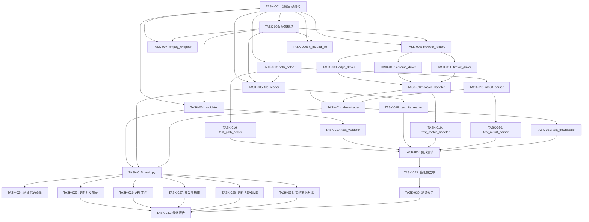

# TASK_代码重构与测试

## 一、任务拆分策略

### 1.1 拆分原则

1. **复杂度可控**：每个任务可以在 1-2 小时内完成
2. **功能独立**：每个任务可以独立验证
3. **依赖清晰**：任务间依赖关系明确
4. **验收明确**：每个任务都有明确的验收标准

### 1.2 任务分类

1. **基础设施任务**：创建目录结构、配置模块
2. **工具模块任务**：创建工具函数模块
3. **浏览器模块任务**：创建浏览器自动化模块
4. **二进制模块任务**：创建二进制程序调用模块
5. **核心模块任务**：创建核心业务逻辑模块
6. **主程序任务**：创建程序入口
7. **测试任务**：编写单元测试和集成测试
8. **文档任务**：更新文档
9. **报告任务**：输出报告

## 二、原子任务列表

### 任务 1：创建项目目录结构

**任务 ID**：TASK-001

**任务名称**：创建项目目录结构

**任务描述**：创建符合开发规范的项目目录结构

**输入契约**：
- 前置依赖：无
- 输入数据：无
- 环境依赖：Python 3.x

**输出契约**：
- 输出数据：完整的目录结构
- 交付物：目录结构
- 验收标准：
  - [ ] 创建 src/dingtalk_downloader 目录
  - [ ] 创建 src/dingtalk_downloader/core 目录
  - [ ] 创建 src/dingtalk_downloader/utils 目录
  - [ ] 创建 src/dingtalk_downloader/binary 目录
  - [ ] 创建 src/dingtalk_downloader/browser 目录
  - [ ] 创建 src/dingtalk_downloader/config 目录
  - [ ] 创建 tests/unit 目录
  - [ ] 创建 tests/integration 目录
  - [ ] 创建 tests/fixtures 目录
  - [ ] 创建 assets 目录
  - [ ] 创建 scripts 目录
  - [ ] 创建 docs/tasks 目录

**实现约束**：
- 技术栈：Python 3.x
- 接口规范：无
- 质量要求：目录结构符合开发规范

**依赖关系**：
- 后置任务：TASK-002, TASK-003, TASK-004, TASK-005, TASK-006
- 并行任务：无

---

### 任务 2：创建配置模块

**任务 ID**：TASK-002

**任务名称**：创建配置模块（constants.py 和 settings.py）

**任务描述**：创建常量定义和配置管理模块

**输入契约**：
- 前置依赖：TASK-001
- 输入数据：无
- 环境依赖：Python 3.x

**输出契约**：
- 输出数据：constants.py 和 settings.py 文件
- 交付物：配置模块代码
- 验收标准：
  - [ ] 创建 src/dingtalk_downloader/config/__init__.py
  - [ ] 创建 src/dingtalk_downloader/config/constants.py
  - [ ] 创建 src/dingtalk_downloader/config/settings.py
  - [ ] 定义浏览器类型常量（BROWSER_TYPE_EDGE, BROWSER_TYPE_CHROME, BROWSER_TYPE_FIREFOX）
  - [ ] 定义下载模式常量（DOWNLOAD_MODE_SINGLE, DOWNLOAD_MODE_BATCH）
  - [ ] 定义保存模式常量（SAVE_MODE_DEFAULT, SAVE_MODE_MANUAL）
  - [ ] 定义最大重试次数常量（MAX_RETRY_COUNT）
  - [ ] 定义默认请求头常量（DEFAULT_HEADERS）
  - [ ] 定义默认下载目录常量（DEFAULT_DOWNLOAD_DIR）
  - [ ] 定义临时文件名常量（TEMP_M3U8_FILE）
  - [ ] 实现 Settings 类
  - [ ] 实现 load() 方法
  - [ ] 实现 save() 方法
  - [ ] 实现 get() 方法
  - [ ] 实现 set() 方法
  - [ ] 添加模块文档字符串
  - [ ] 添加类文档字符串
  - [ ] 添加函数文档字符串

**实现约束**：
- 技术栈：Python 3.x
- 接口规范：遵循 DESIGN 文档中的接口定义
- 质量要求：遵循 PEP 8 规范，添加文档字符串

**依赖关系**：
- 后置任务：TASK-003, TASK-004, TASK-005, TASK-006, TASK-007, TASK-008
- 并行任务：TASK-003, TASK-004, TASK-005

---

### 任务 3：创建工具模块 - path_helper.py

**任务 ID**：TASK-003

**任务名称**：创建路径处理工具模块

**任务描述**：创建路径处理工具函数

**输入契约**：
- 前置依赖：TASK-001, TASK-002
- 输入数据：无
- 环境依赖：Python 3.x

**输出契约**：
- 输出数据：path_helper.py 文件
- 交付物：路径处理工具代码
- 验收标准：
  - [ ] 创建 src/dingtalk_downloader/utils/__init__.py
  - [ ] 创建 src/dingtalk_downloader/utils/path_helper.py
  - [ ] 实现 clean_file_path() 函数
  - [ ] 实现 join_paths() 函数
  - [ ] 添加模块文档字符串
  - [ ] 添加函数文档字符串
  - [ ] 测试通过

**实现约束**：
- 技术栈：Python 3.x, os, pathlib
- 接口规范：遵循 DESIGN 文档中的接口定义
- 质量要求：遵循 PEP 8 规范，添加文档字符串

**依赖关系**：
- 后置任务：TASK-004, TASK-009
- 并行任务：TASK-004, TASK-005

---

### 任务 4：创建工具模块 - validator.py

**任务 ID**：TASK-004

**任务名称**：创建输入验证工具模块

**任务描述**：创建输入验证工具函数

**输入契约**：
- 前置依赖：TASK-001, TASK-002
- 输入数据：无
- 环境依赖：Python 3.x

**输出契约**：
- 输出数据：validator.py 文件
- 交付物：输入验证工具代码
- 验收标准：
  - [ ] 创建 src/dingtalk_downloader/utils/validator.py
  - [ ] 实现 validate_input() 函数
  - [ ] 支持默认选项
  - [ ] 支持输入验证
  - [ ] 添加模块文档字符串
  - [ ] 添加函数文档字符串
  - [ ] 测试通过

**实现约束**：
- 技术栈：Python 3.x
- 接口规范：遵循 DESIGN 文档中的接口定义
- 质量要求：遵循 PEP 8 规范，添加文档字符串

**依赖关系**：
- 后置任务：TASK-007, TASK-008
- 并行任务：TASK-003, TASK-005

---

### 任务 5：创建工具模块 - file_reader.py

**任务 ID**：TASK-005

**任务名称**：创建文件读取工具模块

**任务描述**：创建文件读取工具类，支持 CSV 和 Excel 文件

**输入契约**：
- 前置依赖：TASK-001, TASK-002, TASK-003
- 输入数据：无
- 环境依赖：Python 3.x, pandas, openpyxl, xlrd

**输出契约**：
- 输出数据：file_reader.py 文件
- 交付物：文件读取工具代码
- 验收标准：
  - [ ] 创建 src/dingtalk_downloader/utils/file_reader.py
  - [ ] 实现 FileReader 类
  - [ ] 实现 __init__() 方法
  - [ ] 实现 read_links() 方法
  - [ ] 实现 clean_file_path() 静态方法
  - [ ] 支持 CSV 文件读取
  - [ ] 支持 Excel 文件读取
  - [ ] 支持多种编码（utf-8, gbk）
  - [ ] 提取钉钉直播链接
  - [ ] 添加模块文档字符串
  - [ ] 添加类文档字符串
  - [ ] 添加函数文档字符串
  - [ ] 测试通过

**实现约束**：
- 技术栈：Python 3.x, pandas, openpyxl, xlrd
- 接口规范：遵循 DESIGN 文档中的接口定义
- 质量要求：遵循 PEP 8 规范，添加文档字符串

**依赖关系**：
- 后置任务：TASK-007, TASK-008
- 并行任务：TASK-003, TASK-004

---

### 任务 6：创建二进制模块 - n_m3u8dl_re.py

**任务 ID**：TASK-006

**任务名称**：创建 N_m3u8DL-RE 调用封装模块

**任务描述**：创建 N_m3u8DL-RE 工具调用封装类

**输入契约**：
- 前置依赖：TASK-001, TASK-002
- 输入数据：无
- 环境依赖：Python 3.x, subprocess, platform

**输出契约**：
- 输出数据：n_m3u8dl_re.py 文件
- 交付物：N_m3u8DL-RE 调用封装代码
- 验收标准：
  - [ ] 创建 src/dingtalk_downloader/binary/__init__.py
  - [ ] 创建 src/dingtalk_downloader/binary/n_m3u8dl_re.py
  - [ ] 实现 NM3u8DLRE 类
  - [ ] 实现 __init__() 方法
  - [ ] 实现 download() 方法
  - [ ] 实现 build_command() 方法
  - [ ] 实现 get_executable_name() 静态方法
  - [ ] 支持跨平台（Windows/Linux/macOS）
  - [ ] 添加 Cookie 请求头
  - [ ] 添加 User-Agent 请求头
  - [ ] 添加 Referer 请求头
  - [ ] 添加其他请求头
  - [ ] 添加模块文档字符串
  - [ ] 添加类文档字符串
  - [ ] 添加函数文档字符串
  - [ ] 测试通过

**实现约束**：
- 技术栈：Python 3.x, subprocess, platform
- 接口规范：遵循 DESIGN 文档中的接口定义
- 质量要求：遵循 PEP 8 规范，添加文档字符串

**依赖关系**：
- 后置任务：TASK-009
- 并行任务：TASK-003, TASK-004, TASK-005

---

### 任务 7：创建二进制模块 - ffmpeg_wrapper.py

**任务 ID**：TASK-007

**任务名称**：创建 FFmpeg 调用封装模块

**任务描述**：创建 FFmpeg 工具调用封装类（预留）

**输入契约**：
- 前置依赖：TASK-001, TASK-002
- 输入数据：无
- 环境依赖：Python 3.x, subprocess

**输出契约**：
- 输出数据：ffmpeg_wrapper.py 文件
- 交付物：FFmpeg 调用封装代码
- 验收标准：
  - [ ] 创建 src/dingtalk_downloader/binary/ffmpeg_wrapper.py
  - [ ] 实现 FFmpegWrapper 类
  - [ ] 实现 __init__() 方法
  - [ ] 实现 convert() 方法（预留）
  - [ ] 实现 build_command() 方法（预留）
  - [ ] 添加模块文档字符串
  - [ ] 添加类文档字符串
  - [ ] 添加函数文档字符串

**实现约束**：
- 技术栈：Python 3.x, subprocess
- 接口规范：遵循 DESIGN 文档中的接口定义
- 质量要求：遵循 PEP 8 规范，添加文档字符串

**依赖关系**：
- 后置任务：TASK-009
- 并行任务：TASK-003, TASK-004, TASK-005, TASK-006

---

### 任务 8：创建浏览器模块 - browser_factory.py

**任务 ID**：TASK-008

**任务名称**：创建浏览器工厂模块

**任务描述**：创建浏览器工厂类，统一浏览器创建逻辑

**输入契约**：
- 前置依赖：TASK-001, TASK-002
- 输入数据：无
- 环境依赖：Python 3.x, selenium

**输出契约**：
- 输出数据：browser_factory.py 文件
- 交付物：浏览器工厂代码
- 验收标准：
  - [ ] 创建 src/dingtalk_downloader/browser/__init__.py
  - [ ] 创建 src/dingtalk_downloader/browser/browser_factory.py
  - [ ] 实现 BrowserFactory 类
  - [ ] 实现 create_browser() 静态方法
  - [ ] 支持 Edge 浏览器
  - [ ] 支持 Chrome 浏览器
  - [ ] 支持 Firefox 浏览器
  - [ ] 添加模块文档字符串
  - [ ] 添加类文档字符串
  - [ ] 添加函数文档字符串
  - [ ] 测试通过

**实现约束**：
- 技术栈：Python 3.x, selenium
- 接口规范：遵循 DESIGN 文档中的接口定义
- 质量要求：遵循 PEP 8 规范，添加文档字符串

**依赖关系**：
- 后置任务：TASK-009, TASK-010, TASK-011, TASK-012
- 并行任务：TASK-003, TASK-004, TASK-005, TASK-006, TASK-007

---

### 任务 9：创建浏览器模块 - edge_driver.py

**任务 ID**：TASK-009

**任务名称**：创建 Edge 浏览器驱动模块

**任务描述**：创建 Edge 浏览器驱动类

**输入契约**：
- 前置依赖：TASK-001, TASK-002, TASK-008
- 输入数据：无
- 环境依赖：Python 3.x, selenium

**输出契约**：
- 输出数据：edge_driver.py 文件
- 交付物：Edge 浏览器驱动代码
- 验收标准：
  - [ ] 创建 src/dingtalk_downloader/browser/edge_driver.py
  - [ ] 实现 EdgeDriver 类
  - [ ] 实现 __init__() 方法
  - [ ] 实现 create_driver() 方法
  - [ ] 实现 get_log() 方法
  - [ ] 实现 close() 方法
  - [ ] 配置 Edge 浏览器选项
  - [ ] 启用性能日志
  - [ ] 添加模块文档字符串
  - [ ] 添加类文档字符串
  - [ ] 添加函数文档字符串
  - [ ] 测试通过

**实现约束**：
- 技术栈：Python 3.x, selenium
- 接口规范：遵循 DESIGN 文档中的接口定义
- 质量要求：遵循 PEP 8 规范，添加文档字符串

**依赖关系**：
- 后置任务：TASK-013
- 并行任务：TASK-010, TASK-011

---

### 任务 10：创建浏览器模块 - chrome_driver.py

**任务 ID**：TASK-010

**任务名称**：创建 Chrome 浏览器驱动模块

**任务描述**：创建 Chrome 浏览器驱动类

**输入契约**：
- 前置依赖：TASK-001, TASK-002, TASK-008
- 输入数据：无
- 环境依赖：Python 3.x, selenium

**输出契约**：
- 输出数据：chrome_driver.py 文件
- 交付物：Chrome 浏览器驱动代码
- 验收标准：
  - [ ] 创建 src/dingtalk_downloader/browser/chrome_driver.py
  - [ ] 实现 ChromeDriver 类
  - [ ] 实现 __init__() 方法
  - [ ] 实现 create_driver() 方法
  - [ ] 实现 get_log() 方法
  - [ ] 实现 close() 方法
  - [ ] 配置 Chrome 浏览器选项
  - [ ] 启用性能日志
  - [ ] 添加模块文档字符串
  - [ ] 添加类文档字符串
  - [ ] 添加函数文档字符串
  - [ ] 测试通过

**实现约束**：
- 技术栈：Python 3.x, selenium
- 接口规范：遵循 DESIGN 文档中的接口定义
- 质量要求：遵循 PEP 8 规范，添加文档字符串

**依赖关系**：
- 后置任务：TASK-013
- 并行任务：TASK-009, TASK-011

---

### 任务 11：创建浏览器模块 - firefox_driver.py

**任务 ID**：TASK-011

**任务名称**：创建 Firefox 浏览器驱动模块

**任务描述**：创建 Firefox 浏览器驱动类

**输入契约**：
- 前置依赖：TASK-001, TASK-002, TASK-008
- 输入数据：无
- 环境依赖：Python 3.x, selenium

**输出契约**：
- 输出数据：firefox_driver.py 文件
- 交付物：Firefox 浏览器驱动代码
- 验收标准：
  - [ ] 创建 src/dingtalk_downloader/browser/firefox_driver.py
  - [ ] 实现 FirefoxDriver 类
  - [ ] 实现 __init__() 方法
  - [ ] 实现 create_driver() 方法
  - [ ] 实现 get_log() 方法
  - [ ] 实现 close() 方法
  - [ ] 配置 Firefox 浏览器选项
  - [ ] 启用性能日志
  - [ ] 添加模块文档字符串
  - [ ] 添加类文档字符串
  - [ ] 添加函数文档字符串
  - [ ] 测试通过

**实现约束**：
- 技术栈：Python 3.x, selenium
- 接口规范：遵循 DESIGN 文档中的接口定义
- 质量要求：遵循 PEP 8 规范，添加文档字符串

**依赖关系**：
- 后置任务：TASK-013
- 并行任务：TASK-009, TASK-010

---

### 任务 12：创建核心模块 - cookie_handler.py

**任务 ID**：TASK-012

**任务名称**：创建 Cookie 处理模块

**任务描述**：创建 Cookie 处理类，获取和管理 Cookie

**输入契约**：
- 前置依赖：TASK-001, TASK-002, TASK-008, TASK-009, TASK-010, TASK-011
- 输入数据：无
- 环境依赖：Python 3.x, selenium

**输出契约**：
- 输出数据：cookie_handler.py 文件
- 交付物：Cookie 处理代码
- 验收标准：
  - [ ] 创建 src/dingtalk_downloader/core/__init__.py
  - [ ] 创建 src/dingtalk_downloader/core/cookie_handler.py
  - [ ] 实现 CookieHandler 类
  - [ ] 实现 __init__() 方法
  - [ ] 实现 get_cookie() 方法
  - [ ] 实现 repeat_get_cookie() 方法
  - [ ] 实现 close() 方法
  - [ ] 获取 Cookie 字典
  - [ ] 获取请求头字典
  - [ ] 获取直播视频名称
  - [ ] 添加模块文档字符串
  - [ ] 添加类文档字符串
  - [ ] 添加函数文档字符串
  - [ ] 测试通过

**实现约束**：
- 技术栈：Python 3.x, selenium
- 接口规范：遵循 DESIGN 文档中的接口定义
- 质量要求：遵循 PEP 8 规范，添加文档字符串

**依赖关系**：
- 后置任务：TASK-014, TASK-015
- 并行任务：TASK-013

---

### 任务 13：创建核心模块 - m3u8_parser.py

**任务 ID**：TASK-013

**任务名称**：创建 m3u8 解析模块

**任务描述**：创建 m3u8 解析类，提取 m3u8 链接和基础 URL

**输入契约**：
- 前置依赖：TASK-001, TASK-002, TASK-003
- 输入数据：无
- 环境依赖：Python 3.x, selenium, re, urllib.parse

**输出契约**：
- 输出数据：m3u8_parser.py 文件
- 交付物：m3u8 解析代码
- 验收标准：
  - [ ] 创建 src/dingtalk_downloader/core/m3u8_parser.py
  - [ ] 实现 M3u8Parser 类
  - [ ] 实现 __init__() 方法
  - [ ] 实现 fetch_m3u8_links() 方法
  - [ ] 实现 download_m3u8_file() 方法
  - [ ] 实现 extract_prefix() 方法
  - [ ] 从浏览器网络日志中提取 m3u8 链接
  - [ ] 支持 Edge 和 Chrome 日志格式
  - [ ] 支持 Firefox 日志格式
  - [ ] 实现重试机制（最多 5 次）
  - [ ] 提取基础 URL
  - [ ] 下载 m3u8 文件
  - [ ] 添加模块文档字符串
  - [ ] 添加类文档字符串
  - [ ] 添加函数文档字符串
  - [ ] 测试通过

**实现约束**：
- 技术栈：Python 3.x, selenium, re, urllib.parse
- 接口规范：遵循 DESIGN 文档中的接口定义
- 质量要求：遵循 PEP 8 规范，添加文档字符串

**依赖关系**：
- 后置任务：TASK-014, TASK-015
- 并行任务：TASK-012

---

### 任务 14：创建核心模块 - downloader.py

**任务 ID**：TASK-014

**任务名称**：创建下载器核心模块

**任务描述**：创建下载器类，协调 Cookie 获取、m3u8 解析、视频下载

**输入契约**：
- 前置依赖：TASK-001, TASK-002, TASK-006, TASK-012, TASK-013
- 输入数据：无
- 环境依赖：Python 3.x

**输出契约**：
- 输出数据：downloader.py 文件
- 交付物：下载器核心代码
- 验收标准：
  - [ ] 创建 src/dingtalk_downloader/core/downloader.py
  - [ ] 实现 Downloader 类
  - [ ] 实现 __init__() 方法
  - [ ] 实现 download_single_video() 方法
  - [ ] 实现 download_batch_videos() 方法
  - [ ] 实现 close() 方法
  - [ ] 协调 Cookie 获取
  - [ ] 协调 m3u8 解析
  - [ ] 协调视频下载
  - [ ] 支持单个视频下载
  - [ ] 支持批量下载
  - [ ] 添加模块文档字符串
  - [ ] 添加类文档字符串
  - [ ] 添加函数文档字符串
  - [ ] 测试通过

**实现约束**：
- 技术栈：Python 3.x
- 接口规范：遵循 DESIGN 文档中的接口定义
- 质量要求：遵循 PEP 8 规范，添加文档字符串

**依赖关系**：
- 后置任务：TASK-015
- 并行任务：无

---

### 任务 15：创建主程序入口 - main.py

**任务 ID**：TASK-015

**任务名称**：创建主程序入口

**任务描述**：创建程序入口，协调各模块

**输入契约**：
- 前置依赖：TASK-001, TASK-002, TASK-004, TASK-005, TASK-014
- 输入数据：无
- 环境依赖：Python 3.x

**输出契约**：
- 输出数据：main.py 文件
- 交付物：主程序入口代码
- 验收标准：
  - [ ] 创建 src/dingtalk_downloader/__init__.py
  - [ ] 创建 src/dingtalk_downloader/main.py
  - [ ] 实现 single_mode() 函数
  - [ ] 实现 batch_mode() 函数
  - [ ] 实现主程序入口
  - [ ] 显示欢迎信息
  - [ ] 获取用户输入（下载模式、保存模式、浏览器类型、链接/文件路径）
  - [ ] 调用相应的下载模式
  - [ ] 处理异常和错误
  - [ ] 添加模块文档字符串
  - [ ] 添加函数文档字符串
  - [ ] 测试通过

**实现约束**：
- 技术栈：Python 3.x
- 接口规范：遵循 DESIGN 文档中的接口定义
- 质量要求：遵循 PEP 8 规范，添加文档字符串

**依赖关系**：
- 后置任务：TASK-016
- 并行任务：无

---

### 任务 16：编写单元测试 - path_helper.py

**任务 ID**：TASK-016

**任务名称**：编写 path_helper.py 单元测试

**任务描述**：为 path_helper.py 模块编写单元测试

**输入契约**：
- 前置依赖：TASK-003
- 输入数据：无
- 环境依赖：Python 3.x, pytest, pytest-mock

**输出契约**：
- 输出数据：test_path_helper.py 文件
- 交付物：单元测试代码
- 验收标准：
  - [ ] 创建 tests/unit/test_path_helper.py
  - [ ] 测试 clean_file_path() 函数
  - [ ] 测试 join_paths() 函数
  - [ ] 测试正常情况
  - [ ] 测试边界条件
  - [ ] 测试异常情况
  - [ ] 使用 Mock 模拟外部依赖
  - [ ] 测试通过
  - [ ] 覆盖率 >= 80%

**实现约束**：
- 技术栈：Python 3.x, pytest, pytest-mock
- 接口规范：遵循 pytest 规范
- 质量要求：测试覆盖率 >= 80%

**依赖关系**：
- 后置任务：TASK-022
- 并行任务：TASK-017, TASK-018, TASK-019, TASK-020, TASK-021

---

### 任务 17：编写单元测试 - validator.py

**任务 ID**：TASK-017

**任务名称**：编写 validator.py 单元测试

**任务描述**：为 validator.py 模块编写单元测试

**输入契约**：
- 前置依赖：TASK-004
- 输入数据：无
- 环境依赖：Python 3.x, pytest, pytest-mock

**输出契约**：
- 输出数据：test_validator.py 文件
- 交付物：单元测试代码
- 验收标准：
  - [ ] 创建 tests/unit/test_validator.py
  - [ ] 测试 validate_input() 函数
  - [ ] 测试正常输入
  - [ ] 测试默认选项
  - [ ] 测试无效输入
  - [ ] 使用 Mock 模拟外部依赖
  - [ ] 测试通过
  - [ ] 覆盖率 >= 80%

**实现约束**：
- 技术栈：Python 3.x, pytest, pytest-mock
- 接口规范：遵循 pytest 规范
- 质量要求：测试覆盖率 >= 80%

**依赖关系**：
- 后置任务：TASK-022
- 并行任务：TASK-016, TASK-018, TASK-019, TASK-020, TASK-021

---

### 任务 18：编写单元测试 - file_reader.py

**任务 ID**：TASK-018

**任务名称**：编写 file_reader.py 单元测试

**任务描述**：为 file_reader.py 模块编写单元测试

**输入契约**：
- 前置依赖：TASK-005
- 输入数据：无
- 环境依赖：Python 3.x, pytest, pytest-mock

**输出契约**：
- 输出数据：test_file_reader.py 文件
- 交付物：单元测试代码
- 验收标准：
  - [ ] 创建 tests/unit/test_file_reader.py
  - [ ] 测试 FileReader 类
  - [ ] 测试 read_links() 方法
  - [ ] 测试 clean_file_path() 静态方法
  - [ ] 测试 CSV 文件读取
  - [ ] 测试 Excel 文件读取
  - [ ] 测试不同编码处理
  - [ ] 测试链接提取
  - [ ] 使用 Mock 模拟外部依赖
  - [ ] 测试通过
  - [ ] 覆盖率 >= 80%

**实现约束**：
- 技术栈：Python 3.x, pytest, pytest-mock
- 接口规范：遵循 pytest 规范
- 质量要求：测试覆盖率 >= 80%

**依赖关系**：
- 后置任务：TASK-022
- 并行任务：TASK-016, TASK-017, TASK-019, TASK-020, TASK-021

---

### 任务 19：编写单元测试 - cookie_handler.py

**任务 ID**：TASK-019

**任务名称**：编写 cookie_handler.py 单元测试

**任务描述**：为 cookie_handler.py 模块编写单元测试

**输入契约**：
- 前置依赖：TASK-012
- 输入数据：无
- 环境依赖：Python 3.x, pytest, pytest-mock

**输出契约**：
- 输出数据：test_cookie_handler.py 文件
- 交付物：单元测试代码
- 验收标准：
  - [ ] 创建 tests/unit/test_cookie_handler.py
  - [ ] 测试 CookieHandler 类
  - [ ] 测试 get_cookie() 方法
  - [ ] 测试 repeat_get_cookie() 方法
  - [ ] 测试 close() 方法
  - [ ] 使用 Mock 模拟浏览器
  - [ ] 测试通过
  - [ ] 覆盖率 >= 80%

**实现约束**：
- 技术栈：Python 3.x, pytest, pytest-mock
- 接口规范：遵循 pytest 规范
- 质量要求：测试覆盖率 >= 80%

**依赖关系**：
- 后置任务：TASK-022
- 并行任务：TASK-016, TASK-017, TASK-018, TASK-020, TASK-021

---

### 任务 20：编写单元测试 - m3u8_parser.py

**任务 ID**：TASK-020

**任务名称**：编写 m3u8_parser.py 单元测试

**任务描述**：为 m3u8_parser.py 模块编写单元测试

**输入契约**：
- 前置依赖：TASK-013
- 输入数据：无
- 环境依赖：Python 3.x, pytest, pytest-mock

**输出契约**：
- 输出数据：test_m3u8_parser.py 文件
- 交付物：单元测试代码
- 验收标准：
  - [ ] 创建 tests/unit/test_m3u8_parser.py
  - [ ] 测试 M3u8Parser 类
  - [ ] 测试 fetch_m3u8_links() 方法
  - [ ] 测试 download_m3u8_file() 方法
  - [ ] 测试 extract_prefix() 方法
  - [ ] 测试重试机制
  - [ ] 使用 Mock 模拟浏览器
  - [ ] 测试通过
  - [ ] 覆盖率 >= 80%

**实现约束**：
- 技术栈：Python 3.x, pytest, pytest-mock
- 接口规范：遵循 pytest 规范
- 质量要求：测试覆盖率 >= 80%

**依赖关系**：
- 后置任务：TASK-022
- 并行任务：TASK-016, TASK-017, TASK-018, TASK-019, TASK-021

---

### 任务 21：编写单元测试 - downloader.py

**任务 ID**：TASK-021

**任务名称**：编写 downloader.py 单元测试

**任务描述**：为 downloader.py 模块编写单元测试

**输入契约**：
- 前置依赖：TASK-014
- 输入数据：无
- 环境依赖：Python 3.x, pytest, pytest-mock

**输出契约**：
- 输出数据：test_downloader.py 文件
- 交付物：单元测试代码
- 验收标准：
  - [ ] 创建 tests/unit/test_downloader.py
  - [ ] 测试 Downloader 类
  - [ ] 测试 download_single_video() 方法
  - [ ] 测试 download_batch_videos() 方法
  - [ ] 测试 close() 方法
  - [ ] 使用 Mock 模拟外部依赖
  - [ ] 测试通过
  - [ ] 覆盖率 >= 80%

**实现约束**：
- 技术栈：Python 3.x, pytest, pytest-mock
- 接口规范：遵循 pytest 规范
- 质量要求：测试覆盖率 >= 80%

**依赖关系**：
- 后置任务：TASK-022
- 并行任务：TASK-016, TASK-017, TASK-018, TASK-019, TASK-020

---

### 任务 22：编写集成测试

**任务 ID**：TASK-022

**任务名称**：编写集成测试

**任务描述**：编写完整下载流程的集成测试

**输入契约**：
- 前置依赖：TASK-015, TASK-016, TASK-017, TASK-018, TASK-019, TASK-020, TASK-021
- 输入数据：无
- 环境依赖：Python 3.x, pytest, pytest-mock

**输出契约**：
- 输出数据：test_download_flow.py 文件
- 交付物：集成测试代码
- 验收标准：
  - [ ] 创建 tests/integration/test_download_flow.py
  - [ ] 测试单个视频下载流程
  - [ ] 测试批量下载流程
  - [ ] 测试不同浏览器支持
  - [ ] 测试不同文件格式支持
  - [ ] 使用 Mock 模拟浏览器和二进制工具
  - [ ] 测试通过
  - [ ] 覆盖率 >= 70%

**实现约束**：
- 技术栈：Python 3.x, pytest, pytest-mock
- 接口规范：遵循 pytest 规范
- 质量要求：测试覆盖率 >= 70%

**依赖关系**：
- 后置任务：TASK-023
- 并行任务：无

---

### 任务 23：验证测试覆盖率

**任务 ID**：TASK-023

**任务名称**：验证测试覆盖率

**任务描述**：运行测试并验证覆盖率

**输入契约**：
- 前置依赖：TASK-022
- 输入数据：无
- 环境依赖：Python 3.x, pytest, pytest-cov

**输出契约**：
- 输出数据：覆盖率报告
- 交付物：覆盖率报告
- 验收标准：
  - [ ] 运行所有测试
  - [ ] 核心模块覆盖率 >= 80%
  - [ ] 总体覆盖率 >= 70%
  - [ ] 生成 HTML 格式的覆盖率报告
  - [ ] 覆盖率报告保存到 htmlcov/ 目录

**实现约束**：
- 技术栈：Python 3.x, pytest, pytest-cov
- 接口规范：遵循 pytest 规范
- 质量要求：覆盖率 >= 80%

**依赖关系**：
- 后置任务：TASK-024
- 并行任务：无

---

### 任务 24：验证代码质量

**任务 ID**：TASK-024

**任务名称**：验证代码质量

**任务描述**：使用代码质量工具验证代码质量

**输入契约**：
- 前置依赖：TASK-015
- 输入数据：无
- 环境依赖：Python 3.x, black, flake8, mypy

**输出契约**：
- 输出数据：代码质量报告
- 交付物：代码质量报告
- 验收标准：
  - [ ] 运行 black 格式化检查
  - [ ] 运行 flake8 代码检查
  - [ ] 运行 mypy 类型检查
  - [ ] 修复所有代码质量问题
  - [ ] 代码符合 PEP 8 规范

**实现约束**：
- 技术栈：Python 3.x, black, flake8, mypy
- 接口规范：遵循 PEP 8 规范
- 质量要求：代码质量达标

**依赖关系**：
- 后置任务：TASK-025
- 并行任务：TASK-023

---

### 任务 25：更新开发规范文档

**任务 ID**：TASK-025

**任务名称**：更新开发规范文档

**任务描述**：验证并更新开发规范文档

**输入契约**：
- 前置依赖：TASK-015, TASK-024
- 输入数据：无
- 环境依赖：无

**输出契约**：
- 输出数据：更新后的开发规范文档
- 交付物：开发规范文档
- 验收标准：
  - [ ] 验证现有代码是否符合开发规范
  - [ ] 更新命名规范示例
  - [ ] 更新注释规范示例
  - [ ] 更新项目结构规范
  - [ ] 确保规范文档完整准确

**实现约束**：
- 技术栈：无
- 接口规范：Markdown 格式
- 质量要求：文档完整准确

**依赖关系**：
- 后置任务：TASK-026
- 并行任务：TASK-023

---

### 任务 26：编写 API 文档

**任务 ID**：TASK-026

**任务名称**：编写 API 文档

**任务描述**：编写简单的 API 文档

**输入契约**：
- 前置依赖：TASK-015
- 输入数据：无
- 环境依赖：无

**输出契约**：
- 输出数据：API 文档
- 交付物：API 文档
- 验收标准：
  - [ ] 创建 docs/api/api_reference.md
  - [ ] 文档包含所有公共接口
  - [ ] 文档包含模块说明
  - [ ] 文档包含类说明
  - [ ] 文档包含函数说明
  - [ ] 文档包含参数说明
  - [ ] 文档包含返回值说明
  - [ ] 文档包含异常说明
  - [ ] 文档格式统一

**实现约束**：
- 技术栈：无
- 接口规范：Markdown 格式
- 质量要求：文档完整准确

**依赖关系**：
- 后置任务：TASK-027
- 并行任务：TASK-025

---

### 任务 27：编写开发者指南

**任务 ID**：TASK-027

**任务名称**：编写开发者指南

**任务描述**：编写简单的开发者指南

**输入契约**：
- 前置依赖：TASK-015
- 输入数据：无
- 环境依赖：无

**输出契约**：
- 输出数据：开发者指南
- 交付物：开发者指南
- 验收标准：
  - [ ] 创建 docs/developer_guide.md
  - [ ] 指南包含项目结构说明
  - [ ] 指南包含开发环境搭建
  - [ ] 指南包含开发流程
  - [ ] 指南包含测试流程
  - [ ] 指南包含代码规范
  - [ ] 指南包含提交规范
  - [ ] 指南易于理解

**实现约束**：
- 技术栈：无
- 接口规范：Markdown 格式
- 质量要求：文档完整准确

**依赖关系**：
- 后置任务：TASK-028
- 并行任务：TASK-025, TASK-026

---

### 任务 28：更新 README.md

**任务 ID**：TASK-028

**任务名称**：更新 README.md

**任务描述**：更新 README.md，反映重构后的结构

**输入契约**：
- 前置依赖：TASK-015
- 输入数据：无
- 环境依赖：无

**输出契约**：
- 输出数据：更新后的 README.md
- 交付物：README.md
- 验收标准：
  - [ ] 更新项目简介
  - [ ] 更新功能特性
  - [ ] 更新安装说明
  - [ ] 更新使用指南
  - [ ] 更新项目结构
  - [ ] 更新开发指南
  - [ ] 更新常见问题
  - [ ] 反映重构后的结构

**实现约束**：
- 技术栈：无
- 接口规范：Markdown 格式
- 质量要求：文档完整准确

**依赖关系**：
- 后置任务：TASK-029
- 并行任务：TASK-025, TASK-026, TASK-027

---

### 任务 29：输出重构前后对比

**任务 ID**：TASK-029

**任务名称**：输出重构前后对比

**任务描述**：输出重构前后对比说明

**输入契约**：
- 前置依赖：TASK-015, TASK-024
- 输入数据：无
- 环境依赖：无

**输出契约**：
- 输出数据：重构前后对比文档
- 交付物：重构前后对比文档
- 验收标准：
  - [ ] 创建 docs/tasks/代码重构与测试/REFACTORING_COMPARISON.md
  - [ ] 对比代码结构（模块划分、文件组织）
  - [ ] 对比函数设计（函数数量、重复代码消除）
  - [ ] 对比命名规范（命名风格、命名一致性）
  - [ ] 对比代码质量（注释覆盖率、文档完整性）
  - [ ] 对比内容完整详细
  - [ ] 对比格式清晰易读

**实现约束**：
- 技术栈：无
- 接口规范：Markdown 格式
- 质量要求：对比内容完整详细

**依赖关系**：
- 后置任务：TASK-030
- 并行任务：TASK-025, TASK-026, TASK-027, TASK-028

---

### 任务 30：输出测试报告

**任务 ID**：TASK-030

**任务名称**：输出测试报告

**任务描述**：输出测试结果和覆盖率报告

**输入契约**：
- 前置依赖：TASK-023
- 输入数据：无
- 环境依赖：无

**输出契约**：
- 输出数据：测试报告
- 交付物：测试报告
- 验收标准：
  - [ ] 创建 docs/tasks/代码重构与测试/TEST_REPORT.md
  - [ ] 列出所有测试用例
  - [ ] 说明每个测试用例的目的
  - [ ] 输出每个测试用例的执行结果
  - [ ] 输出通过/失败统计
  - [ ] 输出总体覆盖率
  - [ ] 输出各模块覆盖率
  - [ ] 生成覆盖率报告（HTML 格式）
  - [ ] 覆盖率报告保存到 htmlcov/ 目录

**实现约束**：
- 技术栈：无
- 接口规范：Markdown 格式
- 质量要求：报告完整准确

**依赖关系**：
- 后置任务：TASK-031
- 并行任务：TASK-025, TASK-026, TASK-027, TASK-028, TASK-029

---

### 任务 31：创建最终报告

**任务 ID**：TASK-031

**任务名称**：创建最终报告

**任务描述**：创建项目总结报告和 TODO 列表

**输入契约**：
- 前置依赖：TASK-025, TASK-026, TASK-027, TASK-028, TASK-029, TASK-030
- 输入数据：无
- 环境依赖：无

**输出契约**：
- 输出数据：最终报告和 TODO 列表
- 交付物：最终报告和 TODO 列表
- 验收标准：
  - [ ] 创建 docs/tasks/代码重构与测试/FINAL_代码重构与测试.md
  - [ ] 创建 docs/tasks/代码重构与测试/TODO_代码重构与测试.md
  - [ ] 最终报告包含项目总结
  - [ ] 最终报告包含完成情况
  - [ ] 最终报告包含质量评估
  - [ ] TODO 列表包含待办事项
  - [ ] TODO 列表包含缺少的配置
  - [ ] TODO 列表提供有用的操作指引

**实现约束**：
- 技术栈：无
- 接口规范：Markdown 格式
- 质量要求：报告完整准确

**依赖关系**：
- 后置任务：无
- 并行任务：无

---

## 三、任务依赖图

## 四、任务执行顺序

### 4.1 第一阶段：基础设施（TASK-001 ~ TASK-002）

1. TASK-001：创建项目目录结构
2. TASK-002：创建配置模块

### 4.2 第二阶段：工具模块（TASK-003 ~ TASK-007）

3. TASK-003：创建 path_helper.py
4. TASK-004：创建 validator.py
5. TASK-005：创建 file_reader.py
6. TASK-006：创建 n_m3u8dl_re.py
7. TASK-007：创建 ffmpeg_wrapper.py

### 4.3 第三阶段：浏览器模块（TASK-008 ~ TASK-011）

8. TASK-008：创建 browser_factory.py
9. TASK-009：创建 edge_driver.py
10. TASK-010：创建 chrome_driver.py
11. TASK-011：创建 firefox_driver.py

### 4.4 第四阶段：核心模块（TASK-012 ~ TASK-015）

12. TASK-012：创建 cookie_handler.py
13. TASK-013：创建 m3u8_parser.py
14. TASK-014：创建 downloader.py
15. TASK-015：创建 main.py

### 4.5 第五阶段：单元测试（TASK-016 ~ TASK-021）

16. TASK-016：编写 test_path_helper.py
17. TASK-017：编写 test_validator.py
18. TASK-018：编写 test_file_reader.py
19. TASK-019：编写 test_cookie_handler.py
20. TASK-020：编写 test_m3u8_parser.py
21. TASK-021：编写 test_downloader.py

### 4.6 第六阶段：集成测试（TASK-022）

22. TASK-022：编写集成测试

### 4.7 第七阶段：验证（TASK-023 ~ TASK-024）

23. TASK-023：验证测试覆盖率
24. TASK-024：验证代码质量

### 4.8 第八阶段：文档（TASK-025 ~ TASK-028）

25. TASK-025：更新开发规范文档
26. TASK-026：编写 API 文档
27. TASK-027：编写开发者指南
28. TASK-028：更新 README.md

### 4.9 第九阶段：报告（TASK-029 ~ TASK-031）

29. TASK-029：输出重构前后对比
30. TASK-030：输出测试报告
31. TASK-031：创建最终报告

## 五、质量门控

### 5.1 任务覆盖完整需求

- [ ] 所有任务覆盖所有需求
- [ ] 无遗漏的功能点
- [ ] 无遗漏的测试点

### 5.2 依赖关系无循环

- [ ] 任务依赖关系无循环
- [ ] 任务执行顺序合理
- [ ] 无死锁风险

### 5.3 每个任务都可独立验证

- [ ] 每个任务都有明确的验收标准
- [ ] 每个任务都可以独立测试
- [ ] 每个任务都可以独立提交

### 5.4 复杂度评估合理

- [ ] 每个任务可以在 1-2 小时内完成
- [ ] 任务粒度适中
- [ ] 任务职责单一
