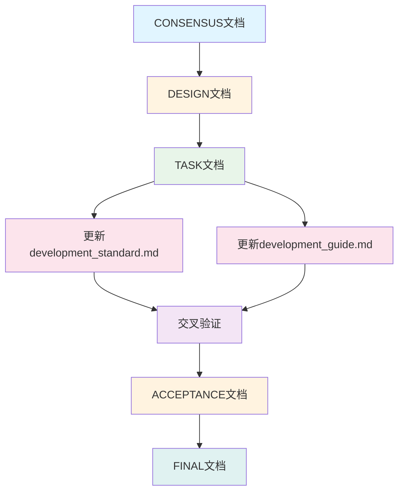

# 文档路径规范更新 - 设计文档

## 一、整体架构设计

### 1.1 更新策略

采用"同步更新、交叉验证"的策略,确保两份文档内容完全一致:

1. **先更新development_standard.md**: 作为主要规范文档,优先更新
2. **再更新development_guide.md**: 作为开发指南,同步更新
3. **交叉验证**: 对比两份文档,确保内容一致

### 1.2 更新原则

- **最小化修改**: 仅修改必要的文件路径相关内容
- **保持结构**: 维持文档原有结构和章节组织
- **格式统一**: 使用统一的格式展示路径信息
- **内容同步**: 确保两份文档内容完全一致

## 二、分层设计

### 2.1 文档分层架构

```
文档更新架构
├── development_standard.md (开发规范)
│   ├── 项目结构规范章节
│   │   ├── 根目录结构
│   │   ├── 目录职责说明
│   │   └── 文件路径规范
│   └── 命名规范章节
│       └── 文件命名规范
└── development_guide.md (开发指南)
    ├── 环境搭建章节
    │   ├── 项目结构说明
    │   └── 文件路径说明
    └── 开发流程章节
        └── 文件操作指南
```

### 2.2 核心组件设计

#### 2.2.1 项目目录结构组件

**组件功能**: 展示完整的项目目录结构

**组件内容**:
```markdown
DingTalk-Live-Playback-Download-Tool/
├── src/                                    # 源代码目录
├── tests/                                  # 测试代码目录
├── assets/                                 # 静态资源目录
│   ├── bin/                                # 外部二进制程序目录
│   ├── template/                           # 模板文件目录
│   └── ICO/                                # 图标资源目录
├── docs/                                   # 文档目录
└── ...
```

**组件位置**:
- development_standard.md: "三、项目结构规范"章节
- development_guide.md: "一、环境搭建"章节

#### 2.2.2 外部二进制文件管理规范组件

**组件功能**: 详细说明外部二进制文件的管理规范

**组件内容**:
```markdown
### 外部二进制文件管理规范

#### 标准化存放路径

**外部二进制文件标准路径**: `assets/bin/`

#### 核心用途与职责范围

- 存放项目所需的外部二进制程序和可执行文件
- 统一管理跨平台的可执行文件(Windows/Linux/macOS)
- 提供统一的二进制文件访问接口
- 便于版本管理和依赖控制

#### 允许存放的文件类型

- Windows平台: `.exe` 可执行文件
- Linux/macOS平台: 无扩展名的可执行文件
- 必要的依赖文件: `.dll`(Windows)、`.so`(Linux)、`.dylib`(macOS)

#### 严格的类型限制

- 仅允许可执行文件和必要的依赖文件
- 不允许配置文件、数据文件、文档文件
- 不允许脚本文件(.bat, .sh, .ps1等)
- 不允许临时文件和缓存文件

#### 统一的文件命名规范

**命名格式**: 使用小写字母、数字、连字符(-)和下划线(_)

**长度限制**: 文件名长度不超过255个字符

**特殊字符规则**:
- 允许: a-z, 0-9, -, _
- 不允许: 空格, @, #, $, %, ^, &, *, (, ), +, =, {, }, [, ], |, \, :, ;, ", ', <, >, ?, /

**示例**:
- ✅ `n_m3u8dl-re.exe`
- ✅ `ffmpeg.exe`
- ❌ `N_m3u8DL-RE.exe`(大写字母)
- ❌ `n m3u8dl re.exe`(空格)
- ❌ `n_m3u8dl-re@v1.0.exe`(特殊字符)

#### 标准路径展示

**N_m3u8DL-RE工具路径**:
- Windows: `assets/bin/N_m3u8DL-RE.exe`
- Linux/macOS: `assets/bin/N_m3u8DL-RE`

**FFmpeg工具路径**:
- Windows: `assets/bin/ffmpeg.exe`
- Linux/macOS: `assets/bin/ffmpeg`
```

**组件位置**:
- development_standard.md: "三、项目结构规范"章节,在"assets/ 静态资源目录"之后
- development_guide.md: "一、环境搭建"章节,在"项目结构说明"之后

#### 2.2.3 批量下载模板路径规范组件

**组件功能**: 说明批量下载模板的存放路径

**组件内容**:
```markdown
### 批量下载模板路径规范

**批量下载模板标准路径**: `assets/template/批量下载模板.xlsx`

该模板文件用于批量下载模式,用户可以填写钉钉直播回放链接,程序会自动读取并批量下载。
```

**组件位置**:
- development_standard.md: "三、项目结构规范"章节
- development_guide.md: "一、环境搭建"章节

#### 2.2.4 ICO文件夹路径规范组件

**组件功能**: 说明ICO文件夹的存放路径

**组件内容**:
```markdown
### ICO文件夹路径规范

**ICO文件夹标准路径**: `assets/ICO/`

**图标文件路径**:
- `assets/ICO/icon-512x512.png`
- `assets/ICO/icon.ico`
- `assets/ICO/icon.png`

该目录存放项目图标和图片资源,用于应用程序的界面展示。
```

**组件位置**:
- development_standard.md: "三、项目结构规范"章节
- development_guide.md: "一、环境搭建"章节

## 三、模块依赖关系图



## 四、接口契约定义

### 4.1 文档更新接口

#### 4.1.1 development_standard.md更新接口

**输入契约**:
- 原始文档路径: `docs/development_standard.md`
- 更新内容: 外部二进制文件管理规范、批量下载模板路径规范、ICO文件夹路径规范
- 更新位置: "三、项目结构规范"章节

**输出契约**:
- 更新后的文档路径: `docs/development_standard.md`
- 更新内容:
  - 完整的项目目录结构树状图
  - 外部二进制文件管理规范详细说明
  - 批量下载模板路径规范说明
  - ICO文件夹路径规范说明
- 验收标准:
  - 所有路径信息使用代码块或加粗文本突出显示
  - 文档结构保持完整
  - 内容准确无误

#### 4.1.2 development_guide.md更新接口

**输入契约**:
- 原始文档路径: `docs/development_guide.md`
- 更新内容: 项目结构说明、文件路径说明
- 更新位置: "一、环境搭建"章节

**输出契约**:
- 更新后的文档路径: `docs/development_guide.md`
- 更新内容:
  - 完整的项目目录结构树状图
  - 外部二进制文件路径说明
  - 批量下载模板路径说明
  - ICO文件夹路径说明
- 验收标准:
  - 所有路径信息使用代码块或加粗文本突出显示
  - 文档结构保持完整
  - 内容准确无误

### 4.2 交叉验证接口

**输入契约**:
- development_standard.md路径: `docs/development_standard.md`
- development_guide.md路径: `docs/development_guide.md`

**输出契约**:
- 验证结果: 通过/不通过
- 不一致项列表: 如有不一致,列出具体差异
- 修正建议: 如有需要,提供修正建议

## 五、数据流向图


## 六、异常处理策略

### 6.1 文档更新异常处理

#### 6.1.1 文件读取失败

**异常描述**: 无法读取原始文档文件

**处理策略**:
- 检查文件路径是否正确
- 检查文件是否存在
- 检查文件权限
- 如无法解决,记录错误并中断执行

#### 6.1.2 文件写入失败

**异常描述**: 无法写入更新后的文档

**处理策略**:
- 检查磁盘空间是否充足
- 检查文件权限
- 检查文件是否被占用
- 如无法解决,记录错误并中断执行

#### 6.1.3 内容不一致

**异常描述**: 两份文档更新后内容不一致

**处理策略**:
- 进行交叉验证
- 列出所有不一致项
- 逐项修正
- 重新验证

### 6.2 路径引用异常处理

#### 6.2.1 路径引用遗漏

**异常描述**: 更新过程中遗漏某些路径引用

**处理策略**:
- 全面搜索文档中所有路径引用
- 验证所有路径引用都已更新
- 补充遗漏的路径引用

#### 6.2.2 路径格式错误

**异常描述**: 路径格式不符合规范

**处理策略**:
- 检查所有路径格式
- 修正不符合规范的路径格式
- 确保使用统一的格式展示

### 6.3 文档结构异常处理

#### 6.3.1 文档结构破坏

**异常描述**: 更新过程中破坏文档原有结构

**处理策略**:
- 检查文档结构是否保持完整
- 恢复被破坏的结构
- 重新验证文档结构

#### 6.3.2 内容冲突

**异常描述**: 更新内容与原有内容冲突

**处理策略**:
- 分析冲突原因
- 协调冲突内容
- 确保内容连贯一致

## 七、更新范围和结构

### 7.1 development_standard.md更新范围

#### 7.1.1 更新章节

**章节**: "三、项目结构规范"

**更新内容**:
1. 更新根目录结构树状图
2. 更新assets目录结构
3. 添加外部二进制文件管理规范
4. 添加批量下载模板路径规范
5. 添加ICO文件夹路径规范

#### 7.1.2 具体更新点

**更新点1**: 根目录结构(第317-364行)

**原内容**:
```markdown
├── assets/ # 静态资源目录(存放外部二进制程序)
│ ├── N_m3u8DL-RE.exe # N_m3u8DL-RE 可执行文件
│ ├── N_m3u8DL-RE # N_m3u8DL-RE 可执行文件(Linux/macOS)
│ ├── ffmpeg.exe # FFmpeg 可执行文件
│ └── ffmpeg # FFmpeg 可执行文件(Linux/macOS)
```

**更新为**:
```markdown
├── assets/ # 静态资源目录
│ ├── bin/ # 外部二进制程序目录
│ │ ├── N_m3u8DL-RE.exe # N_m3u8DL-RE可执行文件(Windows)
│ │ ├── N_m3u8DL-RE # N_m3u8DL-RE可执行文件(Linux/macOS)
│ │ ├── ffmpeg.exe # FFmpeg可执行文件(Windows)
│ │ └── ffmpeg # FFmpeg可执行文件(Linux/macOS)
│ ├── template/ # 模板文件目录
│ │ └── 批量下载模板.xlsx # 批量下载模板文件
│ └── ICO/ # 图标资源目录
│     ├── icon-512x512.png
│     ├── icon.ico
│     └── icon.png
```

**更新点2**: assets目录职责说明(第389-391行)

**原内容**:
```markdown
#### assets/ 静态资源目录

- **职责**:存放外部二进制程序和静态资源
- **原则**:所有外部依赖的可执行文件统一管理
- **命名**:保持原始文件名
```

**更新为**:
```markdown
#### assets/ 静态资源目录

- **职责**:存放外部二进制程序、模板文件和静态资源
- **原则**:所有外部依赖的可执行文件和静态资源统一管理
- **命名**:保持原始文件名,遵循统一的命名规范

##### assets/bin/ 外部二进制程序目录

- **职责**:存放项目所需的外部二进制程序和可执行文件
- **原则**:仅存放可执行文件和必要的依赖文件
- **命名**:使用小写字母、数字、连字符和下划线

##### assets/template/ 模板文件目录

- **职责**:存放项目使用的模板文件
- **原则**:仅存放模板文件,便于用户下载和使用
- **命名**:保持原始文件名,支持中文

##### assets/ICO/ 图标资源目录

- **职责**:存放项目图标和图片资源
- **原则**:仅存放图标和图片文件
- **命名**:使用描述性文件名
```

**更新点3**: 添加外部二进制文件管理规范详细说明

**新增内容**:
```markdown
### 外部二进制文件管理规范

#### 标准化存放路径

**外部二进制文件标准路径**: `assets/bin/`

#### 核心用途与职责范围

- 存放项目所需的外部二进制程序和可执行文件
- 统一管理跨平台的可执行文件(Windows/Linux/macOS)
- 提供统一的二进制文件访问接口
- 便于版本管理和依赖控制

#### 允许存放的文件类型

- Windows平台: `.exe` 可执行文件
- Linux/macOS平台: 无扩展名的可执行文件
- 必要的依赖文件: `.dll`(Windows)、`.so`(Linux)、`.dylib`(macOS)

#### 严格的类型限制

- 仅允许可执行文件和必要的依赖文件
- 不允许配置文件、数据文件、文档文件
- 不允许脚本文件(.bat, .sh, .ps1等)
- 不允许临时文件和缓存文件

#### 统一的文件命名规范

**命名格式**: 使用小写字母、数字、连字符(-)和下划线(_)

**长度限制**: 文件名长度不超过255个字符

**特殊字符规则**:
- 允许: a-z, 0-9, -, _
- 不允许: 空格, @, #, $, %, ^, &, *, (, ), +, =, {, }, [, ], |, \, :, ;, ", ', <, >, ?, /

**示例**:
- ✅ `n_m3u8dl-re.exe`
- ✅ `ffmpeg.exe`
- ❌ `N_m3u8DL-RE.exe`(大写字母)
- ❌ `n m3u8dl re.exe`(空格)
- ❌ `n_m3u8dl-re@v1.0.exe`(特殊字符)

#### 标准路径展示

**N_m3u8DL-RE工具路径**:
- Windows: `assets/bin/N_m3u8DL-RE.exe`
- Linux/macOS: `assets/bin/N_m3u8DL-RE`

**FFmpeg工具路径**:
- Windows: `assets/bin/ffmpeg.exe`
- Linux/macOS: `assets/bin/ffmpeg`
```

**更新点4**: 添加批量下载模板路径规范

**新增内容**:
```markdown
### 批量下载模板路径规范

**批量下载模板标准路径**: `assets/template/批量下载模板.xlsx`

该模板文件用于批量下载模式,用户可以填写钉钉直播回放链接,程序会自动读取并批量下载。
```

**更新点5**: 添加ICO文件夹路径规范

**新增内容**:
```markdown
### ICO文件夹路径规范

**ICO文件夹标准路径**: `assets/ICO/`

**图标文件路径**:
- `assets/ICO/icon-512x512.png`
- `assets/ICO/icon.ico`
- `assets/ICO/icon.png`

该目录存放项目图标和图片资源,用于应用程序的界面展示。
```

### 7.2 development_guide.md更新范围

#### 7.2.1 更新章节

**章节**: "一、环境搭建"

**更新内容**:
1. 添加项目结构说明
2. 添加文件路径说明

#### 7.2.2 具体更新点

**更新点1**: 在"一、环境搭建"章节末尾添加项目结构说明

**新增内容**:
```markdown
### 1.9 项目结构说明

#### 1.9.1 完整项目目录结构

```markdown
DingTalk-Live-Playback-Download-Tool/
├── src/                                    # 源代码目录
│   └── dingtalk_downloader/                # 项目包名
│       ├── __init__.py
│       ├── main.py                         # 程序入口文件
│       ├── core/                           # 核心业务逻辑模块
│       ├── utils/                          # 工具函数模块
│       ├── binary/                         # 二进制程序调用模块
│       ├── browser/                        # 浏览器自动化模块
│       └── config/                         # 配置管理模块
├── tests/                                  # 测试代码目录
│   ├── unit/                               # 单元测试
│   ├── integration/                        # 集成测试
│   └── fixtures/                           # 测试数据
│       ├── sample_links.csv
│       └── sample_links.xlsx
├── assets/                                 # 静态资源目录
│   ├── bin/                                # 外部二进制程序目录
│   │   ├── N_m3u8DL-RE.exe                 # N_m3u8DL-RE可执行文件(Windows)
│   │   ├── N_m3u8DL-RE                     # N_m3u8DL-RE可执行文件(Linux/macOS)
│   │   ├── ffmpeg.exe                      # FFmpeg可执行文件(Windows)
│   │   └── ffmpeg                          # FFmpeg可执行文件(Linux/macOS)
│   ├── template/                           # 模板文件目录
│   │   └── 批量下载模板.xlsx               # 批量下载模板文件
│   └── ICO/                                # 图标资源目录
│       ├── icon-512x512.png
│       ├── icon.ico
│       └── icon.png
├── docs/                                   # 文档目录
│   ├── development_standard.md             # 开发规范
│   ├── development_guide.md               # 开发指南
│   └── project_status.md                  # 项目现状记录
├── scripts/                                # 辅助脚本目录
├── requirements.txt                        # 依赖清单
├── requirements-dev.txt                    # 开发依赖清单
├── .gitignore                              # Git忽略文件
├── .env.example                            # 环境变量示例文件
├── README.md                               # 项目说明
├── LICENSE                                 # 许可证
├── pyproject.toml                          # 项目配置文件
└── setup.cfg                               # 安装配置文件
```

#### 1.9.2 文件路径说明

##### 外部二进制文件路径

**外部二进制文件标准路径**: `assets/bin/`

**N_m3u8DL-RE工具路径**:
- Windows: `assets/bin/N_m3u8DL-RE.exe`
- Linux/macOS: `assets/bin/N_m3u8DL-RE`

**FFmpeg工具路径**:
- Windows: `assets/bin/ffmpeg.exe`
- Linux/macOS: `assets/bin/ffmpeg`

##### 批量下载模板路径

**批量下载模板标准路径**: `assets/template/批量下载模板.xlsx`

该模板文件用于批量下载模式,用户可以填写钉钉直播回放链接,程序会自动读取并批量下载。

##### ICO文件夹路径

**ICO文件夹标准路径**: `assets/ICO/`

**图标文件路径**:
- `assets/ICO/icon-512x512.png`
- `assets/ICO/icon.ico`
- `assets/ICO/icon.png`

该目录存放项目图标和图片资源,用于应用程序的界面展示。
```

## 八、设计原则

### 8.1 严格按照任务范围

- 仅更新development_standard.md和development_guide.md
- 不更新其他文档
- 不修改实际项目文件结构
- 不修改代码或配置文件

### 8.2 确保与现有系统架构一致

- 保持文档原有结构和章节组织
- 遵循现有的文档格式和风格
- 使用现有的术语和命名规范
- 保持文档的连贯性和一致性

### 8.3 复用现有组件和模式

- 复用现有的文档结构模式
- 复用现有的格式规范
- 复用现有的术语和命名
- 避免引入新的格式和规范

## 九、质量门控

### 9.1 架构图清晰准确

- ✅ 模块依赖关系图清晰易懂
- ✅ 数据流向图准确反映更新流程
- ✅ 组件设计合理,职责明确

### 9.2 接口定义完整

- ✅ 文档更新接口定义完整
- ✅ 交叉验证接口定义完整
- ✅ 输入输出契约明确

### 9.3 与现有系统无冲突

- ✅ 不破坏文档原有结构
- ✅ 不引入新的格式和规范
- ✅ 保持文档的连贯性和一致性

### 9.4 设计可行性验证

- ✅ 更新范围明确可行
- ✅ 更新内容具体可操作
- ✅ 异常处理策略完善
- ✅ 质量保证措施到位

## 十、下一步行动

进入Atomize阶段,拆分原子任务,制定详细执行计划。
