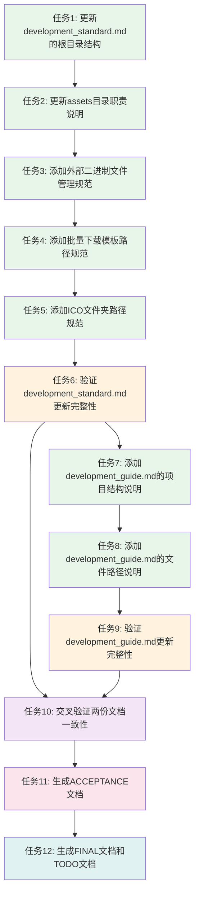

# 文档路径规范更新 - 任务文档

## 一、原子任务拆分

### 任务1: 更新development_standard.md的根目录结构

**输入契约**:
- 前置依赖: ALIGNMENT、CONSENSUS、DESIGN文档已完成
- 输入数据: development_standard.md原始文档
- 环境依赖: 文件读写权限

**输出契约**:
- 输出数据: 更新后的development_standard.md
- 交付物: 根目录结构已更新为包含bin、template、ICO子目录
- 验收标准:
  - assets目录结构已更新
  - 所有路径信息使用代码块格式展示
  - 文档结构保持完整

**实现约束**:
- 技术栈: Markdown文档编辑
- 接口规范: 遵循DESIGN文档中的更新点1
- 质量要求: 准确无误,格式规范

**依赖关系**:
- 后置任务: 任务2
- 并行任务: 无

---

### 任务2: 更新development_standard.md的assets目录职责说明

**输入契约**:
- 前置依赖: 任务1已完成
- 输入数据: 更新后的development_standard.md
- 环境依赖: 文件读写权限

**输出契约**:
- 输出数据: 更新后的development_standard.md
- 交付物: assets目录职责说明已更新,包含bin、template、ICO子目录的详细说明
- 验收标准:
  - assets/bin目录的职责说明已添加
  - assets/template目录的职责说明已添加
  - assets/ICO目录的职责说明已添加
  - 所有路径信息使用代码块或加粗文本突出显示

**实现约束**:
- 技术栈: Markdown文档编辑
- 接口规范: 遵循DESIGN文档中的更新点2
- 质量要求: 准确无误,格式规范

**依赖关系**:
- 前置任务: 任务1
- 后置任务: 任务3
- 并行任务: 无

---

### 任务3: 添加development_standard.md的外部二进制文件管理规范

**输入契约**:
- 前置依赖: 任务2已完成
- 输入数据: 更新后的development_standard.md
- 环境依赖: 文件读写权限

**输出契约**:
- 输出数据: 更新后的development_standard.md
- 交付物: 外部二进制文件管理规范详细说明已添加
- 验收标准:
  - 标准化存放路径已明确
  - 核心用途与职责范围已详细阐述
  - 允许存放的文件类型已明确列出
  - 严格的类型限制已明确
  - 统一的文件命名规范已制定
  - 标准路径已使用代码块格式展示

**实现约束**:
- 技术栈: Markdown文档编辑
- 接口规范: 遵循DESIGN文档中的更新点3
- 质量要求: 准确无误,格式规范,内容完整

**依赖关系**:
- 前置任务: 任务2
- 后置任务: 任务4
- 并行任务: 无

---

### 任务4: 添加development_standard.md的批量下载模板路径规范

**输入契约**:
- 前置依赖: 任务3已完成
- 输入数据: 更新后的development_standard.md
- 环境依赖: 文件读写权限

**输出契约**:
- 输出数据: 更新后的development_standard.md
- 交付物: 批量下载模板路径规范已添加
- 验收标准:
  - 批量下载模板标准路径已明确
  - 路径信息使用加粗文本突出显示
  - 模板用途说明已添加

**实现约束**:
- 技术栈: Markdown文档编辑
- 接口规范: 遵循DESIGN文档中的更新点4
- 质量要求: 准确无误,格式规范

**依赖关系**:
- 前置任务: 任务3
- 后置任务: 任务5
- 并行任务: 无

---

### 任务5: 添加development_standard.md的ICO文件夹路径规范

**输入契约**:
- 前置依赖: 任务4已完成
- 输入数据: 更新后的development_standard.md
- 环境依赖: 文件读写权限

**输出契约**:
- 输出数据: 更新后的development_standard.md
- 交付物: ICO文件夹路径规范已添加
- 验收标准:
  - ICO文件夹标准路径已明确
  - 图标文件路径已列出
  - 路径信息使用代码块格式展示
  - 目录用途说明已添加

**实现约束**:
- 技术栈: Markdown文档编辑
- 接口规范: 遵循DESIGN文档中的更新点5
- 质量要求: 准确无误,格式规范

**依赖关系**:
- 前置任务: 任务4
- 后置任务: 任务6
- 并行任务: 无

---

### 任务6: 验证development_standard.md更新完整性

**输入契约**:
- 前置依赖: 任务5已完成
- 输入数据: 更新后的development_standard.md
- 环境依赖: 文件读取权限

**输出契约**:
- 输出数据: 验证结果报告
- 交付物: development_standard.md更新完整性验证通过
- 验收标准:
  - 所有更新点都已执行
  - 所有路径信息都使用代码块或加粗文本突出显示
  - 文档结构保持完整
  - 内容准确无误

**实现约束**:
- 技术栈: 文档验证
- 接口规范: 遵循CONSENSUS文档中的验收标准
- 质量要求: 全面验证,无遗漏

**依赖关系**:
- 前置任务: 任务5
- 后置任务: 任务7
- 并行任务: 无

---

### 任务7: 添加development_guide.md的项目结构说明

**输入契约**:
- 前置依赖: 任务6已完成
- 输入数据: development_guide.md原始文档
- 环境依赖: 文件读写权限

**输出契约**:
- 输出数据: 更新后的development_guide.md
- 交付物: 项目结构说明已添加到"一、环境搭建"章节
- 验收标准:
  - 完整的项目目录结构树状图已添加
  - 所有路径信息使用代码块格式展示
  - 文档结构保持完整

**实现约束**:
- 技术栈: Markdown文档编辑
- 接口规范: 遵循DESIGN文档中的更新点1
- 质量要求: 准确无误,格式规范

**依赖关系**:
- 前置任务: 任务6
- 后置任务: 任务8
- 并行任务: 无

---

### 任务8: 添加development_guide.md的文件路径说明

**输入契约**:
- 前置依赖: 任务7已完成
- 输入数据: 更新后的development_guide.md
- 环境依赖: 文件读写权限

**输出契约**:
- 输出数据: 更新后的development_guide.md
- 交付物: 文件路径说明已添加
- 验收标准:
  - 外部二进制文件路径说明已添加
  - 批量下载模板路径说明已添加
  - ICO文件夹路径说明已添加
  - 所有路径信息使用代码块或加粗文本突出显示

**实现约束**:
- 技术栈: Markdown文档编辑
- 接口规范: 遵循DESIGN文档中的更新点2
- 质量要求: 准确无误,格式规范

**依赖关系**:
- 前置任务: 任务7
- 后置任务: 任务9
- 并行任务: 无

---

### 任务9: 验证development_guide.md更新完整性

**输入契约**:
- 前置依赖: 任务8已完成
- 输入数据: 更新后的development_guide.md
- 环境依赖: 文件读取权限

**输出契约**:
- 输出数据: 验证结果报告
- 交付物: development_guide.md更新完整性验证通过
- 验收标准:
  - 所有更新点都已执行
  - 所有路径信息都使用代码块或加粗文本突出显示
  - 文档结构保持完整
  - 内容准确无误

**实现约束**:
- 技术栈: 文档验证
- 接口规范: 遵循CONSENSUS文档中的验收标准
- 质量要求: 全面验证,无遗漏

**依赖关系**:
- 前置任务: 任务8
- 后置任务: 任务10
- 并行任务: 无

---

### 任务10: 交叉验证两份文档一致性

**输入契约**:
- 前置依赖: 任务6、任务9已完成
- 输入数据: 更新后的development_standard.md和development_guide.md
- 环境依赖: 文件读取权限

**输出契约**:
- 输出数据: 一致性验证报告
- 交付物: 两份文档内容一致性验证通过
- 验收标准:
  - 两份文档中的assets目录结构完全一致
  - 两份文档中的文件路径描述完全一致
  - 两份文档中的文件命名规范完全一致
  - 两份文档中的路径展示格式完全一致
  - 两份文档中的项目目录结构完全一致
  - 两份文档中的术语使用完全一致

**实现约束**:
- 技术栈: 文档对比验证
- 接口规范: 遵循CONSENSUS文档中的文档一致性验收标准
- 质量要求: 全面对比,无差异

**依赖关系**:
- 前置任务: 任务6、任务9
- 后置任务: 任务11
- 并行任务: 无

---

### 任务11: 生成ACCEPTANCE文档

**输入契约**:
- 前置依赖: 任务10已完成
- 输入数据: 所有任务的执行结果和验证报告
- 环境依赖: 文件写入权限

**输出契约**:
- 输出数据: ACCEPTANCE_文档路径规范更新.md
- 交付物: 任务完成情况记录文档
- 验收标准:
  - 所有任务的执行情况已记录
  - 所有验证结果已记录
  - 所有问题和解决方案已记录

**实现约束**:
- 技术栈: Markdown文档编辑
- 接口规范: 遵循6A工作流规范
- 质量要求: 完整准确,格式规范

**依赖关系**:
- 前置任务: 任务10
- 后置任务: 任务12
- 并行任务: 无

---

### 任务12: 生成FINAL文档和TODO文档

**输入契约**:
- 前置依赖: 任务11已完成
- 输入数据: 所有任务的执行结果和验证报告
- 环境依赖: 文件写入权限

**输出契约**:
- 输出数据: FINAL_文档路径规范更新.md和TODO_文档路径规范更新.md
- 交付物: 项目总结报告和待办事项清单
- 验收标准:
  - FINAL文档包含项目总结报告
  - TODO文档包含待办事项清单
  - 所有待办事项都有明确的操作指引

**实现约束**:
- 技术栈: Markdown文档编辑
- 接口规范: 遵循6A工作流规范
- 质量要求: 完整准确,格式规范

**依赖关系**:
- 前置任务: 任务11
- 后置任务: 无
- 并行任务: 无

---

## 二、任务依赖图

## 三、拆分原则

### 3.1 复杂度可控

- 每个任务专注于一个明确的更新点
- 任务逻辑简单清晰
- 便于AI高成功率交付

### 3.2 按功能模块分解

- 任务1-5: 更新development_standard.md
- 任务6: 验证development_standard.md
- 任务7-8: 更新development_guide.md
- 任务9: 验证development_guide.md
- 任务10: 交叉验证两份文档
- 任务11-12: 生成最终文档

### 3.3 确保任务原子性和独立性

- 每个任务都有明确的输入和输出
- 每个任务都有明确的验收标准
- 任务之间依赖关系清晰

### 3.4 有明确的验收标准

- 每个任务都有具体的验收标准
- 验收标准可测试、可验证
- 便于质量保证

### 3.5 依赖关系清晰

- 任务按依赖顺序执行
- 避免循环依赖
- 便于任务调度和管理

## 四、质量门控

### 4.1 任务覆盖完整需求

- ✅ 所有更新点都已分配到具体任务
- ✅ 所有文档都已包含在任务中
- ✅ 所有验证步骤都已包含在任务中

### 4.2 依赖关系无循环

- ✅ 任务依赖关系清晰
- ✅ 无循环依赖
- ✅ 任务执行顺序合理

### 4.3 每个任务都可独立验证

- ✅ 每个任务都有明确的验收标准
- ✅ 每个任务都有明确的输入输出
- ✅ 每个任务都可以独立测试

### 4.4 复杂度评估合理

- ✅ 每个任务复杂度可控
- ✅ 任务逻辑简单清晰
- ✅ 便于AI高成功率交付

## 五、下一步行动

进入Automate阶段,按任务依赖顺序执行,对每个子任务执行:
- 执行前检查(验证输入契约、环境准备、依赖满足)
- 实现核心逻辑(按设计文档编写代码)
- 编写单元测试(边界条件、异常情况)
- 运行验证测试
- 更新相关文档
- 每完成一个任务立即验证
