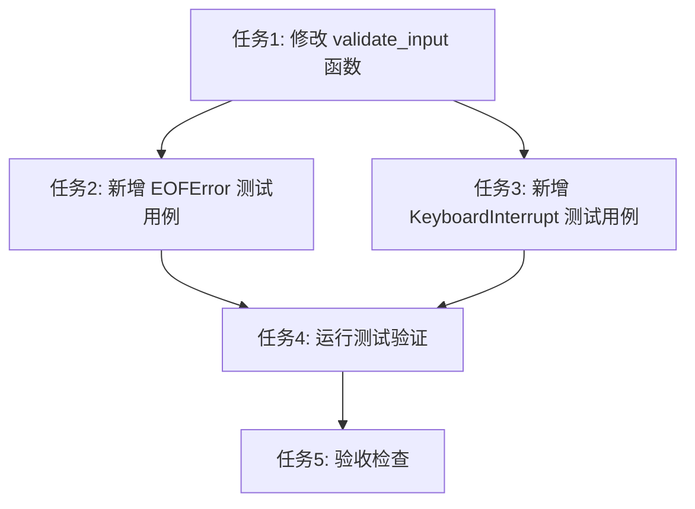

# TASK_输入验证错误修复

## 任务依赖图

## 原子任务列表

### 任务1: 修改 validate_input 函数

**输入契约**：
- 前置依赖：DESIGN 文档
- 输入数据：现有 `validator.py` 文件
- 环境依赖：Python 3.x

**输出契约**：
- 输出数据：修改后的 `validator.py` 文件
- 交付物：增强异常处理的 `validate_input` 函数
- 验收标准：
  - 添加 `try-except` 块捕获 `EOFError` 和 `KeyboardInterrupt`
  - `EOFError` 处理：有默认选项时返回默认选项，否则重新抛出
  - `KeyboardInterrupt` 处理：打印提示信息并重新抛出
  - 保持函数签名不变
  - 保持正常流程不变
  - 添加适当的中文注释
  - 更新文档字符串

**实现约束**：
- 技术栈：Python 3.x
- 接口规范：保持现有函数签名
- 质量要求：代码风格与现有代码一致

**依赖关系**：
- 后置任务：任务2、任务3
- 并行任务：无

---

### 任务2: 新增 EOFError 测试用例

**输入契约**：
- 前置依赖：任务1完成
- 输入数据：现有 `test_validator.py` 文件
- 环境依赖：pytest, pytest-mock

**输出契约**：
- 输出数据：修改后的 `test_validator.py` 文件
- 交付物：覆盖 EOFError 场景的测试用例
- 验收标准：
  - 测试有默认选项时的 EOFError 处理
  - 测试无默认选项时的 EOFError 处理
  - 验证返回值正确
  - 验证异常正确抛出
  - 测试用例有完整的文档字符串
  - 测试用例命名清晰

**实现约束**：
- 技术栈：pytest, pytest-mock
- 接口规范：使用 `@patch` 装饰器模拟 `input`
- 质量要求：测试用例风格与现有测试一致

**依赖关系**：
- 后置任务：任务4
- 并行任务：任务3

---

### 任务3: 新增 KeyboardInterrupt 测试用例

**输入契约**：
- 前置依赖：任务1完成
- 输入数据：现有 `test_validator.py` 文件
- 环境依赖：pytest, pytest-mock

**输出契约**：
- 输出数据：修改后的 `test_validator.py` 文件
- 交付物：覆盖 KeyboardInterrupt 场景的测试用例
- 验收标准：
  - 测试 KeyboardInterrupt 处理
  - 验证异常正确抛出
  - 验证提示信息正确打印
  - 测试用例有完整的文档字符串
  - 测试用例命名清晰

**实现约束**：
- 技术栈：pytest, pytest-mock
- 接口规范：使用 `@patch` 装饰器模拟 `input`
- 质量要求：测试用例风格与现有测试一致

**依赖关系**：
- 后置任务：任务4
- 并行任务：任务2

---

### 任务4: 运行测试验证

**输入契约**：
- 前置依赖：任务2、任务3完成
- 输入数据：修改后的代码和测试文件
- 环境依赖：pytest

**输出契约**：
- 输出数据：测试运行结果
- 交付物：测试通过报告
- 验收标准：
  - 所有现有测试通过
  - 所有新增测试通过
  - 测试覆盖率满足要求
  - 无测试失败或错误

**实现约束**：
- 技术栈：pytest
- 接口规范：使用 pytest 运行测试
- 质量要求：所有测试必须通过

**依赖关系**：
- 后置任务：任务5
- 并行任务：无

---

### 任务5: 验收检查

**输入契约**：
- 前置依赖：任务4完成
- 输入数据：测试运行结果
- 环境依赖：无

**输出契约**：
- 输出数据：验收报告
- 交付物：ACCEPTANCE 文档
- 验收标准：
  - 所有需求已实现
  - 验收标准全部满足
  - 所有测试通过
  - 功能完整性验证
  - 实现与设计文档一致
  - 代码质量符合要求

**实现约束**：
- 技术栈：无
- 接口规范：手动验收
- 质量要求：严格按照验收标准检查

**依赖关系**：
- 后置任务：无
- 并行任务：无

---

## 拆分原则

### 1. 复杂度可控
- 每个任务都可以独立完成
- 每个任务都有明确的验收标准
- 任务之间依赖关系清晰

### 2. 功能模块分解
- 任务1：核心功能修改
- 任务2、任务3：测试用例编写（可并行）
- 任务4：测试验证
- 任务5：验收检查

### 3. 明确的验收标准
- 每个任务都有具体的验收标准
- 验收标准可测试、可验证
- 验收标准与设计文档一致

### 4. 依赖关系清晰
- 任务1是前置任务
- 任务2、任务3可并行
- 任务4依赖任务2、任务3
- 任务5是最终验收

## 质量门控

- ✅ 任务覆盖完整需求
- ✅ 依赖关系无循环
- ✅ 每个任务都可独立验证
- ✅ 复杂度评估合理
