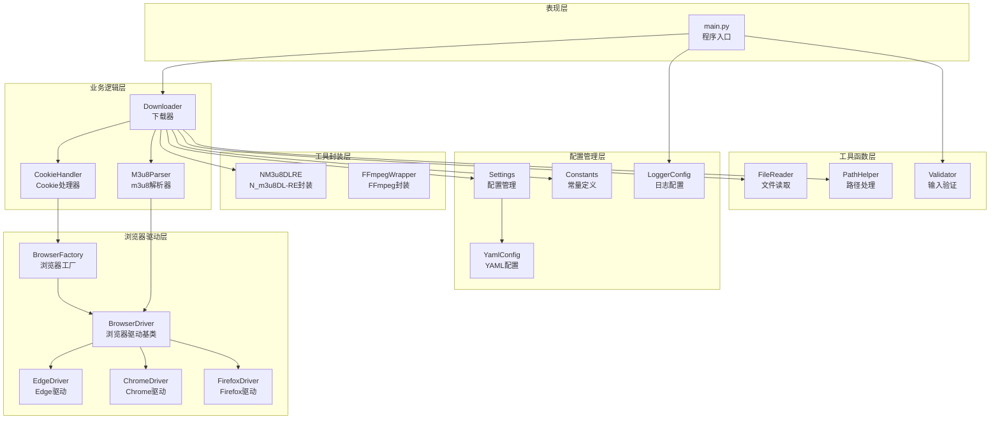
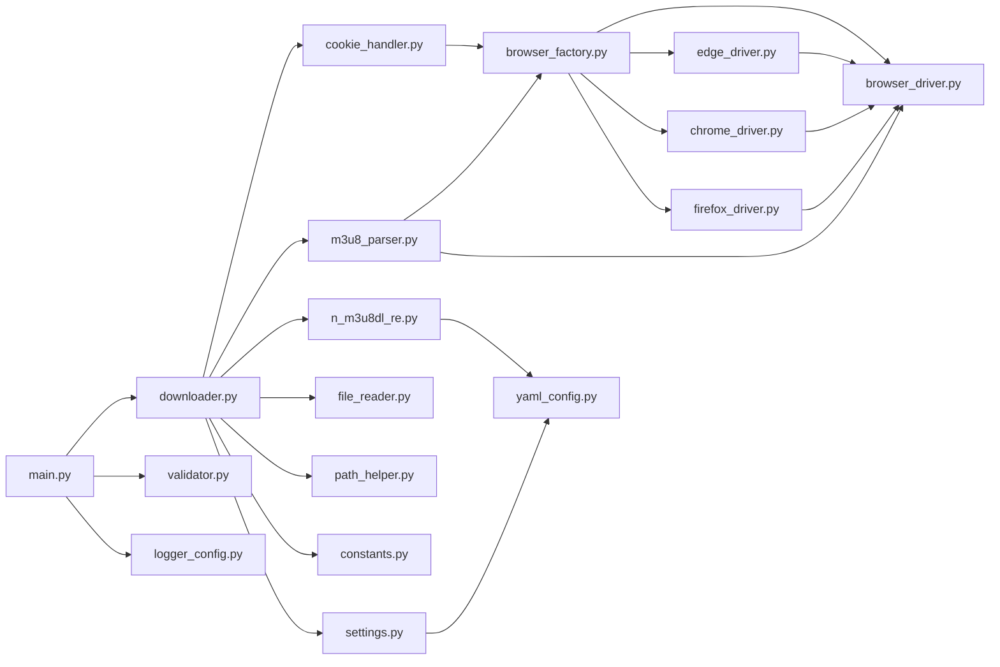
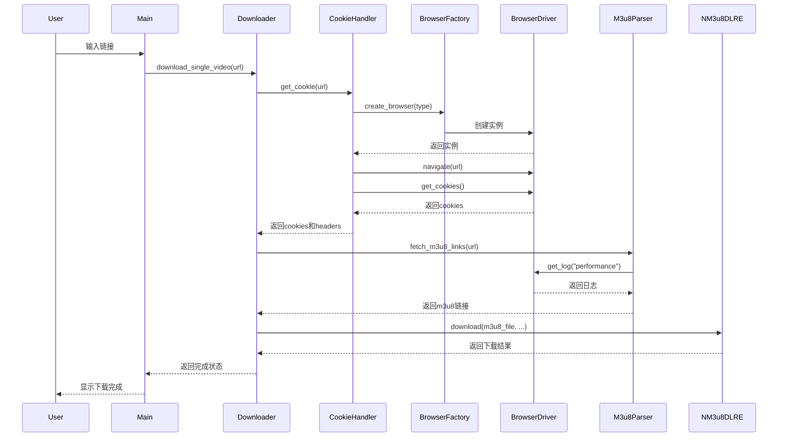

# DESIGN_系统性代码重构

## 设计概述

本文档描述系统性代码重构的详细设计方案,包括整体架构、核心组件、接口契约、数据流向和异常处理策略。

**设计目标**:
- 消除代码重复,提高代码复用性
- 优化代码结构,提高可读性和可维护性
- 修复潜在缺陷,提高代码健壮性
- 优化性能,提高执行效率
- 保持功能一致性,确保向后兼容

**设计原则**:
- 单一职责原则(SRP): 每个类/方法只做一件事
- 开闭原则(OCP): 对扩展开放,对修改关闭
- 里氏替换原则(LSP): 子类可以替换父类
- 接口隔离原则(ISP): 接口应该小而专一
- 依赖倒置原则(DIP): 依赖抽象而非具体实现
- DRY原则(Don't Repeat Yourself): 消除重复代码
- KISS原则(Keep It Simple, Stupid): 保持简单

## 整体架构图



## 分层设计

### 表现层(Presentation Layer)

**职责**: 负责用户交互和程序入口

**组件**:
- `main.py`: 程序入口,处理用户输入,调用业务逻辑

**设计要点**:
- 保持简洁,仅负责输入输出
- 不包含业务逻辑
- 统一异常处理,调用sys.exit()

### 业务逻辑层(Business Logic Layer)

**职责**: 实现核心业务逻辑

**组件**:
- `Downloader`: 下载器,协调Cookie获取、m3u8解析、视频下载
- `CookieHandler`: Cookie处理器,获取和管理Cookie
- `M3u8Parser`: m3u8解析器,从网络日志中提取m3u8链接

**设计要点**:
- 单一职责,每个类只负责一个业务领域
- 依赖抽象,不依赖具体实现
- 抛出异常,不直接调用sys.exit()

### 浏览器驱动层(Browser Driver Layer)

**职责**: 封装浏览器操作,提供统一的接口

**组件**:
- `BrowserDriver`: 浏览器驱动抽象基类(新增)
- `EdgeDriver`: Edge浏览器驱动实现
- `ChromeDriver`: Chrome浏览器驱动实现
- `FirefoxDriver`: Firefox浏览器驱动实现
- `BrowserFactory`: 浏览器工厂,负责创建浏览器实例

**设计要点**:
- 定义抽象基类,统一接口
- 使用工厂模式创建实例
- 消除重复代码

### 工具封装层(Tool Wrapper Layer)

**职责**: 封装第三方工具,提供统一的调用接口

**组件**:
- `NM3u8DLRE`: N_m3u8DL-RE工具封装
- `FFmpegWrapper`: FFmpeg工具封装

**设计要点**:
- 封装命令行调用
- 统一错误处理
- 优化性能

### 配置管理层(Configuration Management Layer)

**职责**: 统一管理配置项

**组件**:
- `Settings`: 配置管理类(向后兼容)
- `YamlConfig`: YAML配置文件管理
- `LoggerConfig`: 日志配置管理
- `Constants`: 常量定义

**设计要点**:
- 统一配置管理
- 支持多种配置来源
- 提供默认配置

### 工具函数层(Utility Layer)

**职责**: 提供通用工具函数

**组件**:
- `Validator`: 输入验证工具
- `FileReader`: 文件读取工具
- `PathHelper`: 路径处理工具

**设计要点**:
- 纯函数,无副作用
- 可复用,可测试
- 类型安全

## 核心组件

### 1. BrowserDriver(新增)

**职责**: 定义浏览器驱动的抽象接口

**位置**: `src/dingtalk_downloader/browser/browser_driver.py`

**方法**:
```python
from abc import ABC, abstractmethod
from typing import List, Optional
from selenium.webdriver.remote.webdriver import WebDriver

class BrowserDriver(ABC):
    """浏览器驱动抽象基类"""

    @abstractmethod
    def create_driver(self) -> WebDriver:
        """创建浏览器实例"""
        pass

    @abstractmethod
    def get_log(self, log_type: str) -> List[dict]:
        """获取浏览器日志"""
        pass

    @abstractmethod
    def get_element_by_xpath(self, xpath: str):
        """通过XPath获取元素"""
        pass

    @abstractmethod
    def get_element_by_class_name(self, class_name: str):
        """通过类名获取元素"""
        pass

    @abstractmethod
    def get_user_agent(self) -> str:
        """获取User-Agent"""
        pass

    @abstractmethod
    def get_referer(self) -> str:
        """获取Referer"""
        pass

    @abstractmethod
    def get_cookies(self) -> List[dict]:
        """获取Cookie"""
        pass

    @abstractmethod
    def navigate(self, url: str) -> None:
        """导航到指定URL"""
        pass

    @abstractmethod
    def wait_for_video(self, timeout: int = 20) -> None:
        """等待视频加载"""
        pass

    @abstractmethod
    def close(self) -> None:
        """关闭浏览器"""
        pass
```

**重构要点**:
- 从EdgeDriver/ChromeDriver/FirefoxDriver中提取公共接口
- 使用ABC定义抽象基类
- 所有具体驱动类继承自BrowserDriver

### 2. CookieHandler(重构)

**职责**: 获取和管理Cookie

**位置**: `src/dingtalk_downloader/core/cookie_handler.py`

**重构内容**:
1. 提取请求头构建逻辑到独立方法
2. 移除sys.exit()调用,改为抛出异常
3. 完善类型注解
4. 优化异常处理

**新增方法**:
```python
def _build_headers(self, user_agent: str, referer: str) -> Dict[str, str]:
    """构建请求头"""
    return {
        "User-Agent": user_agent,
        "Referer": referer,
        "Accept": "application/vnd.apple.mpegurl, text/plain, */*",
        "Accept-Language": "zh-CN,zh;q=0.9,en;q=0.8",
        "Accept-Encoding": "gzip, deflate, br",
        "Connection": "keep-alive",
        "Sec-Fetch-Dest": "document",
        "Sec-Fetch-Mode": "navigate",
        "Sec-Fetch-Site": "same-origin",
        "Sec-Fetch-User": "?1",
        "Upgrade-Insecure-Requests": "1",
    }
```

**重构要点**:
- 消除重复代码
- 统一异常处理
- 确保资源正确释放

### 3. M3u8Parser(重构)

**职责**: 从浏览器网络日志中提取m3u8链接

**位置**: `src/dingtalk_downloader/core/m3u8_parser.py`

**重构内容**:
1. 优化日志处理逻辑,提高性能
2. 消除魔法数字
3. 完善类型注解
4. 增加输入验证

**优化要点**:
- 批量处理日志,减少循环次数
- 使用常量替代魔法数字
- 验证live_uuid有效性

### 4. Downloader(重构)

**职责**: 协调Cookie获取、m3u8解析、视频下载

**位置**: `src/dingtalk_downloader/core/downloader.py`

**重构内容**:
1. 拆分过长方法
2. 提取m3u8下载逻辑到独立方法
3. 移除sys.exit()调用,改为抛出异常
4. 完善类型注解

**新增方法**:
```python
def _fetch_and_download_m3u8(
    self,
    url: str,
    m3u8_headers: Dict[str, str],
) -> Tuple[str, str]:
    """
    获取并下载m3u8文件

    Args:
        url: 钉钉直播回放分享链接
        m3u8_headers: 请求头字典

    Returns:
        tuple: (m3u8_file, prefix)
    """
    m3u8_links = self.m3u8_parser.fetch_m3u8_links(url)
    if not m3u8_links:
        raise Exception("未找到m3u8链接")

    m3u8_file = self.m3u8_parser.download_m3u8_file(
        m3u8_links[0], TEMP_M3U8_FILE, m3u8_headers
    )
    prefix = self.m3u8_parser.extract_prefix(m3u8_links[0])

    return m3u8_file, prefix
```

**重构要点**:
- 单一职责,每个方法只做一件事
- 提取公共逻辑,消除重复
- 统一异常处理

### 5. NM3u8DLRE(重构)

**职责**: 调用N_m3u8DL-RE工具下载视频

**位置**: `src/dingtalk_downloader/binary/n_m3u8dl_re.py`

**重构内容**:
1. 优化请求头处理逻辑
2. 减少不必要的对象复制
3. 完善类型注解

**优化要点**:
- 简化请求头添加逻辑
- 使用列表推导式优化代码

## 模块依赖关系图



## 接口契约定义

### BrowserDriver接口

```python
from abc import ABC, abstractmethod
from typing import List, Optional
from selenium.webdriver.remote.webdriver import WebDriver

class BrowserDriver(ABC):
    """浏览器驱动抽象基类"""

    @abstractmethod
    def create_driver(self) -> WebDriver:
        """
        创建浏览器实例

        Returns:
            WebDriver: 浏览器实例

        Raises:
            Exception: 创建失败时
        """
        pass

    @abstractmethod
    def get_log(self, log_type: str) -> List[dict]:
        """
        获取浏览器日志

        Args:
            log_type: 日志类型(如"performance")

        Returns:
            List[dict]: 日志列表

        Raises:
            Exception: 获取失败时
        """
        pass

    @abstractmethod
    def get_element_by_xpath(self, xpath: str):
        """
        通过XPath获取元素

        Args:
            xpath: XPath表达式

        Returns:
            WebElement: 元素对象

        Raises:
            Exception: 获取失败时
        """
        pass

    @abstractmethod
    def get_element_by_class_name(self, class_name: str):
        """
        通过类名获取元素

        Args:
            class_name: 类名

        Returns:
            WebElement: 元素对象

        Raises:
            Exception: 获取失败时
        """
        pass

    @abstractmethod
    def get_user_agent(self) -> str:
        """
        获取User-Agent

        Returns:
            str: User-Agent字符串

        Raises:
            Exception: 获取失败时
        """
        pass

    @abstractmethod
    def get_referer(self) -> str:
        """
        获取Referer

        Returns:
            str: Referer字符串

        Raises:
            Exception: 获取失败时
        """
        pass

    @abstractmethod
    def get_cookies(self) -> List[dict]:
        """
        获取Cookie

        Returns:
            List[dict]: Cookie列表

        Raises:
            Exception: 获取失败时
        """
        pass

    @abstractmethod
    def navigate(self, url: str) -> None:
        """
        导航到指定URL

        Args:
            url: 目标URL

        Raises:
            Exception: 导航失败时
        """
        pass

    @abstractmethod
    def wait_for_video(self, timeout: int = 20) -> None:
        """
        等待视频加载

        Args:
            timeout: 超时时间(秒),默认为20

        Raises:
            Exception: 等待超时时
        """
        pass

    @abstractmethod
    def close(self) -> None:
        """
        关闭浏览器,释放资源

        Raises:
            Exception: 关闭失败时
        """
        pass
```

## 数据流向图



## 异常处理策略

### 异常层次结构

```python
class DingTalkDownloaderError(Exception):
    """基础异常类"""
    pass

class BrowserError(DingTalkDownloaderError):
    """浏览器相关异常"""
    pass

class CookieError(DingTalkDownloaderError):
    """Cookie相关异常"""
    pass

class M3u8ParseError(DingTalkDownloaderError):
    """m3u8解析异常"""
    pass

class DownloadError(DingTalkDownloaderError):
    """下载异常"""
    pass

class ValidationError(DingTalkDownloaderError):
    """验证异常"""
    pass
```

### 异常处理原则

1. **底层模块**: 抛出异常,不捕获
   - `cookie_handler.py`: 抛出`CookieError`
   - `m3u8_parser.py`: 抛出`M3u8ParseError`
   - `browser/`: 抛出`BrowserError`
   - `n_m3u8dl_re.py`: 抛出`DownloadError`

2. **业务逻辑层**: 捕获并转换异常
   - `downloader.py`: 捕获底层异常,转换为`DingTalkDownloaderError`

3. **表现层**: 捕获所有异常,记录日志,调用sys.exit()
   - `main.py`: 捕获所有异常,记录日志,调用sys.exit(1)

### 资源管理策略

1. **使用try-finally确保资源释放**
   ```python
   try:
       # 使用资源
       pass
   finally:
       # 释放资源
       if self.browser:
           self.browser.close()
   ```

2. **使用context manager管理资源**(可选)
   ```python
   from contextlib import contextmanager

   @contextmanager
   def browser_context(browser_type: str):
       browser = BrowserFactory.create_browser(browser_type)
       try:
           yield browser
       finally:
           browser.close()
   ```

## 设计原则

### 1. 单一职责原则(SRP)

每个类和方法只负责一个职责:
- `BrowserDriver`: 定义浏览器驱动接口
- `CookieHandler`: 负责Cookie获取和管理
- `M3u8Parser`: 负责m3u8链接提取
- `Downloader`: 负责下载流程协调

### 2. 开闭原则(OCP)

对扩展开放,对修改关闭:
- 新增浏览器支持时,只需新增驱动类,无需修改现有代码
- 使用抽象基类定义接口,具体实现可以自由扩展

### 3. 里氏替换原则(LSP)

子类可以替换父类:
- 所有具体浏览器驱动类都可以替换`BrowserDriver`
- 使用`BrowserDriver`类型的地方可以使用任何具体驱动类

### 4. 接口隔离原则(ISP)

接口应该小而专一:
- `BrowserDriver`接口只包含浏览器操作相关方法
- 不包含不必要的方法

### 5. 依赖倒置原则(DIP)

依赖抽象而非具体实现:
- `CookieHandler`依赖`BrowserDriver`抽象,而非具体驱动类
- `M3u8Parser`依赖`BrowserDriver`抽象,而非具体驱动类

### 6. DRY原则(Don't Repeat Yourself)

消除重复代码:
- 提取请求头构建逻辑到独立方法
- 提取m3u8下载逻辑到独立方法
- 创建浏览器驱动抽象基类

### 7. KISS原则(Keep It Simple, Stupid)

保持简单:
- 避免过度设计
- 使用简单直接的实现
- 避免不必要的抽象

## 重构风险与应对

### 风险1: 重构引入新的bug

**应对措施**:
- 小步重构,每次只做一个小改动
- 每次修改后运行测试确保行为不变
- 频繁提交,保持代码随时可工作

### 风险2: 性能下降

**应对措施**:
- 重构前后进行性能对比测试
- 优化关键路径
- 避免不必要的对象创建和复制

### 风险3: 测试覆盖不足

**应对措施**:
- 重构前确保测试覆盖率≥90%
- 必要时补充测试用例
- 重构后再次检查测试覆盖率

### 风险4: 向后兼容性问题

**应对措施**:
- 保持所有公共API不变
- 不改变配置文件格式
- 不改变用户使用方式

## 下一步行动

进入Atomize阶段,将重构方案拆分为可执行的原子任务。
