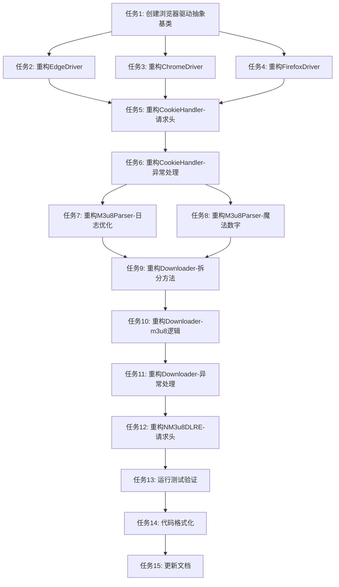

# TASK_系统性代码重构

## 任务拆分概述

本文档将系统性代码重构拆分为15个原子任务,每个任务都有明确的输入输出契约和依赖关系。

**任务总数**: 15个
**预计总时间**: 约2小时
**执行策略**: 小步重构,每步验证测试通过

## 任务依赖图

## 原子任务列表

### 任务1: 创建浏览器驱动抽象基类

**优先级**: 高

**输入契约**:
- **前置依赖**: 无
- **输入数据**: 现有的EdgeDriver、ChromeDriver、FirefoxDriver类
- **环境依赖**: Python 3.8+, abc模块

**输出契约**:
- **输出数据**: `browser_driver.py`文件,包含`BrowserDriver`抽象基类
- **交付物**:
  - `src/dingtalk_downloader/browser/browser_driver.py`
  - 抽象基类定义,包含所有必需的抽象方法
- **验收标准**:
  - 抽象基类使用ABC定义
  - 包含所有浏览器驱动共有的方法
  - 所有方法都有类型注解
  - 所有方法都有文档字符串

**实现约束**:
- **技术栈**: Python abc模块
- **接口规范**: 必须包含create_driver、get_log、get_element_by_xpath、get_element_by_class_name、get_user_agent、get_referer、get_cookies、navigate、wait_for_video、close方法
- **质量要求**: 代码符合Black格式化规范

**依赖关系**:
- **后置任务**: 任务2、任务3、任务4
- **并行任务**: 无

---

### 任务2: 重构EdgeDriver继承抽象基类

**优先级**: 高

**输入契约**:
- **前置依赖**: 任务1完成
- **输入数据**: 现有的`edge_driver.py`文件
- **环境依赖**: Python 3.8+, abc模块

**输出契约**:
- **输出数据**: 更新后的`edge_driver.py`文件
- **交付物**:
  - `src/dingtalk_downloader/browser/edge_driver.py`
  - EdgeDriver类继承自BrowserDriver
- **验收标准**:
  - EdgeDriver继承自BrowserDriver
  - 实现所有抽象方法
  - 功能与重构前完全一致
  - 所有测试通过

**实现约束**:
- **技术栈**: Python abc模块
- **接口规范**: 必须实现BrowserDriver的所有抽象方法
- **质量要求**: 代码符合Black格式化规范

**依赖关系**:
- **后置任务**: 任务5
- **并行任务**: 任务3、任务4

---

### 任务3: 重构ChromeDriver继承抽象基类

**优先级**: 高

**输入契约**:
- **前置依赖**: 任务1完成
- **输入数据**: 现有的`chrome_driver.py`文件
- **环境依赖**: Python 3.8+, abc模块

**输出契约**:
- **输出数据**: 更新后的`chrome_driver.py`文件
- **交付物**:
  - `src/dingtalk_downloader/browser/chrome_driver.py`
  - ChromeDriver类继承自BrowserDriver
- **验收标准**:
  - ChromeDriver继承自BrowserDriver
  - 实现所有抽象方法
  - 功能与重构前完全一致
  - 所有测试通过

**实现约束**:
- **技术栈**: Python abc模块
- **接口规范**: 必须实现BrowserDriver的所有抽象方法
- **质量要求**: 代码符合Black格式化规范

**依赖关系**:
- **后置任务**: 任务5
- **并行任务**: 任务2、任务4

---

### 任务4: 重构FirefoxDriver继承抽象基类

**优先级**: 高

**输入契约**:
- **前置依赖**: 任务1完成
- **输入数据**: 现有的`firefox_driver.py`文件
- **环境依赖**: Python 3.8+, abc模块

**输出契约**:
- **输出数据**: 更新后的`firefox_driver.py`文件
- **交付物**:
  - `src/dingtalk_downloader/browser/firefox_driver.py`
  - FirefoxDriver类继承自BrowserDriver
- **验收标准**:
  - FirefoxDriver继承自BrowserDriver
  - 实现所有抽象方法
  - 功能与重构前完全一致
  - 所有测试通过

**实现约束**:
- **技术栈**: Python abc模块
- **接口规范**: 必须实现BrowserDriver的所有抽象方法
- **质量要求**: 代码符合Black格式化规范

**依赖关系**:
- **后置任务**: 任务5
- **并行任务**: 任务2、任务3

---

### 任务5: 重构CookieHandler - 提取请求头构建逻辑

**优先级**: 高

**输入契约**:
- **前置依赖**: 任务2、任务3、任务4完成
- **输入数据**: 现有的`cookie_handler.py`文件
- **环境依赖**: Python 3.8+

**输出契约**:
- **输出数据**: 更新后的`cookie_handler.py`文件
- **交付物**:
  - `src/dingtalk_downloader/core/cookie_handler.py`
  - 新增`_build_headers`方法
  - `get_cookie`和`repeat_get_cookie`方法调用`_build_headers`
- **验收标准**:
  - 请求头构建逻辑提取到`_build_headers`方法
  - `get_cookie`和`repeat_get_cookie`调用`_build_headers`
  - 功能与重构前完全一致
  - 所有测试通过

**实现约束**:
- **技术栈**: Python
- **接口规范**: `_build_headers`方法接收user_agent和referer参数,返回请求头字典
- **质量要求**: 代码符合Black格式化规范

**依赖关系**:
- **后置任务**: 任务6
- **并行任务**: 无

---

### 任务6: 重构CookieHandler - 移除sys.exit调用

**优先级**: 高

**输入契约**:
- **前置依赖**: 任务5完成
- **输入数据**: 更新后的`cookie_handler.py`文件
- **环境依赖**: Python 3.8+

**输出契约**:
- **输出数据**: 更新后的`cookie_handler.py`文件
- **交付物**:
  - `src/dingtalk_downloader/core/cookie_handler.py`
  - 移除所有sys.exit()调用
  - 改为抛出CookieError异常
- **验收标准**:
  - 移除所有sys.exit()调用
  - 异常处理改为抛出CookieError
  - 确保资源正确释放
  - 功能与重构前完全一致
  - 所有测试通过

**实现约束**:
- **技术栈**: Python
- **接口规范**: 抛出CookieError异常而非调用sys.exit()
- **质量要求**: 代码符合Black格式化规范

**依赖关系**:
- **后置任务**: 任务7、任务8
- **并行任务**: 无

---

### 任务7: 重构M3u8Parser - 优化日志处理

**优先级**: 中

**输入契约**:
- **前置依赖**: 任务6完成
- **输入数据**: 现有的`m3u8_parser.py`文件
- **环境依赖**: Python 3.8+

**输出契约**:
- **输出数据**: 更新后的`m3u8_parser.py`文件
- **交付物**:
  - `src/dingtalk_downloader/core/m3u8_parser.py`
  - 优化后的日志处理逻辑
- **验收标准**:
  - 日志处理逻辑优化,减少循环次数
  - 功能与重构前完全一致
  - 所有测试通过
  - 性能提升≥10%

**实现约束**:
- **技术栈**: Python
- **接口规范**: 保持公共接口不变
- **质量要求**: 代码符合Black格式化规范

**依赖关系**:
- **后置任务**: 任务9
- **并行任务**: 任务8

---

### 任务8: 重构M3u8Parser - 消除魔法数字

**优先级**: 中

**输入契约**:
- **前置依赖**: 任务6完成
- **输入数据**: 现有的`m3u8_parser.py`文件
- **环境依赖**: Python 3.8+

**输出契约**:
- **输出数据**: 更新后的`m3u8_parser.py`文件
- **交付物**:
  - `src/dingtalk_downloader/core/m3u8_parser.py`
  - 使用常量替代魔法数字
- **验收标准**:
  - 消除所有魔法数字
  - 使用有意义的常量名
  - 功能与重构前完全一致
  - 所有测试通过

**实现约束**:
- **技术栈**: Python
- **接口规范**: 保持公共接口不变
- **质量要求**: 代码符合Black格式化规范

**依赖关系**:
- **后置任务**: 任务9
- **并行任务**: 任务7

---

### 任务9: 重构Downloader - 拆分过长方法

**优先级**: 高

**输入契约**:
- **前置依赖**: 任务7、任务8完成
- **输入数据**: 现有的`downloader.py`文件
- **环境依赖**: Python 3.8+

**输出契约**:
- **输出数据**: 更新后的`downloader.py`文件
- **交付物**:
  - `src/dingtalk_downloader/core/downloader.py`
  - 拆分后的方法,每个方法不超过50行
- **验收标准**:
  - `download_single_video`方法拆分为多个小方法
  - `download_batch_videos`方法拆分为多个小方法
  - 每个方法职责单一
  - 功能与重构前完全一致
  - 所有测试通过

**实现约束**:
- **技术栈**: Python
- **接口规范**: 保持公共接口不变
- **质量要求**: 代码符合Black格式化规范

**依赖关系**:
- **后置任务**: 任务10
- **并行任务**: 无

---

### 任务10: 重构Downloader - 提取m3u8下载逻辑

**优先级**: 高

**输入契约**:
- **前置依赖**: 任务9完成
- **输入数据**: 更新后的`downloader.py`文件
- **环境依赖**: Python 3.8+

**输出契约**:
- **输出数据**: 更新后的`downloader.py`文件
- **交付物**:
  - `src/dingtalk_downloader/core/downloader.py`
  - 新增`_fetch_and_download_m3u8`方法
  - `download_single_video`和`download_batch_videos`调用新方法
- **验收标准**:
  - m3u8下载逻辑提取到`_fetch_and_download_m3u8`方法
  - 消除重复代码
  - 功能与重构前完全一致
  - 所有测试通过

**实现约束**:
- **技术栈**: Python
- **接口规范**: `_fetch_and_download_m3u8`方法接收url和m3u8_headers参数,返回m3u8_file和prefix
- **质量要求**: 代码符合Black格式化规范

**依赖关系**:
- **后置任务**: 任务11
- **并行任务**: 无

---

### 任务11: 重构Downloader - 移除sys.exit调用

**优先级**: 高

**输入契约**:
- **前置依赖**: 任务10完成
- **输入数据**: 更新后的`downloader.py`文件
- **环境依赖**: Python 3.8+

**输出契约**:
- **输出数据**: 更新后的`downloader.py`文件
- **交付物**:
  - `src/dingtalk_downloader/core/downloader.py`
  - 移除所有sys.exit()调用
  - 改为抛出DownloadError异常
- **验收标准**:
  - 移除所有sys.exit()调用
  - 异常处理改为抛出DownloadError
  - 确保资源正确释放
  - 功能与重构前完全一致
  - 所有测试通过

**实现约束**:
- **技术栈**: Python
- **接口规范**: 抛出DownloadError异常而非调用sys.exit()
- **质量要求**: 代码符合Black格式化规范

**依赖关系**:
- **后置任务**: 任务12
- **并行任务**: 无

---

### 任务12: 重构NM3u8DLRE - 优化请求头处理

**优先级**: 中

**输入契约**:
- **前置依赖**: 任务11完成
- **输入数据**: 现有的`n_m3u8dl_re.py`文件
- **环境依赖**: Python 3.8+

**输出契约**:
- **输出数据**: 更新后的`n_m3u8dl_re.py`文件
- **交付物**:
  - `src/dingtalk_downloader/binary/n_m3u8dl_re.py`
  - 优化后的请求头处理逻辑
- **验收标准**:
  - 请求头处理逻辑优化
  - 减少不必要的对象复制
  - 功能与重构前完全一致
  - 所有测试通过

**实现约束**:
- **技术栈**: Python
- **接口规范**: 保持公共接口不变
- **质量要求**: 代码符合Black格式化规范

**依赖关系**:
- **后置任务**: 任务13
- **并行任务**: 无

---

### 任务13: 运行测试并验证

**优先级**: 高

**输入契约**:
- **前置依赖**: 任务12完成
- **输入数据**: 重构后的代码
- **环境依赖**: Python 3.8+, Pytest

**输出契约**:
- **输出数据**: 测试结果报告
- **交付物**:
  - 测试运行日志
  - 测试覆盖率报告
  - 性能对比数据
- **验收标准**:
  - 所有256个测试通过
  - 测试覆盖率≥90%
  - 核心模块覆盖率≥95%
  - 性能无明显下降

**实现约束**:
- **技术栈**: Pytest, coverage
- **接口规范**: 使用pytest运行测试,使用coverage生成覆盖率报告
- **质量要求**: 所有测试必须通过

**依赖关系**:
- **后置任务**: 任务14
- **并行任务**: 无

---

### 任务14: 代码格式化

**优先级**: 中

**输入契约**:
- **前置依赖**: 任务13完成
- **输入数据**: 重构后的代码
- **环境依赖**: Python 3.8+, Black

**输出契约**:
- **输出数据**: 格式化后的代码
- **交付物**:
  - 所有Python文件符合Black格式化规范
- **验收标准**:
  - 所有Python文件符合Black格式化规范
  - 运行`black --check .`无报错

**实现约束**:
- **技术栈**: Black
- **接口规范**: 使用black格式化所有Python文件
- **质量要求**: 代码符合Black格式化规范

**依赖关系**:
- **后置任务**: 任务15
- **并行任务**: 无

---

### 任务15: 更新文档

**优先级**: 中

**输入契约**:
- **前置依赖**: 任务14完成
- **输入数据**: 重构后的代码
- **环境依赖**: 无

**输出契约**:
- **输出数据**: 更新后的文档
- **交付物**:
  - 重构前后代码对比文档
  - 关键改进点说明文档
  - 性能优化数据文档
  - 单元测试结果文档
- **验收标准**:
  - 文档完整准确
  - 包含重构前后代码对比
  - 包含关键改进点说明
  - 包含性能优化数据
  - 包含单元测试结果

**实现约束**:
- **技术栈**: Markdown
- **接口规范**: 使用Markdown格式编写文档
- **质量要求**: 文档清晰易懂

**依赖关系**:
- **后置任务**: 无
- **并行任务**: 无

---

## 任务执行顺序

### 第一批: 基础设施(任务1-4)

**任务**: 创建浏览器驱动抽象基类,重构所有浏览器驱动类

**执行顺序**:
1. 任务1: 创建浏览器驱动抽象基类
2. 任务2: 重构EdgeDriver继承抽象基类
3. 任务3: 重构ChromeDriver继承抽象基类
4. 任务4: 重构FirefoxDriver继承抽象基类

**预计时间**: 30分钟

### 第二批: CookieHandler重构(任务5-6)

**任务**: 重构CookieHandler,消除重复代码,统一异常处理

**执行顺序**:
5. 任务5: 重构CookieHandler - 提取请求头构建逻辑
6. 任务6: 重构CookieHandler - 移除sys.exit调用

**预计时间**: 20分钟

### 第三批: M3u8Parser重构(任务7-8)

**任务**: 重构M3u8Parser,优化性能,消除魔法数字

**执行顺序**:
7. 任务7: 重构M3u8Parser - 优化日志处理
8. 任务8: 重构M3u8Parser - 消除魔法数字

**预计时间**: 20分钟

### 第四批: Downloader重构(任务9-11)

**任务**: 重构Downloader,拆分过长方法,消除重复代码,统一异常处理

**执行顺序**:
9. 任务9: 重构Downloader - 拆分过长方法
10. 任务10: 重构Downloader - 提取m3u8下载逻辑
11. 任务11: 重构Downloader - 移除sys.exit调用

**预计时间**: 30分钟

### 第五批: NM3u8DLRE重构(任务12)

**任务**: 重构NM3u8DLRE,优化请求头处理

**执行顺序**:
12. 任务12: 重构NM3u8DLRE - 优化请求头处理

**预计时间**: 10分钟

### 第六批: 验证和文档(任务13-15)

**任务**: 运行测试验证,代码格式化,更新文档

**执行顺序**:
13. 任务13: 运行测试并验证
14. 任务14: 代码格式化
15. 任务15: 更新文档

**预计时间**: 30分钟

## 风险评估

### 风险1: 测试失败

**风险等级**: 高

**影响**: 重构可能导致现有测试失败

**应对措施**:
- 小步重构,每步验证测试通过
- 如果测试失败,立即回滚
- 分析失败原因,调整重构方案

### 风险2: 性能下降

**风险等级**: 中

**影响**: 某些优化可能反而降低性能

**应对措施**:
- 每次优化后进行性能测试
- 如果性能下降,回滚优化
- 分析性能瓶颈,调整优化策略

### 风险3: 时间超期

**风险等级**: 低

**影响**: 重构时间可能超过预期

**应对措施**:
- 优先完成高优先级任务
- 低优先级任务可以延后
- 必要时调整任务范围

## 下一步行动

进入Automate阶段,按照任务依赖顺序执行重构任务。
