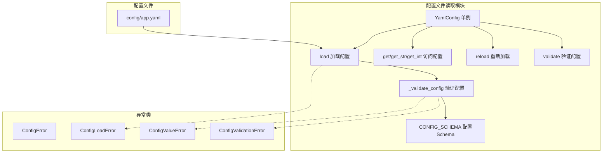
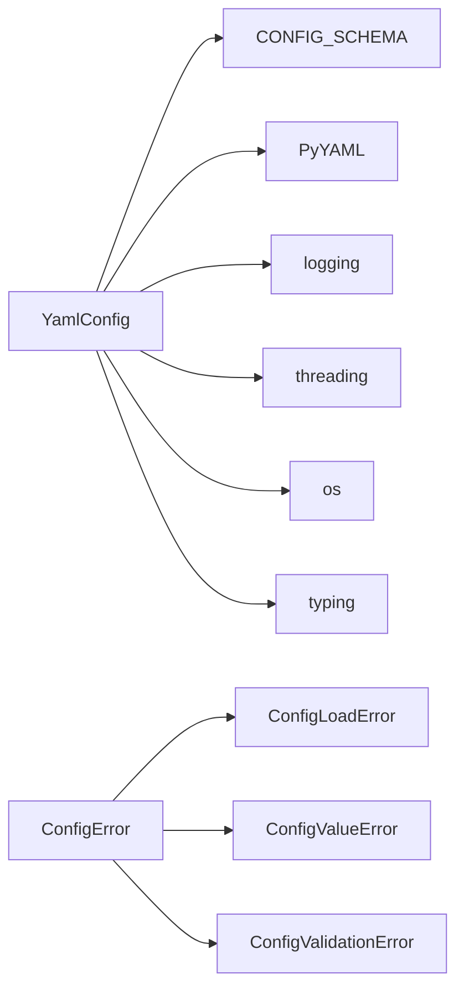
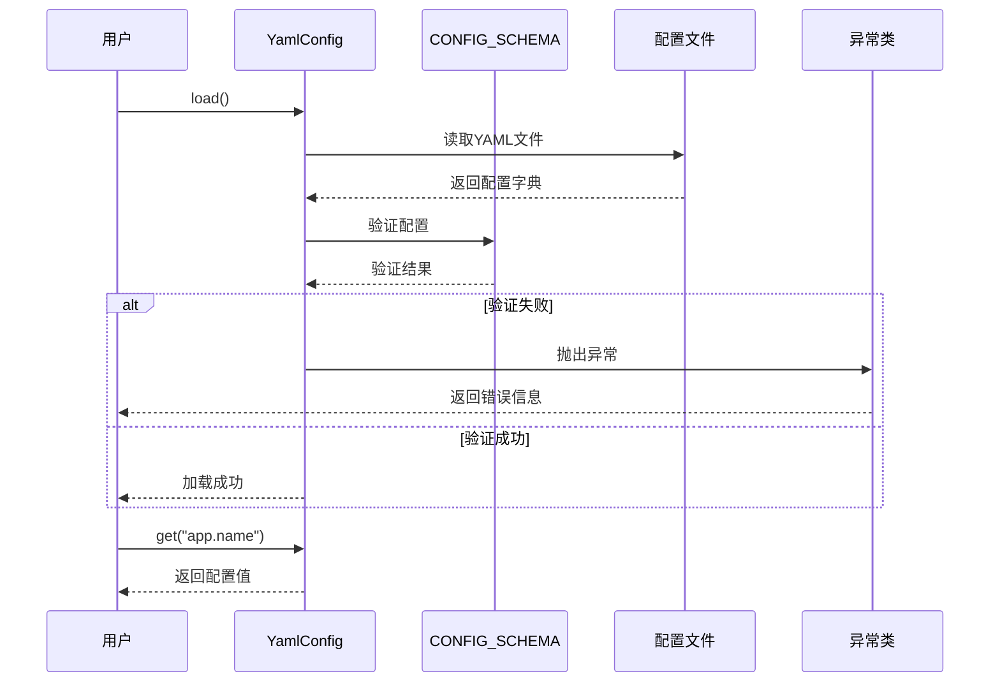

# DESIGN 配置文件读取模块优化

## 整体架构图



## 分层设计

### 表示层（API接口层）

- **YamlConfig类**: 提供配置访问的公共接口
  - `get()`: 获取配置项
  - `get_str()`: 获取字符串类型配置项
  - `get_int()`: 获取整数类型配置项
  - `get_float()`: 获取浮点数类型配置项
  - `get_bool()`: 获取布尔类型配置项
  - `get_list()`: 获取列表类型配置项
  - `get_dict()`: 获取字典类型配置项
  - `load()`: 加载配置文件
  - `reload()`: 重新加载配置文件
  - `validate()`: 验证配置有效性

### 业务逻辑层

- **配置加载逻辑**: 负责从YAML文件加载配置
- **配置验证逻辑**: 负责验证配置的有效性
- **配置访问逻辑**: 负责提供类型安全的配置访问

### 数据访问层

- **YAML解析**: 使用PyYAML库解析配置文件
- **文件IO**: 读取配置文件

## 核心组件

### YamlConfig类

- **职责**: 配置管理的核心类，提供配置加载、验证、访问功能
- **接口**:
  - `load()`: 加载配置文件
  - `reload()`: 重新加载配置文件
  - `validate()`: 验证配置有效性
  - `get()`: 获取配置项
  - `get_str()`: 获取字符串类型配置项
  - `get_int()`: 获取整数类型配置项
  - `get_float()`: 获取浮点数类型配置项
  - `get_bool()`: 获取布尔类型配置项
  - `get_list()`: 获取列表类型配置项
  - `get_dict()`: 获取字典类型配置项
  - `get_nested()`: 获取嵌套配置项
- **依赖**: PyYAML, logging, threading

### CONFIG_SCHEMA常量

- **职责**: 定义配置项的验证规则
- **结构**: 嵌套字典，包含必填项、类型、取值范围、选项等验证规则
- **依赖**: 无

### 异常类层次结构

- **ConfigError**: 配置异常基类
- **ConfigLoadError**: 配置加载异常
- **ConfigValueError**: 配置值异常
- **ConfigValidationError**: 配置验证异常

## 模块依赖关系图



## 接口契约定义

### load()

- **输入参数**: 无
- **输出参数**: None
- **异常处理**:
  - `ConfigLoadError`: 配置文件不存在或读取失败
  - `ConfigLoadError`: 配置文件格式错误
  - `ConfigValidationError`: 配置验证失败
- **行为**: 从配置文件加载配置，验证配置有效性，设置_loaded标志为True

### reload()

- **输入参数**: 无
- **输出参数**: None
- **异常处理**: 同load()
- **行为**: 清空当前配置，重新加载配置文件

### validate()

- **输入参数**: 无
- **输出参数**: bool (True表示验证通过)
- **异常处理**:
  - `ConfigValidationError`: 配置验证失败
- **行为**: 验证配置有效性，返回验证结果

### get(key, default)

- **输入参数**:
  - key: 配置项键，支持点号分隔的嵌套键
  - default: 默认值（可选）
- **输出参数**: 配置项值，如果不存在则返回默认值
- **异常处理**: 无
- **行为**: 获取配置项值，支持嵌套键访问

### get_str(key, default)

- **输入参数**:
  - key: 配置项键
  - default: 默认值（可选）
- **输出参数**: 字符串类型的配置项值
- **异常处理**:
  - `ConfigValueError`: 配置值不是字符串类型
- **行为**: 获取字符串类型配置项，进行类型检查

### get_int(key, default)

- **输入参数**:
  - key: 配置项键
  - default: 默认值（可选）
- **输出参数**: 整数类型的配置项值
- **异常处理**:
  - `ConfigValueError`: 配置值不是整数类型或无法转换为整数
- **行为**: 获取整数类型配置项，进行类型检查和转换

### get_float(key, default)

- **输入参数**:
  - key: 配置项键
  - default: 默认值（可选）
- **输出参数**: 浮点数类型的配置项值
- **异常处理**:
  - `ConfigValueError`: 配置值不是浮点数类型或无法转换为浮点数
- **行为**: 获取浮点数类型配置项，进行类型检查和转换

### get_bool(key, default)

- **输入参数**:
  - key: 配置项键
  - default: 默认值（可选）
- **输出参数**: 布尔类型的配置项值
- **异常处理**:
  - `ConfigValueError`: 配置值不是布尔类型或无法转换为布尔值
- **行为**: 获取布尔类型配置项，进行类型检查和转换

### get_list(key, default)

- **输入参数**:
  - key: 配置项键
  - default: 默认值（可选）
- **输出参数**: 列表类型的配置项值
- **异常处理**:
  - `ConfigValueError`: 配置值不是列表类型
- **行为**: 获取列表类型配置项，进行类型检查

### get_dict(key, default)

- **输入参数**:
  - key: 配置项键
  - default: 默认值（可选）
- **输出参数**: 字典类型的配置项值
- **异常处理**:
  - `ConfigValueError`: 配置值不是字典类型
- **行为**: 获取字典类型配置项，进行类型检查

### _validate_config(config, schema, path)

- **输入参数**:
  - config: 配置字典
  - schema: 配置schema
  - path: 当前配置路径（用于错误信息）
- **输出参数**: None
- **异常处理**:
  - `ConfigValidationError`: 必填项缺失
  - `ConfigValueError`: 类型不匹配、值超出范围、值不在选项中
- **行为**: 递归验证配置是否符合schema定义

## 数据流向图



## 异常处理策略

### 异常分类

1. **ConfigLoadError**: 配置加载异常
   - 配置文件不存在
   - 配置文件读取失败
   - 配置文件格式错误

2. **ConfigValueError**: 配置值异常
   - 配置值类型不匹配
   - 配置值超出范围
   - 配置值不在选项中

3. **ConfigValidationError**: 配置验证异常
   - 必填配置项缺失

### 错误信息格式

所有异常都包含详细的错误信息，包括：
- 配置项路径（如 "app.name"）
- 期望值（如 "str"）
- 实际值（如 "123"）
- 错误原因（如 "配置值类型错误"）

### 错误处理流程

1. 配置文件不存在 → 抛出 `ConfigLoadError`
2. 配置文件格式错误 → 抛出 `ConfigLoadError`
3. 必填项缺失 → 抛出 `ConfigValidationError`
4. 类型不匹配 → 抛出 `ConfigValueError`
5. 值超出范围 → 抛出 `ConfigValueError`
6. 值不在选项中 → 抛出 `ConfigValueError`

## 配置Schema设计

### Schema结构

```python
CONFIG_SCHEMA = {
    "section_name": {
        "required": True/False,
        "type": dict,
        "fields": {
            "field_name": {
                "required": True/False,
                "type": str/int/float/bool/list/dict,
                "min": 最小值,
                "max": 最大值,
                "choices": [选项1, 选项2, ...],
            }
        }
    }
}
```

### Schema字段说明

- **required**: 是否必填
- **type**: 期望的数据类型
- **min**: 最小值（适用于int和float）
- **max**: 最大值（适用于int和float）
- **choices**: 可选值列表（适用于str）
- **fields**: 嵌套字段的schema（适用于dict）

### 配置项Schema

#### app section

```python
"app": {
    "required": True,
    "type": dict,
    "fields": {
        "name": {"required": True, "type": str},
        "version": {"required": True, "type": str},
    }
}
```

#### download section

```python
"download": {
    "required": True,
    "type": dict,
    "fields": {
        "default_dir": {"required": True, "type": str},
        "temp_dir": {"required": True, "type": str},
        "max_retry_count": {"required": True, "type": int, "min": 1, "max": 100},
    }
}
```

#### browser section

```python
"browser": {
    "required": True,
    "type": dict,
    "fields": {
        "default_type": {"required": True, "type": str, "choices": ["edge", "chrome", "firefox"]},
        "headless": {"required": True, "type": bool},
        "timeout": {"required": True, "type": int, "min": 1, "max": 300},
    }
}
```

#### logging section

```python
"logging": {
    "required": True,
    "type": dict,
    "fields": {
        "level": {"required": True, "type": str, "choices": ["DEBUG", "INFO", "WARNING", "ERROR", "CRITICAL"]},
        "dir": {"required": True, "type": str},
        "max_bytes": {"required": True, "type": int, "min": 1024},
        "backup_count": {"required": True, "type": int, "min": 1, "max": 100},
        "retention_days": {"required": True, "type": int, "min": 1, "max": 365},
    }
}
```

#### headers section

```python
"headers": {
    "required": True,
    "type": dict,
    "fields": {
        "user_agent": {"required": True, "type": str},
        "referer": {"required": True, "type": str},
        "accept": {"required": True, "type": str},
        "accept_language": {"required": True, "type": str},
        "accept_encoding": {"required": True, "type": str},
        "connection": {"required": True, "type": str},
        "sec_fetch_dest": {"required": True, "type": str},
        "sec_fetch_mode": {"required": True, "type": str},
        "sec_fetch_site": {"required": True, "type": str},
        "sec_fetch_user": {"required": True, "type": str},
        "upgrade_insecure_requests": {"required": True, "type": str},
    }
}
```

#### n_m3u8dl_re section

```python
"n_m3u8dl_re": {
    "required": True,
    "type": dict,
    "fields": {
        "executable_path": {"required": True, "type": str},
        "ui_language": {"required": True, "type": str},
        "temp_dir": {"required": True, "type": str},
        "log_dir": {"required": True, "type": str},
    }
}
```

#### ffmpeg section

```python
"ffmpeg": {
    "required": True,
    "type": dict,
    "fields": {
        "executable_path": {"required": True, "type": str},
    }
}
```
