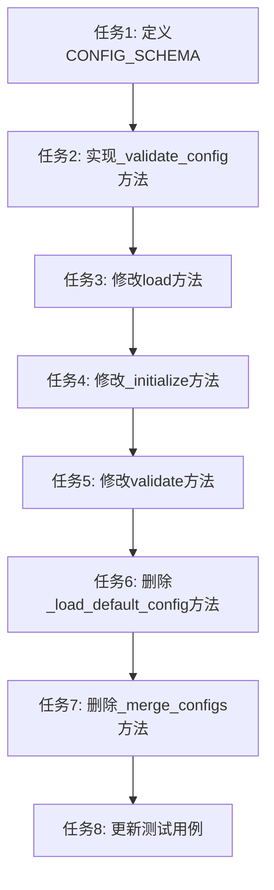

# TASK 配置文件读取模块优化

## 任务依赖图

## 原子任务列表

### 任务 1: 定义CONFIG_SCHEMA常量

#### 输入契约

- **前置依赖**: 无
- **输入数据**: DESIGN文档中的配置schema设计
- **环境依赖**: Python 3.x环境

#### 输出契约

- **输出数据**: CONFIG_SCHEMA常量定义
- **交付物**: yaml_config.py中的CONFIG_SCHEMA常量
- **验收标准**:
  - [ ] CONFIG_SCHEMA包含所有配置section的验证规则
  - [ ] 每个section定义了required、type、fields
  - [ ] 每个field定义了required、type、min、max、choices等验证规则
  - [ ] Schema结构与DESIGN文档一致

#### 实现约束

- **技术栈**: Python 3.x, typing
- **接口规范**: 使用字典结构定义schema
- **质量要求**:
  - 代码缩进使用4个空格
  - 使用类型注解
  - 添加必要的注释

#### 依赖关系

- **后置任务**: 任务2（实现_validate_config方法）
- **并行任务**: 无

---

### 任务 2: 实现_validate_config方法

#### 输入契约

- **前置依赖**: 任务1（定义CONFIG_SCHEMA常量）
- **输入数据**: CONFIG_SCHEMA常量
- **环境依赖**: Python 3.x环境

#### 输出契约

- **输出数据**: _validate_config方法实现
- **交付物**: yaml_config.py中的_validate_config方法
- **验收标准**:
  - [ ] 方法接受config、schema、path三个参数
  - [ ] 验证必填项是否存在
  - [ ] 验证配置项类型是否正确
  - [ ] 验证配置值是否在范围内
  - [ ] 验证配置值是否在选项中
  - [ ] 递归验证嵌套配置
  - [ ] 验证失败时抛出ConfigValidationError或ConfigValueError
  - [ ] 错误信息包含配置项路径、期望值、实际值

#### 实现约束

- **技术栈**: Python 3.x, typing
- **接口规范**: 私有方法，使用下划线前缀
- **质量要求**:
  - 代码缩进使用4个空格
  - 使用类型注解
  - 添加必要的注释
  - 遵循现有代码风格

#### 依赖关系

- **后置任务**: 任务3（修改load方法）、任务5（修改validate方法）
- **并行任务**: 无

---

### 任务 3: 修改load方法

#### 输入契约

- **前置依赖**: 任务2（实现_validate_config方法）
- **输入数据**: _validate_config方法
- **环境依赖**: Python 3.x环境

#### 输出契约

- **输出数据**: 修改后的load方法
- **交付物**: yaml_config.py中的load方法
- **验收标准**:
  - [ ] 配置文件不存在时抛出ConfigLoadError
  - [ ] 配置文件格式错误时抛出ConfigLoadError
  - [ ] 配置文件读取失败时抛出ConfigLoadError
  - [ ] 加载完成后调用_validate_config验证配置
  - [ ] 移除自动创建配置文件目录的逻辑
  - [ ] 移除使用默认配置的逻辑
  - [ ] 保持线程安全机制
  - [ ] 保持延迟加载机制

#### 实现约束

- **技术栈**: Python 3.x, PyYAML, logging, threading
- **接口规范**: 公开方法，保持现有接口不变
- **质量要求**:
  - 代码缩进使用4个空格
  - 使用类型注解
  - 添加必要的注释
  - 遵循现有代码风格

#### 依赖关系

- **后置任务**: 任务4（修改_initialize方法）
- **并行任务**: 无

---

### 任务 4: 修改_initialize方法

#### 输入契约

- **前置依赖**: 任务3（修改load方法）
- **输入数据**: 无
- **环境依赖**: Python 3.x环境

#### 输出契约

- **输出数据**: 修改后的_initialize方法
- **交付物**: yaml_config.py中的_initialize方法
- **验收标准**:
  - [ ] 移除default_config属性的初始化
  - [ ] 保持config属性的初始化
  - [ ] 保持_loaded属性的初始化
  - [ ] 保持config_file属性的初始化

#### 实现约束

- **技术栈**: Python 3.x, typing
- **接口规范**: 私有方法，使用下划线前缀
- **质量要求**:
  - 代码缩进使用4个空格
  - 使用类型注解
  - 添加必要的注释
  - 遵循现有代码风格

#### 依赖关系

- **后置任务**: 任务5（修改validate方法）
- **并行任务**: 无

---

### 任务 5: 修改validate方法

#### 输入契约

- **前置依赖**: 任务2（实现_validate_config方法）、任务4（修改_initialize方法）
- **输入数据**: _validate_config方法
- **环境依赖**: Python 3.x环境

#### 输出契约

- **输出数据**: 修改后的validate方法
- **交付物**: yaml_config.py中的validate方法
- **验收标准**:
  - [ ] 调用_validate_config方法验证配置
  - [ ] 验证通过时返回True
  - [ ] 验证失败时抛出ConfigValidationError
  - [ ] 保持延迟加载机制

#### 实现约束

- **技术栈**: Python 3.x, typing
- **接口规范**: 公开方法，保持现有接口不变
- **质量要求**:
  - 代码缩进使用4个空格
  - 使用类型注解
  - 添加必要的注释
  - 遵循现有代码风格

#### 依赖关系

- **后置任务**: 任务6（删除_load_default_config方法）
- **并行任务**: 无

---

### 任务 6: 删除_load_default_config方法

#### 输入契约

- **前置依赖**: 任务5（修改validate方法）
- **输入数据**: 无
- **环境依赖**: Python 3.x环境

#### 输出契约

- **输出数据**: 无
- **交付物**: 删除_load_default_config方法
- **验收标准**:
  - [ ] _load_default_config方法已删除
  - [ ] 没有其他代码引用该方法

#### 实现约束

- **技术栈**: Python 3.x
- **接口规范**: 无
- **质量要求**:
  - 确保没有遗留引用

#### 依赖关系

- **后置任务**: 任务7（删除_merge_configs方法）
- **并行任务**: 无

---

### 任务 7: 删除_merge_configs方法

#### 输入契约

- **前置依赖**: 任务6（删除_load_default_config方法）
- **输入数据**: 无
- **环境依赖**: Python 3.x环境

#### 输出契约

- **输出数据**: 无
- **交付物**: 删除_merge_configs方法
- **验收标准**:
  - [ ] _merge_configs方法已删除
  - [ ] 没有其他代码引用该方法

#### 实现约束

- **技术栈**: Python 3.x
- **接口规范**: 无
- **质量要求**:
  - 确保没有遗留引用

#### 依赖关系

- **后置任务**: 任务8（更新测试用例）
- **并行任务**: 无

---

### 任务 8: 更新测试用例

#### 输入契约

- **前置依赖**: 任务7（删除_merge_configs方法）
- **输入数据**: 修改后的yaml_config.py
- **环境依赖**: Python 3.x, pytest环境

#### 输出契约

- **输出数据**: 更新后的测试用例
- **交付物**: test_yaml_config.py
- **验收标准**:
  - [ ] test_yaml_config_load_nonexistent_file更新为期望抛出ConfigLoadError
  - [ ] test_yaml_config_default_config删除或修改
  - [ ] test_yaml_config_merge_configs删除或修改
  - [ ] 新增配置验证相关测试用例
  - [ ] 所有测试用例通过
  - [ ] 测试覆盖率达到80%以上

#### 实现约束

- **技术栈**: Python 3.x, pytest
- **接口规范**: 遵循pytest测试规范
- **质量要求**:
  - 代码缩进使用4个空格
  - 使用类型注解
  - 添加必要的注释
  - 遵循现有测试风格

#### 依赖关系

- **后置任务**: 无
- **并行任务**: 无

---

### 任务 9: 更新模块文档

#### 输入契约

- **前置依赖**: 任务8（更新测试用例）
- **输入数据**: 修改后的yaml_config.py
- **环境依赖**: Python 3.x环境

#### 输出契约

- **输出数据**: 更新后的模块文档
- **交付物**: yaml_config.py的模块文档字符串
- **验收标准**:
  - [ ] 模块文档字符串更新，反映新的实现
  - [ ] 移除关于默认配置的说明
  - [ ] 添加配置验证机制的说明
  - [ ] 添加错误处理的说明

#### 实现约束

- **技术栈**: Python 3.x
- **接口规范**: 遵循Python文档字符串规范
- **质量要求**:
  - 使用中文编写文档
  - 文档清晰准确

#### 依赖关系

- **后置任务**: 无
- **并行任务**: 无
