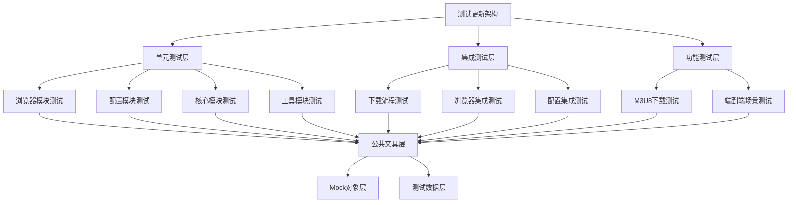
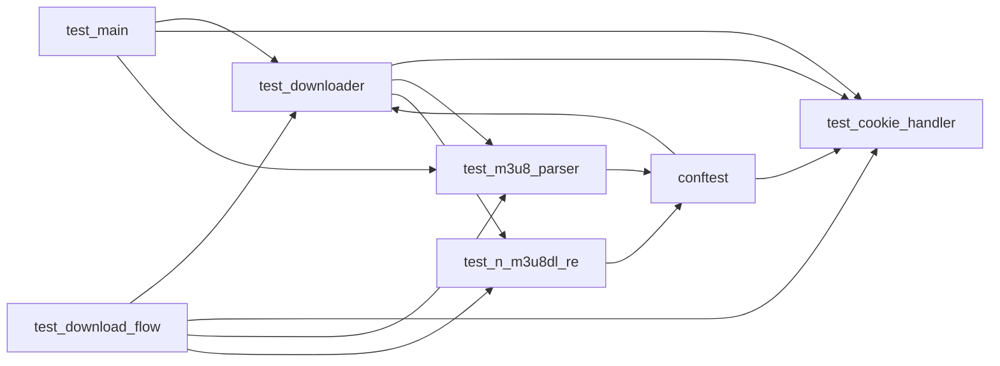
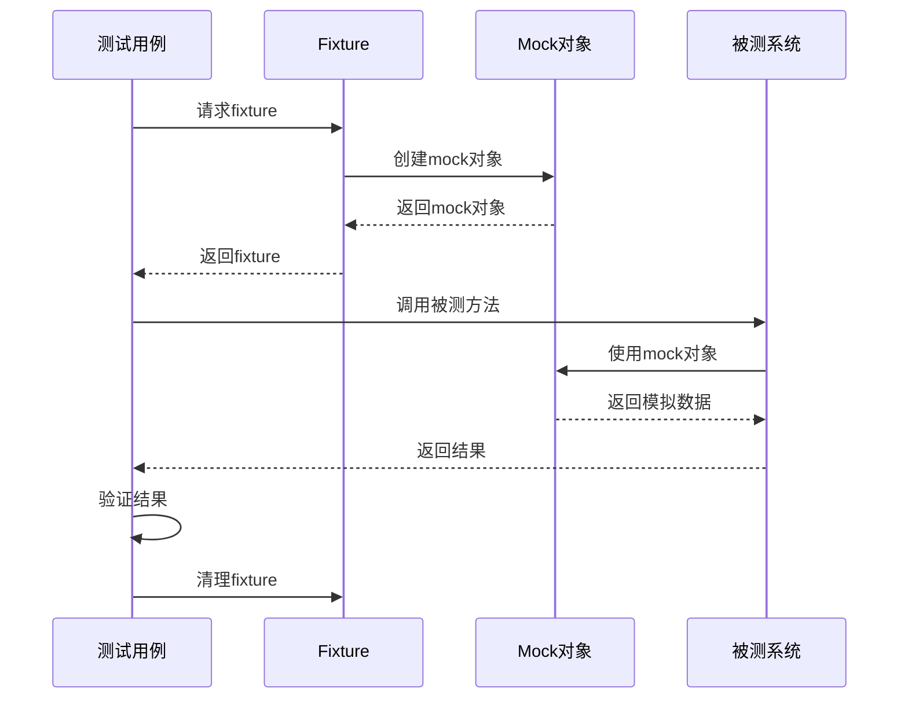

# 测试代码全面更新 - 设计文档

## 整体架构

### 测试架构图



### 分层设计

#### 1. 单元测试层
**职责**: 测试单个模块的功能
- 浏览器模块测试（browser/）
- 配置模块测试（config/）
- 核心模块测试（core/）
- 工具模块测试（utils/）

#### 2. 集成测试层
**职责**: 测试模块间的交互
- 下载流程测试
- 浏览器集成测试
- 配置集成测试

#### 3. 功能测试层
**职责**: 测试完整的功能场景
- M3U8下载测试
- 端到端场景测试

#### 4. 公共夹具层
**职责**: 提供可复用的测试夹具
- 全局fixture
- 模块级fixture
- 功能级fixture

#### 5. Mock对象层
**职责**: 提供模拟对象
- 浏览器mock
- 网络mock
- 文件系统mock

#### 6. 测试数据层
**职责**: 提供测试数据
- 示例URL
- 示例配置
- 示例文件

## 核心组件

### 1. 测试夹具系统

#### 全局Fixture（conftest.py）
```python
@pytest.fixture(scope="session")
def project_root_path() -> Path:
    """项目根目录路径"""

@pytest.fixture(scope="session")
def src_path(project_root_path: Path) -> Path:
    """源代码目录路径"""

@pytest.fixture(scope="session")
def tests_path(project_root_path: Path) -> Path:
    """测试目录路径"""

@pytest.fixture(scope="function")
def mock_logger(mocker) -> MagicMock:
    """Mock日志记录器"""

@pytest.fixture(scope="function")
def mock_config(mocker) -> MagicMock:
    """Mock配置对象"""
```

#### 模块级Fixture
```python
@pytest.fixture(scope="function")
def mock_browser(mocker) -> MagicMock:
    """Mock浏览器对象"""

@pytest.fixture(scope="function")
def mock_cookie_handler(mocker) -> MagicMock:
    """Mock Cookie 处理器"""

@pytest.fixture(scope="function")
def mock_m3u8_parser(mocker) -> MagicMock:
    """Mock M3U8 解析器"""
```

#### 功能级Fixture
```python
@pytest.fixture(scope="function")
def sample_live_urls() -> list:
    """示例直播URL列表"""

@pytest.fixture(scope="function")
def sample_m3u8_content() -> str:
    """示例M3U8内容"""

@pytest.fixture(scope="function")
def sample_cookies() -> list:
    """示例Cookie列表"""
```

### 2. Mock对象系统

#### 浏览器Mock
```python
class MockBrowser:
    """Mock浏览器对象"""

    def __init__(self):
        self.driver = Mock()
        self.driver.execute_script.return_value = "#EXTM3U\n"
        self.get_cookies.return_value = [{"name": "test", "value": "value"}]
        self.get_user_agent.return_value = "Mozilla/5.0"
```

#### 网络Mock
```python
class MockNetwork:
    """Mock网络请求"""

    def __init__(self):
        self.requests = []

    def mock_get(self, url, headers=None):
        """Mock GET请求"""
        self.requests.append({"url": url, "headers": headers})
        return Mock(status_code=200, text="#EXTM3U\n")
```

#### 文件系统Mock
```python
class MockFileSystem:
    """Mock文件系统"""

    def __init__(self):
        self.files = {}

    def mock_read(self, path):
        """Mock文件读取"""
        return self.files.get(path, "")

    def mock_write(self, path, content):
        """Mock文件写入"""
        self.files[path] = content
```

### 3. 测试数据系统

#### 测试数据管理
```python
class TestData:
    """测试数据管理器"""

    VALID_DINGTALK_URLS = [
        "https://n.dingtalk.com/d/live/1234567890abcdef1234567890abcdef?liveUuid=12345678-1234-1234-1234-1234567890ab",
    ]

    INVALID_DINGTALK_URLS = [
        "http://example.com/test",
        "https://n.dingtalk.com/test",
    ]

    SAMPLE_M3U8_CONTENT = """#EXTM3U
#EXT-X-VERSION:3
#EXT-X-TARGETDURATION:10
#EXTINF:10.0,
segment1.ts
#EXT-X-ENDLIST
"""

    SAMPLE_CONFIG = {
        "app": {"name": "test_app"},
        "download": {"default_dir": "test_dir"},
    }
```

## 模块依赖关系

### 测试模块依赖图



### 接口契约定义

#### Downloader接口
```python
class DownloaderInterface:
    """下载器接口"""

    def __init__(self, browser_type: str, save_mode: str):
        """初始化下载器"""

    def download_single_video(self, url: str) -> None:
        """下载单个视频"""

    def download_batch_videos(self, urls: Dict[int, str]) -> None:
        """批量下载视频"""

    def close(self) -> None:
        """关闭下载器"""
```

#### CookieHandler接口
```python
class CookieHandlerInterface:
    """Cookie处理器接口"""

    def __init__(self, browser_type: str):
        """初始化Cookie处理器"""

    def get_cookie(self, url: str) -> Tuple[object, Dict, Dict, str]:
        """获取Cookie"""

    def repeat_get_cookie(self, url: str) -> Tuple[Dict, Dict, str]:
        """重复获取Cookie"""

    def close(self) -> None:
        """关闭处理器"""
```

#### M3u8Parser接口
```python
class M3u8ParserInterface:
    """M3U8解析器接口"""

    def __init__(self, browser: object):
        """初始化解析器"""

    def fetch_m3u8_links(self, url: str) -> Optional[List[str]]:
        """获取M3U8链接"""

    def download_m3u8_file(self, url: str, save_path: str, headers: Dict) -> str:
        """下载M3U8文件"""

    def extract_prefix(self, url: str) -> str:
        """提取基础URL"""
```

## 数据流向图

### 测试执行流程



### 测试数据流向


## 异常处理策略

### 测试异常处理

#### 1. 预期异常测试
```python
def test_expected_exception():
    """测试预期异常"""
    with pytest.raises(ValueError) as exc_info:
        raise ValueError("测试异常")
    assert "测试异常" in str(exc_info.value)
```

#### 2. 异常信息验证
```python
def test_exception_message():
    """测试异常信息"""
    with pytest.raises(ValueError) as exc_info:
        raise ValueError("测试异常")
    assert exc_info.type == ValueError
    assert str(exc_info.value) == "测试异常"
```

#### 3. 异常链测试
```python
def test_exception_chain():
    """测试异常链"""
    try:
        raise ValueError("原始异常")
    except ValueError as e:
        raise TypeError("包装异常") from e

    with pytest.raises(TypeError) as exc_info:
        raise TypeError("包装异常") from ValueError("原始异常")
    assert exc_info.value.__cause__ is not None
```

## 测试优化策略

### 1. 测试独立性
- 每个测试独立运行
- 使用fixture提供测试数据
- 清理测试环境

### 2. 测试可读性
- 清晰的测试命名
- 简洁的测试代码
- 必要的注释说明

### 3. 测试可维护性
- 避免重复代码
- 使用fixture和parametrize
- 保持测试代码简洁

### 4. 测试覆盖率
- 覆盖正常流程
- 覆盖边界条件
- 覆盖异常情况
- 覆盖关键业务逻辑

## 测试执行策略

### 测试分类

#### 单元测试
- 标记: `@pytest.mark.unit`
- 执行: `pytest -m unit`
- 覆盖: 单个模块功能

#### 集成测试
- 标记: `@pytest.mark.integration`
- 执行: `pytest -m integration`
- 覆盖: 模块间交互

#### 功能测试
- 标记: `@pytest.mark.functional`
- 执行: `pytest -m functional`
- 覆盖: 完整功能场景

#### 慢速测试
- 标记: `@pytest.mark.slow`
- 执行: `pytest -m slow`
- 覆盖: 耗时操作

### 测试执行顺序

#### 快速测试优先
```bash
# 执行快速测试
pytest -m "not slow"

# 执行所有测试
pytest

# 执行特定模块测试
pytest tests/unit/test_downloader.py
```

#### 并行执行
```bash
# 使用pytest-xdist并行执行
pytest -n auto
```

## 测试报告策略

### 覆盖率报告

#### HTML报告
```bash
pytest --cov=src/dingtalk_downloader --cov-report=html
```

#### 终端报告
```bash
pytest --cov=src/dingtalk_downloader --cov-report=term-missing
```

#### XML报告
```bash
pytest --cov=src/dingtalk_downloader --cov-report=xml
```

### 测试结果报告

#### JUnit XML
```bash
pytest --junitxml=test-results.xml
```

#### JSON报告
```bash
pytest --json-report
```

## 持续集成策略

### CI/CD集成

#### GitHub Actions
```yaml
name: Tests
on: [push, pull_request]
jobs:
  test:
    runs-on: ubuntu-latest
    steps:
      - uses: actions/checkout@v2
      - name: Set up Python
        uses: actions/setup-python@v2
        with:
          python-version: '3.8'
      - name: Install dependencies
        run: |
          pip install -r requirements-dev.txt
      - name: Run tests
        run: |
          pytest --cov=src/dingtalk_downloader --cov-report=xml
      - name: Upload coverage
        uses: codecov/codecov-action@v2
```

### 质量门控

#### 覆盖率门控
```ini
[pytest]
addopts = --cov-fail-under=80
```

#### 测试失败门控
```yaml
# 测试失败时阻止合并
if: steps.test.outcome == 'failure'
```

## 设计原则

### 1. 简单性
- 测试代码简洁明了
- 避免过度设计
- 优先可读性

### 2. 可靠性
- 测试稳定可重复
- 避免随机性
- 清理测试环境

### 3. 可维护性
- 代码结构清晰
- 避免重复代码
- 易于修改和扩展

### 4. 可扩展性
- 支持新功能测试
- 支持新场景测试
- 支持新平台测试

## 技术约束

### 测试框架
- pytest 7.0+
- pytest-mock 3.10+
- pytest-cov 4.0+

### Python版本
- Python 3.8+
- 支持多版本测试

### 平台支持
- Windows
- Linux
- macOS

### 执行时间
- 单元测试: < 5秒
- 集成测试: < 10秒
- 总测试时间: < 30秒
