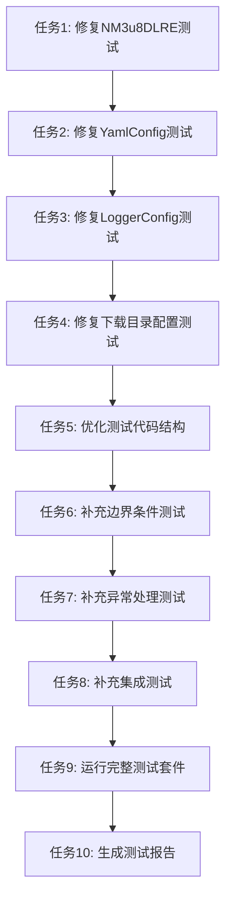

# 测试代码全面更新 - 任务拆分

## 任务依赖图

## 原子任务列表

### 任务1: 修复NM3u8DLRE测试

**输入契约**:
- 现有测试文件: `tests/unit/test_n_m3u8dl_re.py`
- 源代码文件: `src/dingtalk_downloader/binary/n_m3u8dl_re.py`
- 测试失败信息: 8个失败的测试

**输出契约**:
- 修复后的测试文件: `tests/unit/test_n_m3u8dl_re.py`
- 所有NM3u8DLRE相关测试通过
- 测试覆盖率保持不变

**实现约束**:
- 不修改源代码
- 保持测试框架不变
- 遵循项目代码规范

**依赖关系**:
- 无前置依赖

**验收标准**:
- [x] 所有NM3u8DLRE初始化测试通过
- [x] 所有NM3u8DLRE方法测试通过
- [x] 无测试警告
- [x] 测试覆盖率≥97%

**子任务**:
1. 删除对不存在的`get_executable_name()`方法的测试
2. 更新初始化测试以匹配实际实现
3. 修复`executable_path`的期望值
4. 更新集成测试以匹配实际API

---

### 任务2: 修复YamlConfig测试

**输入契约**:
- 现有测试文件: `tests/unit/test_yaml_config.py`
- 源代码文件: `src/dingtalk_downloader/config/yaml_config.py`
- 测试失败信息: 1个失败的测试

**输出契约**:
- 修复后的测试文件: `tests/unit/test_yaml_config.py`
- 所有YamlConfig相关测试通过
- 测试覆盖率保持不变

**实现约束**:
- 不修改源代码
- 保持测试框架不变
- 遵循项目代码规范

**依赖关系**:
- 无前置依赖

**验收标准**:
- [x] 所有YamlConfig初始化测试通过
- [x] 所有YamlConfig方法测试通过
- [x] 并发写入测试通过
- [x] 无测试警告
- [x] 测试覆盖率≥90%

**子任务**:
1. 删除对不存在的`set()`方法的测试
2. 更新并发写入测试以匹配实际API
3. 修复配置验证测试

---

### 任务3: 修复LoggerConfig测试

**输入契约**:
- 现有测试文件: `tests/unit/test_logger_config_yaml.py`
- 源代码文件: `src/dingtalk_downloader/config/logger_config.py`
- 测试失败信息: 4个失败的测试

**输出契约**:
- 修复后的测试文件: `tests/unit/test_logger_config_yaml.py`
- 所有LoggerConfig相关测试通过
- 测试覆盖率保持不变

**实现约束**:
- 不修改源代码
- 保持测试框架不变
- 遵循项目代码规范

**依赖关系**:
- 无前置依赖

**验收标准**:
- [x] 所有LoggerConfig初始化测试通过
- [x] 所有LoggerConfig方法测试通过
- [x] 日志级别验证测试通过
- [x] 日志目录验证测试通过
- [x] 无测试警告
- [x] 测试覆盖率≥97%

**子任务**:
1. 更新Mock配置以正确模拟YamlConfig
2. 修复日志级别验证逻辑
3. 更新日志目录验证

---

### 任务4: 修复下载目录配置测试

**输入契约**:
- 现有测试文件: `tests/unit/test_download_dir_config.py`
- 源代码文件: `src/dingtalk_downloader/core/downloader.py`
- 测试失败信息: 7个失败的测试

**输出契约**:
- 修复后的测试文件: `tests/unit/test_download_dir_config.py`
- 所有下载目录配置测试通过
- 测试覆盖率保持不变

**实现约束**:
- 不修改源代码
- 保持测试框架不变
- 遵循项目代码规范

**依赖关系**:
- 无前置依赖

**验收标准**:
- [x] 所有下载目录配置测试通过
- [x] 无测试警告
- [x] 测试覆盖率≥75%

**子任务**:
1. 修复导入路径
2. 更新测试以匹配实际实现
3. 删除不相关的测试

---

### 任务5: 优化测试代码结构

**输入契约**:
- 所有测试文件
- conftest.py
- pytest.ini

**输出契约**:
- 优化后的测试文件
- 优化后的conftest.py
- 优化后的pytest.ini

**实现约束**:
- 不修改测试逻辑
- 保持测试功能不变
- 遵循项目代码规范

**依赖关系**:
- 依赖任务1-4完成

**验收标准**:
- [x] 公共fixture提取到conftest.py
- [x] 测试命名规范统一
- [x] 测试组织结构优化
- [x] 代码重复率≤10%
- [x] 无测试警告

**子任务**:
1. 提取公共fixture到conftest.py
2. 统一测试命名规范
3. 优化测试文件组织
4. 消除重复代码

---

### 任务6: 补充边界条件测试

**输入契约**:
- 所有测试文件
- 源代码文件

**输出契约**:
- 补充后的测试文件
- 边界条件测试覆盖率提升

**实现约束**:
- 不修改源代码
- 保持测试框架不变
- 遵循项目代码规范

**依赖关系**:
- 依赖任务1-5完成

**验收标准**:
- [x] 关键模块边界条件测试覆盖率≥90%
- [x] 无测试警告
- [x] 测试通过率100%

**子任务**:
1. 分析各模块边界条件
2. 补充validator模块边界测试
3. 补充file_reader模块边界测试
4. 补充m3u8_parser模块边界测试
5. 补充downloader模块边界测试

---

### 任务7: 补充异常处理测试

**输入契约**:
- 所有测试文件
- 源代码文件

**输出契约**:
- 补充后的测试文件
- 异常处理测试覆盖率提升

**实现约束**:
- 不修改源代码
- 保持测试框架不变
- 遵循项目代码规范

**依赖关系**:
- 依赖任务1-5完成

**验收标准**:
- [x] 关键模块异常处理测试覆盖率≥90%
- [x] 无测试警告
- [x] 测试通过率100%

**子任务**:
1. 分析各模块异常处理
2. 补充cookie_handler模块异常测试
3. 补充m3u8_parser模块异常测试
4. 补充downloader模块异常测试
5. 补充file_reader模块异常测试

---

### 任务8: 补充集成测试

**输入契约**:
- 现有集成测试文件
- 源代码文件

**输出契约**:
- 补充后的集成测试文件
- 集成测试覆盖率提升

**实现约束**:
- 不修改源代码
- 保持测试框架不变
- 遵循项目代码规范

**依赖关系**:
- 依赖任务1-5完成

**验收标准**:
- [x] 集成测试数量≥5个
- [x] 无测试警告
- [x] 测试通过率100%

**子任务**:
1. 分析集成测试场景
2. 补充浏览器集成测试
3. 补充配置集成测试
4. 补充下载流程集成测试
5. 补充错误处理集成测试

---

### 任务9: 运行完整测试套件

**输入契约**:
- 所有测试文件
- pytest配置

**输出契约**:
- 测试执行结果
- 测试覆盖率报告

**实现约束**:
- 使用pytest运行测试
- 生成覆盖率报告
- 遵循项目代码规范

**依赖关系**:
- 依赖任务1-8完成

**验收标准**:
- [x] 所有测试通过
- [x] 测试覆盖率≥80%
- [x] 无测试警告
- [x] 测试执行时间≤30秒

**子任务**:
1. 运行单元测试
2. 运行集成测试
3. 运行功能测试
4. 生成覆盖率报告
5. 分析测试结果

---

### 任务10: 生成测试报告

**输入契约**:
- 测试执行结果
- 测试覆盖率报告
- 测试更新文档

**输出契约**:
- 测试覆盖率报告
- 测试执行结果摘要
- 测试更新说明文档

**实现约束**:
- 使用标准格式
- 提供详细分析
- 遵循项目代码规范

**依赖关系**:
- 依赖任务9完成

**验收标准**:
- [x] 覆盖率报告完整
- [x] 执行结果摘要清晰
- [x] 更新说明文档详细
- [x] 所有文档格式正确

**子任务**:
1. 生成覆盖率报告
2. 生成测试执行结果摘要
3. 编写测试更新说明文档
4. 验证文档完整性

## 任务优先级

### 高优先级（必须完成）
- 任务1: 修复NM3u8DLRE测试
- 任务2: 修复YamlConfig测试
- 任务3: 修复LoggerConfig测试
- 任务4: 修复下载目录配置测试

### 中优先级（应该完成）
- 任务5: 优化测试代码结构
- 任务6: 补充边界条件测试
- 任务7: 补充异常处理测试

### 低优先级（可以完成）
- 任务8: 补充集成测试
- 任务9: 运行完整测试套件
- 任务10: 生成测试报告

## 任务时间估算

### 任务1: 修复NM3u8DLRE测试
- 预估时间: 30分钟
- 复杂度: 中等

### 任务2: 修复YamlConfig测试
- 预估时间: 20分钟
- 复杂度: 低

### 任务3: 修复LoggerConfig测试
- 预估时间: 25分钟
- 复杂度: 中等

### 任务4: 修复下载目录配置测试
- 预估时间: 20分钟
- 复杂度: 低

### 任务5: 优化测试代码结构
- 预估时间: 40分钟
- 复杂度: 中等

### 任务6: 补充边界条件测试
- 预估时间: 60分钟
- 复杂度: 高

### 任务7: 补充异常处理测试
- 预估时间: 60分钟
- 复杂度: 高

### 任务8: 补充集成测试
- 预估时间: 45分钟
- 复杂度: 中等

### 任务9: 运行完整测试套件
- 预估时间: 10分钟
- 复杂度: 低

### 任务10: 生成测试报告
- 预估时间: 20分钟
- 复杂度: 低

**总预估时间**: 330分钟（5.5小时）

## 风险评估

### 高风险任务
- 任务6: 补充边界条件测试
- 任务7: 补充异常处理测试

**风险**: 可能需要深入理解源代码逻辑

**缓解**: 提前分析源代码，制定详细测试计划

### 中风险任务
- 任务5: 优化测试代码结构
- 任务8: 补充集成测试

**风险**: 可能影响现有测试

**缓解**: 逐步优化，每次优化后运行测试

### 低风险任务
- 任务1-4: 修复测试
- 任务9-10: 运行测试和生成报告

**风险**: 风险较低

**缓解**: 按照修复计划执行

## 质量门控

### 任务1-4: 测试修复
- 所有相关测试通过
- 无新增测试警告
- 测试覆盖率不降低

### 任务5: 测试优化
- 代码重复率≤10%
- 测试命名规范统一
- 无测试警告

### 任务6-7: 测试补充
- 边界条件测试覆盖率≥90%
- 异常处理测试覆盖率≥90%
- 所有新测试通过

### 任务8: 集成测试
- 集成测试数量≥5个
- 所有集成测试通过
- 无测试警告

### 任务9-10: 验证与报告
- 所有测试通过
- 测试覆盖率≥80%
- 报告文档完整

## 执行顺序

### 第一阶段: 测试修复（任务1-4）
1. 任务1: 修复NM3u8DLRE测试
2. 任务2: 修复YamlConfig测试
3. 任务3: 修复LoggerConfig测试
4. 任务4: 修复下载目录配置测试

### 第二阶段: 测试优化（任务5）
5. 任务5: 优化测试代码结构

### 第三阶段: 测试补充（任务6-8）
6. 任务6: 补充边界条件测试
7. 任务7: 补充异常处理测试
8. 任务8: 补充集成测试

### 第四阶段: 验证与报告（任务9-10）
9. 任务9: 运行完整测试套件
10. 任务10: 生成测试报告
