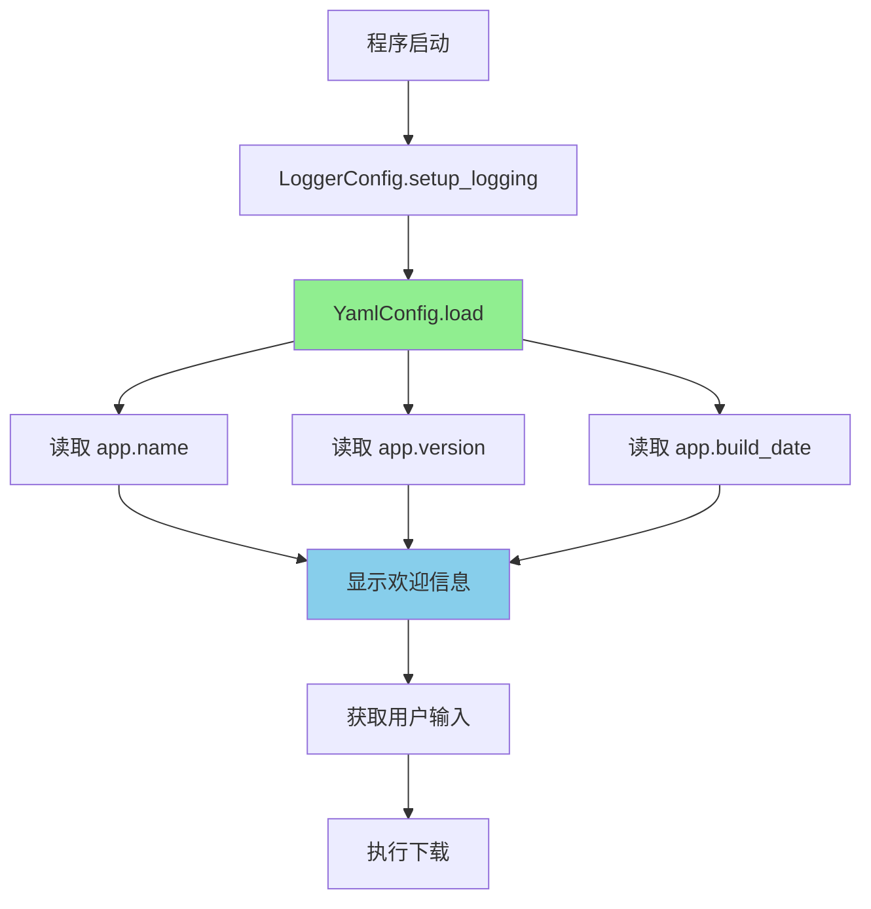
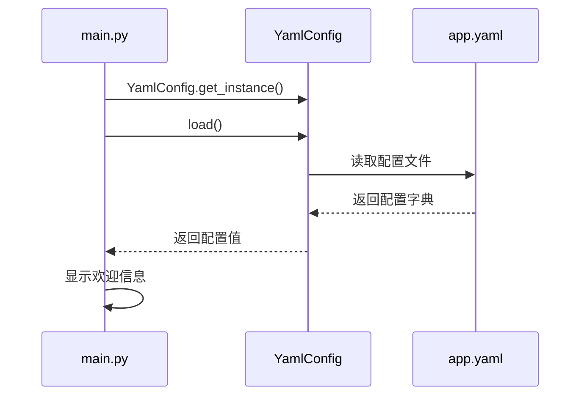
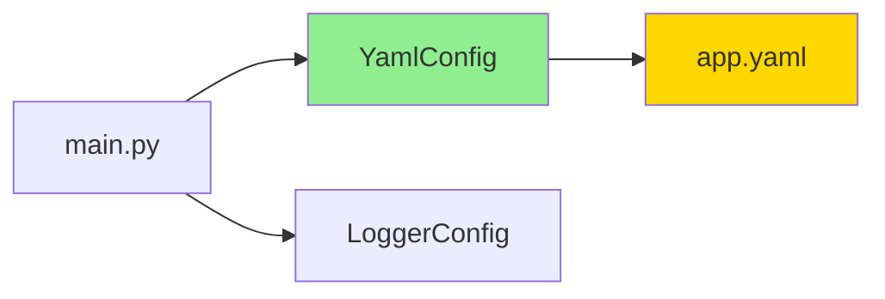

# DESIGN\_配置动态化

## 整体架构设计

### 架构原则

1. **最小改动**: 仅修改必要的代码,避免过度设计
2. **复用现有**: 使用现有的 `YamlConfig` 单例类
3. **向后兼容**: 确保修改不影响现有功能
4. **类型安全**: 使用类型安全的配置访问方法

### 架构图



### 数据流向图



## 分层设计

### 1. 配置层 (config)

#### YamlConfig 类

- **职责**: 管理配置文件的加载和访问
- **修改内容**: 更新 CONFIG_SCHEMA 以包含 `build_date` 字段验证

```python
CONFIG_SCHEMA = {
    "app": {
        "required": True,
        "type": dict,
        "fields": {
            "name": {"required": True, "type": str},
            "version": {"required": True, "type": str},
            "build_date": {"required": True, "type": str},  # 新增
        },
    },
    # ... 其他配置
}
```

### 2. 应用层 (main)

#### main 函数

- **职责**: 程序入口,显示欢迎信息
- **修改内容**: 从配置文件读取应用信息并显示

```python
def main() -> None:
    LoggerConfig.setup_logging()

    config = YamlConfig.get_instance()
    config.load()

    app_name = config.get_str("app.name")
    app_version = config.get_str("app.version")
    build_date = config.get_str("app.build_date")

    print("=" * 47)
    print(f"     欢迎使用{app_name} v{app_version}")
    print(f"         构建日期:{build_date}")
    print("=" * 47)

    # ... 其他代码
```

## 核心组件

### 1. YamlConfig 配置管理器

- **单例模式**: 确保全局只有一个实例
- **线程安全**: 使用 RLock 保证并发访问安全
- **类型安全**: 提供 `get_str()`、`get_int()` 等类型安全方法
- **配置验证**: 自动验证配置文件格式和值的有效性

### 2. 配置文件 (app.yaml)

- **位置**: `config/app.yaml`
- **格式**: YAML
- **结构**: 嵌套字典结构

```yaml
app:
  name: "钉钉直播回放下载工具"
  version: "1.5.0"
  build_date: "2026年01月15日"
```

## 模块依赖关系图



## 接口契约定义

### YamlConfig.get_str()

```python
def get_str(self, key: str, default: str = "") -> str:
    """
    获取字符串类型配置项。

    Args:
        key: 配置项键,支持点号分隔的嵌套键(如"app.name")
        default: 默认值

    Returns:
        字符串类型的配置项值

    Raises:
        ConfigValueError: 配置值不是字符串类型
    """
```

### main()

```python
def main() -> None:
    """
    主程序入口。

    显示欢迎信息,获取用户输入的下载模式,调用相应的下载函数。

    Raises:
        ConfigLoadError: 配置文件加载失败
        ConfigValidationError: 配置文件验证失败
    """
```

## 异常处理策略

### 1. 配置文件不存在

- **异常类型**: `ConfigLoadError`
- **处理方式**: 记录错误日志,显示友好的错误提示,退出程序
- **错误信息**: "配置文件不存在: {path}"

### 2. 配置文件格式错误

- **异常类型**: `ConfigLoadError`
- **处理方式**: 记录错误日志,显示友好的错误提示,退出程序
- **错误信息**: "配置文件格式错误: {details}"

### 3. 配置项缺失

- **异常类型**: `ConfigValidationError`
- **处理方式**: 记录错误日志,显示友好的错误提示,退出程序
- **错误信息**: "缺少必填配置项: {key}"

### 4. 配置值类型错误

- **异常类型**: `ConfigValueError`
- **处理方式**: 记录错误日志,显示友好的错误提示,退出程序
- **错误信息**: "配置项类型错误: {key}, 期望类型: {expected}, 实际类型: {actual}"

## 实现约束

### 1. 代码规范

- 遵循 PEP 8 编码规范
- 使用 Black 格式化工具
- 行长度不超过 100 字符
- 使用 4 空格缩进

### 2. 类型注解

- 所有函数必须有类型注解
- 使用 `typing` 模块的类型提示
- 避免使用 `Any` 类型

### 3. 错误处理

- 所有异常必须被捕获和处理
- 提供友好的错误提示
- 记录详细的错误日志

### 4. 日志记录

- 使用 logging 模块
- 记录关键操作和错误
- 日志级别: INFO, WARNING, ERROR

## 测试策略

### 1. 单元测试

- 测试 `YamlConfig.get_str()` 方法
- 测试配置文件加载功能
- 测试配置验证功能
- 测试异常处理

### 2. 集成测试

- 测试程序启动时的配置读取
- 测试欢迎信息的显示
- 测试配置文件缺失时的错误处理

### 3. 测试覆盖率

- 目标覆盖率: 80% 以上
- 关键路径覆盖率: 100%

## 性能考虑

### 1. 配置加载

- 仅在程序启动时加载一次
- 使用单例模式避免重复加载
- 配置加载时间 < 100ms

### 2. 配置访问

- 使用字典查找,时间复杂度 O(1)
- 线程安全,使用 RLock 保护

## 安全考虑

### 1. 配置文件安全

- 配置文件不应包含敏感信息
- 配置文件权限: 仅当前用户可读写

### 2. 输入验证

- 验证配置值类型
- 验证配置值范围
- 防止注入攻击

## 扩展性考虑

### 1. 未来扩展

- 可以添加更多应用信息字段(如 author, description)
- 可以支持配置文件热重载
- 可以支持多环境配置(dev, test, prod)

### 2. 接口设计

- 使用类型安全的配置访问方法
- 支持嵌套配置访问
- 支持默认值

## 兼容性

### 1. 向后兼容

- 不修改现有配置文件格式
- 不修改现有 API
- 保持现有功能不变

### 2. Python 版本

- 支持 Python 3.8+
- 不使用 Python 3.8+ 的新特性

## 下一步

基于以上设计,我将进入 **Atomize 阶段**,将任务拆分为可执行的原子任务。
