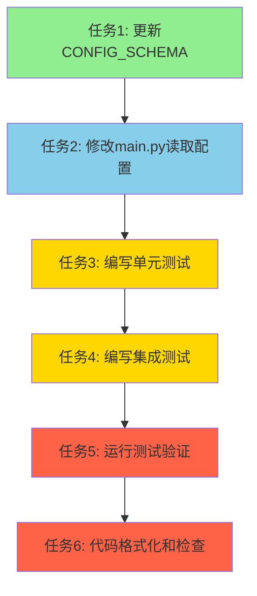

# TASK\_配置动态化

## 任务依赖图

## 原子任务列表

### 任务1: 更新CONFIG_SCHEMA以包含build_date字段验证

**任务ID**: TASK-001
**优先级**: 高
**预估时间**: 10分钟

#### 输入契约

- 文件路径: `src/dingtalk_downloader/config/yaml_config.py`
- CONFIG_SCHEMA 已存在,包含 `app.name` 和 `app.version` 字段

#### 输出契约

- CONFIG_SCHEMA 的 `app` 部分包含 `build_date` 字段验证
- `build_date` 字段标记为必填项,类型为 `str`

#### 实现约束

- 不修改其他配置项
- 保持现有验证逻辑
- 遵循代码规范(PEP 8, Black)

#### 依赖关系

- 无前置依赖

#### 验收标准

- [ ] CONFIG_SCHEMA 包含 `build_date` 字段
- [ ] `build_date` 字段标记为必填项
- [ ] `build_date` 字段类型为 `str`
- [ ] 代码格式化通过

---

### 任务2: 修改main.py从配置文件读取并显示应用信息

**任务ID**: TASK-002
**优先级**: 高
**预估时间**: 15分钟

#### 输入契约

- 文件路径: `src/dingtalk_downloader/main.py`
- `YamlConfig` 类已实现,提供 `get_str()` 方法
- 配置文件 `config/app.yaml` 包含 `app.name`、`app.version`、`app.build_date`

#### 输出契约

- `main()` 函数从配置文件读取应用信息
- 欢迎信息使用配置文件中的值
- 添加配置加载失败的错误处理

#### 实现约束

- 使用 `YamlConfig.get_instance()` 获取单例实例
- 使用 `get_str()` 方法读取配置
- 添加配置加载失败的异常处理
- 添加日志记录
- 遵循代码规范(PEP 8, Black)

#### 依赖关系

- 依赖任务1: CONFIG_SCHEMA已更新

#### 验收标准

- [ ] 从配置文件读取 `app.name`
- [ ] 从配置文件读取 `app.version`
- [ ] 从配置文件读取 `app.build_date`
- [ ] 欢迎信息显示正确的应用信息
- [ ] 配置文件不存在时显示友好的错误提示
- [ ] 配置文件格式错误时显示友好的错误提示
- [ ] 添加了适当的日志记录
- [ ] 代码格式化通过

---

### 任务3: 编写单元测试验证配置读取功能

**任务ID**: TASK-003
**优先级**: 中
**预估时间**: 20分钟

#### 输入契约

- 文件路径: `tests/unit/test_yaml_config.py`
- `YamlConfig` 类已实现
- pytest 测试框架已配置

#### 输出契约

- 测试 `YamlConfig.get_str()` 方法读取 `app.name`
- 测试 `YamlConfig.get_str()` 方法读取 `app.version`
- 测试 `YamlConfig.get_str()` 方法读取 `app.build_date`
- 测试配置文件不存在时的异常处理
- 测试配置文件格式错误时的异常处理
- 测试配置项缺失时的异常处理

#### 实现约束

- 使用 pytest 测试框架
- 使用 pytest-mock 进行 mock
- 测试覆盖率不低于 80%
- 遵循测试命名规范

#### 依赖关系

- 依赖任务1: CONFIG_SCHEMA已更新
- 依赖任务2: main.py已修改

#### 验收标准

- [ ] 测试读取 `app.name` 成功
- [ ] 测试读取 `app.version` 成功
- [ ] 测试读取 `app.build_date` 成功
- [ ] 测试配置文件不存在时抛出 `ConfigLoadError`
- [ ] 测试配置文件格式错误时抛出 `ConfigLoadError`
- [ ] 测试配置项缺失时抛出 `ConfigValidationError`
- [ ] 所有测试通过
- [ ] 测试覆盖率不低于 80%

---

### 任务4: 编写集成测试验证程序启动显示

**任务ID**: TASK-004
**优先级**: 中
**预估时间**: 15分钟

#### 输入契约

- 文件路径: `tests/unit/test_main.py`
- `main()` 函数已修改
- pytest 测试框架已配置

#### 输出契约

- 测试程序启动时显示正确的欢迎信息
- 测试配置文件缺失时的错误处理
- 测试配置文件格式错误时的错误处理

#### 实现约束

- 使用 pytest 测试框架
- 使用 pytest-mock 进行 mock
- 使用 capsys 捕获标准输出
- 遵循测试命名规范

#### 依赖关系

- 依赖任务2: main.py已修改

#### 验收标准

- [ ] 测试欢迎信息包含正确的应用名称
- [ ] 测试欢迎信息包含正确的版本号
- [ ] 测试欢迎信息包含正确的构建日期
- [ ] 测试配置文件缺失时显示友好的错误提示
- [ ] 测试配置文件格式错误时显示友好的错误提示
- [ ] 所有测试通过

---

### 任务5: 运行测试验证功能

**任务ID**: TASK-005
**优先级**: 高
**预估时间**: 10分钟

#### 输入契约

- 所有代码修改已完成
- 所有测试已编写

#### 输出契约

- 所有单元测试通过
- 所有集成测试通过
- 测试覆盖率报告生成

#### 实现约束

- 使用 pytest 运行测试
- 生成测试覆盖率报告
- 确保测试覆盖率不低于 80%

#### 依赖关系

- 依赖任务3: 单元测试已编写
- 依赖任务4: 集成测试已编写

#### 验收标准

- [ ] 所有单元测试通过
- [ ] 所有集成测试通过
- [ ] 测试覆盖率不低于 80%
- [ ] 无测试失败或错误

---

### 任务6: 代码格式化和检查

**任务ID**: TASK-006
**优先级**: 中
**预估时间**: 10分钟

#### 输入契约

- 所有代码修改已完成

#### 输出契约

- 代码格式化通过
- 代码风格检查通过
- 无 lint 错误

#### 实现约束

- 使用 Black 格式化代码
- 使用 flake8 检查代码风格
- 修复所有 lint 错误

#### 依赖关系

- 依赖任务2: main.py已修改
- 依赖任务3: 单元测试已编写
- 依赖任务4: 集成测试已编写

#### 验收标准

- [ ] Black 格式化通过
- [ ] flake8 检查通过
- [ ] 无 lint 错误
- [ ] 代码符合 PEP 8 规范

---

## 任务执行顺序

1. **任务1**: 更新CONFIG_SCHEMA以包含build_date字段验证
2. **任务2**: 修改main.py从配置文件读取并显示应用信息
3. **任务3**: 编写单元测试验证配置读取功能
4. **任务4**: 编写集成测试验证程序启动显示
5. **任务5**: 运行测试验证功能
6. **任务6**: 代码格式化和检查

## 总体验收标准

### 功能验收

- [ ] 程序启动时从配置文件读取并显示应用名称
- [ ] 程序启动时从配置文件读取并显示版本号
- [ ] 程序启动时从配置文件读取并显示构建日期
- [ ] 配置文件不存在时提供友好的错误提示
- [ ] 配置文件格式错误时提供友好的错误提示

### 代码质量验收

- [ ] 代码符合项目编码规范(PEP 8, Black格式化)
- [ ] 代码有完整的类型注解
- [ ] 代码有适当的错误处理
- [ ] 代码有适当的日志记录

### 测试验收

- [ ] 单元测试覆盖配置读取功能
- [ ] 集成测试验证程序启动显示
- [ ] 所有测试通过
- [ ] 测试覆盖率不低于80%

## 下一步

基于以上任务拆分,我将进入 **Approve 阶段**,审查任务计划的完整性和可行性。
