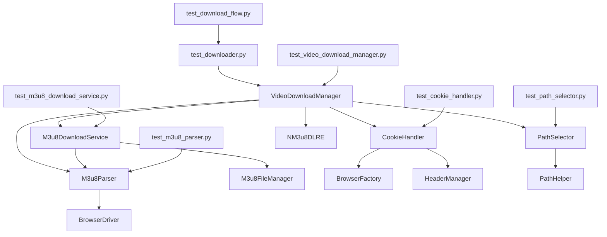
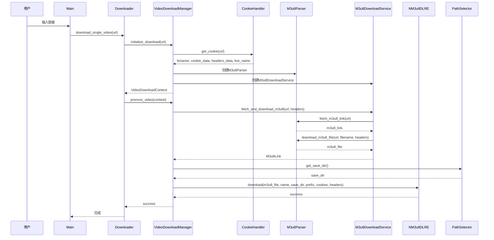
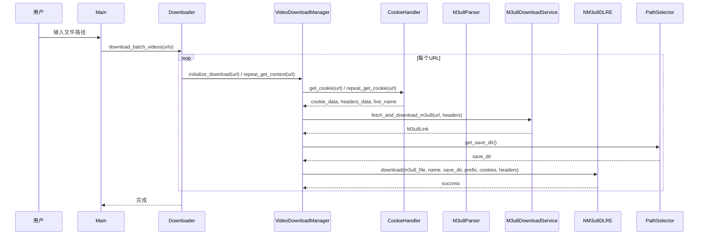

# DESIGN_测试代码更新

## 整体架构

### 测试架构设计

```
tests/
├── conftest.py                      # pytest配置和全局fixtures
├── fixtures/                        # 测试fixtures
│   ├── __init__.py
│   ├── browser_fixtures.py          # 浏览器相关fixtures
│   ├── cookie_fixtures.py           # Cookie相关fixtures
│   ├── file_fixtures.py             # 文件相关fixtures
│   └── mock_fixtures.py             # Mock对象fixtures
├── unit/                            # 单元测试
│   ├── __init__.py
│   ├── test_downloader.py           # Downloader单元测试（重写）
│   ├── test_video_download_manager.py  # VideoDownloadManager单元测试（新增）
│   ├── test_m3u8_download_service.py  # M3u8DownloadService单元测试（新增）
│   ├── test_cookie_handler.py       # CookieHandler单元测试（更新）
│   ├── test_m3u8_parser.py          # M3u8Parser单元测试（更新）
│   ├── test_path_selector.py        # PathSelector单元测试（新增）
│   ├── test_n_m3u8dl_re.py          # NM3u8DLRE单元测试（验证）
│   ├── test_models.py               # 数据模型单元测试（验证）
│   ├── test_browser_factory.py      # BrowserFactory单元测试（验证）
│   ├── test_file_reader.py          # FileReader单元测试（验证）
│   ├── test_yaml_config.py          # YamlConfig单元测试（验证）
│   ├── test_validator.py            # Validator单元测试（验证）
│   ├── test_path_helper.py          # PathHelper单元测试（验证）
│   ├── test_logger_config_yaml.py   # LoggerConfig单元测试（验证）
│   ├── test_download_dir_config.py  # DownloadDirConfig单元测试（验证）
│   ├── test_chrome_driver.py       # ChromeDriver单元测试（验证）
│   ├── test_edge_driver.py         # EdgeDriver单元测试（验证）
│   ├── test_firefox_driver.py      # FirefoxDriver单元测试（验证）
│   ├── test_browser_driver.py      # BrowserDriver单元测试（验证）
│   └── test_main.py                # Main单元测试（验证）
├── integration/                     # 集成测试
│   ├── __init__.py
│   └── test_download_flow.py        # 下载流程集成测试（重写）
└── functional/                      # 功能测试
    └── test_m3u8_download_fix.py   # m3u8下载功能测试（验证）
```

### 分层设计

#### 1. 单元测试层（Unit Tests）
**目标**: 测试单个类或函数的功能

**测试策略**:
- 使用Mock对象隔离依赖
- 测试正常流程和异常情况
- 测试边界条件
- 测试输入验证

**测试覆盖**:
- Downloader: 作为外观类的协调功能
- VideoDownloadManager: 视频下载管理逻辑
- M3u8DownloadService: m3u8获取和下载逻辑
- CookieHandler: Cookie获取和管理逻辑
- M3u8Parser: m3u8链接提取逻辑
- PathSelector: 路径选择逻辑
- 其他工具类和辅助类

#### 2. 集成测试层（Integration Tests）
**目标**: 测试多个类协作完成的功能

**测试策略**:
- 使用部分Mock对象
- 测试完整流程
- 测试异常处理
- 测试用户交互

**测试覆盖**:
- 单个视频下载流程
- 批量下载流程
- 错误恢复流程

#### 3. 功能测试层（Functional Tests）
**目标**: 测试系统的功能需求

**测试策略**:
- 尽量使用真实环境
- 测试用户场景
- 测试性能指标

**测试覆盖**:
- m3u8下载功能
- 文件处理功能

## 核心组件

### 1. test_downloader.py

#### 测试目标
验证Downloader作为外观类的协调功能

#### Mock策略
```python
@patch("dingtalk_downloader.core.downloader.VideoDownloadManager")
def test_downloader_init(mock_video_manager_class):
    """测试Downloader初始化"""
    mock_video_manager = Mock()
    mock_video_manager_class.return_value = mock_video_manager

    downloader = Downloader("edge", "1")

    assert downloader.browser_type == "edge"
    assert downloader.save_mode == "1"
    assert downloader.video_manager == mock_video_manager
```

#### 测试用例设计
1. **初始化测试**
   - test_downloader_init_edge_default
   - test_downloader_init_chrome_manual
   - test_downloader_init_firefox_manual

2. **关闭测试**
   - test_downloader_close

3. **单个视频下载测试**
   - test_download_single_video_success
   - test_download_single_video_failure
   - test_download_single_video_continue
   - test_download_single_video_exit

4. **批量下载测试**
   - test_download_batch_videos_success
   - test_download_batch_videos_failure
   - test_download_batch_videos_continue

### 2. test_video_download_manager.py

#### 测试目标
验证VideoDownloadManager的视频下载管理逻辑

#### Mock策略
```python
@patch("dingtalk_downloader.core.video_download_manager.CookieHandler")
@patch("dingtalk_downloader.core.video_download_manager.M3u8Parser")
@patch("dingtalk_downloader.core.video_download_manager.M3u8DownloadService")
@patch("dingtalk_downloader.core.video_download_manager.PathSelector")
@patch("dingtalk_downloader.core.video_download_manager.NM3u8DLRE")
def test_video_download_manager_init(
    mock_n_m3u8dl_re_class,
    mock_path_selector_class,
    mock_m3u8_download_service_class,
    mock_m3u8_parser_class,
    mock_cookie_handler_class
):
    """测试VideoDownloadManager初始化"""
    mock_cookie_handler = Mock()
    mock_cookie_handler_class.return_value = mock_cookie_handler

    mock_path_selector = Mock()
    mock_path_selector_class.return_value = mock_path_selector

    mock_n_m3u8dl_re = Mock()
    mock_n_m3u8dl_re_class.return_value = mock_n_m3u8dl_re

    manager = VideoDownloadManager("edge", "1")

    assert manager.browser_type == "edge"
    assert manager.cookie_handler == mock_cookie_handler
    assert manager.path_selector == mock_path_selector
    assert manager.n_m3u8dl_re == mock_n_m3u8dl_re
```

#### 测试用例设计
1. **初始化测试**
   - test_video_download_manager_init_edge_default
   - test_video_download_manager_init_chrome_manual

2. **初始化下载测试**
   - test_initialize_download_success
   - test_initialize_download_cookie_error

3. **重复获取上下文测试**
   - test_repeat_get_context_success
   - test_repeat_get_context_first_call

4. **处理视频测试**
   - test_process_video_success
   - test_process_video_failure
   - test_process_video_m3u8_download_error

5. **关闭测试**
   - test_close

### 3. test_m3u8_download_service.py

#### 测试目标
验证M3u8DownloadService的m3u8获取和下载逻辑

#### Mock策略
```python
@patch("dingtalk_downloader.core.m3u8_download_service.M3u8FileManager")
def test_m3u8_download_service_fetch_and_download_m3u8_success(
    mock_m3u8_file_manager_class
):
    """测试成功获取并下载m3u8文件"""
    mock_m3u8_parser = Mock()
    mock_m3u8_parser.fetch_m3u8_link.return_value = "https://test.com/video.m3u8"
    mock_m3u8_parser.download_m3u8_file.return_value = "/path/to/video.m3u8"
    mock_m3u8_parser.extract_prefix.return_value = "https://test.com/"

    mock_m3u8_file_manager = Mock()
    mock_m3u8_file_manager.get_temp_file_path.return_value = "/path/to/video.m3u8"
    mock_m3u8_file_manager_class.return_value = mock_m3u8_file_manager

    service = M3u8DownloadService(mock_m3u8_parser)

    m3u8_link = service.fetch_and_download_m3u8(
        "https://n.dingtalk.com/test",
        {"User-Agent": "Mozilla/5.0"}
    )

    assert m3u8_link.url == "https://test.com/video.m3u8"
    assert m3u8_link.prefix == "https://test.com/"
    assert m3u8_link.local_file_path == "/path/to/video.m3u8"
```

#### 测试用例设计
1. **初始化测试**
   - test_m3u8_download_service_init

2. **获取并下载m3u8测试**
   - test_fetch_and_download_m3u8_success
   - test_fetch_and_download_m3u8_fetch_error
   - test_fetch_and_download_m3u8_download_error
   - test_fetch_and_download_m3u8_file_not_exist

### 4. test_cookie_handler.py（更新）

#### 测试目标
验证CookieHandler的Cookie获取和管理逻辑

#### 更新内容
1. 移除对`get_user_agent()`和`get_referer()`的调用
2. 使用HeaderManager而不是直接调用浏览器方法
3. 添加对`_collect_browser_data()`方法的测试

#### 测试用例设计
1. **初始化测试**
   - test_cookie_handler_init

2. **获取Cookie测试**
   - test_get_cookie_success
   - test_get_cookie_browser_error

3. **重复获取Cookie测试**
   - test_repeat_get_cookie_success
   - test_repeat_get_cookie_first_call

4. **收集浏览器数据测试**
   - test_collect_browser_data_success

5. **获取直播名称测试**
   - test_get_live_name_xpath_success
   - test_get_live_name_css_success
   - test_get_live_name_fallback

6. **关闭测试**
   - test_close

### 5. test_m3u8_parser.py（更新）

#### 测试目标
验证M3u8Parser的m3u8链接提取逻辑

#### 更新内容
1. 将`fetch_m3u8_links()`改为`fetch_m3u8_link()`
2. 将返回值从列表改为单个字符串
3. 移除对`extract_m3u8_links_from_logs()`的直接调用

#### 测试用例设计
1. **初始化测试**
   - test_m3u8_parser_init

2. **获取m3u8链接测试**
   - test_fetch_m3u8_link_success
   - test_fetch_m3u8_link_no_live_uuid
   - test_fetch_m3u8_link_retry_success
   - test_fetch_m3u8_link_retry_failure

3. **下载m3u8文件测试**
   - test_download_m3u8_file_success
   - test_download_m3u8_file_failure

4. **提取基础URL测试**
   - test_extract_prefix_success
   - test_extract_prefix_no_match

5. **刷新页面测试**
   - test_refresh_page

### 6. test_path_selector.py（新增）

#### 测试目标
验证PathSelector的路径选择逻辑

#### Mock策略
```python
@patch("dingtalk_downloader.utils.path_helper.get_default_download_dir")
def test_path_selector_get_save_dir_default(mock_get_default_download_dir):
    """测试获取默认保存目录"""
    mock_get_default_download_dir.return_value = "/path/to/downloads"

    selector = PathSelector("1")
    save_dir = selector.get_save_dir()

    assert save_dir == "/path/to/downloads"
```

#### 测试用例设计
1. **初始化测试**
   - test_path_selector_init_default
   - test_path_selector_init_manual

2. **获取保存目录测试**
   - test_get_save_dir_default
   - test_get_save_dir_manual_success
   - test_get_save_dir_manual_cancelled

### 7. test_download_flow.py（重写）

#### 测试目标
验证完整的下载流程

#### Mock策略
```python
@patch("dingtalk_downloader.core.downloader.VideoDownloadManager")
def test_single_download_flow_success(mock_video_manager_class):
    """测试单个视频下载流程成功"""
    mock_video_manager = Mock()
    mock_video_manager_class.return_value = mock_video_manager

    mock_context = Mock()
    mock_context.live_name = "测试直播"
    mock_video_manager.initialize_download.return_value = mock_context
    mock_video_manager.process_video.return_value = True

    downloader = Downloader("edge", "1")

    with patch("builtins.input", return_value="q"):
        downloader.download_single_video("https://n.dingtalk.com/test")

    mock_video_manager.initialize_download.assert_called_once()
    mock_video_manager.process_video.assert_called_once()
```

#### 测试用例设计
1. **单个视频下载流程测试**
   - test_single_download_flow_success
   - test_single_download_flow_failure
   - test_single_download_flow_continue

2. **批量下载流程测试**
   - test_batch_download_flow_success
   - test_batch_download_flow_failure
   - test_batch_download_flow_continue

## 模块依赖关系

### 依赖关系图



### 接口契约定义

#### Downloader接口
```python
class Downloader:
    def __init__(self, browser_type: str, save_mode: str) -> None
    def download_single_video(self, url: str) -> None
    def download_batch_videos(self, urls: Dict[int, str]) -> None
    def close(self) -> None
```

#### VideoDownloadManager接口
```python
class VideoDownloadManager:
    def __init__(self, browser_type: str, save_mode: str) -> None
    def initialize_download(self, url: str) -> VideoDownloadContext
    def repeat_get_context(self, url: str) -> VideoDownloadContext
    def process_video(self, context: VideoDownloadContext) -> bool
    def close(self) -> None
```

#### M3u8DownloadService接口
```python
class M3u8DownloadService:
    def __init__(self, m3u8_parser: M3u8Parser) -> None
    def fetch_and_download_m3u8(self, url: str, m3u8_headers: dict) -> M3u8Link
```

#### CookieHandler接口
```python
class CookieHandler:
    def __init__(self, browser_type: str) -> None
    def get_cookie(self, url: str) -> Tuple[Any, CookieData, HeadersData, str]
    def repeat_get_cookie(self, url: str) -> Tuple[CookieData, HeadersData, str]
    def close(self) -> None
```

#### M3u8Parser接口
```python
class M3u8Parser:
    def __init__(self, browser: BrowserDriver, max_retries: int = 5) -> None
    def fetch_m3u8_link(self, url: str) -> str
    def download_m3u8_file(self, url: str, filename: str, headers: dict) -> str
    def extract_prefix(self, url: str) -> str
```

#### PathSelector接口
```python
class PathSelector:
    def __init__(self, save_mode: str) -> None
    def get_save_dir(self) -> Optional[str]
```

## 数据流向

### 单个视频下载流程



### 批量下载流程



## 异常处理策略

### 异常类型

#### 1. CookieError
**触发条件**: Cookie获取失败
**处理方式**: 抛出异常，由上层捕获并处理

#### 2. M3u8ParseError
**触发条件**: m3u8解析失败
**处理方式**: 抛出异常，由上层捕获并处理

#### 3. FileReaderError
**触发条件**: 文件读取失败
**处理方式**: 抛出异常，由上层捕获并处理

#### 4. DownloadError
**触发条件**: 下载失败
**处理方式**: 抛出异常，由上层捕获并处理

### 测试异常处理

#### 测试用例设计
1. **Cookie获取失败测试**
   - test_get_cookie_browser_error
   - test_get_cookie_timeout

2. **m3u8解析失败测试**
   - test_fetch_m3u8_link_no_live_uuid
   - test_fetch_m3u8_link_retry_failure
   - test_download_m3u8_file_failure

3. **文件读取失败测试**
   - test_file_reader_invalid_format
   - test_file_reader_no_links

4. **下载失败测试**
   - test_download_single_video_failure
   - test_download_batch_videos_failure
   - test_n_m3u8dl_re_download_failure

## 测试数据管理

### 测试数据分类

#### 1. Mock数据
- Mock浏览器实例
- Mock Cookie数据
- Mock请求头数据
- Mock m3u8链接
- Mock视频下载上下文

#### 2. 测试文件
- 测试CSV文件
- 测试Excel文件
- 测试m3u8文件
- 测试视频文件

#### 3. 测试URL
- 有效的钉钉直播链接
- 无效的钉钉直播链接
- 测试用的m3u8链接

### 测试数据存储

```
tests/
├── fixtures/
│   ├── browser_fixtures.py      # 浏览器Mock fixtures
│   ├── cookie_fixtures.py       # Cookie Mock fixtures
│   ├── file_fixtures.py         # 文件Mock fixtures
│   └── mock_fixtures.py         # 通用Mock fixtures
├── data/                        # 测试数据文件
│   ├── sample.csv              # 示例CSV文件
│   ├── sample.xlsx             # 示例Excel文件
│   └── sample.m3u8             # 示例m3u8文件
└── temp/                        # 临时测试文件
    └── .gitkeep
```

## 测试执行策略

### 测试执行顺序

1. **单元测试**
   - 先测试基础类（models, utils）
   - 再测试核心类（VideoDownloadManager, M3u8DownloadService）
   - 最后测试外观类（Downloader）

2. **集成测试**
   - 测试单个视频下载流程
   - 测试批量下载流程

3. **功能测试**
   - 测试m3u8下载功能
   - 测试文件处理功能

### 测试执行命令

```bash
# 运行所有测试
pytest

# 运行单元测试
pytest tests/unit/

# 运行集成测试
pytest tests/integration/

# 运行功能测试
pytest tests/functional/

# 运行特定测试文件
pytest tests/unit/test_downloader.py

# 运行特定测试用例
pytest tests/unit/test_downloader.py::test_downloader_init

# 查看测试覆盖率
pytest --cov=src --cov-report=html

# 运行慢速测试
pytest -m slow

# 运行快速测试
pytest -m "not slow"
```

## 测试报告

### 测试覆盖率报告

```bash
pytest --cov=src --cov-report=html
```

生成的覆盖率报告位于`htmlcov/index.html`

### 测试执行报告

```bash
pytest -v --tb=short
```

### 测试性能报告

```bash
pytest --durations=10
```

显示最慢的10个测试用例

## 质量保证

### 代码审查检查清单

- [ ] 测试用例命名清晰、描述准确
- [ ] 测试用例独立，不相互依赖
- [ ] Mock对象使用合理，不依赖外部资源
- [ ] 测试覆盖正常流程和异常情况
- [ ] 测试覆盖边界条件
- [ ] 测试代码符合项目编码规范
- [ ] 测试代码有清晰的文档字符串
- [ ] 复杂测试逻辑有必要的注释

### 持续集成检查清单

- [ ] 所有测试用例能够成功执行
- [ ] 测试覆盖率不低于当前水平
- [ ] 没有慢速测试（>5秒）
- [ ] 没有跳过的测试
- [ ] 测试执行时间在可接受范围内

### 回归测试检查清单

- [ ] 运行所有测试用例
- [ ] 检查是否有测试失败
- [ ] 检查是否有测试被跳过
- [ ] 检查测试覆盖率是否降低
- [ ] 检查是否有新的测试失败
