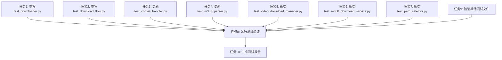

# TASK_测试代码更新

## 任务依赖图

## 原子任务列表

### 任务1: 重写test_downloader.py

#### 输入契约
- **前置条件**:
  - 已完成项目源码分析
  - 已完成测试代码分析
  - 已创建ALIGNMENT、CONSENSUS、DESIGN文档
- **输入文件**:
  - `src/dingtalk_downloader/core/downloader.py`
  - `tests/unit/test_downloader.py`（旧版本）
  - `docs/tasks/20260127-000000-test-update/DESIGN_测试代码更新.md`

#### 输出契约
- **输出文件**:
  - `tests/unit/test_downloader.py`（新版本）
- **验收标准**:
  - 所有测试用例能够成功执行
  - 测试覆盖Downloader的所有公共方法
  - Mock对象使用合理，不依赖外部资源
  - 测试代码符合项目编码规范

#### 实现约束
- 只能修改`tests/unit/test_downloader.py`
- 不能修改`src`目录下的任何文件
- 必须使用Mock对象隔离依赖
- 测试用例必须独立，不相互依赖

#### 依赖关系
- 无前置依赖

#### 测试用例清单
1. `test_downloader_init_edge_default` - 测试Edge浏览器默认模式初始化
2. `test_downloader_init_chrome_manual` - 测试Chrome浏览器手动模式初始化
3. `test_downloader_init_firefox_manual` - 测试Firefox浏览器手动模式初始化
4. `test_downloader_close` - 测试关闭下载器
5. `test_download_single_video_success` - 测试单个视频下载成功
6. `test_download_single_video_failure` - 测试单个视频下载失败
7. `test_download_single_video_continue` - 测试继续下载
8. `test_download_single_video_exit` - 测试退出
9. `test_download_batch_videos_success` - 测试批量下载成功
10. `test_download_batch_videos_failure` - 测试批量下载失败
11. `test_download_batch_videos_continue` - 测试继续下载

---

### 任务2: 重写test_download_flow.py

#### 输入契约
- **前置条件**:
  - 任务1已完成
  - 已完成项目源码分析
  - 已完成测试代码分析
- **输入文件**:
  - `src/dingtalk_downloader/core/downloader.py`
  - `src/dingtalk_downloader/core/video_download_manager.py`
  - `tests/integration/test_download_flow.py`（旧版本）
  - `docs/tasks/20260127-000000-test-update/DESIGN_测试代码更新.md`

#### 输出契约
- **输出文件**:
  - `tests/integration/test_download_flow.py`（新版本）
- **验收标准**:
  - 所有测试用例能够成功执行
  - 测试覆盖完整的下载流程
  - Mock对象使用合理，不依赖外部资源
  - 测试代码符合项目编码规范

#### 实现约束
- 只能修改`tests/integration/test_download_flow.py`
- 不能修改`src`目录下的任何文件
- 必须使用Mock对象隔离依赖
- 测试用例必须独立，不相互依赖

#### 依赖关系
- 依赖任务1（test_downloader.py重写）

#### 测试用例清单
1. `test_single_download_flow_success` - 测试单个视频下载流程成功
2. `test_single_download_flow_failure` - 测试单个视频下载流程失败
3. `test_single_download_flow_continue` - 测试单个视频下载流程继续
4. `test_batch_download_flow_success` - 测试批量下载流程成功
5. `test_batch_download_flow_failure` - 测试批量下载流程失败
6. `test_batch_download_flow_continue` - 测试批量下载流程继续

---

### 任务3: 更新test_cookie_handler.py

#### 输入契约
- **前置条件**:
  - 已完成项目源码分析
  - 已完成测试代码分析
- **输入文件**:
  - `src/dingtalk_downloader/core/cookie_handler.py`
  - `tests/unit/test_cookie_handler.py`（当前版本）
  - `docs/tasks/20260127-000000-test-update/DESIGN_测试代码更新.md`

#### 输出契约
- **输出文件**:
  - `tests/unit/test_cookie_handler.py`（更新版本）
- **验收标准**:
  - 所有测试用例能够成功执行
  - 移除对已废弃方法的测试
  - 更新Mock对象，使用HeaderManager
  - 测试代码符合项目编码规范

#### 实现约束
- 只能修改`tests/unit/test_cookie_handler.py`
- 不能修改`src`目录下的任何文件
- 必须保留仍然有效的测试用例
- 必须移除与当前实现不一致的测试用例

#### 依赖关系
- 无前置依赖

#### 测试用例清单
1. `test_cookie_handler_init` - 测试初始化（保留）
2. `test_cookie_handler_get_cookie_success` - 测试获取Cookie成功（更新）
3. `test_cookie_handler_get_cookie_browser_error` - 测试获取Cookie浏览器错误（新增）
4. `test_cookie_handler_repeat_get_cookie_success` - 测试重复获取Cookie成功（更新）
5. `test_cookie_handler_repeat_get_cookie_first_call` - 测试重复获取Cookie首次调用（新增）
6. `test_cookie_handler_collect_browser_data_success` - 测试收集浏览器数据成功（新增）
7. `test_cookie_handler_get_live_name_xpath_success` - 测试通过XPath获取直播名称（更新）
8. `test_cookie_handler_get_live_name_css_success` - 测试通过CSS选择器获取直播名称（更新）
9. `test_cookie_handler_get_live_name_fallback` - 测试直播名称获取失败回退（更新）
10. `test_cookie_handler_close` - 测试关闭（保留）

#### 需要移除的测试用例
1. `test_cookie_handler_get_cookie_with_multiple_cookies` - 方法签名已改变
2. `test_cookie_handler_get_live_name_xpath` - 已合并到新测试用例
3. `test_cookie_handler_get_live_name_css` - 已合并到新测试用例
4. `test_cookie_handler_get_live_name_fallback` - 已合并到新测试用例

---

### 任务4: 更新test_m3u8_parser.py

#### 输入契约
- **前置条件**:
  - 已完成项目源码分析
  - 已完成测试代码分析
- **输入文件**:
  - `src/dingtalk_downloader/core/m3u8_parser.py`
  - `tests/unit/test_m3u8_parser.py`（当前版本）
  - `docs/tasks/20260127-000000-test-update/DESIGN_测试代码更新.md`

#### 输出契约
- **输出文件**:
  - `tests/unit/test_m3u8_parser.py`（更新版本）
- **验收标准**:
  - 所有测试用例能够成功执行
  - 更新方法调用，使用新的API
  - 更新返回值，从列表改为单个字符串
  - 测试代码符合项目编码规范

#### 实现约束
- 只能修改`tests/unit/test_m3u8_parser.py`
- 不能修改`src`目录下的任何文件
- 必须保留仍然有效的测试用例
- 必须移除与当前实现不一致的测试用例

#### 依赖关系
- 无前置依赖

#### 测试用例清单
1. `test_m3u8_parser_init` - 测试初始化（保留）
2. `test_m3u8_parser_fetch_m3u8_link_success` - 测试成功获取m3u8链接（更新）
3. `test_m3u8_parser_fetch_m3u8_link_no_live_uuid` - 测试没有liveUuid的情况（更新）
4. `test_m3u8_parser_fetch_m3u8_link_retry_success` - 测试重试机制成功（更新）
5. `test_m3u8_parser_fetch_m3u8_link_retry_failure` - 测试重试机制失败（更新）
6. `test_m3u8_parser_fetch_m3u8_link_exception_handling` - 测试异常处理（保留）
7. `test_m3u8_parser_download_m3u8_file_success` - 测试成功下载m3u8文件（保留）
8. `test_m3u8_parser_download_m3u8_file_with_headers` - 测试下载m3u8文件带请求头（保留）
9. `test_m3u8_parser_download_m3u8_file_failure` - 测试下载m3u8文件失败（更新）
10. `test_m3u8_parser_extract_prefix_success` - 测试提取基础URL成功（保留）
11. `test_m3u8_parser_extract_prefix_no_match` - 测试提取基础URL无匹配（保留）
12. `test_m3u8_parser_refresh_page` - 测试刷新页面（保留）

#### 需要移除的测试用例
1. `test_m3u8_parser_fetch_m3u8_links_edge` - 方法名已改变
2. `test_m3u8_parser_fetch_m3u8_links_chrome` - 方法名已改变
3. `test_m3u8_parser_fetch_m3u8_links_firefox` - 方法名已改变
4. `test_m3u8_parser_fetch_m3u8_links_not_found` - 方法名已改变
5. `test_m3u8_parser_fetch_m3u8_links_retry` - 方法名已改变
6. `test_m3u8_parser_fetch_m3u8_links_empty_logs` - 方法名已改变
7. `test_m3u8_parser_fetch_m3u8_links_max_retries_exceeded` - 方法名已改变
8. `test_m3u8_parser_fetch_m3u8_links_multiple_m3u8_links` - 方法名已改变
9. `test_m3u8_parser_fetch_m3u8_links_log_exception_handling` - 方法名已改变
10. `test_m3u8_parser_fetch_m3u8_links_json_parse_error` - 方法名已改变
11. `test_m3u8_parser_fetch_m3u8_links_empty_json_url` - 方法名已改变
12. `test_m3u8_parser_fetch_m3u8_links_mixed_content` - 方法名已改变
13. `test_m3u8_parser_fetch_m3u8_links_case_insensitive` - 方法名已改变
14. `test_m3u8_parser_fetch_m3u8_links_with_special_characters` - 方法名已改变
15. `test_m3u8_parser_download_m3u8_file_exception_handling` - 已合并到新测试用例
16. `test_m3u8_parser_download_m3u8_file_write_error` - 已合并到新测试用例
17. `test_m3u8_parser_extract_prefix_with_query_params` - 已合并到新测试用例
18. `test_m3u8_parser_extract_prefix_without_query_params` - 已合并到新测试用例
19. `test_m3u8_parser_extract_prefix_different_path` - 已合并到新测试用例

---

### 任务5: 新增test_video_download_manager.py

#### 输入契约
- **前置条件**:
  - 已完成项目源码分析
  - 已完成测试代码分析
- **输入文件**:
  - `src/dingtalk_downloader/core/video_download_manager.py`
  - `docs/tasks/20260127-000000-test-update/DESIGN_测试代码更新.md`

#### 输出契约
- **输出文件**:
  - `tests/unit/test_video_download_manager.py`（新文件）
- **验收标准**:
  - 所有测试用例能够成功执行
  - 测试覆盖VideoDownloadManager的所有公共方法
  - Mock对象使用合理，不依赖外部资源
  - 测试代码符合项目编码规范

#### 实现约束
- 只能创建`tests/unit/test_video_download_manager.py`
- 不能修改`src`目录下的任何文件
- 必须使用Mock对象隔离依赖
- 测试用例必须独立，不相互依赖

#### 依赖关系
- 无前置依赖

#### 测试用例清单
1. `test_video_download_manager_init_edge_default` - 测试Edge浏览器默认模式初始化
2. `test_video_download_manager_init_chrome_manual` - 测试Chrome浏览器手动模式初始化
3. `test_video_download_manager_init_firefox_manual` - 测试Firefox浏览器手动模式初始化
4. `test_initialize_download_success` - 测试初始化下载成功
5. `test_initialize_download_cookie_error` - 测试初始化下载Cookie错误
6. `test_repeat_get_context_success` - 测试重复获取上下文成功
7. `test_repeat_get_context_first_call` - 测试重复获取上下文首次调用
8. `test_process_video_success` - 测试处理视频成功
9. `test_process_video_failure` - 测试处理视频失败
10. `test_process_video_m3u8_download_error` - 测试处理视频m3u8下载错误
11. `test_close` - 测试关闭管理器

---

### 任务6: 新增test_m3u8_download_service.py

#### 输入契约
- **前置条件**:
  - 已完成项目源码分析
  - 已完成测试代码分析
- **输入文件**:
  - `src/dingtalk_downloader/core/m3u8_download_service.py`
  - `docs/tasks/20260127-000000-test-update/DESIGN_测试代码更新.md`

#### 输出契约
- **输出文件**:
  - `tests/unit/test_m3u8_download_service.py`（新文件）
- **验收标准**:
  - 所有测试用例能够成功执行
  - 测试覆盖M3u8DownloadService的所有公共方法
  - Mock对象使用合理，不依赖外部资源
  - 测试代码符合项目编码规范

#### 实现约束
- 只能创建`tests/unit/test_m3u8_download_service.py`
- 不能修改`src`目录下的任何文件
- 必须使用Mock对象隔离依赖
- 测试用例必须独立，不相互依赖

#### 依赖关系
- 无前置依赖

#### 测试用例清单
1. `test_m3u8_download_service_init` - 测试初始化
2. `test_fetch_and_download_m3u8_success` - 测试成功获取并下载m3u8文件
3. `test_fetch_and_download_m3u8_fetch_error` - 测试获取m3u8链接错误
4. `test_fetch_and_download_m3u8_download_error` - 测试下载m3u8文件错误
5. `test_fetch_and_download_m3u8_file_not_exist` - 测试m3u8文件不存在

---

### 任务7: 新增test_path_selector.py

#### 输入契约
- **前置条件**:
  - 已完成项目源码分析
  - 已完成测试代码分析
- **输入文件**:
  - `src/dingtalk_downloader/utils/path_selector.py`
  - `docs/tasks/20260127-000000-test-update/DESIGN_测试代码更新.md`

#### 输出契约
- **输出文件**:
  - `tests/unit/test_path_selector.py`（新文件）
- **验收标准**:
  - 所有测试用例能够成功执行
  - 测试覆盖PathSelector的所有公共方法
  - Mock对象使用合理，不依赖外部资源
  - 测试代码符合项目编码规范

#### 实现约束
- 只能创建`tests/unit/test_path_selector.py`
- 不能修改`src`目录下的任何文件
- 必须使用Mock对象隔离依赖
- 测试用例必须独立，不相互依赖

#### 依赖关系
- 无前置依赖

#### 测试用例清单
1. `test_path_selector_init_default` - 测试默认模式初始化
2. `test_path_selector_init_manual` - 测试手动模式初始化
3. `test_get_save_dir_default` - 测试获取默认保存目录
4. `test_get_save_dir_manual_success` - 测试获取手动选择的保存目录成功
5. `test_get_save_dir_manual_cancelled` - 测试获取手动选择的保存目录取消

---

### 任务8: 运行测试验证

#### 输入契约
- **前置条件**:
  - 任务1-7已完成
- **输入文件**:
  - 所有更新后的测试文件

#### 输出契约
- **输出文件**:
  - 测试执行报告
  - 测试覆盖率报告
- **验收标准**:
  - 所有测试用例能够成功执行
  - 测试覆盖率不低于当前水平
  - 没有失败的测试用例
  - 没有跳过的测试用例

#### 实现约束
- 不能修改任何测试文件
- 只能运行测试和生成报告

#### 依赖关系
- 依赖任务1-7

#### 执行步骤
1. 运行所有单元测试：`pytest tests/unit/ -v`
2. 运行所有集成测试：`pytest tests/integration/ -v`
3. 运行所有功能测试：`pytest tests/functional/ -v`
4. 运行所有测试：`pytest -v`
5. 生成测试覆盖率报告：`pytest --cov=src --cov-report=html`
6. 检查测试执行时间：`pytest --durations=10`

---

### 任务9: 验证其他测试文件

#### 输入契约
- **前置条件**:
  - 已完成项目源码分析
  - 已完成测试代码分析
- **输入文件**:
  - 所有其他测试文件
  - `docs/tasks/20260127-000000-test-update/DESIGN_测试代码更新.md`

#### 输出契约
- **输出文件**:
  - 验证报告
- **验收标准**:
  - 所有测试用例能够成功执行
  - 测试代码与当前实现一致
  - 测试代码符合项目编码规范

#### 实现约束
- 只能验证测试文件，不能修改
- 如果发现不一致的问题，记录在验证报告中

#### 依赖关系
- 无前置依赖

#### 验证清单
1. `test_main.py` - 验证主程序测试
2. `test_models.py` - 验证数据模型测试
3. `test_n_m3u8dl_re.py` - 验证N_m3u8DL-RE测试
4. `test_browser_factory.py` - 验证浏览器工厂测试
5. `test_file_reader.py` - 验证文件读取器测试
6. `test_yaml_config.py` - 验证YAML配置测试
7. `test_validator.py` - 验证验证器测试
8. `test_path_helper.py` - 验证路径助手测试
9. `test_logger_config_yaml.py` - 验证日志配置测试
10. `test_download_dir_config.py` - 验证下载目录配置测试
11. `test_chrome_driver.py` - 验证Chrome驱动测试
12. `test_edge_driver.py` - 验证Edge驱动测试
13. `test_firefox_driver.py` - 验证Firefox驱动测试
14. `test_browser_driver.py` - 验证浏览器驱动测试
15. `test_m3u8_download_fix.py` - 验证m3u8下载功能测试

---

### 任务10: 生成测试报告

#### 输入契约
- **前置条件**:
  - 任务8-9已完成
- **输入文件**:
  - 测试执行报告
  - 测试覆盖率报告
  - 验证报告

#### 输出契约
- **输出文件**:
  - `docs/tasks/20260127-000000-test-update/TEST_REPORT.md`
  - `docs/tasks/20260127-000000-test-update/COVERAGE_REPORT.md`
- **验收标准**:
  - 测试报告完整、准确
  - 覆盖率报告完整、准确
  - 报告格式清晰、易读

#### 实现约束
- 只能生成报告，不能修改任何测试文件

#### 依赖关系
- 依赖任务8-9

#### 报告内容
1. 测试执行统计
   - 总测试用例数
   - 通过的测试用例数
   - 失败的测试用例数
   - 跳过的测试用例数
   - 测试执行时间

2. 测试覆盖率统计
   - 总体覆盖率
   - 模块覆盖率
   - 行覆盖率
   - 分支覆盖率

3. 测试更新总结
   - 重写的测试文件
   - 更新的测试文件
   - 新增的测试文件
   - 验证的测试文件

4. 问题和建议
   - 发现的问题
   - 改进建议
   - 后续工作

## 任务执行顺序

### 第一批任务（可并行执行）
- 任务1: 重写test_downloader.py
- 任务3: 更新test_cookie_handler.py
- 任务4: 更新test_m3u8_parser.py
- 任务5: 新增test_video_download_manager.py
- 任务6: 新增test_m3u8_download_service.py
- 任务7: 新增test_path_selector.py
- 任务9: 验证其他测试文件

### 第二批任务（依赖第一批任务）
- 任务2: 重写test_download_flow.py（依赖任务1）

### 第三批任务（依赖前两批任务）
- 任务8: 运行测试验证（依赖任务1-7）

### 第四批任务（依赖第三批任务）
- 任务10: 生成测试报告（依赖任务8-9）

## 任务优先级

### 高优先级
- 任务1: 重写test_downloader.py
- 任务5: 新增test_video_download_manager.py
- 任务8: 运行测试验证

### 中优先级
- 任务2: 重写test_download_flow.py
- 任务3: 更新test_cookie_handler.py
- 任务4: 更新test_m3u8_parser.py
- 任务6: 新增test_m3u8_download_service.py
- 任务7: 新增test_path_selector.py

### 低优先级
- 任务9: 验证其他测试文件
- 任务10: 生成测试报告

## 风险评估

### 高风险任务
- 任务1: 重写test_downloader.py
  - 风险：可能引入新的bug
  - 缓解措施：仔细分析当前实现，逐步实现测试用例

- 任务2: 重写test_download_flow.py
  - 风险：可能引入新的bug
  - 缓解措施：仔细分析当前实现，逐步实现测试用例

### 中风险任务
- 任务3: 更新test_cookie_handler.py
  - 风险：可能遗漏某些测试用例
  - 缓解措施：对比新旧实现，运行所有测试用例验证

- 任务4: 更新test_m3u8_parser.py
  - 风险：可能遗漏某些测试用例
  - 缓解措施：对比新旧实现，运行所有测试用例验证

### 低风险任务
- 任务5-7: 新增测试文件
  - 风险：较低
  - 缓解措施：参考现有测试文件，遵循项目规范

- 任务8-10: 验证和报告
  - 风险：极低
  - 缓解措施：仔细检查，确保准确性

## 质量门控

### 任务完成标准
- [ ] 所有测试用例能够成功执行
- [ ] 测试代码符合项目编码规范
- [ ] 测试用例命名清晰、描述准确
- [ ] Mock对象使用合理，不依赖外部资源
- [ ] 测试独立性良好，不相互依赖

### 阶段完成标准
- [ ] 所有任务已完成
- [ ] 所有测试用例能够成功执行
- [ ] 测试覆盖率不低于当前水平
- [ ] 测试报告完整、准确
- [ ] 覆盖率报告完整、准确
