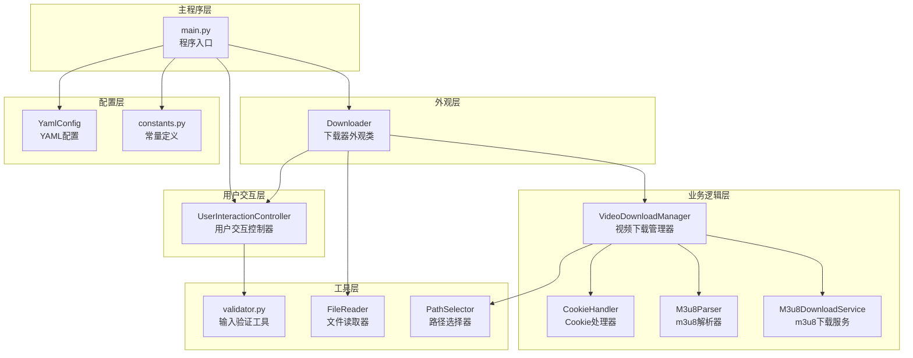
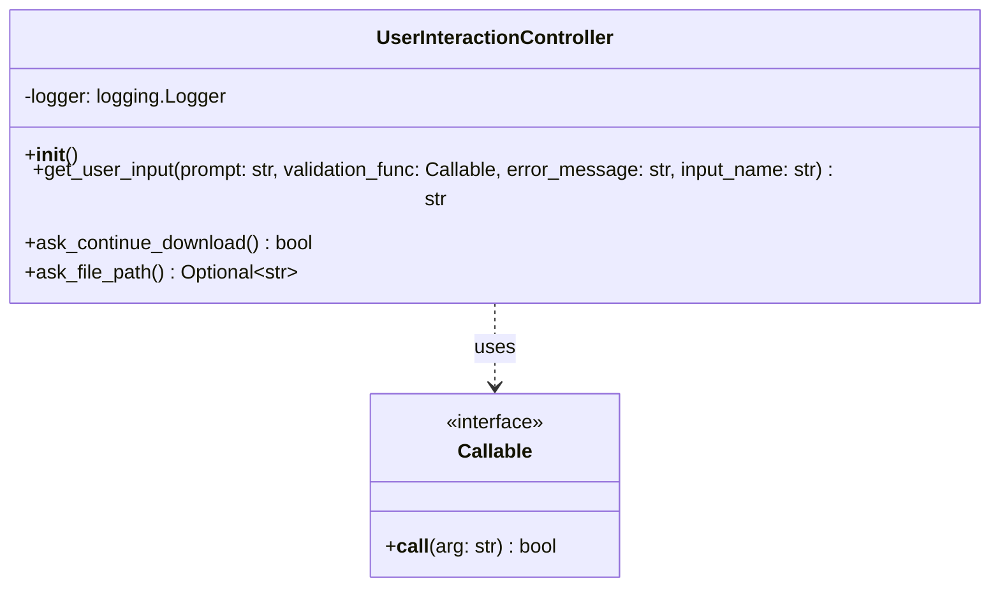
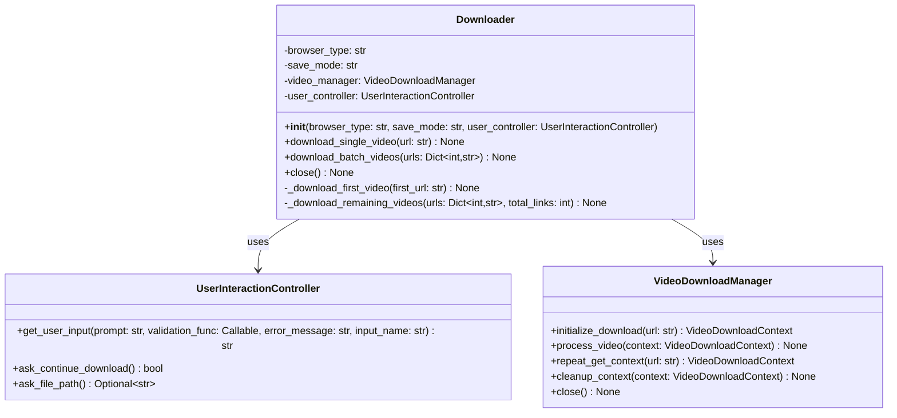
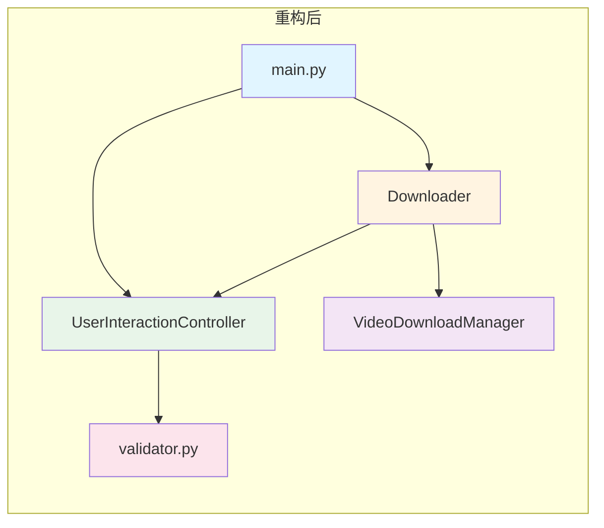
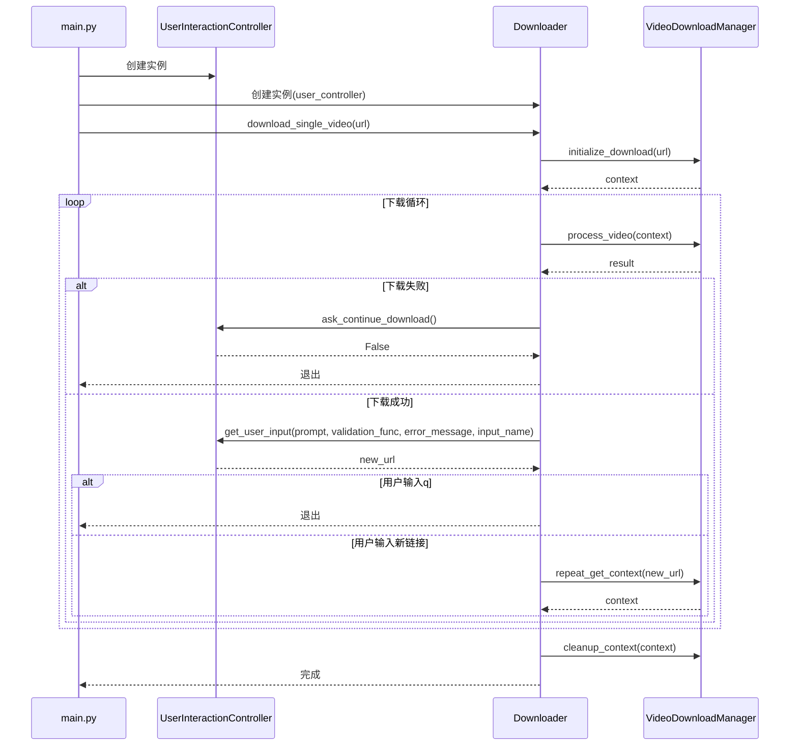
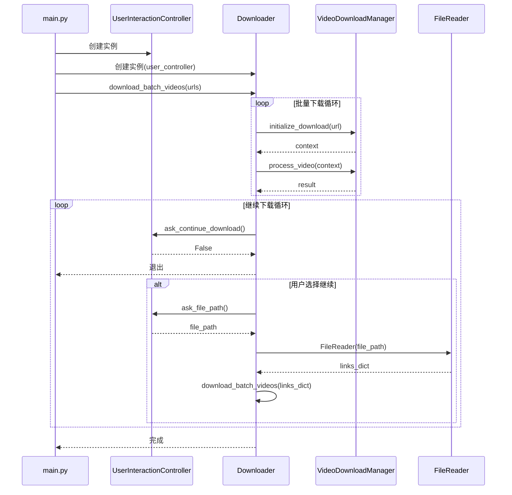
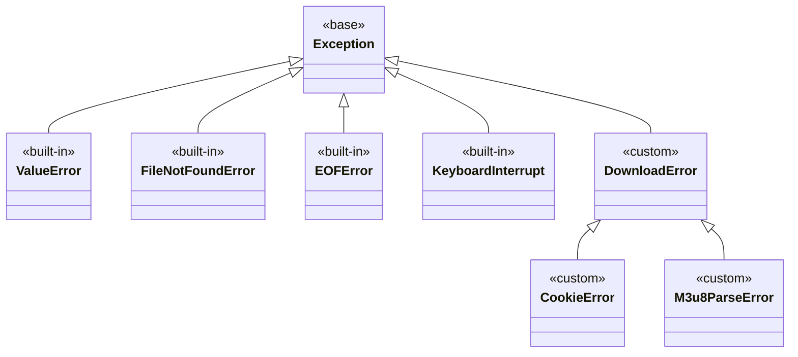

# 设计文档 - 模块职责优化

**任务名称**: 模块职责优化  
**创建时间**: 20260128_144000  
**基于文档**: CONSENSUS_模块职责优化.md

---

## 一、整体架构设计

### 1.1 架构概述

本次重构的核心目标是提取用户交互控制器，实现职责分离。重构后的架构将遵循单一职责原则，提高代码的可测试性和可维护性。

### 1.2 架构图



### 1.3 架构说明

#### 1.3.1 主程序层（main.py）

**职责**: 程序入口，协调各模块

**功能**:
- 显示欢迎信息
- 获取用户输入的下载模式
- 创建UserInteractionController实例
- 创建Downloader实例
- 处理异常和错误

#### 1.3.2 外观层（Downloader）

**职责**: 作为外观类提供统一接口，协调视频下载流程

**功能**:
- 协调单个视频下载
- 协调批量视频下载
- 管理下载状态
- 控制程序流程

**不包含**: 用户交互逻辑

#### 1.3.3 用户交互层（UserInteractionController）

**职责**: 专门负责处理用户输入和交互逻辑

**功能**:
- 获取用户输入
- 验证用户输入
- 询问用户是否继续下载
- 询问用户输入文件路径
- 集中管理用户交互相关的错误处理

#### 1.3.4 业务逻辑层

**职责**: 实现具体的业务逻辑

**包含**:
- VideoDownloadManager: 视频下载管理器
- CookieHandler: Cookie处理器
- M3u8Parser: m3u8解析器
- M3u8DownloadService: m3u8下载服务

#### 1.3.5 工具层

**职责**: 提供通用的工具函数和类

**包含**:
- validator.py: 输入验证工具
- FileReader: 文件读取器
- PathSelector: 路径选择器

#### 1.3.6 配置层

**职责**: 管理配置和常量

**包含**:
- YamlConfig: YAML配置
- constants.py: 常量定义

---

## 二、分层设计

### 2.1 分层原则

1. **单向依赖**: 上层依赖下层，下层不依赖上层
2. **职责清晰**: 每层有明确的职责
3. **高内聚低耦合**: 层内高内聚，层间低耦合
4. **接口稳定**: 层间通过接口通信，接口保持稳定

### 2.2 分层说明

#### 2.2.1 主程序层

**依赖**: 外观层、用户交互层、配置层

**职责**: 程序入口，协调各模块

**不依赖**: 业务逻辑层、工具层

#### 2.2.2 外观层

**依赖**: 用户交互层、业务逻辑层、工具层

**职责**: 作为外观类提供统一接口，协调视频下载流程

**不依赖**: 主程序层、配置层

#### 2.2.3 用户交互层

**依赖**: 工具层

**职责**: 专门负责处理用户输入和交互逻辑

**不依赖**: 主程序层、外观层、业务逻辑层、配置层

#### 2.2.4 业务逻辑层

**依赖**: 工具层、配置层

**职责**: 实现具体的业务逻辑

**不依赖**: 主程序层、外观层、用户交互层

#### 2.2.5 工具层

**依赖**: 无

**职责**: 提供通用的工具函数和类

**不依赖**: 所有上层

#### 2.2.6 配置层

**依赖**: 无

**职责**: 管理配置和常量

**不依赖**: 所有上层

---

## 三、核心组件设计

### 3.1 UserInteractionController

#### 3.1.1 类图



#### 3.1.2 接口定义

```python
class UserInteractionController:
    """
    用户交互控制器类。
    
    专门负责处理用户输入和交互逻辑。
    
    Attributes:
        logger: 日志记录器
    """
    
    def __init__(self):
        """
        初始化用户交互控制器。
        """
        self.logger = logging.getLogger(__name__)
    
    def get_user_input(
        self,
        prompt: str,
        validation_func: Callable[[str], bool],
        error_message: str,
        input_name: str
    ) -> str:
        """
        获取用户输入。
        
        Args:
            prompt: 提示信息
            validation_func: 验证函数，返回True表示验证通过
            error_message: 错误消息
            input_name: 输入项名称
            
        Returns:
            用户输入
            
        Raises:
            ValueError: 输入无效时
            EOFError: 输入流结束时
            KeyboardInterrupt: 用户中断时
        """
    
    def ask_continue_download(self) -> bool:
        """
        询问用户是否继续下载。
        
        Returns:
            True表示继续，False表示退出
            
        Raises:
            EOFError: 输入流结束时
            KeyboardInterrupt: 用户中断时
        """
    
    def ask_file_path(self) -> Optional[str]:
        """
        询问用户输入文件路径。
        
        Returns:
            文件路径，如果用户选择退出则返回None
            
        Raises:
            ValueError: 文件路径无效时
            FileNotFoundError: 文件不存在时
            EOFError: 输入流结束时
            KeyboardInterrupt: 用户中断时
        """
```

#### 3.1.3 实现细节

- 使用现有的`validate_required_input`函数
- 使用现有的`validate_dingtalk_url`函数
- 使用现有的`validate_file_path`函数
- 集中管理用户交互相关的错误处理
- 提供清晰的错误消息

### 3.2 Downloader

#### 3.2.1 类图



#### 3.2.2 接口定义

```python
class Downloader:
    """
    下载器类，作为外观类提供统一接口。
    
    该类封装了单个视频下载和批量下载的逻辑，
    通过VideoDownloadManager、UserInteractionController等辅助类实现功能。
    
    Attributes:
        browser_type: 浏览器类型
        save_mode: 保存模式
        video_manager: 视频下载管理器
        user_controller: 用户交互控制器
    """
    
    def __init__(
        self,
        browser_type: str,
        save_mode: str,
        user_controller: UserInteractionController
    ):
        """
        初始化下载器。
        
        Args:
            browser_type: 浏览器类型（edge/chrome/firefox）
            save_mode: 保存模式（1：默认路径，2：手动选择）
            user_controller: 用户交互控制器
        """
    
    def download_single_video(self, url: str) -> None:
        """
        下载单个视频。
        
        协调Cookie获取、m3u8解析、视频下载。
        
        Args:
            url: 钉钉直播回放分享链接
            
        Raises:
            DownloadError: 下载失败时
        """
    
    def download_batch_videos(self, urls: Dict[int, str]) -> None:
        """
        批量下载视频。
        
        协调Cookie获取、m3u8解析、视频下载。
        
        Args:
            urls: 链接字典 {index: url}
            
        Raises:
            DownloadError: 下载失败时
        """
    
    def close(self) -> None:
        """
        关闭浏览器，释放资源。
        """
```

---

## 四、模块依赖关系图

### 4.1 依赖关系图



### 4.2 依赖关系说明

#### 4.2.1 main.py依赖

- 依赖Downloader: 创建Downloader实例
- 依赖UserInteractionController: 创建UserInteractionController实例

#### 4.2.2 Downloader依赖

- 依赖UserInteractionController: 通过构造函数注入
- 依赖VideoDownloadManager: 创建VideoDownloadManager实例

#### 4.2.3 UserInteractionController依赖

- 依赖validator.py: 使用验证函数

### 4.3 依赖注入方式

#### 4.2.1 构造函数注入

```python
# main.py
user_controller = UserInteractionController()
downloader = Downloader(browser_type, save_mode, user_controller)
```

#### 4.2.2 优势

- 依赖关系清晰
- 易于测试
- 易于替换实现
- 符合依赖倒置原则

---

## 五、接口契约定义

### 5.1 UserInteractionController接口契约

#### 5.1.1 get_user_input

**输入契约**:
- `prompt`: 非空字符串
- `validation_func`: 可调用对象，接受字符串参数，返回布尔值
- `error_message`: 非空字符串
- `input_name`: 非空字符串

**输出契约**:
- 返回用户输入的有效字符串
- 如果输入无效，抛出ValueError
- 如果输入流结束，抛出EOFError
- 如果用户中断，抛出KeyboardInterrupt

**前置条件**:
- 无

**后置条件**:
- 返回的字符串通过验证函数验证
- 返回的字符串非空

**异常**:
- ValueError: 输入无效时
- EOFError: 输入流结束时
- KeyboardInterrupt: 用户中断时

#### 5.1.2 ask_continue_download

**输入契约**:
- 无

**输出契约**:
- 返回布尔值，True表示继续，False表示退出
- 如果输入流结束，抛出EOFError
- 如果用户中断，抛出KeyboardInterrupt

**前置条件**:
- 无

**后置条件**:
- 返回的布尔值表示用户的选择

**异常**:
- EOFError: 输入流结束时
- KeyboardInterrupt: 用户中断时

#### 5.1.3 ask_file_path

**输入契约**:
- 无

**输出契约**:
- 返回有效的文件路径字符串
- 如果用户选择退出，返回None
- 如果文件路径无效，抛出ValueError
- 如果文件不存在，抛出FileNotFoundError
- 如果输入流结束，抛出EOFError
- 如果用户中断，抛出KeyboardInterrupt

**前置条件**:
- 无

**后置条件**:
- 返回的文件路径存在且可读
- 返回的文件路径是CSV或Excel文件

**异常**:
- ValueError: 文件路径无效时
- FileNotFoundError: 文件不存在时
- EOFError: 输入流结束时
- KeyboardInterrupt: 用户中断时

### 5.2 Downloader接口契约

#### 5.2.1 __init__

**输入契约**:
- `browser_type`: 非空字符串，值为"edge"、"chrome"或"firefox"
- `save_mode`: 非空字符串，值为"1"或"2"
- `user_controller`: UserInteractionController实例

**输出契约**:
- 返回Downloader实例
- 所有属性正确初始化

**前置条件**:
- 无

**后置条件**:
- browser_type属性正确设置
- save_mode属性正确设置
- video_manager属性正确初始化
- user_controller属性正确设置

**异常**:
- 无

#### 5.2.2 download_single_video

**输入契约**:
- `url`: 非空字符串，有效的钉钉直播链接

**输出契约**:
- 无返回值
- 如果下载失败，抛出DownloadError

**前置条件**:
- url是有效的钉钉直播链接
- user_controller已正确初始化

**后置条件**:
- 视频已下载到指定路径
- 浏览器已关闭
- 资源已释放

**异常**:
- DownloadError: 下载失败时
- CookieError: Cookie获取失败时
- M3u8ParseError: m3u8解析失败时

#### 5.2.3 download_batch_videos

**输入契约**:
- `urls`: 非空字典，键为整数，值为有效的钉钉直播链接

**输出契约**:
- 无返回值
- 如果下载失败，抛出DownloadError

**前置条件**:
- urls非空
- urls中的所有链接都是有效的钉钉直播链接
- user_controller已正确初始化

**后置条件**:
- 所有视频已下载到指定路径
- 浏览器已关闭
- 资源已释放

**异常**:
- DownloadError: 下载失败时
- CookieError: Cookie获取失败时
- M3u8ParseError: m3u8解析失败时

---

## 六、数据流向图

### 6.1 单个视频下载流程



### 6.2 批量下载流程



---

## 七、异常处理策略

### 7.1 异常层次结构



### 7.2 异常处理策略

#### 7.2.1 UserInteractionController

**处理策略**:
- 捕获EOFError，记录日志，重新抛出
- 捕获KeyboardInterrupt，记录日志，重新抛出
- 捕获ValueError，记录日志，重新抛出
- 不处理其他异常，让调用者处理

#### 7.2.2 Downloader

**处理策略**:
- 捕获DownloadError，记录日志，打印错误消息
- 捕获CookieError，记录日志，转换为DownloadError
- 捕获M3u8ParseError，记录日志，转换为DownloadError
- 捕获KeyboardInterrupt，记录日志，清理资源，重新抛出
- 捕获其他异常，记录日志，转换为DownloadError

#### 7.2.3 main.py

**处理策略**:
- 捕获CookieError，记录日志，打印错误消息，退出程序
- 捕获M3u8ParseError，记录日志，打印错误消息，退出程序
- 捕获KeyboardInterrupt，记录日志，打印消息，退出程序
- 捕获其他异常，记录日志，打印错误消息，退出程序

### 7.3 错误消息规范

#### 7.3.1 用户输入错误

- 格式："{input_name}不能为空，请重新输入。"
- 示例："钉钉直播链接不能为空，请重新输入。"

#### 7.3.2 验证错误

- 格式："{error_message}"
- 示例："链接格式不正确。请确保链接以 https://n.dingtalk.com 开头，并包含 liveUuid 参数。"

#### 7.3.3 下载错误

- 格式："下载失败: {error_message}"
- 示例："下载失败: Cookie获取失败"

---

## 八、设计原则

### 8.1 SOLID原则

#### 8.1.1 单一职责原则（SRP）

- UserInteractionController: 专门负责用户交互
- Downloader: 专门负责协调下载流程
- VideoDownloadManager: 专门负责视频下载管理

#### 8.1.2 开闭原则（OCP）

- UserInteractionController: 可以通过继承扩展功能
- Downloader: 可以通过继承扩展功能

#### 8.1.3 里氏替换原则（LSP）

- UserInteractionController的子类可以替换父类
- Downloader的子类可以替换父类

#### 8.1.4 接口隔离原则（ISP）

- UserInteractionController的接口简洁明了
- Downloader的接口简洁明了

#### 8.1.5 依赖倒置原则（DIP）

- Downloader依赖UserInteractionController的接口，不依赖具体实现
- Downloader依赖VideoDownloadManager的接口，不依赖具体实现

### 8.2 其他设计原则

#### 8.2.1 DRY原则（Don't Repeat Yourself）

- 避免代码重复
- 提取公共逻辑到单独的方法

#### 8.2.2 KISS原则（Keep It Simple, Stupid）

- 保持代码简单
- 避免过度设计

#### 8.2.3 YAGNI原则（You Aren't Gonna Need It）

- 不实现不需要的功能
- 避免过度设计

---

## 九、性能考虑

### 9.1 性能目标

- 无明显的性能下降（<5%）
- 无额外的内存占用（<10MB）
- 程序启动时间无明显变化（<100ms）
- 用户交互响应时间无明显变化（<50ms）

### 9.2 性能优化策略

#### 9.2.1 避免不必要的对象创建

- 复用UserInteractionController实例
- 复用Downloader实例

#### 9.2.2 减少方法调用层次

- 保持方法调用层次简洁
- 避免过深的调用栈

#### 9.2.3 优化日志记录

- 使用适当的日志级别
- 避免在循环中记录过多日志

---

## 十、安全考虑

### 10.1 输入验证

- 所有用户输入都经过验证
- 使用现有的验证函数
- 提供清晰的错误消息

### 10.2 错误处理

- 所有异常都经过处理
- 记录详细的错误日志
- 不暴露敏感信息

### 10.3 资源管理

- 及时释放资源
- 使用try-finally确保资源释放
- 避免资源泄漏

---

**设计文档创建时间**: 20260128_144000  
**设计文档版本**: 1.0  
**基于文档**: CONSENSUS_模块职责优化.md
