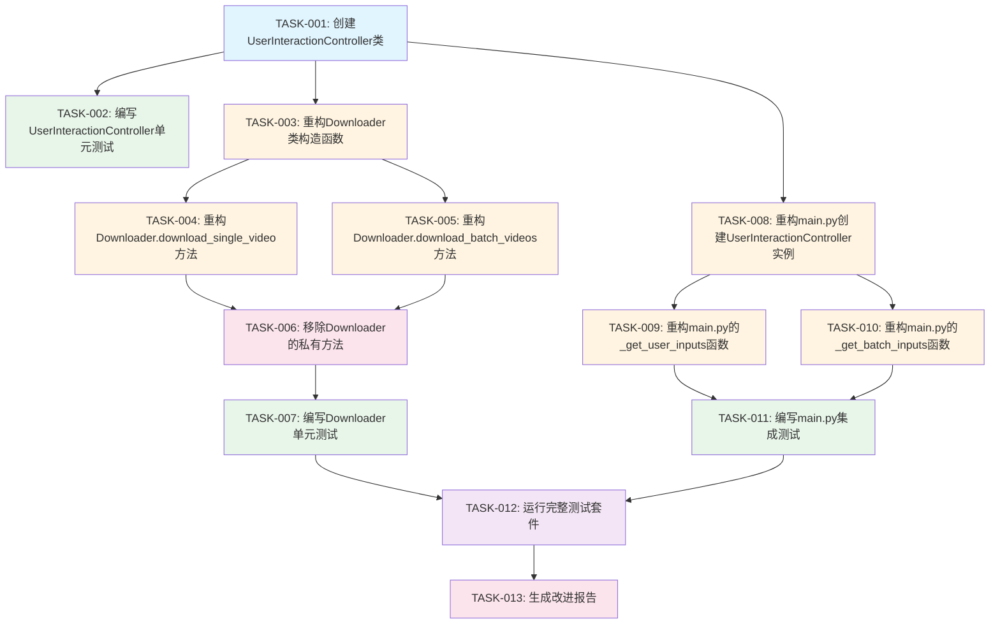

# 任务拆分文档 - 模块职责优化

**任务名称**: 模块职责优化  
**创建时间**: 20260128_144500  
**基于文档**: DESIGN_模块职责优化.md

---

## 一、任务概述

### 1.1 任务目标

将"模块职责优化"任务拆分为多个可独立执行、可独立验证的原子任务。

### 1.2 拆分原则

1. **复杂度可控**: 每个任务的复杂度在AI可成功交付的范围内
2. **功能模块化**: 按功能模块分解，确保任务原子性和独立性
3. **验收标准明确**: 每个任务都有明确的验收标准
4. **可独立测试**: 每个任务都可以独立编译和测试
5. **依赖关系清晰**: 任务间的依赖关系清晰明确

### 1.3 任务列表

| 任务ID | 任务名称 | 优先级 | 预计时间 | 依赖任务 |
|--------|---------|--------|----------|----------|
| TASK-001 | 创建UserInteractionController类 | 高 | 2-3小时 | 无 |
| TASK-002 | 编写UserInteractionController单元测试 | 高 | 2-3小时 | TASK-001 |
| TASK-003 | 重构Downloader类构造函数 | 高 | 1-2小时 | TASK-001 |
| TASK-004 | 重构Downloader.download_single_video方法 | 高 | 2-3小时 | TASK-003 |
| TASK-005 | 重构Downloader.download_batch_videos方法 | 高 | 2-3小时 | TASK-003 |
| TASK-006 | 移除Downloader的私有方法 | 中 | 1小时 | TASK-004, TASK-005 |
| TASK-007 | 编写Downloader单元测试 | 高 | 3-4小时 | TASK-006 |
| TASK-008 | 重构main.py创建UserInteractionController实例 | 高 | 1-2小时 | TASK-001 |
| TASK-009 | 重构main.py的_get_user_inputs函数 | 高 | 1-2小时 | TASK-008 |
| TASK-010 | 重构main.py的_get_batch_inputs函数 | 高 | 1-2小时 | TASK-008 |
| TASK-011 | 编写main.py集成测试 | 高 | 2-3小时 | TASK-009, TASK-010 |
| TASK-012 | 运行完整测试套件 | 高 | 1-2小时 | TASK-007, TASK-011 |
| TASK-013 | 生成改进报告 | 中 | 1-2小时 | TASK-012 |

---

## 二、任务依赖关系图

---

## 三、原子任务详情

### TASK-001: 创建UserInteractionController类

#### 3.1 任务描述

创建独立的UserInteractionController类，封装所有用户交互逻辑。

#### 3.2 输入契约

- 设计文档：DESIGN_模块职责优化.md
- 现有验证函数：src/dingtalk_downloader/utils/validator.py

#### 3.3 输出契约

- 新文件：src/dingtalk_downloader/core/user_interaction_controller.py
- 类：UserInteractionController
- 方法：
  - `__init__`
  - `get_user_input`
  - `ask_continue_download`
  - `ask_file_path`

#### 3.4 实现约束

- 遵循PEP 8规范
- 遵循项目现有代码风格
- 使用现有的验证函数
- 添加完整的类型注解
- 添加完整的文档字符串
- 文档字符串遵循Google风格

#### 3.5 依赖关系

- 无前置依赖

#### 3.6 验收标准

- [ ] 文件创建成功
- [ ] 类创建成功
- [ ] 所有方法实现完整
- [ ] 所有方法都有类型注解
- [ ] 所有方法都有文档字符串
- [ ] 代码符合PEP 8规范
- [ ] 代码符合项目现有代码风格

---

### TASK-002: 编写UserInteractionController单元测试

#### 3.1 任务描述

为UserInteractionController类编写完整的单元测试。

#### 3.2 输入契约

- UserInteractionController类：src/dingtalk_downloader/core/user_interaction_controller.py
- 测试框架：pytest

#### 3.3 输出契约

- 新文件：tests/test_user_interaction_controller.py
- 测试用例：
  - 测试`get_user_input`方法
  - 测试`ask_continue_download`方法
  - 测试`ask_file_path`方法
  - 测试正常流程
  - 测试边界条件
  - 测试异常情况

#### 3.4 实现约束

- 使用pytest框架
- 使用mock模拟用户输入
- 测试覆盖率不低于90%
- 测试用例清晰易懂
- 测试用例有清晰的描述

#### 3.5 依赖关系

- 前置依赖：TASK-001

#### 3.6 验收标准

- [ ] 测试文件创建成功
- [ ] 所有公共方法都有测试
- [ ] 测试覆盖正常流程
- [ ] 测试覆盖边界条件
- [ ] 测试覆盖异常情况
- [ ] 测试覆盖率不低于90%
- [ ] 所有测试通过

---

### TASK-003: 重构Downloader类构造函数

#### 3.1 任务描述

重构Downloader类的构造函数，添加UserInteractionController依赖注入。

#### 3.2 输入契约

- 现有文件：src/dingtalk_downloader/core/downloader.py
- UserInteractionController类：src/dingtalk_downloader/core/user_interaction_controller.py

#### 3.3 输出契约

- 修改文件：src/dingtalk_downloader/core/downloader.py
- 修改方法：`__init__`
- 新增参数：`user_controller: UserInteractionController`
- 新增属性：`self.user_controller`

#### 3.4 实现约束

- 保持向后兼容性
- 保持现有接口不变
- 添加完整的类型注解
- 更新文档字符串
- 遵循PEP 8规范

#### 3.5 依赖关系

- 前置依赖：TASK-001

#### 3.6 验收标准

- [ ] 构造函数修改成功
- [ ] 新增参数正确
- [ ] 新增属性正确
- [ ] 保持向后兼容性
- [ ] 代码符合PEP 8规范
- [ ] 文档字符串更新完整

---

### TASK-004: 重构Downloader.download_single_video方法

#### 3.1 任务描述

重构Downloader类的download_single_video方法，使用UserInteractionController处理用户交互。

#### 3.2 输入契约

- 现有文件：src/dingtalk_downloader/core/downloader.py
- UserInteractionController类：src/dingtalk_downloader/core/user_interaction_controller.py

#### 3.3 输出契约

- 修改文件：src/dingtalk_downloader/core/downloader.py
- 修改方法：`download_single_video`
- 使用`user_controller.get_user_input`替换`_handle_user_input`

#### 3.4 实现约束

- 保持方法签名不变
- 保持现有功能不变
- 使用UserInteractionController处理用户交互
- 保持现有的异常处理机制
- 遵循PEP 8规范

#### 3.5 依赖关系

- 前置依赖：TASK-003

#### 3.6 验收标准

- [ ] 方法修改成功
- [ ] 使用UserInteractionController处理用户交互
- [ ] 保持方法签名不变
- [ ] 保持现有功能不变
- [ ] 代码符合PEP 8规范
- [ ] 文档字符串更新完整

---

### TASK-005: 重构Downloader.download_batch_videos方法

#### 3.1 任务描述

重构Downloader类的download_batch_videos方法，使用UserInteractionController处理用户交互。

#### 3.2 输入契约

- 现有文件：src/dingtalk_downloader/core/downloader.py
- UserInteractionController类：src/dingtalk_downloader/core/user_interaction_controller.py

#### 3.3 输出契约

- 修改文件：src/dingtalk_downloader/core/downloader.py
- 修改方法：`download_batch_videos`
- 使用`user_controller.ask_continue_download`和`user_controller.ask_file_path`替换`_continue_download`

#### 3.4 实现约束

- 保持方法签名不变
- 保持现有功能不变
- 使用UserInteractionController处理用户交互
- 保持现有的异常处理机制
- 遵循PEP 8规范

#### 3.5 依赖关系

- 前置依赖：TASK-003

#### 3.6 验收标准

- [ ] 方法修改成功
- [ ] 使用UserInteractionController处理用户交互
- [ ] 保持方法签名不变
- [ ] 保持现有功能不变
- [ ] 代码符合PEP 8规范
- [ ] 文档字符串更新完整

---

### TASK-006: 移除Downloader的私有方法

#### 3.1 任务描述

移除Downloader类的私有方法`_handle_user_input`和`_continue_download`。

#### 3.2 输入契约

- 现有文件：src/dingtalk_downloader/core/downloader.py

#### 3.3 输出契约

- 修改文件：src/dingtalk_downloader/core/downloader.py
- 移除方法：`_handle_user_input`
- 移除方法：`_continue_download`

#### 3.4 实现约束

- 确保方法不再被调用
- 确保功能不受影响
- 遵循PEP 8规范

#### 3.5 依赖关系

- 前置依赖：TASK-004, TASK-005

#### 3.6 验收标准

- [ ] 方法移除成功
- [ ] 方法不再被调用
- [ ] 功能不受影响
- [ ] 代码符合PEP 8规范

---

### TASK-007: 编写Downloader单元测试

#### 3.1 任务描述

为Downloader类编写完整的单元测试。

#### 3.2 输入契约

- Downloader类：src/dingtalk_downloader/core/downloader.py
- UserInteractionController类：src/dingtalk_downloader/core/user_interaction_controller.py
- 测试框架：pytest

#### 3.3 输出契约

- 新文件：tests/test_downloader.py
- 测试用例：
  - 测试`__init__`方法
  - 测试`download_single_video`方法
  - 测试`download_batch_videos`方法
  - 测试`close`方法
  - 测试正常流程
  - 测试边界条件
  - 测试异常情况

#### 3.4 实现约束

- 使用pytest框架
- 使用mock模拟UserInteractionController
- 使用mock模拟VideoDownloadManager
- 测试覆盖率不低于90%
- 测试用例清晰易懂
- 测试用例有清晰的描述

#### 3.5 依赖关系

- 前置依赖：TASK-006

#### 3.6 验收标准

- [ ] 测试文件创建成功
- [ ] 所有公共方法都有测试
- [ ] 测试覆盖正常流程
- [ ] 测试覆盖边界条件
- [ ] 测试覆盖异常情况
- [ ] 测试覆盖率不低于90%
- [ ] 所有测试通过

---

### TASK-008: 重构main.py创建UserInteractionController实例

#### 3.1 任务描述

重构main.py，创建UserInteractionController实例。

#### 3.2 输入契约

- 现有文件：src/dingtalk_downloader/main.py
- UserInteractionController类：src/dingtalk_downloader/core/user_interaction_controller.py

#### 3.3 输出契约

- 修改文件：src/dingtalk_downloader/main.py
- 修改函数：`main`
- 创建UserInteractionController实例
- 将UserInteractionController实例传递给Downloader

#### 3.4 实现约束

- 保持程序流程不变
- 保持现有功能不变
- 遵循PEP 8规范

#### 3.5 依赖关系

- 前置依赖：TASK-001

#### 3.6 验收标准

- [ ] 函数修改成功
- [ ] UserInteractionController实例创建成功
- [ ] UserInteractionController实例传递给Downloader
- [ ] 保持程序流程不变
- [ ] 保持现有功能不变
- [ ] 代码符合PEP 8规范

---

### TASK-009: 重构main.py的_get_user_inputs函数

#### 3.1 任务描述

重构main.py的_get_user_inputs函数，使用UserInteractionController处理用户交互。

#### 3.2 输入契约

- 现有文件：src/dingtalk_downloader/main.py
- UserInteractionController类：src/dingtalk_downloader/core/user_interaction_controller.py

#### 3.3 输出契约

- 修改文件：src/dingtalk_downloader/main.py
- 修改函数：`_get_user_inputs`
- 使用UserInteractionController处理用户交互

#### 3.4 实现约束

- 保持函数签名不变
- 保持现有功能不变
- 使用UserInteractionController处理用户交互
- 保持现有的异常处理机制
- 遵循PEP 8规范

#### 3.5 依赖关系

- 前置依赖：TASK-008

#### 3.6 验收标准

- [ ] 函数修改成功
- [ ] 使用UserInteractionController处理用户交互
- [ ] 保持函数签名不变
- [ ] 保持现有功能不变
- [ ] 代码符合PEP 8规范
- [ ] 文档字符串更新完整

---

### TASK-010: 重构main.py的_get_batch_inputs函数

#### 3.1 任务描述

重构main.py的_get_batch_inputs函数，使用UserInteractionController处理用户交互。

#### 3.2 输入契约

- 现有文件：src/dingtalk_downloader/main.py
- UserInteractionController类：src/dingtalk_downloader/core/user_interaction_controller.py

#### 3.3 输出契约

- 修改文件：src/dingtalk_downloader/main.py
- 修改函数：`_get_batch_inputs`
- 使用UserInteractionController处理用户交互

#### 3.4 实现约束

- 保持函数签名不变
- 保持现有功能不变
- 使用UserInteractionController处理用户交互
- 保持现有的异常处理机制
- 遵循PEP 8规范

#### 3.5 依赖关系

- 前置依赖：TASK-008

#### 3.6 验收标准

- [ ] 函数修改成功
- [ ] 使用UserInteractionController处理用户交互
- [ ] 保持函数签名不变
- [ ] 保持现有功能不变
- [ ] 代码符合PEP 8规范
- [ ] 文档字符串更新完整

---

### TASK-011: 编写main.py集成测试

#### 3.1 任务描述

为main.py编写完整的集成测试。

#### 3.2 输入契约

- main.py：src/dingtalk_downloader/main.py
- UserInteractionController类：src/dingtalk_downloader/core/user_interaction_controller.py
- Downloader类：src/dingtalk_downloader/core/downloader.py
- 测试框架：pytest

#### 3.3 输出契约

- 新文件：tests/test_main.py
- 测试用例：
  - 测试单个视频下载流程
  - 测试批量下载流程
  - 测试继续下载流程
  - 测试用户输入验证
  - 测试错误处理
  - 测试程序退出

#### 3.4 实现约束

- 使用pytest框架
- 使用mock模拟用户输入
- 使用mock模拟文件系统
- 测试覆盖率不低于80%
- 测试用例清晰易懂
- 测试用例有清晰的描述

#### 3.5 依赖关系

- 前置依赖：TASK-009, TASK-010

#### 3.6 验收标准

- [ ] 测试文件创建成功
- [ ] 所有主要流程都有测试
- [ ] 测试覆盖正常流程
- [ ] 测试覆盖边界条件
- [ ] 测试覆盖异常情况
- [ ] 测试覆盖率不低于80%
- [ ] 所有测试通过

---

### TASK-012: 运行完整测试套件

#### 3.1 任务描述

运行完整的测试套件，验证所有功能正常。

#### 3.2 输入契约

- 测试文件：
  - tests/test_user_interaction_controller.py
  - tests/test_downloader.py
  - tests/test_main.py
- 测试框架：pytest

#### 3.3 输出契约

- 测试报告
- 测试覆盖率报告
- 性能测试报告

#### 3.4 实现约束

- 运行所有测试
- 生成测试覆盖率报告
- 记录测试结果
- 记录性能指标

#### 3.5 依赖关系

- 前置依赖：TASK-007, TASK-011

#### 3.6 验收标准

- [ ] 所有测试通过
- [ ] 测试覆盖率不低于80%
- [ ] 核心模块测试覆盖率不低于90%
- [ ] 无明显的性能下降
- [ ] 测试报告生成成功

---

### TASK-013: 生成改进报告

#### 3.1 任务描述

生成改进报告，总结重构过程和结果。

#### 3.2 输入契约

- 测试报告
- 测试覆盖率报告
- 性能测试报告
- 代码变更记录

#### 3.3 输出契约

- 新文件：docs/review/module_optimization_improvement_report.md
- 报告内容：
  - 问题分析
  - 实施步骤
  - 测试结果
  - 性能对比
  - 结论和建议

#### 3.4 实现约束

- 报告结构清晰
- 报告内容完整
- 报告数据准确
- 报告语言规范

#### 3.5 依赖关系

- 前置依赖：TASK-012

#### 3.6 验收标准

- [ ] 报告文件创建成功
- [ ] 报告包含问题分析
- [ ] 报告包含实施步骤
- [ ] 报告包含测试结果
- [ ] 报告包含性能对比
- [ ] 报告包含结论和建议
- [ ] 报告结构清晰
- [ ] 报告内容完整

---

## 四、任务执行顺序

### 4.1 第一批任务（核心功能）

1. TASK-001: 创建UserInteractionController类
2. TASK-002: 编写UserInteractionController单元测试
3. TASK-003: 重构Downloader类构造函数
4. TASK-004: 重构Downloader.download_single_video方法
5. TASK-005: 重构Downloader.download_batch_videos方法
6. TASK-006: 移除Downloader的私有方法
7. TASK-007: 编写Downloader单元测试

### 4.2 第二批任务（集成功能）

8. TASK-008: 重构main.py创建UserInteractionController实例
9. TASK-009: 重构main.py的_get_user_inputs函数
10. TASK-010: 重构main.py的_get_batch_inputs函数
11. TASK-011: 编写main.py集成测试

### 4.3 第三批任务（验证和交付）

12. TASK-012: 运行完整测试套件
13. TASK-013: 生成改进报告

---

## 五、质量门控

### 5.1 任务完成标准

每个任务必须满足以下标准才能标记为完成：

1. **功能完整性**: 任务描述的所有功能都已实现
2. **代码质量**: 代码符合PEP 8规范和项目现有代码风格
3. **文档完整性**: 所有类和方法都有完整的文档字符串
4. **类型注解**: 所有函数都有完整的类型注解
5. **测试覆盖**: 所有公共方法都有对应的测试用例

### 5.2 阶段完成标准

每个阶段必须满足以下标准才能进入下一阶段：

1. **第一批任务**: UserInteractionController和Downloader重构完成，测试通过
2. **第二批任务**: main.py重构完成，集成测试通过
3. **第三批任务**: 所有测试通过，改进报告生成

### 5.3 整体完成标准

整个任务必须满足以下标准才能标记为完成：

1. **功能完整性**: 所有功能都已实现，程序功能与重构前完全一致
2. **代码质量**: 代码符合PEP 8规范和项目现有代码风格
3. **测试覆盖**: 测试覆盖率不低于80%，核心模块测试覆盖率不低于90%
4. **性能要求**: 无明显的性能下降（<5%），无额外的内存占用（<10MB）
5. **文档完整性**: 改进报告生成，包含问题分析、实施步骤、测试结果

---

**任务拆分文档创建时间**: 20260128_144500  
**任务拆分文档版本**: 1.0  
**基于文档**: DESIGN_模块职责优化.md
