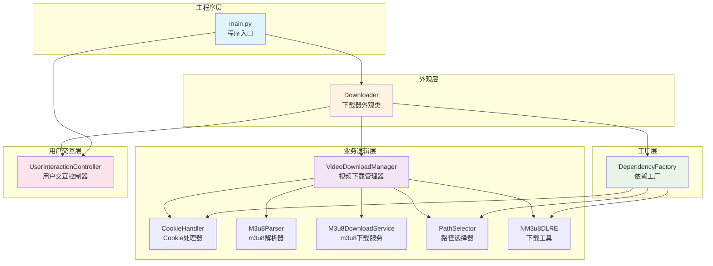
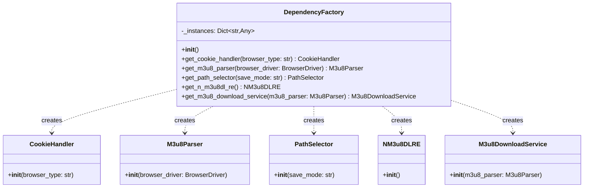
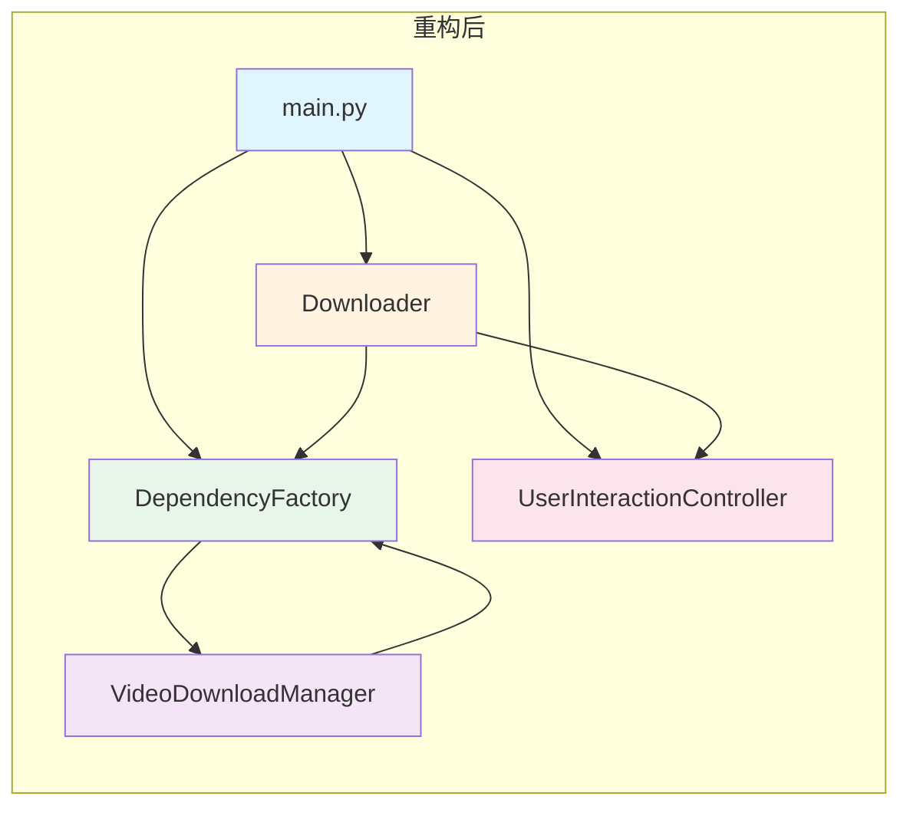
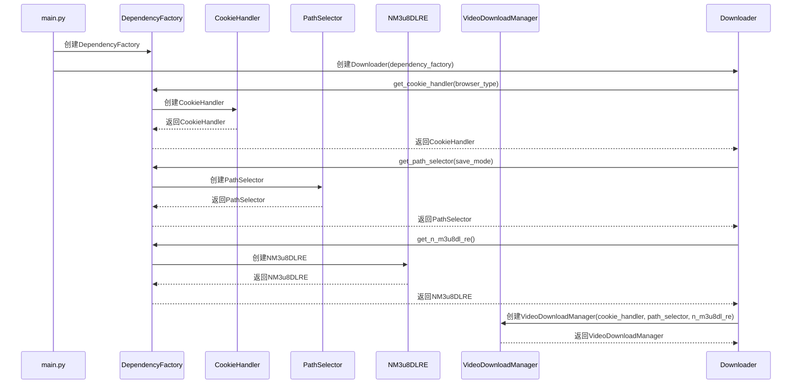
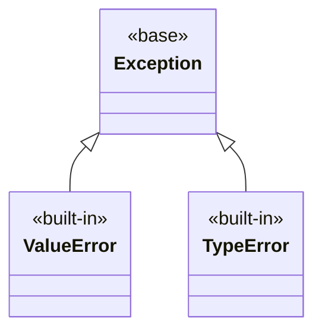

# 设计文档 - 依赖关系优化

**任务名称**: 依赖关系优化  
**创建时间**: 20260128*152000  
**基于文档**: CONSENSUS*依赖关系优化.md

---

## 一、整体架构设计

### 1.1 架构概述

本次重构的核心目标是使用依赖注入和工厂模式降低模块间耦合度。重构后的架构将遵循依赖倒置原则，提高代码的可测试性和可维护性。

### 1.2 架构图



### 1.3 架构说明

#### 1.3.1 主程序层（main.py）

**职责**: 程序入口，协调各模块

**功能**:

- 显示欢迎信息
- 获取用户输入的下载模式
- 创建DependencyFactory实例
- 创建UserInteractionController实例
- 创建Downloader实例
- 处理异常和错误

#### 1.3.2 外观层（Downloader）

**职责**: 作为外观类提供统一接口，协调视频下载流程

**功能**:

- 协调单个视频下载
- 协调批量视频下载
- 管理下载状态
- 控制程序流程

**不包含**: 直接创建依赖实例

#### 1.3.3 工厂层（DependencyFactory）

**职责**: 负责创建和管理各种依赖实例

**功能**:

- 创建CookieHandler实例
- 创建M3u8Parser实例
- 创建PathSelector实例
- 创建NM3u8DLRE实例
- 创建M3u8DownloadService实例
- 支持依赖实例的复用（单例模式）

#### 1.3.4 业务逻辑层

**职责**: 实现具体的业务逻辑

**包含**:

- VideoDownloadManager: 视频下载管理器
- CookieHandler: Cookie处理器
- M3u8Parser: m3u8解析器
- M3u8DownloadService: m3u8下载服务
- PathSelector: 路径选择器
- NM3u8DLRE: 下载工具

#### 1.3.5 用户交互层（UserInteractionController）

**职责**: 专门负责处理用户输入和交互逻辑

**功能**:

- 获取用户输入
- 验证用户输入
- 询问用户是否继续下载
- 询问用户输入文件路径
- 集中管理用户交互相关的错误处理

---

## 二、分层设计

### 2.1 分层原则

1. **单向依赖**: 上层依赖下层，下层不依赖上层
2. **职责清晰**: 每层有明确的职责
3. **高内聚低耦合**: 层内高内聚，层间低耦合
4. **接口稳定**: 层间通过接口通信，接口保持稳定

### 2.2 分层说明

#### 2.2.1 主程序层

**依赖**: 外观层、用户交互层、工厂层

**职责**: 程序入口，协调各模块

**不依赖**: 业务逻辑层、工具层

#### 2.2.2 外观层

**依赖**: 用户交互层、工厂层、业务逻辑层

**职责**: 作为外观类提供统一接口，协调视频下载流程

**不依赖**: 主程序层、配置层

#### 2.2.3 工厂层

**依赖**: 业务逻辑层

**职责**: 负责创建和管理各种依赖实例

**不依赖**: 所有上层

#### 2.2.4 业务逻辑层

**依赖**: 工具层、配置层

**职责**: 实现具体的业务逻辑

**不依赖**: 主程序层、外观层、用户交互层

#### 2.2.5 用户交互层

**依赖**: 工具层

**职责**: 专门负责处理用户输入和交互逻辑

**不依赖**: 主程序层、外观层、业务逻辑层、配置层

---

## 三、核心组件设计

### 3.1 DependencyFactory

#### 3.1.1 类图



#### 3.1.2 接口定义

```python
class DependencyFactory:
    """
    依赖工厂类。

    负责创建和管理各种依赖实例。

    Attributes:
        _instances: 存储依赖实例的字典
    """

    def __init__(self):
        """
        初始化依赖工厂。
        """
        self._instances = {}

    def get_cookie_handler(self, browser_type: str) -> CookieHandler:
        """
        获取Cookie处理器实例。

        Args:
            browser_type: 浏览器类型

        Returns:
            CookieHandler实例
        """
        key = f"cookie_handler_{browser_type}"
        if key not in self._instances:
            self._instances[key] = CookieHandler(browser_type)
        return self._instances[key]

    def get_m3u8_parser(self, browser_driver: BrowserDriver) -> M3u8Parser:
        """
        获取m3u8解析器实例。

        Args:
            browser_driver: 浏览器驱动

        Returns:
            M3u8Parser实例
        """
        key = f"m3u8_parser_{id(browser_driver)}"
        if key not in self._instances:
            self._instances[key] = M3u8Parser(browser_driver)
        return self._instances[key]

    def get_path_selector(self, save_mode: str) -> PathSelector:
        """
        获取路径选择器实例。

        Args:
            save_mode: 保存模式

        Returns:
            PathSelector实例
        """
        key = f"path_selector_{save_mode}"
        if key not in self._instances:
            self._instances[key] = PathSelector(save_mode)
        return self._instances[key]

    def get_n_m3u8dl_re(self) -> NM3u8DLRE:
        """
        获取NM3u8DLRE实例。

        Returns:
            NM3u8DLRE实例
        """
        key = "n_m3u8dl_re"
        if key not in self._instances:
            self._instances[key] = NM3u8DLRE()
        return self._instances[key]

    def get_m3u8_download_service(
        self, m3u8_parser: M3u8Parser
    ) -> M3u8DownloadService:
        """
        获取m3u8下载服务实例。

        Args:
            m3u8_parser: m3u8解析器

        Returns:
            M3u8DownloadService实例
        """
        key = f"m3u8_download_service_{id(m3u8_parser)}"
        if key not in self._instances:
            self._instances[key] = M3u8DownloadService(m3u8_parser)
        return self._instances[key]
```

### 3.2 VideoDownloadManager

#### 3.2.1 构造函数修改

```python
class VideoDownloadManager:
    """
    视频下载管理器类。

    通过依赖注入接收依赖，降低耦合度。

    Attributes:
        browser_type: 浏览器类型
        save_mode: 保存模式
        cookie_handler: Cookie处理器
        m3u8_parser: m3u8解析器
        m3u8_download_service: m3u8下载服务
        path_selector: 路径选择器
        n_m3u8dl_re: NM3u8DLRE实例
    """

    def __init__(
        self,
        browser_type: str,
        save_mode: str,
        cookie_handler: Optional[CookieHandler] = None,
        m3u8_parser: Optional[M3u8Parser] = None,
        m3u8_download_service: Optional[M3u8DownloadService] = None,
        path_selector: Optional[PathSelector] = None,
        n_m3u8dl_re: Optional[NM3u8DLRE] = None,
    ):
        """
        初始化视频下载管理器。

        Args:
            browser_type: 浏览器类型
            save_mode: 保存模式
            cookie_handler: Cookie处理器（可选）
            m3u8_parser: m3u8解析器（可选）
            m3u8_download_service: m3u8下载服务（可选）
            path_selector: 路径选择器（可选）
            n_m3u8dl_re: NM3u8DLRE实例（可选）
        """
        self.browser_type = browser_type
        self.save_mode = save_mode

        # 使用注入的依赖，如果没有注入则创建默认实例
        self.cookie_handler = cookie_handler
        self.m3u8_parser = m3u8_parser
        self.m3u8_download_service = m3u8_download_service
        self.path_selector = path_selector
        self.n_m3u8dl_re = n_m3u8dl_re

        logger.debug(f"视频下载管理器初始化 - 浏览器类型: {browser_type}")
```

### 3.3 Downloader

#### 3.3.1 构造函数修改

```python
class Downloader:
    """
    下载器类，作为外观类提供统一接口。

    该类封装了单个视频下载和批量下载的逻辑，
    通过VideoDownloadManager、UserInteractionController、DependencyFactory等辅助类实现功能。

    Attributes:
        video_manager: 视频下载管理器
        browser_type: 浏览器类型
        save_mode: 保存模式
        user_controller: 用户交互控制器
        dependency_factory: 依赖工厂
    """

    def __init__(
        self,
        browser_type: str,
        save_mode: str,
        user_controller: UserInteractionController,
        dependency_factory: Optional[DependencyFactory] = None,
    ):
        """
        初始化下载器。

        Args:
            browser_type: 浏览器类型（edge/chrome/firefox）
            save_mode: 保存模式（1：默认路径，2：手动选择）
            user_controller: 用户交互控制器
            dependency_factory: 依赖工厂（可选）
        """
        self.browser_type = browser_type
        self.save_mode = save_mode
        self.user_controller = user_controller

        # 创建依赖工厂
        self.dependency_factory = dependency_factory or DependencyFactory()

        # 使用依赖工厂创建依赖实例
        cookie_handler = self.dependency_factory.get_cookie_handler(browser_type)
        path_selector = self.dependency_factory.get_path_selector(save_mode)
        n_m3u8dl_re = self.dependency_factory.get_n_m3u8dl_re()

        # 创建视频下载管理器
        self.video_manager = VideoDownloadManager(
            browser_type,
            save_mode,
            cookie_handler=cookie_handler,
            path_selector=path_selector,
            n_m3u8dl_re=n_m3u8dl_re,
        )

        logger.info(f"下载器初始化完成 - 浏览器类型: {browser_type}, 保存模式: {save_mode}")
```

---

## 四、模块依赖关系图

### 4.1 依赖关系图



### 4.2 依赖关系说明

#### 4.2.1 main.py依赖

- 依赖Downloader: 创建Downloader实例
- 依赖DependencyFactory: 创建DependencyFactory实例
- 依赖UserInteractionController: 创建UserInteractionController实例

#### 4.2.2 Downloader依赖

- 依赖UserInteractionController: 通过构造函数注入
- 依赖DependencyFactory: 通过构造函数注入或创建默认实例
- 依赖VideoDownloadManager: 创建VideoDownloadManager实例

#### 4.2.3 DependencyFactory依赖

- 依赖CookieHandler: 创建CookieHandler实例
- 依赖M3u8Parser: 创建M3u8Parser实例
- 依赖PathSelector: 创建PathSelector实例
- 依赖NM3u8DLRE: 创建NM3u8DLRE实例
- 依赖M3u8DownloadService: 创建M3u8DownloadService实例

#### 4.2.4 VideoDownloadManager依赖

- 依赖CookieHandler: 通过构造函数注入
- 依赖M3u8Parser: 通过构造函数注入
- 依赖M3u8DownloadService: 通过构造函数注入
- 依赖PathSelector: 通过构造函数注入
- 依赖NM3u8DLRE: 通过构造函数注入

### 4.3 依赖注入方式

#### 4.3.1 构造函数注入

```python
# main.py
dependency_factory = DependencyFactory()
user_controller = UserInteractionController()
downloader = Downloader(browser_type, save_mode, user_controller, dependency_factory)
```

#### 4.3.2 优势

- 依赖关系清晰
- 易于测试
- 易于替换实现
- 符合依赖倒置原则

---

## 五、接口契约定义

### 5.1 DependencyFactory接口契约

#### 5.1.1 get_cookie_handler

**输入契约**:

- `browser_type`: 非空字符串，值为"edge"、"chrome"或"firefox"

**输出契约**:

- 返回CookieHandler实例
- 如果实例已存在，返回缓存的实例

**前置条件**:

- 无

**后置条件**:

- 返回的CookieHandler实例正确初始化
- 实例已缓存

**异常**:

- 无

#### 5.1.2 get_m3u8_parser

**输入契约**:

- `browser_driver`: BrowserDriver实例

**输出契约**:

- 返回M3u8Parser实例
- 如果实例已存在，返回缓存的实例

**前置条件**:

- browser_driver已正确初始化

**后置条件**:

- 返回的M3u8Parser实例正确初始化
- 实例已缓存

**异常**:

- 无

#### 5.1.3 get_path_selector

**输入契约**:

- `save_mode`: 非空字符串，值为"1"或"2"

**输出契约**:

- 返回PathSelector实例
- 如果实例已存在，返回缓存的实例

**前置条件**:

- 无

**后置条件**:

- 返回的PathSelector实例正确初始化
- 实例已缓存

**异常**:

- 无

#### 5.1.4 get_n_m3u8dl_re

**输入契约**:

- 无

**输出契约**:

- 返回NM3u8DLRE实例
- 如果实例已存在，返回缓存的实例

**前置条件**:

- 无

**后置条件**:

- 返回的NM3u8DLRE实例正确初始化
- 实例已缓存

**异常**:

- 无

#### 5.1.5 get_m3u8_download_service

**输入契约**:

- `m3u8_parser`: M3u8Parser实例

**输出契约**:

- 返回M3u8DownloadService实例
- 如果实例已存在，返回缓存的实例

**前置条件**:

- m3u8_parser已正确初始化

**后置条件**:

- 返回的M3u8DownloadService实例正确初始化
- 实例已缓存

**异常**:

- 无

### 5.2 VideoDownloadManager接口契约

#### 5.2.1 **init**

**输入契约**:

- `browser_type`: 非空字符串，值为"edge"、"chrome"或"firefox"
- `save_mode`: 非空字符串，值为"1"或"2"
- `cookie_handler`: CookieHandler实例或None
- `m3u8_parser`: M3u8Parser实例或None
- `m3u8_download_service`: M3u8DownloadService实例或None
- `path_selector`: PathSelector实例或None
- `n_m3u8dl_re`: NM3u8DLRE实例或None

**输出契约**:

- 返回VideoDownloadManager实例
- 所有属性正确初始化

**前置条件**:

- 无

**后置条件**:

- browser_type属性正确设置
- save_mode属性正确设置
- 所有依赖属性正确设置

**异常**:

- 无

---

## 六、数据流向图

### 6.1 依赖创建流程



---

## 七、异常处理策略

### 7.1 异常层次结构



### 7.2 异常处理策略

#### 7.2.1 DependencyFactory

**处理策略**:

- 不捕获异常，让调用者处理
- 记录日志

#### 7.2.2 VideoDownloadManager

**处理策略**:

- 不捕获异常，让调用者处理
- 记录日志

#### 7.2.3 Downloader

**处理策略**:

- 捕获DownloadError，记录日志，打印错误消息
- 捕获CookieError，记录日志，转换为DownloadError
- 捕获M3u8ParseError，记录日志，转换为DownloadError
- 捕获KeyboardInterrupt，记录日志，清理资源，重新抛出
- 捕获其他异常，记录日志，转换为DownloadError

---

## 八、设计原则

### 8.1 SOLID原则

#### 8.1.1 单一职责原则（SRP）

- DependencyFactory: 专门负责创建和管理依赖实例
- VideoDownloadManager: 专门负责视频下载管理
- Downloader: 专门负责协调下载流程

#### 8.1.2 开闭原则（OCP）

- DependencyFactory: 可以通过继承扩展功能
- VideoDownloadManager: 可以通过继承扩展功能

#### 8.1.3 里氏替换原则（LSP）

- DependencyFactory的子类可以替换父类
- VideoDownloadManager的子类可以替换父类

#### 8.1.4 接口隔离原则（ISP）

- DependencyFactory的接口简洁明了
- VideoDownloadManager的接口简洁明了

#### 8.1.5 依赖倒置原则（DIP）

- VideoDownloadManager依赖注入的接口，不依赖具体实现
- Downloader依赖DependencyFactory的接口，不依赖具体实现

### 8.2 其他设计原则

#### 8.2.1 DRY原则（Don't Repeat Yourself）

- 避免代码重复
- 提取公共逻辑到单独的方法

#### 8.2.2 KISS原则（Keep It Simple, Stupid）

- 保持代码简单
- 避免过度设计

#### 8.2.3 YAGNI原则（You Aren't Gonna Need It）

- 不实现不需要的功能
- 避免过度设计

---

## 九、性能考虑

### 9.1 性能目标

- 无明显的性能下降（<5%）
- 无额外的内存占用（<10MB）
- 程序启动时间无明显变化（<100ms）
- 用户交互响应时间无明显变化（<50ms）

### 9.2 性能优化策略

#### 9.2.1 依赖实例复用

- 使用单例模式复用依赖实例
- 减少对象创建开销

#### 9.2.2 减少方法调用层次

- 保持方法调用层次简洁
- 避免过深的调用栈

#### 9.2.3 优化日志记录

- 使用适当的日志级别
- 避免在循环中记录过多日志

---

## 十、安全考虑

### 10.1 依赖管理

- 所有依赖都通过工厂创建
- 确保依赖实例的正确初始化
- 避免依赖泄漏

### 10.2 错误处理

- 所有异常都经过处理
- 记录详细的错误日志
- 不暴露敏感信息

### 10.3 资源管理

- 及时释放资源
- 使用try-finally确保资源释放
- 避免资源泄漏

---

**设计文档创建时间**: 20260128*152000  
**设计文档版本**: 1.0  
**基于文档**: CONSENSUS*依赖关系优化.md
