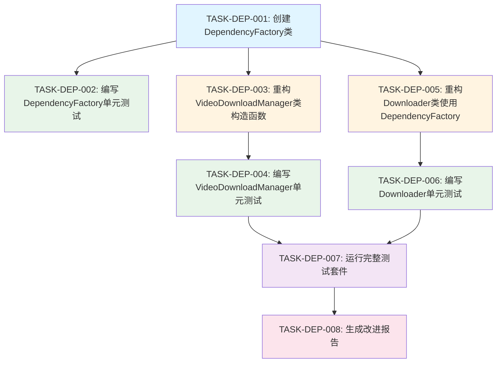

# 任务拆分文档 - 依赖关系优化

**任务名称**: 依赖关系优化  
**创建时间**: 20260128*152500  
**基于文档**: DESIGN*依赖关系优化.md

---

## 一、任务概述

### 1.1 任务目标

将"依赖关系优化"任务拆分为多个可独立执行、可独立验证的原子任务。

### 1.2 拆分原则

1. **复杂度可控**: 每个任务的复杂度在AI可成功交付的范围内
2. **功能模块化**: 按功能模块分解，确保任务原子性和独立性
3. **验收标准明确**: 每个任务都有明确的验收标准
4. **可独立测试**: 每个任务都可以独立编译和测试
5. **依赖关系清晰**: 任务间的依赖关系清晰明确

### 1.3 任务列表

| 任务ID       | 任务名称                              | 优先级 | 预计时间 | 依赖任务                   |
| ------------ | ------------------------------------- | ------ | -------- | -------------------------- |
| TASK-DEP-001 | 创建DependencyFactory类               | 高     | 2-3小时  | 无                         |
| TASK-DEP-002 | 编写DependencyFactory单元测试         | 高     | 2-3小时  | TASK-DEP-001               |
| TASK-DEP-003 | 重构VideoDownloadManager类构造函数    | 高     | 2-3小时  | TASK-DEP-001               |
| TASK-DEP-004 | 编写VideoDownloadManager单元测试      | 高     | 3-4小时  | TASK-DEP-003               |
| TASK-DEP-005 | 重构Downloader类使用DependencyFactory | 高     | 2-3小时  | TASK-DEP-001               |
| TASK-DEP-006 | 编写Downloader单元测试                | 高     | 3-4小时  | TASK-DEP-005               |
| TASK-DEP-007 | 运行完整测试套件                      | 高     | 1-2小时  | TASK-DEP-004, TASK-DEP-006 |
| TASK-DEP-008 | 生成改进报告                          | 中     | 1-2小时  | TASK-DEP-007               |

---

## 二、任务依赖关系图

---

## 三、原子任务详情

### TASK-DEP-001: 创建DependencyFactory类

#### 3.1 任务描述

创建DependencyFactory类，负责创建和管理各种依赖实例。

#### 3.2 输入契约

- 设计文档：DESIGN\_依赖关系优化.md
- 现有类：CookieHandler, M3u8Parser, PathSelector, NM3u8DLRE, M3u8DownloadService

#### 3.3 输出契约

- 新文件：src/dingtalk_downloader/core/dependency_factory.py
- 类：DependencyFactory
- 方法：
  - `__init__`
  - `get_cookie_handler`
  - `get_m3u8_parser`
  - `get_path_selector`
  - `get_n_m3u8dl_re`
  - `get_m3u8_download_service`

#### 3.4 实现约束

- 遵循PEP 8规范
- 遵循项目现有代码风格
- 使用字典存储依赖实例
- 支持依赖实例的复用（单例模式）
- 添加完整的类型注解
- 添加完整的文档字符串

#### 3.5 依赖关系

- 无前置依赖

#### 3.6 验收标准

- [ ] 文件创建成功
- [ ] 类创建成功
- [ ] 所有方法实现完整
- [ ] 所有方法都有类型注解
- [ ] 所有方法都有文档字符串
- [ ] 代码符合PEP 8规范
- [ ] 代码符合项目现有代码风格

---

### TASK-DEP-002: 编写DependencyFactory单元测试

#### 3.1 任务描述

为DependencyFactory类编写完整的单元测试。

#### 3.2 输入契约

- DependencyFactory类：src/dingtalk_downloader/core/dependency_factory.py
- 测试框架：pytest

#### 3.3 输出契约

- 新文件：tests/test_dependency_factory.py
- 测试用例：
  - 测试`__init__`方法
  - 测试`get_cookie_handler`方法
  - 测试`get_m3u8_parser`方法
  - 测试`get_path_selector`方法
  - 测试`get_n_m3u8dl_re`方法
  - 测试`get_m3u8_download_service`方法
  - 测试依赖实例复用

#### 3.4 实现约束

- 使用pytest框架
- 使用mock模拟依赖类
- 测试覆盖率不低于90%
- 测试用例清晰易懂
- 测试用例有清晰的描述

#### 3.5 依赖关系

- 前置依赖：TASK-DEP-001

#### 3.6 验收标准

- [ ] 测试文件创建成功
- [ ] 所有公共方法都有测试
- [ ] 测试覆盖正常流程
- [ ] 测试覆盖边界条件
- [ ] 测试覆盖异常情况
- [ ] 测试覆盖率不低于90%
- [ ] 所有测试通过

---

### TASK-DEP-003: 重构VideoDownloadManager类构造函数

#### 3.1 任务描述

重构VideoDownloadManager类的构造函数，添加依赖注入支持。

#### 3.2 输入契约

- 现有文件：src/dingtalk_downloader/core/video_download_manager.py
- DependencyFactory类：src/dingtalk_downloader/core/dependency_factory.py

#### 3.3 输出契约

- 修改文件：src/dingtalk_downloader/core/video_download_manager.py
- 修改方法：`__init__`
- 新增参数：
  - `cookie_handler: Optional[CookieHandler] = None`
  - `m3u8_parser: Optional[M3u8Parser] = None`
  - `m3u8_download_service: Optional[M3u8DownloadService] = None`
  - `path_selector: Optional[PathSelector] = None`
  - `n_m3u8dl_re: Optional[NM3u8DLRE] = None`

#### 3.4 实现约束

- 保持向后兼容性
- 保持现有接口不变
- 如果依赖未注入，则创建默认实例
- 添加完整的类型注解
- 更新文档字符串

#### 3.5 依赖关系

- 前置依赖：TASK-DEP-001

#### 3.6 验收标准

- [ ] 构造函数修改成功
- [ ] 新增参数正确
- [ ] 保持向后兼容性
- [ ] 保持现有接口不变
- [ ] 代码符合PEP 8规范
- [ ] 文档字符串更新完整

---

### TASK-DEP-004: 编写VideoDownloadManager单元测试

#### 3.1 任务描述

为VideoDownloadManager类编写完整的单元测试。

#### 3.2 输入契约

- VideoDownloadManager类：src/dingtalk_downloader/core/video_download_manager.py
- DependencyFactory类：src/dingtalk_downloader/core/dependency_factory.py
- 测试框架：pytest

#### 3.3 输出契约

- 新文件：tests/test_video_download_manager.py
- 测试用例：
  - 测试`__init__`方法
  - 测试`initialize_download`方法
  - 测试`process_video`方法
  - 测试`repeat_get_context`方法
  - 测试`cleanup_context`方法
  - 测试`close`方法
  - 测试依赖注入功能

#### 3.4 实现约束

- 使用pytest框架
- 使用mock模拟DependencyFactory
- 使用mock模拟依赖类
- 测试覆盖率不低于90%
- 测试用例清晰易懂
- 测试用例有清晰的描述

#### 3.5 依赖关系

- 前置依赖：TASK-DEP-003

#### 3.6 验收标准

- [ ] 测试文件创建成功
- [ ] 所有公共方法都有测试
- [ ] 测试覆盖正常流程
- [ ] 测试覆盖边界条件
- [ ] 测试覆盖异常情况
- [ ] 测试覆盖率不低于90%
- [ ] 所有测试通过

---

### TASK-DEP-005: 重构Downloader类使用DependencyFactory

#### 3.1 任务描述

重构Downloader类，使用DependencyFactory创建依赖实例。

#### 3.2 输入契约

- 现有文件：src/dingtalk_downloader/core/downloader.py
- DependencyFactory类：src/dingtalk_downloader/core/dependency_factory.py

#### 3.3 输出契约

- 修改文件：src/dingtalk_downloader/core/downloader.py
- 修改方法：`__init__`
- 新增参数：`dependency_factory: Optional[DependencyFactory] = None`
- 使用DependencyFactory创建依赖实例
- 将依赖实例注入到VideoDownloadManager

#### 3.4 实现约束

- 保持向后兼容性
- 保持现有接口不变
- 如果dependency_factory未注入，则创建默认实例
- 添加完整的类型注解
- 更新文档字符串

#### 3.5 依赖关系

- 前置依赖：TASK-DEP-001

#### 3.6 验收标准

- [ ] 构造函数修改成功
- [ ] 使用DependencyFactory创建依赖
- [ ] 保持向后兼容性
- [ ] 保持现有接口不变
- [ ] 代码符合PEP 8规范
- [ ] 文档字符串更新完整

---

### TASK-DEP-006: 编写Downloader单元测试

#### 3.1 任务描述

为Downloader类编写完整的单元测试。

#### 3.2 输入契约

- Downloader类：src/dingtalk_downloader/core/downloader.py
- DependencyFactory类：src/dingtalk_downloader/core/dependency_factory.py
- 测试框架：pytest

#### 3.3 输出契约

- 新文件：tests/test_downloader.py
- 测试用例：
  - 测试`__init__`方法
  - 测试`download_single_video`方法
  - 测试`download_batch_videos`方法
  - 测试`close`方法
  - 测试DependencyFactory集成

#### 3.4 实现约束

- 使用pytest框架
- 使用mock模拟DependencyFactory
- 使用mock模拟VideoDownloadManager
- 使用mock模拟UserInteractionController
- 测试覆盖率不低于90%
- 测试用例清晰易懂
- 测试用例有清晰的描述

#### 3.5 依赖关系

- 前置依赖：TASK-DEP-005

#### 3.6 验收标准

- [ ] 测试文件创建成功
- [ ] 所有公共方法都有测试
- [ ] 测试覆盖正常流程
- [ ] 测试覆盖边界条件
- [ ] 测试覆盖异常情况
- [ ] 测试覆盖率不低于90%
- [ ] 所有测试通过

---

### TASK-DEP-007: 运行完整测试套件

#### 3.1 任务描述

运行完整的测试套件，验证所有功能正常。

#### 3.2 输入契约

- 测试文件：
  - tests/test_dependency_factory.py
  - tests/test_video_download_manager.py
  - tests/test_downloader.py
- 测试框架：pytest

#### 3.3 输出契约

- 测试报告
- 测试覆盖率报告
- 性能测试报告

#### 3.4 实现约束

- 运行所有测试
- 生成测试覆盖率报告
- 记录测试结果
- 记录性能指标

#### 3.5 依赖关系

- 前置依赖：TASK-DEP-004, TASK-DEP-006

#### 3.6 验收标准

- [ ] 所有测试通过
- [ ] 测试覆盖率不低于80%
- [ ] 核心模块测试覆盖率不低于90%
- [ ] 无明显的性能下降
- [ ] 测试报告生成成功

---

### TASK-DEP-008: 生成改进报告

#### 3.1 任务描述

生成改进报告，总结重构过程和结果。

#### 3.2 输入契约

- 测试报告
- 测试覆盖率报告
- 性能测试报告
- 代码变更记录

#### 3.3 输出契约

- 新文件：docs/review/dependency_optimization_improvement_report.md
- 报告内容：
  - 问题分析
  - 实施步骤
  - 测试结果
  - 性能对比
  - 结论和建议

#### 3.4 实现约束

- 报告结构清晰
- 报告内容完整
- 报告数据准确
- 报告语言规范

#### 3.5 依赖关系

- 前置依赖：TASK-DEP-007

#### 3.6 验收标准

- [ ] 报告文件创建成功
- [ ] 报告包含问题分析
- [ ] 报告包含实施步骤
- [ ] 报告包含测试结果
- [ ] 报告包含性能对比
- [ ] 报告包含结论和建议
- [ ] 报告结构清晰
- [ ] 报告内容完整

---

## 四、任务执行顺序

### 4.1 第一批任务（核心功能）

1. TASK-DEP-001: 创建DependencyFactory类
2. TASK-DEP-002: 编写DependencyFactory单元测试
3. TASK-DEP-003: 重构VideoDownloadManager类构造函数
4. TASK-DEP-004: 编写VideoDownloadManager单元测试
5. TASK-DEP-005: 重构Downloader类使用DependencyFactory
6. TASK-DEP-006: 编写Downloader单元测试

### 4.2 第二批任务（验证和交付）

7. TASK-DEP-007: 运行完整测试套件
8. TASK-DEP-008: 生成改进报告

---

## 五、质量门控

### 5.1 任务完成标准

每个任务必须满足以下标准才能标记为完成：

1. **功能完整性**: 任务描述的所有功能都已实现
2. **代码质量**: 代码符合PEP 8规范和项目现有代码风格
3. **文档完整性**: 所有类和方法都有完整的文档字符串
4. **类型注解**: 所有函数都有完整的类型注解
5. **测试覆盖**: 所有公共方法都有对应的测试用例

### 5.2 阶段完成标准

每个阶段必须满足以下标准才能进入下一阶段：

1. **第一批任务**: DependencyFactory创建、VideoDownloadManager重构、Downloader重构完成，测试通过
2. **第二批任务**: 所有测试通过，改进报告生成

### 5.3 整体完成标准

整个任务必须满足以下标准才能标记为完成：

1. **功能完整性**: 所有功能都已实现，程序功能与重构前完全一致
2. **代码质量**: 代码符合PEP 8规范和项目现有代码风格
3. **测试覆盖**: 测试覆盖率不低于80%，核心模块测试覆盖率不低于90%
4. **性能要求**: 无明显的性能下降（<5%），无额外的内存占用（<10MB）
5. **文档完整性**: 改进报告生成，包含问题分析、实施步骤、测试结果

---

**任务拆分文档创建时间**: 20260128*152500  
**任务拆分文档版本**: 1.0  
**基于文档**: DESIGN*依赖关系优化.md
