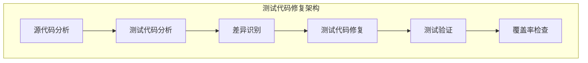
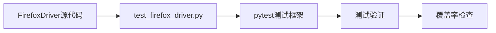
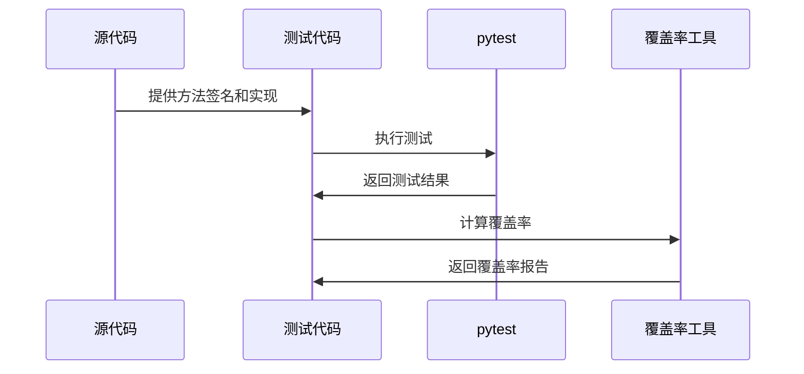

# DESIGN_测试代码更新

## 整体架构图

## 分层设计

### 分析层

- **源代码分析**: 分析src目录下的源代码，理解方法签名、参数、返回值
- **测试代码分析**: 分析tests目录下的测试代码，理解测试逻辑和预期行为
- **差异识别**: 对比源代码和测试代码，识别不一致之处

### 修复层

- **测试代码修复**: 修复不一致的测试用例
- **测试验证**: 运行测试确保修复后测试通过
- **覆盖率检查**: 检查测试覆盖率是否达标

## 核心组件

### FirefoxDriver测试修复

- **职责**: 修复test_firefox_driver.py中与源代码不一致的测试用例
- **接口**: pytest测试框架
- **依赖**: FirefoxDriver源代码实现

### 测试验证组件

- **职责**: 运行所有测试确保修复后测试通过
- **接口**: pytest命令行工具
- **依赖**: pytest, pytest-mock, pytest-cov

### 覆盖率检查组件

- **职责**: 检查测试覆盖率是否达到≥80%的要求
- **接口**: pytest-cov插件
- **依赖**: pytest-cov

## 模块依赖关系图

## 接口契约定义

### FirefoxDriver.extract_m3u8_links_from_logs

- **输入参数**:
  - `logs: List[dict]` - 浏览器日志列表
- **输出参数**:
  - `List[str]` - 提取的m3u8链接列表
- **异常处理**: 无异常抛出，返回空列表表示未找到链接

### 测试用例修复

- **输入**: 源代码方法签名和实现
- **输出**: 修复后的测试用例
- **异常处理**: 无

## 数据流向图

## 异常处理策略

### 异常分类

1. **测试失败**: 修复测试代码后重新运行
2. **覆盖率下降**: 分析未覆盖的代码，补充测试用例
3. **源代码与测试代码不一致**: 优先修复测试代码以匹配源代码

### 错误码定义

| 错误码 | 说明 | 处理方式 |
|--------|------|----------|
| TEST_001 | 测试用例失败 | 修复测试代码或源代码 |
| TEST_002 | 覆盖率不足 | 补充测试用例 |
| TEST_003 | 方法签名不一致 | 调整测试代码以匹配源代码 |
