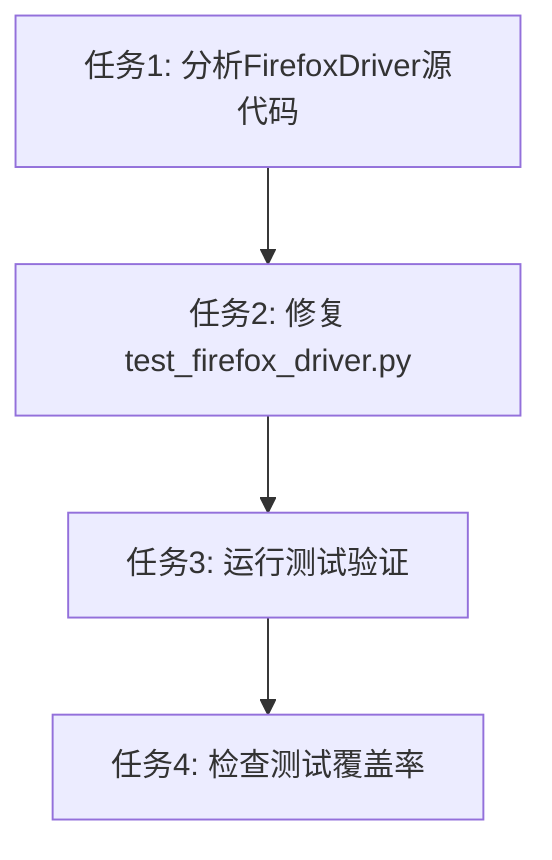

# TASK_测试代码更新

## 任务依赖图

## 原子任务列表

### 任务 1: 分析FirefoxDriver源代码

#### 输入契约

- **前置依赖**: 无
- **输入数据**:
  - `src/dingtalk_downloader/browser/firefox_driver.py` 源代码
  - `src/dingtalk_downloader/browser/browser_driver.py` 父类源代码
- **环境依赖**: Python 3.13+

#### 输出契约

- **输出数据**:
  - FirefoxDriver.extract_m3u8_links_from_logs 方法签名: `def extract_m3u8_links_from_logs(self, logs: List[dict]) -> List[str]:`
  - 父类 BrowserDriver.extract_m3u8_links_from_logs 方法签名: `def extract_m3u8_links_from_logs(self, logs: List[dict], live_uuid: str) -> List[str]:`
  - FirefoxDriver 使用正则表达式提取m3u8链接，不依赖 live_uuid 参数
- **交付物**: 分析报告（文档化在ALIGNMENT和CONSENSUS文档中）
- **验收标准**:
  - [ ] 准确识别FirefoxDriver方法签名
  - [ ] 准确识别父类方法签名
  - [ ] 理解FirefoxDriver的特殊实现逻辑

#### 实现约束

- **技术栈**: Python 3.13+
- **接口规范**: 遵循Python方法签名规范
- **质量要求**: 分析准确无误

#### 依赖关系

- **后置任务**: 任务2
- **并行任务**: 无

---

### 任务 2: 修复test_firefox_driver.py

#### 输入契约

- **前置依赖**: 任务1
- **输入数据**:
  - `tests/unit/test_firefox_driver.py` 测试文件
  - FirefoxDriver源代码分析结果
- **环境依赖**: pytest, pytest-mock

#### 输出契约

- **输出数据**: 修复后的 `tests/unit/test_firefox_driver.py` 文件
- **交付物**: 修复后的测试文件
- **验收标准**:
  - [ ] TestFirefoxDriverExtractM3u8Links 类中的测试用例适配 FirefoxDriver 的实际方法签名
  - [ ] 测试用例反映 FirefoxDriver 的特殊实现（使用正则表达式提取，不依赖 live_uuid 过滤）
  - [ ] 测试用例命名清晰，描述准确
  - [ ] 测试代码符合项目代码规范（PEP 8, 4空格缩进, UTF-8编码）

#### 实现约束

- **技术栈**: pytest, pytest-mock
- **接口规范**: 遵循pytest测试框架规范
- **质量要求**: 测试代码质量高，覆盖正常流程、边界条件、异常情况

#### 依赖关系

- **后置任务**: 任务3
- **并行任务**: 无

---

### 任务 3: 运行测试验证

#### 输入契约

- **前置依赖**: 任务2
- **输入数据**: 修复后的测试文件
- **环境依赖**: pytest, pytest-mock, pytest-cov

#### 输出契约

- **输出数据**: 测试运行结果
- **交付物**: 测试运行报告
- **验收标准**:
  - [ ] 所有测试用例通过（415个测试）
  - [ ] 无测试失败
  - [ ] 无测试错误

#### 实现约束

- **技术栈**: pytest, pytest-mock, pytest-cov
- **接口规范**: 遵循pytest命令行工具规范
- **质量要求**: 测试执行成功

#### 依赖关系

- **后置任务**: 任务4
- **并行任务**: 无

---

### 任务 4: 检查测试覆盖率

#### 输入契约

- **前置依赖**: 任务3
- **输入数据**: 测试运行结果
- **环境依赖**: pytest-cov

#### 输出契约

- **输出数据**: 测试覆盖率报告
- **交付物**: 覆盖率报告（htmlcov/coverage.xml）
- **验收标准**:
  - [ ] 测试覆盖率≥80%
  - [ ] 覆盖率报告生成成功

#### 实现约束

- **技术栈**: pytest-cov
- **接口规范**: 遵循pytest-cov插件规范
- **质量要求**: 覆盖率达标

#### 依赖关系

- **后置任务**: 无
- **并行任务**: 无
