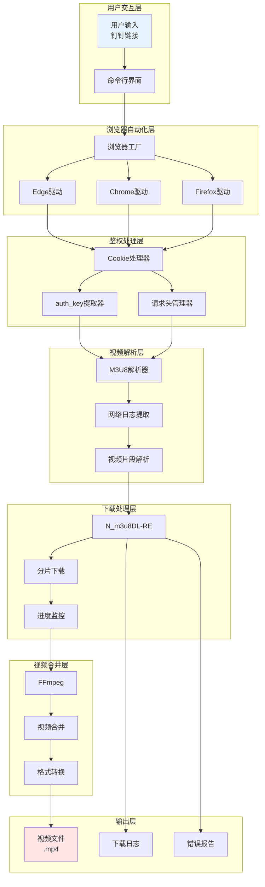
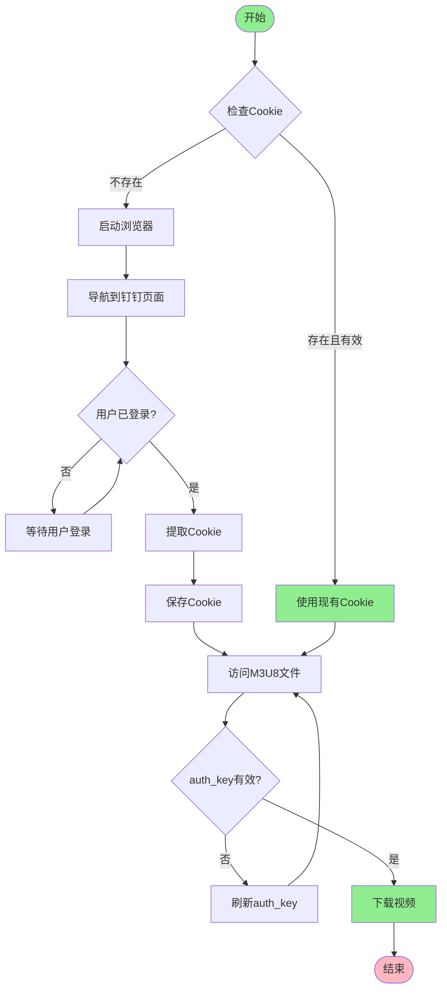
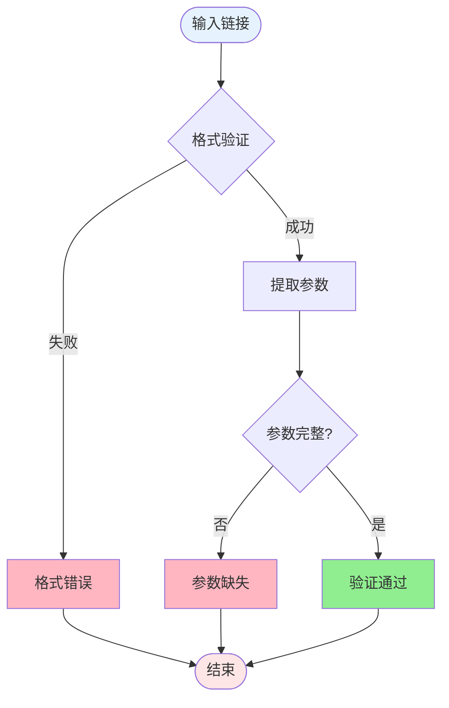
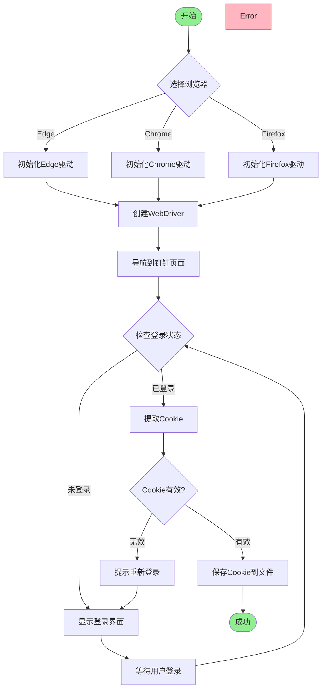
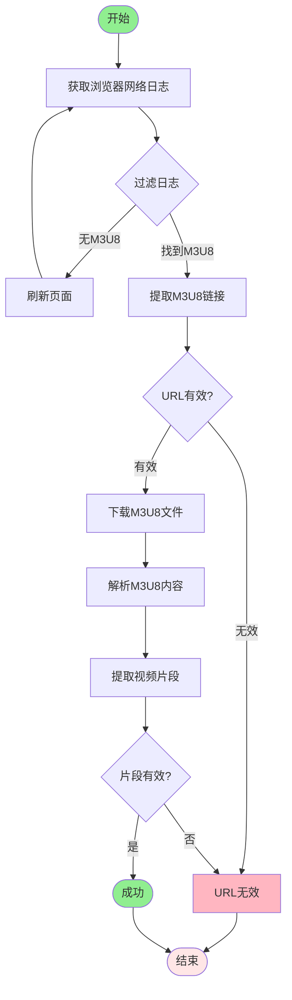
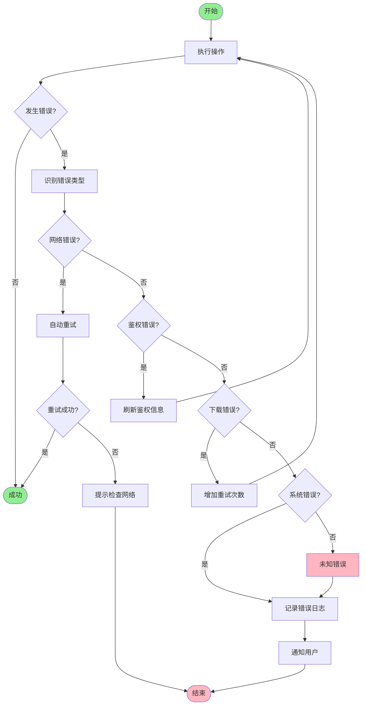

# 钉钉直播回放视频下载开发指南

## 文档信息

- **文档版本**: v1.0.0
- **创建日期**: 2025-01-15
- **最后更新**: 2025-01-15
- **适用工具版本**:
  - N_m3u8DL-RE: 20251027
  - FFmpeg: 5.x+
  - Python: 3.8+

## 目录

- [1. 概述](#1-概述)
- [2. 技术架构](#2-技术架构)
- [3. 钉钉鉴权机制](#3-钉钉鉴权机制)
- [4. 输入参数规范](#4-输入参数规范)
- [5. Cookie 获取流程](#5-cookie获取流程)
- [6. M3U8 解析流程](#6-m3u8解析流程)
- [7. N_m3u8DL-RE 配置](#7-n_m3u8dl-re配置)
- [8. FFmpeg 合并方案](#8-ffmpeg合并方案)
- [9. 错误处理方案](#9-错误处理方案)
- [10. 常见问题排查](#10-常见问题排查)
- [11. 完整示例](#11-完整示例)
- [12. 附录](#12-附录)

---

## 1. 概述

### 1.1 背景介绍

钉钉直播回放功能为企业用户提供了便捷的直播内容回放服务,但钉钉平台未提供官方的下载接口。本指南将详细介绍如何通过技术手段实现钉钉直播回放视频的下载。

### 1.2 技术挑战

钉钉直播回放下载面临以下技术挑战:

1. **鉴权机制复杂**: 钉钉采用多重鉴权机制,包括 Cookie 和 auth_key
2. **视频流格式**: 视频采用 HLS(M3U8)格式,需要分片下载和合并
3. **动态 URL**: M3U8 文件和视频片段 URL 包含动态生成的 auth_key 参数
4. **浏览器依赖**: 需要通过浏览器自动化获取有效的鉴权信息

### 1.3 技术栈

本指南采用以下技术栈:

| 技术                | 版本     | 用途          |
| ------------------- | -------- | ------------- |
| Python              | 3.8+     | 主要编程语言  |
| Selenium            | 4.x      | 浏览器自动化  |
| Edge/Chrome/Firefox | 最新版本 | 浏览器驱动    |
| N_m3u8DL-RE         | 20251027 | M3U8 视频下载 |
| FFmpeg              | 5.x+     | 视频合并处理  |

### 1.4 适用场景

本指南适用于以下场景:

- 开发者学习钉钉视频下载技术
- 技术人员部署和维护下载工具
- 研究人员了解钉钉鉴权机制
- 企业内部批量下载直播回放

---

## 2. 技术架构

### 2.1 整体架构图



### 2.2 数据流向图


---

## 3. 钉钉鉴权机制

钉钉平台采用多重鉴权机制,主要包括 Cookie 鉴权、auth_key 鉴权和请求头验证。理解这些鉴权机制是成功下载视频的关键。

### 3.1 Cookie 鉴权

#### 3.1.1 Cookie 的作用

Cookie 是钉钉平台用于识别用户身份和维护会话状态的关键凭证。在访问钉钉直播回放页面和下载视频流时,必须携带有效的 Cookie。

#### 3.1.2 主要 Cookie 字段

根据实际抓包分析,钉钉直播回放下载需要以下关键 Cookie:

| Cookie 名称   | 作用           | 示例值                                                                                                                |
| ------------- | -------------- | --------------------------------------------------------------------------------------------------------------------- |
| account       | 用户账号凭证   | oauth_k1:wCHiNer7aXnAnH5XPvfhgNMXoEWTaStVor/I6++rywATtIhvQmVScu8KToKYwFgkqgL8tm+h2rzpedTkN4J6F2u3ahSLWDPpBm/GyPnaDfg= |
| deviceid      | 设备标识符     | 67575feef95d4d079fcd475cf96411aa                                                                                      |
| pub_uid       | 公开用户 ID    | 9jELC8+ewLBxGH9rXrTX7g==                                                                                              |
| LV_PC_SESSION | PC 会话标识    | c7d0c366bad1c7e1                                                                                                      |
| lv_token      | 直播令牌       | oauth_k1:wCHiNer7aXnAnH5XPvfhgNMXoEWTaStVor/I6++rywATtIhvQmVScu8KToKYwFgkqgL8tm+h2rzpedTkN4J6F2u3ahSLWDPpBm/GyPnaDfg= |
| isg           | 阿里云安全标识 | BFdXerlJ8say1HZK3rww2ibQ5suhnCv-AKTxd6mE7SaN2HYasWhXTEPqOHhGKwN2                                                      |

#### 3.1.3 Cookie 获取方法

**步骤 1: 启动浏览器**

使用 Selenium 启动浏览器并启用性能日志记录:

```python
from selenium import webdriver
from selenium.webdriver.edge.options import Options

options = Options()
options.set_capability('goog:loggingPrefs', {'performance': 'ALL'})
driver = webdriver.Edge(options=options)
```

**步骤 2: 导航到钉钉页面**

```python
driver.get('https://n.dingtalk.com/dingding/live-room/index.html?roomId=xxx&liveUuid=xxx')
```

**步骤 3: 等待用户登录**

```python
input("请在浏览器中登录钉钉账户后,按Enter键继续...")
```

**步骤 4: 提取 Cookie**

```python
cookies = driver.get_cookies()
cookie_dict = {cookie['name']: cookie['value'] for cookie in cookies}
print(f"已获取 {len(cookie_dict)} 个Cookie")
```

### 3.2 auth_key 鉴权

#### 3.2.1 auth_key 的格式

auth_key 是钉钉视频流 URL 中的鉴权参数,格式如下:

```
auth_key={timestamp}-{signature}-{0}-{md5}
```

各部分说明:

- **timestamp**: Unix 时间戳,表示 auth_key 的生成时间
- **signature**: 签名,基于时间戳和密钥生成
- **0**: 固定值,表示不使用某种特定功能
- **md5**: MD5 哈希值,用于验证请求的完整性

**示例**:

```
auth_key=1769305717-4a9f486752f04f5fbafbe6ffc66bd414-0-df22001f8ec407dd7033a05b28bd2812
```

#### 3.2.2 auth_key 的作用

auth_key 的主要作用:

1. **访问控制**: 确保只有授权用户可以访问视频流
2. **时间限制**: auth_key 包含时间戳,有过期时间限制
3. **防盗链**: 防止视频流 URL 被直接分享和盗用
4. **完整性验证**: MD5 哈希值确保请求未被篡改

#### 3.2.3 auth_key 的获取

auth_key 不需要手动生成,它会自动包含在 M3U8 文件和视频片段 URL 中。我们只需要:

1. 从 M3U8 文件中提取 auth_key
2. 将 auth_key 附加到每个视频片段 URL
3. 确保 auth_key 在有效期内使用

### 3.3 请求头验证

#### 3.3.1 必需的请求头

访问钉钉视频流时,必须携带以下请求头:

| 请求头          | 值                                                              | 作用               |
| --------------- | --------------------------------------------------------------- | ------------------ |
| User-Agent      | Mozilla/5.0 (Windows NT 10.0; Win64; x64) AppleWebKit/537.36... | 模拟真实浏览器     |
| Referer         | https://n.dingtalk.com/                                         | 防止盗链           |
| Accept          | application/vnd.apple.mpegurl, text/plain, _/_                  | 指定接受的内容类型 |
| Accept-Language | zh-CN,zh;q=0.9,en;q=0.8                                         | 指定语言偏好       |
| Accept-Encoding | gzip, deflate, br                                               | 指定支持的压缩方式 |
| Cookie          | account=xxx; deviceid=xxx; ...                                  | 用户身份凭证       |

#### 3.3.2 请求头构建示例

```python
headers = {
    'User-Agent': 'Mozilla/5.0 (Windows NT 10.0; Win64; x64) AppleWebKit/537.36 (KHTML, like Gecko) Chrome/143.0.0.0 Safari/537.36',
    'Referer': 'https://n.dingtalk.com/',
    'Accept': 'application/vnd.apple.mpegurl, text/plain, */*',
    'Accept-Language': 'zh-CN,zh;q=0.9,en;q=0.8',
    'Accept-Encoding': 'gzip, deflate, br',
    'Cookie': '; '.join([f'{k}={v}' for k, v in cookie_dict.items()])
}
```

### 3.4 鉴权流程图



---

## 4. 输入参数规范

### 4.1 钉钉直播回放链接格式

#### 4.1.1 标准格式

钉钉直播回放链接的标准格式:

```
https://n.dingtalk.com/dingding/live-room/index.html?roomId={roomId}&liveUuid={liveUuid}
```

#### 4.1.2 参数说明

| 参数     | 类型   | 必需 | 说明      | 示例                                 |
| -------- | ------ | ---- | --------- | ------------------------------------ |
| roomId   | string | 是   | 直播间 ID | JC0D5jhMaB                           |
| liveUuid | string | 是   | 直播 UUID | 9f3171a7-3b52-47ca-917a-bcc2f02e33f5 |

#### 4.1.3 完整示例

```
https://n.dingtalk.com/dingding/live-room/index.html?roomId=JC0D5jhMaB&liveUuid=9f3171a7-3b52-47ca-917a-bcc2f02e33f5
```

### 4.2 链接验证规则

#### 4.2.1 格式验证

使用正则表达式验证链接格式:

```python
import re

def validate_dingtalk_url(url: str) -> bool:
    pattern = r'^https://n\.dingtalk\.com/dingding/live-room/index\.html\?roomId=[^&]+&liveUuid=[^&]+$'
    return bool(re.match(pattern, url))
```

#### 4.2.2 参数提取

从 URL 中提取参数:

```python
from urllib.parse import urlparse, parse_qs

def extract_params(url: str) -> dict:
    parsed = urlparse(url)
    params = parse_qs(parsed.query)
    return {
        'roomId': params.get('roomId', [None])[0],
        'liveUuid': params.get('liveUuid', [None])[0]
    }
```

#### 4.2.3 参数完整性检查

```python
def check_params(params: dict) -> bool:
    return all([
        params.get('roomId'),
        params.get('liveUuid')
    ])
```

### 4.3 验证流程



---

## 5. Cookie 获取流程

### 5.1 流程图



### 5.2 代码实现

#### 5.2.1 浏览器初始化

```python
from selenium import webdriver
from selenium.webdriver.edge.options import Options
from selenium.webdriver.chrome.options import Options as ChromeOptions
from selenium.webdriver.firefox.options import Options as FirefoxOptions

def create_browser(browser_type: str) -> webdriver.Remote:
    if browser_type == 'edge':
        options = Options()
        options.set_capability('goog:loggingPrefs', {'performance': 'ALL'})
        return webdriver.Edge(options=options)
    elif browser_type == 'chrome':
        options = ChromeOptions()
        options.set_capability('goog:loggingPrefs', {'performance': 'ALL'})
        return webdriver.Chrome(options=options)
    elif browser_type == 'firefox':
        options = FirefoxOptions()
        options.set_preference('devtools.console.stdout', True)
        return webdriver.Firefox(options=options)
    else:
        raise ValueError(f'不支持的浏览器类型: {browser_type}')
```

#### 5.2.2 Cookie 提取

```python
def get_cookies(driver: webdriver.Remote) -> dict:
    cookies = driver.get_cookies()
    cookie_dict = {}

    for cookie in cookies:
        cookie_dict[cookie['name']] = cookie['value']

    return cookie_dict
```

#### 5.2.3 Cookie 保存

```python
import json

def save_cookies(cookies: dict, filepath: str = 'cookies.json'):
    with open(filepath, 'w', encoding='utf-8') as f:
        json.dump(cookies, f, ensure_ascii=False, indent=2)
    print(f'Cookie已保存到: {filepath}')
```

#### 5.2.4 Cookie 加载

```python
def load_cookies(filepath: str = 'cookies.json') -> dict:
    try:
        with open(filepath, 'r', encoding='utf-8') as f:
            return json.load(f)
    except FileNotFoundError:
        print(f'Cookie文件不存在: {filepath}')
        return {}
```

### 5.3 注意事项

1. **浏览器驱动版本**: 浏览器驱动版本必须与浏览器版本匹配
2. **登录超时**: 设置合理的登录超时时间,避免无限等待
3. **Cookie 有效期**: Cookie 通常有有效期,过期后需要重新获取
4. **多浏览器支持**: 不同浏览器的 Cookie 格式可能略有不同
5. **隐私模式**: 避免使用隐私模式,否则 Cookie 无法持久化

---

## 6. M3U8 解析流程

### 6.1 流程图



### 6.2 M3U8 链接提取

#### 6.2.1 从网络日志提取

```python
import re

def extract_m3u8_from_logs(logs: list) -> list:
    m3u8_links = []

    for log in logs:
        log_message = log.get('message', str(log))

        if '.m3u8' in log_message:
            pattern = r'https://[^,\'"]+\.m3u8\?[^\'"]+'
            matches = re.findall(pattern, log_message)

            for match in matches:
                m3u8_links.append(match)
                print(f'找到M3U8链接: {match}')

    return m3u8_links
```

#### 6.2.2 按 liveUuid 过滤

```python
def filter_m3u8_by_uuid(m3u8_links: list, live_uuid: str) -> list:
    filtered = []
    for link in m3u8_links:
        if live_uuid in link:
            filtered.append(link)
            print(f'匹配的M3U8链接: {link}')
    return filtered
```

### 6.3 M3U8 文件下载

#### 6.3.1 使用浏览器下载

```python
def download_m3u8_with_browser(driver: webdriver.Remote, url: str, save_path: str) -> str:
    m3u8_content = driver.execute_script(
        "return fetch(arguments[0], { method: 'GET' }).then(response => response.text())",
        url
    )

    with open(save_path, 'w', encoding='utf-8') as f:
        f.write(m3u8_content)

    print(f'M3U8文件已下载: {save_path}')
    return save_path
```

#### 6.3.2 使用 requests 下载

```python
import requests

def download_m3u8_with_requests(url: str, headers: dict, save_path: str) -> str:
    response = requests.get(url, headers=headers)
    response.raise_for_status()

    with open(save_path, 'w', encoding='utf-8') as f:
        f.write(response.text)

    print(f'M3U8文件已下载: {save_path}')
    return save_path
```

### 6.4 M3U8 内容解析

#### 6.4.1 解析视频片段

```python
def parse_m3u8_segments(m3u8_file: str) -> list:
    segments = []

    with open(m3u8_file, 'r', encoding='utf-8') as f:
        for line in f:
            line = line.strip()

            if line and not line.startswith('#'):
                segments.append(line)

    print(f'解析到 {len(segments)} 个视频片段')
    return segments
```

#### 6.4.2 提取基础 URL

```python
def extract_base_url(m3u8_url: str) -> str:
    pattern = r'(https?://[^/]+/[^/]+/[^/]+/[^/]+)'
    match = re.search(pattern, m3u8_url)

    if match:
        base_url = match.group(1)
        print(f'基础URL: {base_url}')
        return base_url

    return m3u8_url.rsplit('/', 1)[0]
```

### 6.5 解析技巧

1. **正则表达式**: 使用精确的正则表达式匹配 M3U8 链接
2. **重试机制**: 网络日志可能不完整,需要多次尝试
3. **日志级别**: 启用性能日志以获取完整的网络请求
4. **页面刷新**: 如果首次提取失败,刷新页面重试
5. **相对路径处理**: 正确处理 M3U8 文件中的相对路径

---

## 7. N_m3u8DL-RE 配置

### 7.1 核心参数

| 参数                   | 说明           | 示例值                                             | 必需 |
| ---------------------- | -------------- | -------------------------------------------------- | ---- |
| --save-name            | 设置保存文件名 | --save-name "直播回放"                             | 是   |
| --save-dir             | 设置保存目录   | --save-dir "D:\Downloads"                          | 是   |
| --base-url             | 设置基础 URL   | --base-url "https://dtliving-sz.dingtalk.com/live" | 是   |
| -H                     | 设置请求头     | -H "Cookie: account=xxx"                           | 是   |
| --thread-count         | 设置下载线程数 | --thread-count 16                                  | 否   |
| --download-retry-count | 设置重试次数   | --download-retry-count 5                           | 否   |
| --http-request-timeout | 设置超时时间   | --http-request-timeout 120                         | 否   |
| --ui-language          | 设置 UI 语言   | --ui-language zh-CN                                | 否   |

### 7.2 配置示例

#### 7.2.1 基本配置

```bash
N_m3u8DL-RE.exe video.m3u8 ^
  --save-name "钉钉直播回放" ^
  --save-dir "D:\Downloads" ^
  --base-url "https://dtliving-sz.dingtalk.com/live" ^
  -H "Cookie: account=xxx; deviceid=xxx" ^
  -H "User-Agent: Mozilla/5.0..." ^
  -H "Referer: https://n.dingtalk.com/"
```

#### 7.2.2 高级配置

```bash
N_m3u8DL-RE.exe video.m3u8 ^
  --save-name "钉钉直播回放" ^
  --save-dir "D:\Downloads" ^
  --base-url "https://dtliving-sz.dingtalk.com/live" ^
  --thread-count 32 ^
  --download-retry-count 5 ^
  --http-request-timeout 120 ^
  -H "Cookie: account=xxx; deviceid=xxx" ^
  -H "User-Agent: Mozilla/5.0..." ^
  -H "Referer: https://n.dingtalk.com/" ^
  -H "Accept: application/vnd.apple.mpegurl, text/plain, */*" ^
  -H "Accept-Language: zh-CN,zh;q=0.9" ^
  --ui-language zh-CN ^
  --log-level INFO
```

### 7.3 性能优化

#### 7.3.1 线程数调整

根据网络带宽和 CPU 性能调整线程数:

| 网络带宽   | 推荐线程数 |
| ---------- | ---------- |
| < 10 Mbps  | 8-16       |
| 10-50 Mbps | 16-32      |
| > 50 Mbps  | 32-64      |

#### 7.3.2 重试策略

```bash
--download-retry-count 5
--http-request-timeout 120
```

#### 7.3.3 网络优化

```bash
--use-system-proxy false
--custom-proxy "http://127.0.0.1:8888"
```

### 7.4 完整命令示例

```python
import subprocess

def build_n_m3u8dl_re_command(
    m3u8_file: str,
    save_name: str,
    save_dir: str,
    base_url: str,
    cookies: dict,
    headers: dict
) -> list:
    command = [
        'N_m3u8DL-RE.exe',
        m3u8_file,
        '--save-name', save_name,
        '--save-dir', save_dir,
        '--base-url', base_url,
        '--thread-count', '32',
        '--download-retry-count', '5',
        '--http-request-timeout', '120',
        '--ui-language', 'zh-CN'
    ]

    cookie_string = '; '.join([f'{k}={v}' for k, v in cookies.items()])
    command.extend(['-H', f'Cookie: {cookie_string}'])

    if 'User-Agent' in headers:
        command.extend(['-H', f"User-Agent: {headers['User-Agent']}"])

    if 'Referer' in headers:
        command.extend(['-H', f"Referer: {headers['Referer']}"])

    if 'Accept' in headers:
        command.extend(['-H', f"Accept: {headers['Accept']}"])

    return command

def execute_download(command: list):
    print('开始下载视频...')
    subprocess.run(command)
    print('视频下载完成!')
```

---

## 8. FFmpeg 合并方案

### 8.1 基本合并命令

#### 8.1.1 直接合并

```bash
ffmpeg -i input.ts -c copy output.mp4
```

参数说明:

- `-i input.ts`: 指定输入文件
- `-c copy`: 直接复制流,不重新编码(速度快,无质量损失)
- `output.mp4`: 指定输出文件

#### 8.1.2 批量合并

```bash
ffmpeg -f concat -safe 0 -i filelist.txt -c copy output.mp4
```

`filelist.txt`格式:

```
file 'segment1.ts'
file 'segment2.ts'
file 'segment3.ts'
```

### 8.2 高级合并命令

#### 8.2.1 添加元信息

```bash
ffmpeg -i input.ts -c copy -metadata title="钉钉直播回放" -metadata author="钉钉用户" output.mp4
```

#### 8.2.2 视频质量调整

```bash
ffmpeg -i input.ts -c:v libx264 -crf 23 -preset medium -c:a aac -b:a 128k output.mp4
```

参数说明:

- `-c:v libx264`: 使用 H.264 编码
- `-crf 23`: 控制视频质量(18-28,数值越小质量越高)
- `-preset medium`: 编码速度与压缩率的平衡
- `-c:a aac`: 使用 AAC 音频编码
- `-b:a 128k`: 音频比特率

#### 8.2.3 格式转换

```bash
ffmpeg -i input.ts -c copy output.mkv
```

### 8.3 Python 封装

```python
import subprocess

def merge_video(
    input_file: str,
    output_file: str,
    metadata: dict = None
) -> bool:
    command = ['ffmpeg', '-i', input_file, '-c', 'copy']

    if metadata:
        for key, value in metadata.items():
            command.extend(['-metadata', f'{key}={value}'])

    command.append(output_file)

    try:
        print(f'开始合并视频: {input_file} -> {output_file}')
        subprocess.run(command, check=True)
        print(f'视频合并完成: {output_file}')
        return True
    except subprocess.CalledProcessError as e:
        print(f'视频合并失败: {e}')
        return False
```

### 8.4 使用示例

```python
metadata = {
    'title': '钉钉直播回放',
    'author': '钉钉用户',
    'comment': '下载自钉钉直播回放'
}

merge_video('video.ts', 'video.mp4', metadata)
```

---

## 9. 错误处理方案

### 9.1 错误分类

| 错误类型 | 常见原因                   | 处理策略                    |
| -------- | -------------------------- | --------------------------- |
| 网络错误 | 连接超时、网络不稳定       | 自动重试、提示检查网络      |
| 鉴权错误 | Cookie 过期、auth_key 无效 | 重新获取 Cookie、刷新页面   |
| 下载错误 | 视频片段下载失败           | 增加重试次数、检查 URL      |
| 合并错误 | FFmpeg 未安装、文件损坏    | 检查 FFmpeg、验证文件完整性 |
| 系统错误 | 权限不足、磁盘空间不足     | 检查权限、清理磁盘空间      |

### 9.2 错误处理流程图



### 9.3 重试机制

#### 9.3.1 自动重试

```python
import time

def retry_operation(func, max_retries: int = 3, delay: int = 5):
    for attempt in range(max_retries):
        try:
            return func()
        except Exception as e:
            print(f'操作失败 (尝试 {attempt + 1}/{max_retries}): {e}')

            if attempt < max_retries - 1:
                print(f'等待 {delay} 秒后重试...')
                time.sleep(delay)
            else:
                raise e
```

#### 9.3.2 使用示例

```python
def download_with_retry(url: str, headers: dict):
    def download():
        response = requests.get(url, headers=headers)
        response.raise_for_status()
        return response

    return retry_operation(download, max_retries=5, delay=10)
```

### 9.4 错误日志记录

```python
import logging
from datetime import datetime

def setup_logging(log_file: str = 'download.log'):
    logging.basicConfig(
        level=logging.INFO,
        format='%(asctime)s - %(levelname)s - %(message)s',
        handlers=[
            logging.FileHandler(log_file, encoding='utf-8'),
            logging.StreamHandler()
        ]
    )

def log_error(error: Exception):
    logging.error(f'发生错误: {type(error).__name__}: {error}')
```

---

## 10. 常见问题排查

### 10.1 网络问题

#### 10.1.1 连接超时

**症状**: 下载时提示连接超时

**原因**:

- 网络不稳定
- 防火墙阻止连接
- 代理设置错误

**解决方案**:

1. 检查网络连接
2. 增加超时时间:`--http-request-timeout 300`
3. 检查防火墙设置
4. 验证代理配置

#### 10.1.2 下载速度慢

**症状**: 下载速度远低于带宽

**原因**:

- 线程数设置过低
- 服务器限速
- 网络拥堵

**解决方案**:

1. 增加线程数:`--thread-count 64`
2. 检查网络带宽
3. 避免高峰期下载
4. 使用 CDN 加速

### 10.2 鉴权问题

#### 10.2.1 Cookie 过期

**症状**: 提示 403 Forbidden 或 401 Unauthorized

**原因**:

- Cookie 已过期
- Cookie 格式错误
- 用户未登录

**解决方案**:

1. 重新登录钉钉账号
2. 刷新 Cookie
3. 验证 Cookie 格式
4. 检查账号权限

#### 10.2.2 auth_key 无效

**症状**: M3U8 文件下载成功,但视频片段下载失败

**原因**:

- auth_key 已过期
- auth_key 格式错误
- auth_key 不匹配

**解决方案**:

1. 刷新 M3U8 文件
2. 重新提取 auth_key
3. 检查 auth_key 格式
4. 确保 auth_key 在有效期内使用

### 10.3 下载问题

#### 10.3.1 M3U8 解析失败

**症状**: 无法找到 M3U8 链接

**原因**:

- 页面未完全加载
- 网络日志未启用
- M3U8 链接格式变化

**解决方案**:

1. 等待页面完全加载
2. 启用性能日志
3. 刷新页面重试
4. 检查 M3U8 链接格式

#### 10.3.2 视频片段下载失败

**症状**: 部分视频片段下载失败

**原因**:

- 网络不稳定
- 视频片段 URL 错误
- 服务器限流

**解决方案**:

1. 增加重试次数:`--download-retry-count 10`
2. 检查视频片段 URL
3. 降低下载速度:`-R 5M`
4. 分批下载

#### 10.3.3 下载不完整

**症状**: 下载的视频不完整或无法播放

**原因**:

- 视频片段缺失
- 合并失败
- 文件损坏

**解决方案**:

1. 检查视频片段数量
2. 验证 M3U8 文件完整性
3. 重新下载失败的视频片段
4. 使用 FFmpeg 验证文件

### 10.4 合并问题

#### 10.4.1 FFmpeg 未安装

**症状**: 提示'ffmpeg'不是内部或外部命令

**原因**: FFmpeg 未安装或未添加到 PATH

**解决方案**:

1. 下载 FFmpeg:[https://ffmpeg.org/download.html](https://ffmpeg.org/download.html)
2. 解压到指定目录
3. 添加到系统 PATH
4. 验证安装:`ffmpeg -version`

#### 10.4.2 合并失败

**症状**: FFmpeg 合并时提示错误

**原因**:

- 视频片段格式不兼容
- 文件损坏
- 参数错误

**解决方案**:

1. 检查视频片段格式
2. 验证文件完整性
3. 调整 FFmpeg 参数
4. 查看错误日志

#### 10.4.3 视频无法播放

**症状**: 合并后的视频无法播放

**原因**:

- 编码格式不支持
- 文件损坏
- 播放器不支持

**解决方案**:

1. 使用 VLC 播放器测试
2. 重新编码视频
3. 检查文件完整性
4. 尝试其他播放器

---

## 11. 完整示例

### 11.1 单个下载示例

```python
import os
import json
import requests
from selenium import webdriver
from selenium.webdriver.edge.options import Options
from urllib.parse import urlparse, parse_qs
import subprocess
import time

class DingTalkDownloader:
    def __init__(self, browser_type: str = 'edge'):
        self.browser_type = browser_type
        self.driver = None
        self.cookies = {}
        self.headers = {}

    def validate_url(self, url: str) -> bool:
        pattern = r'^https://n\.dingtalk\.com/dingding/live-room/index\.html\?roomId=[^&]+&liveUuid=[^&]+$'
        import re
        return bool(re.match(pattern, url))

    def extract_params(self, url: str) -> dict:
        parsed = urlparse(url)
        params = parse_qs(parsed.query)
        return {
            'roomId': params.get('roomId', [None])[0],
            'liveUuid': params.get('liveUuid', [None])[0]
        }

    def create_browser(self):
        options = Options()
        options.set_capability('goog:loggingPrefs', {'performance': 'ALL'})
        self.driver = webdriver.Edge(options=options)

    def navigate_and_login(self, url: str):
        self.driver.get(url)
        input("请在浏览器中登录钉钉账户后,按Enter键继续...")
        time.sleep(2)

    def get_cookies(self):
        cookies = self.driver.get_cookies()
        self.cookies = {cookie['name']: cookie['value'] for cookie in cookies}
        print(f"已获取 {len(self.cookies)} 个Cookie")

    def build_headers(self):
        self.headers = {
            'User-Agent': 'Mozilla/5.0 (Windows NT 10.0; Win64; x64) AppleWebKit/537.36 (KHTML, like Gecko) Chrome/143.0.0.0 Safari/537.36',
            'Referer': 'https://n.dingtalk.com/',
            'Accept': 'application/vnd.apple.mpegurl, text/plain, */*',
            'Accept-Language': 'zh-CN,zh;q=0.9,en;q=0.8',
            'Accept-Encoding': 'gzip, deflate, br',
            'Cookie': '; '.join([f'{k}={v}' for k, v in self.cookies.items()])
        }

    def extract_m3u8_from_logs(self):
        import re
        logs = self.driver.get_log('performance')
        m3u8_links = []

        for log in logs:
            log_message = log.get('message', str(log))
            if '.m3u8' in log_message:
                pattern = r'https://[^,\'"]+\.m3u8\?[^\'"]+'
                matches = re.findall(pattern, log_message)
                for match in matches:
                    m3u8_links.append(match)

        return m3u8_links

    def download_m3u8(self, url: str, save_path: str):
        m3u8_content = self.driver.execute_script(
            "return fetch(arguments[0], { method: 'GET' }).then(response => response.text())",
            url
        )

        with open(save_path, 'w', encoding='utf-8') as f:
            f.write(m3u8_content)

        print(f'M3U8文件已下载: {save_path}')
        return save_path

    def download_video(self, m3u8_file: str, save_name: str, save_dir: str, base_url: str):
        command = [
            'N_m3u8DL-RE.exe',
            m3u8_file,
            '--save-name', save_name,
            '--save-dir', save_dir,
            '--base-url', base_url,
            '--thread-count', '32',
            '--download-retry-count', '5',
            '--http-request-timeout', '120',
            '--ui-language', 'zh-CN'
        ]

        cookie_string = '; '.join([f'{k}={v}' for k, v in self.cookies.items()])
        command.extend(['-H', f'Cookie: {cookie_string}'])
        command.extend(['-H', f"User-Agent: {self.headers['User-Agent']}"])
        command.extend(['-H', f"Referer: {self.headers['Referer']}"])

        print('开始下载视频...')
        subprocess.run(command)
        print('视频下载完成!')

    def close(self):
        if self.driver:
            self.driver.quit()

    def download_single_video(self, url: str, save_dir: str):
        if not self.validate_url(url):
            print('URL格式错误!')
            return False

        params = self.extract_params(url)
        print(f"roomId: {params['roomId']}")
        print(f"liveUuid: {params['liveUuid']}")

        try:
            self.create_browser()
            self.navigate_and_login(url)
            self.get_cookies()
            self.build_headers()

            m3u8_links = self.extract_m3u8_from_logs()
            if not m3u8_links:
                print('未找到M3U8链接!')
                return False

            m3u8_url = m3u8_links[0]
            base_url = m3u8_url.rsplit('/', 1)[0]
            m3u8_file = os.path.join(save_dir, 'video.m3u8')

            self.download_m3u8(m3u8_url, m3u8_file)
            self.download_video(m3u8_file, '钉钉直播回放', save_dir, base_url)

            return True
        except Exception as e:
            print(f'下载失败: {e}')
            return False
        finally:
            self.close()

if __name__ == '__main__':
    url = input('请输入钉钉直播回放链接: ')
    save_dir = input('请输入保存目录(默认为当前目录): ') or '.'

    downloader = DingTalkDownloader()
    downloader.download_single_video(url, save_dir)
```

### 11.2 批量下载示例

```python
import xlrd

def read_excel_links(file_path: str) -> dict:
    workbook = xlrd.open_workbook(file_path)
    sheet = workbook.sheet_by_index(0)

    links = {}
    for row_idx in range(1, sheet.nrows):
        cell_value = sheet.cell_value(row_idx, 0)
        if cell_value and isinstance(cell_value, str):
            links[row_idx] = cell_value

    return links

def batch_download(file_path: str, save_dir: str):
    links = read_excel_links(file_path)
    print(f'共读取到 {len(links)} 个链接')

    downloader = DingTalkDownloader()

    for idx, url in links.items():
        print(f'\n正在下载第 {idx} 个视频...')

        try:
            downloader.create_browser()
            downloader.navigate_and_login(url)
            downloader.get_cookies()
            downloader.build_headers()

            m3u8_links = downloader.extract_m3u8_from_logs()
            if m3u8_links:
                m3u8_url = m3u8_links[0]
                base_url = m3u8_url.rsplit('/', 1)[0]
                m3u8_file = os.path.join(save_dir, f'video_{idx}.m3u8')

                downloader.download_m3u8(m3u8_url, m3u8_file)
                downloader.download_video(m3u8_file, f'直播回放_{idx}', save_dir, base_url)

            downloader.close()
        except Exception as e:
            print(f'第 {idx} 个视频下载失败: {e}')
            downloader.close()

if __name__ == '__main__':
    file_path = input('请输入Excel文件路径: ')
    save_dir = input('请输入保存目录(默认为当前目录): ') or '.'

    batch_download(file_path, save_dir)
```

---

## 12. 附录

### 12.1 参数参考

#### 12.1.1 N_m3u8DL-RE 完整参数

详见[N_m3u8DL-RE 说明文档](./foundation/N_m3u8DL-RE.md)

#### 12.1.2 FFmpeg 常用参数

| 参数      | 说明                | 示例                       |
| --------- | ------------------- | -------------------------- |
| -i        | 输入文件            | -i input.ts                |
| -c copy   | 直接复制,不重新编码 | -c copy                    |
| -c:v      | 视频编码器          | -c:v libx264               |
| -c:a      | 音频编码器          | -c:a aac                   |
| -crf      | 视频质量            | -crf 23                    |
| -preset   | 编码速度            | -preset medium             |
| -metadata | 元信息              | -metadata title="视频标题" |

### 12.2 工具下载

#### 12.2.1 N_m3u8DL-RE

- **官方地址**: [https://github.com/nilaoda/N_m3u8DL-RE/releases](https://github.com/nilaoda/N_m3u8DL-RE/releases)
- **最新版本**: 20251027
- **支持平台**: Windows, Linux, macOS

#### 12.2.2 FFmpeg

- **官方地址**: [https://ffmpeg.org/download.html](https://ffmpeg.org/download.html)
- **推荐版本**: 5.x 或更高版本
- **支持平台**: Windows, Linux, macOS

#### 12.2.3 浏览器驱动

- **Edge WebDriver**: [https://developer.microsoft.com/en-us/microsoft-edge/tools/webdriver/](https://developer.microsoft.com/en-us/microsoft-edge/tools/webdriver/)
- **Chrome WebDriver**: [https://chromedriver.chromium.org/downloads](https://chromedriver.chromium.org/downloads)
- **Firefox WebDriver**: [https://github.com/mozilla/geckodriver/releases](https://github.com/mozilla/geckodriver/releases)

### 12.3 版本信息

| 组件        | 版本     | 发布日期   |
| ----------- | -------- | ---------- |
| 文档        | v1.0.0   | 2025-01-15 |
| N_m3u8DL-RE | 20251027 | 2025-10-27 |
| FFmpeg      | 5.x+     | 持续更新   |
| Python      | 3.8+     | 持续更新   |

### 12.4 更新日志

#### v1.0.0 (2025-01-15)

- 初始版本发布
- 包含完整的钉钉视频下载流程说明
- 详细解析钉钉鉴权机制
- 提供 N_m3u8DL-RE 和 FFmpeg 配置指南
- 包含错误处理和问题排查方案

---

## 参考资源

- [N_m3u8DL-RE 官方文档](https://github.com/nilaoda/N_m3u8DL-RE)
- [FFmpeg 官方文档](https://ffmpeg.org/ffmpeg.html)
- [Selenium 官方文档](https://www.selenium.dev/documentation/)
- [钉钉开放平台](https://open.dingtalk.com/)

## 许可证

本文档仅供学习和研究使用,请勿用于商业用途。使用本指南下载视频时,请遵守钉钉平台的服务条款和相关法律法规。

## 联系方式

如有问题或建议,请通过以下方式联系:

- **项目地址**: [https://github.com/glacier0315/DingTalk-Live-Playback-Download-Tool](https://github.com/glacier0315/DingTalk-Live-Playback-Download-Tool)
- **Issues**: [https://github.com/glacier0315/DingTalk-Live-Playback-Download-Tool/issues](https://github.com/glacier0315/DingTalk-Live-Playback-Download-Tool/issues)

---

**文档结束**
